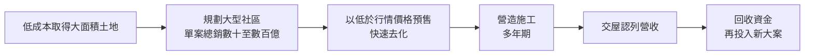
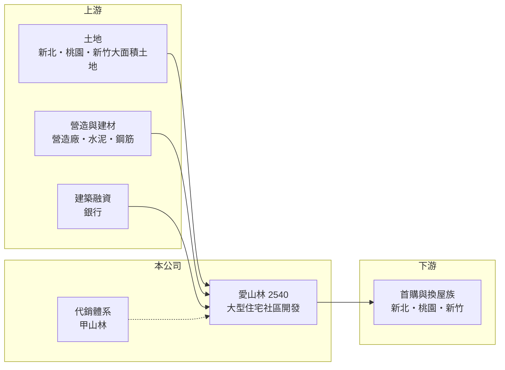

# 2540 愛山林

> 上市｜[[產業索引-建材營造業|建材營造業]]｜上市（櫃）日期 1989/12/26

# 第一章：企業模式與商業藍圖

> [!info] 撰寫說明
> 本文由 Claude 依公開資料整理，架構比照 [[2330台積電]] 的四章研究，資料截至 2026-10-08。財務數字來源：Goodinfo 年度經營績效頁、聯合新聞網 2025 年 12 月報導、證交所 OpenAPI 2026 年第二季財報與股利資料（經本機資料檔）、Money 錢與工商時報報導標題；經營者背景為整理性內容，尚未逐條比對原始文件。#待校對

在評估單一個股的長期投資價值時，首要步驟是拆解企業的底層獲利邏輯。本章說明愛山林建設開發（股票代號：2540，以下簡稱愛山林）如何以代銷出身的經營團隊，走出「大量推案、低於行情銷售」的大型住宅開發路線。

## 一、核心定位：代銷思維主導的大型推案建商

愛山林董事長祝文宇是房地產代銷業出身，與甲山林代銷體系關係密切（整理性內容）。代銷業的核心能力是判斷市場需求、包裝產品與快速銷售，這種思維延伸到愛山林，形成「推大案、快速去化」的經營方式。愛山林的推案集中在新北板橋、三重、中和、泰山、桃園龜山與新竹，單案總銷常達數百億元，規模在上市建商中名列前茅。

建商的營收在[[建案交屋]]時才一次認列。愛山林的大案從推案到交屋需要多年，因此營收與獲利的高峰，往往落在推案熱潮之後的三至五年。

## 二、營收結構：大型住宅社區為主

愛山林的營收主要來自大型住宅社區交屋。2023 至 2025 年營收分別約 81 億、112 億與 113 億元，規模已經是中型建商的數倍。依 2025 年 12 月報導，公司規劃 2026 年新推案總銷 2,091 億元，其中自建案約 1,360 億元（65%）、外案約 731 億元（35%），自建案包括中和「左岸明珠」（380 億元）、三重「星河帝寶」（40 億元）、泰山「當代帝寶」（150 億元）、桃園龜山「AI 都會城」一、二期（540 億元）與「新竹帝寶」（250 億元）。外案的性質（合作開發或代銷）公開資料未說明清楚，本文不繪製營收結構圓餅圖。

## 三、資本轉化邏輯：低價取得土地、讓利快速去化

2025 年初起，愛山林以約市場行情 75 折的價格銷售板橋「濱河帝景」與三重「市政帝景」，祝文宇表示這是因為土地取得成本較低才能「便宜賣」，濱河帝景已售逾八成。這種策略的商業邏輯是：犧牲部分單價換取速度，讓大量資金不必長期壓在未售出的房屋上。代價是毛利率下降，2025 年毛利率降到 20.6%，是近十年最低。

## 四、企業長期藍圖：規模化與產業聚落

愛山林的長期方向是把推案量持續放大，並鎖定產業聚落帶來的居住需求，例如以「AI 都會城」命名的桃園龜山案，以及新竹的大型住宅案。這反映公司押注 AI 與半導體產業在北台灣創造的就業與人口移入。規模化能攤薄管理與行銷成本，但也讓公司對房市景氣更加敏感。

# 第二章：護城河深度與競爭優勢

「護城河」指企業抵禦競爭、維持超額利潤的保護機制。本章分析愛山林的競爭優勢與限制。

## 一、愛山林護城河的核心組成要素

愛山林的優勢主要來自銷售能力與土地成本。代銷出身的團隊熟悉市場價格帶與買方心理，能精準制定價格與行銷策略，讓大案在短時間內去化；這在建設業中是相當稀缺的能力。第二是低成本土地，祝文宇多次強調「土地取得成本較低」是讓利銷售的前提。

不過這些優勢依賴經營者個人的判斷與人脈，屬於「關鍵人物型」優勢，而非制度化的護城河。

## 二、主要競爭對手格局

| 對手 | 定位 | 對愛山林的威脅 |
|---|---|---|
| [[2542興富發]] | 全台推案量最大的建商之一 | 同樣以大量推案搶市場 |
| [[2501國建]] | 全台布局的品牌建商 | 在新北與桃園中高價住宅競爭 |
| 潤泰創新等大型開發商 | 新北高價住宅 | 報導指潤泰建案每坪破 100 萬元，與愛山林每坪 70 萬元起形成價差對比 |
| 新北與桃園區域建商 | 深耕在地 | 在同區域爭取土地與客群 |

## 三、優勢轉化：守得住／守不住／觀察重點

守得住的是快速去化能力，讓愛山林在冷淡市場中仍能維持銷售。守不住的是獲利率：讓利銷售使 2025 年營業利益率降到 9%，EPS 從 2021 年的 7.02 元降到 0.69 元。長期觀察重點是 2026 年 2,091 億元推案的去化率、讓利後的毛利率水準，以及龐大推案量對資金的需求。

# 第三章：財務體質與盈利規模

資料日期：2026-10-08，表格是撰寫當時的快照；最新月營收、毛利率、累計 EPS 由自動排程寫在本筆記的屬性欄位（月營收、毛利率、累計EPS 等）。#待校對

財務報表是檢驗護城河是否真實存在的最終標準。本章用五年的三率、ROE、營建業專屬指標與資本報酬，檢視愛山林的獲利品質。

## 一、獲利能力的基石：三率

| 年度 | 營收（新台幣） | [[毛利率]] | [[營業利益率]] | EPS（元） | [[ROE]] |
|---|---|---|---|---|---|
| 2021 | 55.2 億 | 41.9% | 30.0% | 7.02 | 19.6% |
| 2022 | 47.3 億 | 29.8% | 15.1% | 1.67 | 7.18% |
| 2023 | 81.0 億 | 41.0% | 28.0% | 3.91 | 20.0% |
| 2024 | 112 億 | 33.4% | 23.2% | 3.07 | 17.9% |
| 2025 | 113 億 | 20.6% | 9.04% | 0.69 | 4.49% |

2021 至 2025 年營收年複合成長率約 20%（推算），平均 ROE 約 13.8%（推算）。但同一期間股本從 16.1 億元擴大到 94.5 億元，增加近六倍，因此 EPS 從 7.02 元降到 0.69 元，遠比淨利的變化劇烈。每股淨值也從 2021 年的 38.79 元降到 2025 年的 17.39 元。評估愛山林時，應以淨利總額與 ROE 為主，不宜直接比較不同年度的每股數字。

## 二、營建業指標：推案量、已售未入帳與存貨

愛山林沒有公布[[已售未入帳]]總額，主要的規模指標是 2026 年 2,091 億元的推案計畫。財務槓桿非常高：2026 年第二季資產總額約 632.1 億元、負債約 524.4 億元，負債比約 83%，流動負債約 469 億元，主要是建築融資與預收房款。以權益約 107.7 億元支撐超過 600 億元的資產，代表房市若轉弱，淨值受到的衝擊會被放大。

## 三、[[ROE]] 與股利

2025 年度每股配發現金 6.0 元，其中只有 0.62 元來自盈餘，其餘 5.38 元來自[[資本公積]]，現金總額約 56.7 億元。用資本公積發放現金，性質上是把股東過去投入的資本退還，而不是當年獲利的分配。Goodinfo 統計的歷年平均現金股利（一般平均）約 0.37 元，股利穩定度低。

## 四、[[ROIC]] 與 [[WACC]]：價值創造利差

**ROIC 推算：** 2025 年營業利益約 10.2 億元（113 億 × 9.04%），稅後約 8.2 億元。以 2026 年第二季權益 107.7 億元加上有息負債（假設為負債 524.4 億元的六成，約 315 億元，推估），投入資本約 422 億元，2025 年 ROIC 約 1.9%（推算）。2021 至 2025 年平均稅後營業利益約 13.2 億元，平均 ROIC 約 3.1%（推算）。

**WACC 推算：** 假設台灣 10 年期公債殖利率 1.75%、市場風險溢酬 6%、β 取營建同業常見值 0.9，股東權益成本約 7.2%。負債成本假設 3%，稅後 2.4%；權益占投入資本約 26%（推估），WACC 約 3.6%（推算）。由於槓桿遠高於同業，實際 β 與負債成本應更高，WACC 很可能被低估。

**結論：** 愛山林的高 ROE 主要來自高槓桿，而不是本業資本報酬：ROIC 五年平均約 3%，低於或接近資金成本。2025 年讓利銷售後 ROIC 進一步下降，若 2026 年的大量推案仍需以低價去化，價值創造的空間有限。

# 第四章：總體風險與地緣政治

任何企業都無法脫離宏觀環境獨立存在。本章分析愛山林長期必須面對的房市週期、財務槓桿與經營風險。

## 一、產業週期與市場結構

房地產景氣循環長達 7 至 10 年。愛山林的推案規模大，單一大案總銷數百億元，若推案時點遇上景氣反轉，去化時間拉長會直接造成存貨與利息負擔。大量供給集中在新北與桃園，也可能壓抑同區域的房價。

## 二、財務槓桿與政策風險

負債比約 83%，在上市建商中屬於極高水準。央行的[[信用管制]]若持續收緊建築融資與購屋貸款，公司的資金調度與客戶交屋都會受影響。以資本公積發放大量現金股利，也會降低財務緩衝。

## 三、讓利策略的長期影響

以低於行情的價格銷售能加速去化，但若成為常態，會讓公司長期毛利率維持在較低水準，並可能引起同區域既有屋主或其他建商的反彈。報導中也有對讓利是否為行銷手法的質疑。

## 四、關鍵人物風險

公司的策略高度依賴董事長的市場判斷與代銷經驗。經營者交接或判斷失誤，都可能對大規模推案帶來重大影響，這是長期投資人需要納入考量的治理風險。

# 專有名詞解析

## 金融

- **[[資本公積]]**：股東投入超過面額的資本等來源累積的權益，用來發放現金時性質上屬於退還資本。
- **[[信用管制]]**：央行限制購屋與建商貸款成數的政策，會影響房市成交與建商資金。
- **[[ROIC]]**：投入資本報酬率，稅後營業利益除以股東權益加有息負債，衡量本業運用資本的效率。
- **[[WACC]]**：加權平均資金成本，股東與債權人要求報酬率的加權平均，是 ROIC 要超越的門檻。

## 產業

- **[[建案交屋]]**：建商在房屋完工並交付買方時才認列營收，因此營建公司的營收常集中在交屋年度。
- **[[已售未入帳]]**：已經賣出、但尚未完工交屋而未認列營收的建案金額，是建商未來營收的主要能見度指標。

# 核心供應鏈

## 1. 上游：土地、營造與資金
- 土地：新北板橋、三重、中和、泰山，桃園龜山，新竹
- 建材：[[1101台泥]]、[[2002中鋼]]
- 資金：銀行建築融資

## 2. 中游：愛山林與相關體系
- 銷售：甲山林代銷體系（整理性內容）
- 同業：[[2542興富發]]、[[2501國建]]

## 3. 下游：客戶
- 新北、桃園與新竹的首購與換屋購屋者

## 最新新聞
<!-- news:start（自動產生，請勿手動編輯此範圍） -->
- 2026-10-07 📰 媒體 19:50｜營收速報 - 愛山林(2540)9月營收32.61億元年增率高達238.7％｜[鉅亨網](https://news.cnyes.com/news/id/6623951)

完整紀錄：[[2540愛山林 新聞]]
<!-- news:end -->

## 相關連結
- [公開資訊觀測站](https://mopsov.twse.com.tw/mops/web/t05st03?step=1&firstin=1&co_id=2540)
- [Goodinfo](https://goodinfo.tw/tw/StockDetail.asp?STOCK_ID=2540)
- [Yahoo 股市](https://tw.stock.yahoo.com/quote/2540)
- [鉅亨網新聞](https://www.cnyes.com/twstock/2540/news)
