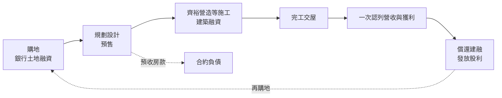
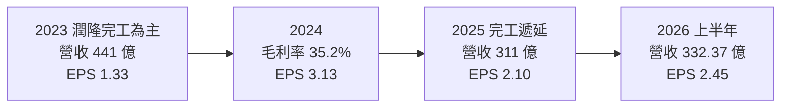
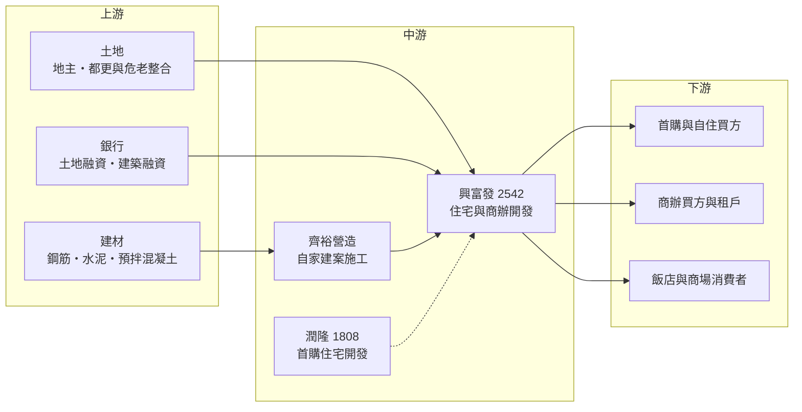

# 2542 興富發

> 上市｜[[產業索引-建材營造業|建材營造業]]｜上市（櫃）日期 1999/05/03

# 第一章：企業模式與商業藍圖

> [!info] 撰寫說明
> 本文由 Claude 依公開資料整理，架構比照 [[2330台積電]] 的四章研究，資料截至 2026-10-08。財務數字來源：Goodinfo 年度經營績效頁、工商時報 2025 年 12 月與 2026 年 6 月報導、CMoney 投資網誌整理、股感 2020 年公司分析、HiStock 資產負債摘要、證交所開放資料（2026 年第二季綜合損益與資產負債、股利、基本資料）；產業描述為整理性內容，尚未逐條比對原始文件。#待校對

在評估單一個股的長期投資價值時，首要步驟是拆解企業的底層獲利邏輯。本章針對興富發建設（股票代號：2542，以下簡稱興富發）的商業模式進行定性分析，說明台灣推案量最大的建商之一如何運作，以及為什麼它的營收與獲利會在不同年度之間大起大落。

## 一、核心定位：全台布局、量體最大的住宅與商辦開發商

興富發成立於 1980 年，前身為宏巨建設，1989 年由鄭欽天入主，1999 年上市，2003 年更名為興富發建設。鄭欽天早年在高雄從事房屋代銷，有「高雄代銷之王」之稱，這段背景塑造了興富發重視銷售與推案速度的文化。依證交所 2026 年 10 月的基本資料，董事長為王嶠奇、總經理為范華軍，實收資本額約 215.3 億元；2026 年 6 月股東會時由曹淵博以董事長身分發言（工商時報報導），顯示經營團隊近期有所調整。

興富發的商業模式是[[建設開發]]：買進土地、規劃設計、預售或成屋銷售，再由營造廠施工，完工交屋後認列營收與獲利。它與一般建商最大的不同在於規模：工商時報 2025 年 12 月報導，集團 2025 至 2032 年八年累計完工量預估達 4,957 億元，推案遍及基隆、台北、新北、桃園、新竹、台中、台南、高雄八大城市。

## 二、產品與事業板塊

公司未揭露產品別營收比重（未查得），以下依公開報導整理其主要事業：

* **住宅開發：** 早期以大坪數豪宅為主，2013 至 2014 年政府打房後，轉向都市周邊的首購自住宅，多為 20 至 30 坪的兩房、三房產品。依 2026 年股東會說法，住宅推動「精裝修」服務，減輕購屋者負擔。
* **商辦開發：** 近年重點方向。2026 年預計推出的千億元新案中有 5 筆是商辦，包括新莊「國家壹號廣場」（總銷約 295.9 億元）與台中七期「惠國 90 案」（約 427.27 億元）等。商用不動產採「租售並進」，不再只靠出售的處分利益。
* **營造與銷售整合：** 100% 持股的齊裕營造承攬多數自家建案；2015 年起把代銷收回自營，可多賺取約 5% 至 10% 的銷售利潤並直接掌握買方回饋；另設自有房仲品牌。
* **潤隆建設：** 2010 年入主國賓大地環保，隔年更名為[[1808潤隆]]，主推首購小坪數住宅。CMoney 整理指出，興富發持股約 16%，但因具實質控制力而合併潤隆營收，淨利只依持股認列，因此興富發的合併營收常大於自身建案貢獻。
* **飯店與商場：** 高雄悅城商場 2019 年開幕；在新北金山、台南安平、高雄美術館特區興建國際級酒店，並以 14.5 億元買下高雄麗尊飯店進行升級。這些資產的財務貢獻有限，但可提升周邊建案價值。

## 三、資本轉化邏輯：土地、建融與完工交屋

台灣建商在 IFRS 15 下採[[完工交屋認列]]：預售期間收到的款項只能先列為合約負債，等建案完工、過戶交屋後才一次認列營收與成本。這產生三個長期特徵：

* **營收高度不平均：** 興富發的營收在 2017 年只有 187 億元，2018 年跳到 442 億元，2019 年又降到 238 億元，2021 年再到 443 億元。年度數字反映的是當年完工的案量，而不是當年賣了多少房子，因此單看某一年的 EPS 容易誤判。CMoney 指出，完工遞延會讓獲利延後，但不會消失。
* **高財務槓桿：** 從購地到交屋常需 4 至 6 年，期間需要大量土地融資與建築融資。依證交所資料，2026 年第二季底總資產 2,713.5 億元、負債 2,109.0 億元，負債比約 77.7%，遠高於一般產業。
* **土地是核心資本：** 建商的長期獲利取決於買地時機與成本。興富發在 2008 年金融海嘯時逆勢購地超過百億元，2016 年起又判斷房市觸底、每年購地超過百億元，這些低成本土地是後來高毛利的來源。

## 四、企業長期藍圖：商辦、都更與完工高峰

興富發的長期策略可以歸納為四點：第一，未來數年迎接完工交屋高峰，工商時報報導的預估完工量為 2026 年約 792 億元、2027 年約 743 億元、2028 年約 750 億元；第二，產品重心由住宅延伸到商辦與微型商辦，並以租售並進累積收租資產；第三，購地「跟著政策走」，鎖定市中心核心區域，並積極參與[[都市更新]]與[[危老重建]]；第四，為因應缺工，率先引進工廠預製、整體運至現場安裝的整體式裝修系統。完工量預估是公司依工程進度的規劃，實際入帳仍受工期、缺工與交屋進度影響。

# 第二章：護城河深度與競爭優勢

在長期價值投資中，「護城河」指企業抵禦競爭、維持超額利潤的保護機制。營建業普遍被認為缺乏護城河，本章分析興富發的規模、土地與銷售能力能否構成相對優勢。

## 一、興富發護城河的核心組成要素

* **1. 規模與全台土地庫存：** 興富發是少數在台灣北、中、南都大量推案的建商。全台布局讓它不必押注單一區域的房市，也能在某個城市景氣好時集中推案。大量土地庫存是過去十多年持續購地累積的，新進者很難在短期內取得相同規模與成本的土地。
* **2. 營造、代銷、房仲一條龍：** 自有齊裕營造控制工程品質與成本，自營代銷掌握銷售節奏與客戶資料。這種整合讓興富發可以把原本外包給代銷公司與營造廠的利潤留在集團內，也能更快調整產品與定價。
* **3. 品牌與首購市場經驗：** 興富發以低總價首購產品打響知名度，在首購族心中有一定的品牌認知度。首購市場量大，政策上也較受保護，是相對穩定的需求來源。

即使如此，營建業的產品高度在地化、土地取得高度競爭，興富發的優勢更接近「規模與執行力」而非真正的護城河，毛利率仍隨房市循環大幅波動。

## 二、主要競爭對手格局

| 對手 | 定位 | 對興富發的威脅 |
|---|---|---|
| [[5522遠雄]] | 大型造鎮與住宅開發，北部為主 | 在大型造鎮與商辦案競爭 |
| [[2548華固]] | 台北精華區住宅與商辦 | 在雙北高價住宅與商辦競爭土地與客戶 |
| [[2545皇翔]] | 台北豪宅開發 | 在台北核心區競爭 |
| [[1808潤隆]] | 集團內首購住宅開發 | 屬集團合作，與興富發在同區域共同推案 |
| 地方型建商 | 熟悉單一縣市的中小型建商 | 在地方土地與首購市場以靈活度競爭 |

## 三、優勢轉化：哪些守得住、哪些守不住

* **守得住：** 全台推案帶來的分散效果，以及首購與自住需求。這類需求受政策支持，房市修正時跌幅通常比投資型產品小。
* **守不住：** 毛利率與銷售速度。房市受利率、信用管制與稅制影響很大，2025 年在信用管制與房市降溫下，興富發毛利率由前一年的 35.2% 降到 29.9%；當政府打房或利率上升時，任何建商都難以維持高價與高去化率。
* **觀察重點：** 第一，未來三年預估的 500 至 800 億元完工量能否如期交屋；第二，大量商辦案在商辦市場供給增加下的去化速度；第三，負債比與現金流在推案高峰期是否維持安全。

# 第三章：財務體質與盈利規模

資料日期：2026-10-08。數字取自 Goodinfo 年度經營績效、工商時報與證交所開放資料，表格是撰寫當時的快照；最新月營收、毛利率、累計 EPS 由自動排程寫在本筆記的屬性欄位（月營收、毛利率、累計EPS 等）。#待校對

財務報表是檢驗護城河是否真實存在的最終標準。由於建商採完工認列，本章特別以多年度平均與營建業專屬指標來評估興富發。

## 一、獲利能力的基石：三率與營建指標

| 年度 | 營收（新台幣） | [[毛利率]] | [[營業利益率]] | EPS（元） | [[ROE]] |
|---|---|---|---|---|---|
| 2016 | 351 億 | 32.2% | 22.1% | 5.57 | 18.6% |
| 2018 | 442 億 | 29.8% | 21.5% | 6.01 | 23.5% |
| 2020 | 245 億 | 28.0% | 16.9% | 2.11 | 8.04% |
| 2021 | 443 億 | 31.0% | 22.6% | 6.45 | 23.5% |
| 2022 | 266 億 | 33.7% | 21.2% | 2.29 | 8.24% |
| 2023 | 441 億 | 35.0% | 26.6% | 1.33 | 16.6% |
| 2024 | 369 億 | 35.2% | 25.5% | 3.13 | 13.5% |
| 2025 | 311 億 | 29.9% | 20.7% | 2.10 | 8.66% |
| 2026 上半年 | 332.37 億 | 31.00% | 24.76% | 2.45 | 不適用（半年） |

閱讀這張表需要注意三點。第一，2023 年營收 441 億元但 EPS 只有 1.33 元（CMoney 為 1.21 元），原因是當年營收多來自潤隆的完工案，而潤隆的淨利只依約 16% 持股認列，大部分歸屬非控制權益。第二，Goodinfo 的 ROE 與 EPS 推算的報酬率不完全一致，例如 2023 年 ROE 16.6% 可能是含非控制權益的口徑，使用時應對照年報。第三，2025 年 EPS 2.10 元偏低，主要是缺工、缺料與土方問題導致部分建案遞延到 2026 至 2027 年入帳。

**營建業適用指標：**
* **完工量：** 建商營收的領先指標。依工商時報報導，集團預估完工量 2025 年約 609 億元、2026 年約 792 億元、2027 年約 743 億元、2028 年約 750 億元、2029 年約 529 億元（含潤隆等集團公司，為公司規劃值）。
* **負債比：** 2026 年第二季底約 77.7%，其中包含預收房款形成的合約負債與銀行借款，細項未查得。
* **毛利率長期區間：** 2016 至 2025 年大致在 27% 至 35% 之間，2017 與 2019 年曾為清庫存而讓利。
* **2021 至 2025 年平均：** 五年平均 ROE 約 14.1%（推算，依 Goodinfo 口徑），平均營業利益約 86.5 億元（推算）。單年營收成長率沒有意義，2020 至 2025 年營收年複合成長率約 4.9%（推算），僅供參考。

## 二、[[ROE]]：資本效率

依證交所資料，2026 年第二季底歸屬母公司權益 494.1 億元、非控制權益 110.4 億元，每股淨值 23.40 元。興富發的每股淨值十年來大致在 25 至 30 元之間，沒有明顯成長，原因是公司把大部分盈餘以現金股利發放，甚至動用以前年度的未分配盈餘。ROE 依完工年度在 7% 至 24% 之間跳動，必須以多年平均看待。

## 三、資本支出、自由現金流與股利

* **資本支出：** 建商的主要投資是土地與在建工程，會計上列為存貨而非資本支出，因此傳統的資本支出與[[自由現金流]]指標不適用。飯店與商場等長期資產另計，例如以 14.5 億元購入高雄麗尊飯店。
* **現金流特性：** 推案與購地高峰期營業現金流常為負，交屋高峰期則大幅轉正，必須以多年合計觀察（推估）。
* **股利：** 2025 年度配發現金股利 4.0 元（證交所股利資料），高於當年 EPS 2.10 元，配發率約 190%，動用了以前年度累積的未分配盈餘。公司章程規定股東股利不低於累積可分配盈餘的 20%。Goodinfo 統計歷年加權平均現金股利約 2.78 元。興富發的股利以「平滑化」為特徵，在獲利低的年度仍維持一定配息，但長期而言股利仍受完工量限制。

## 四、[[ROIC]] 與 [[WACC]]：價值創造利差

**ROIC 推算：** 由於完工認列造成單年波動，以 2021 至 2025 年平均營業利益約 86.5 億元計算，以 20% 稅率計稅後約 69.2 億元。權益總計 604.5 億元（2026 年第二季底）；有息負債細項未查得，假設約占總負債六成、約 1,250 億元（推估），投入資本約 1,855 億元，五年平均 ROIC 約 3.7%（推算）。若以 2025 年單年營業利益約 64.4 億元計算，ROIC 約 2.8%（推算）。

**WACC 推算：** 假設台灣 10 年期公債殖利率 1.75%、市場風險溢酬 6%、β 取營建股常見值 0.9（假設），股東權益成本約 7.15%。建築融資與土地融資成本假設 2.5%，稅後 2.0%，以權益約 33%、負債約 67% 計算，WACC 約 3.7%（推算）。

**結論：** 興富發的長期 ROIC 與 WACC 大致相當，表示在高槓桿的營運模式下，本業報酬只是勉強覆蓋資金成本，股東報酬主要來自財務槓桿放大的 ROE。這是台灣大型建商的共同特徵：真正創造價值的時機在於低點購地、高點完工交屋，而不是穩定的營運利差。若未來三年完工高峰如期入帳，平均 ROIC 有機會高於 WACC；反之，若房市信用管制持續、去化放緩，高槓桿會放大風險。

# 第四章：總體風險與地緣政治

任何企業都無法脫離宏觀環境獨立存在。本章分析興富發長期必須面對的政策、產業週期、營運與法規風險。

## 一、政策與總體環境

營建業是台灣受政策影響最深的產業之一。央行的選擇性信用管制、房地合一稅、囤房稅、預售屋禁止換約等政策，都會直接改變購屋需求與建商的銷售速度。近年央行加強信用管制讓房市降溫，2026 年 3 月央行把第二戶房貸成數放寬到 6 成，流動性才緩步回升。利率變化則同時影響買方的房貸負擔與建商的融資成本。兩岸局勢對房市信心也有間接影響，地緣政治緊張時，購屋決策可能延後。

## 二、產業週期與市場結構

房地產循環通常長達數年，從推案、預售到交屋又有數年落差，建商常在景氣高點時大量推案，等到完工時市場已經轉弱，形成「推案在高點、交屋在低點」的錯位。台灣住宅市場也面臨長期結構問題：少子化與人口老化會使住宅需求成長放緩，部分蛋白區已出現房價微跌；商辦市場則可能因多家建商同時推出大型商辦而出現供給過剩。

## 三、營運環境的隱性風險

* **缺工與缺料：** 台灣營建業長期缺工，鋼筋、水泥等材料價格波動，2025 年又有土方去化問題，導致工期延誤、成本上升。
* **退戶與交屋風險：** 房價下跌或貸款成數受限時，預售屋買方可能退戶或延後交屋，公司表示目前退戶金額占營收比例極低，但在房市反轉時這項風險會上升。
* **財務槓桿：** 約 78% 的負債比在房市下行時是風險放大器，若去化放緩、存貨積壓，利息負擔與融資條件會成為壓力。
* **集團交易與治理：** 興富發與潤隆、齊裕營造等集團公司之間有大量合建與承攬交易，投資人需留意關係人交易的透明度。

## 四、科技或法規演進

建築法規持續強化耐震、綠建築與節能要求，2050 淨零碳排政策也將推動低碳建材與建築能效標準，這會提高營建成本，但也有利於有規模、能投資新工法的大型建商。興富發導入工廠預製的整體式裝修系統，是因應缺工與品質要求的嘗試。都市更新與危老重建的法規放寬，為擁有整合能力的建商帶來長期機會，但都更案涉及住戶整合，時程常超出預期。

# 專有名詞解析

## 金融

- **[[合約負債]]**：已收取客戶款項但尚未交付商品或服務時列在資產負債表上的負債，建商的預收房款即屬此類。
- **[[選擇性信用管制]]**：央行針對特定購屋族群限制房貸成數、寬限期等條件，用來抑制房市過熱。
- **[[自由現金流]]**：營業活動現金流減去資本支出，代表企業可自由用於配息、還債或併購的現金。
- **[[ROIC]]**：投入資本報酬率，稅後營業利益除以股東權益加有息負債，衡量本業運用資本的效率。
- **[[WACC]]**：加權平均資金成本，股東與債權人要求報酬的加權平均，ROIC 高於它才代表創造價值。

## 產業

- **[[建設開發]]**：購買土地、規劃設計、銷售並交由營造廠興建住宅或商辦的商業模式，獲利來自土地與房價的增值。
- **[[完工交屋認列]]**：建商在建案完工並過戶交屋時才一次認列營收與成本，預售期間收到的款項先列為負債。
- **[[預售屋]]**：在建案動工前或興建期間就開始銷售的房屋，買方分期付款，交屋時才支付大部分房款。
- **[[都市更新]]**：依都市更新條例整合老舊建物與土地，重建或整建以改善都市環境，通常需要多數住戶同意。
- **[[危老重建]]**：依危老條例針對具危險或屋齡老舊的建物進行重建，門檻較都更低、程序較快。
- **[[建築融資]]**：建商以土地與建案向銀行借款支應施工費用的融資方式，隨工程進度撥款。

# 核心供應鏈

## 1. 上游：土地、建材與資金
- 建材：[[2002中鋼]]（鋼品）、[[1101台泥]]（水泥），實際採購比例未查得
- 合作營造：齊裕營造（100% 子公司）、[[2535達欣工]]（部分案件）
- 資金：國內銀行的土地與建築融資

## 2. 中游：興富發與集團公司
- 集團公司：[[1808潤隆]]、齊裕營造
- 同業：[[5522遠雄]]、[[2548華固]]、[[2545皇翔]]

## 3. 下游：客戶與資產
- 住宅買方：以首購與自住族群為主
- 商辦買方與租戶：國家壹號廣場、惠國案等商辦
- 飯店與商場：高雄悅城商場、金山與台南安平、高雄美術館特區酒店、高雄麗尊飯店

## 最新新聞
<!-- news:start（自動產生，請勿手動編輯此範圍） -->
- 2026-10-08 📰 媒體 17:23｜營收速報 - 興富發(2542)9月營收61.23億元年增率高達103.73％｜[鉅亨網](https://news.cnyes.com/news/id/6625000)

完整紀錄：[[2542興富發 新聞]]
<!-- news:end -->

## 相關連結
- [公開資訊觀測站](https://mopsov.twse.com.tw/mops/web/t05st03?step=1&firstin=1&co_id=2542)
- [Goodinfo](https://goodinfo.tw/tw/StockDetail.asp?STOCK_ID=2542)
- [Yahoo 股市](https://tw.stock.yahoo.com/quote/2542)
- [鉅亨網新聞](https://www.cnyes.com/twstock/2542/news)
