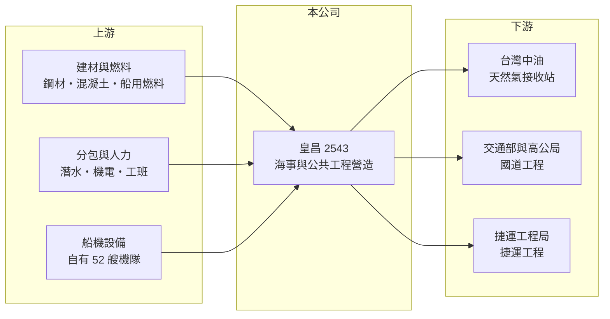

# 2543 皇昌

> 上市｜[[產業索引-建材營造業|建材營造業]]｜上市（櫃）日期 1999/10/15

# 第一章：企業模式與商業藍圖

> [!info] 撰寫說明
> 本文由 Claude 依公開資料整理，架構比照 [[2330台積電]] 的四章研究，資料截至 2026-10-08。財務數字來源：Goodinfo 年度經營績效頁、經濟日報 2026 年 5 月報導、證交所 OpenAPI 2026 年第二季財報與股利資料（經本機資料檔）、工商時報、聯合新聞網與 Yahoo 股市報導標題；公開資料有限，業務比重與在手訂單總額未查得。#待校對

在評估單一個股的長期投資價值時，首要步驟是拆解企業的底層獲利邏輯。本章說明皇昌營造（股票代號：2543，以下簡稱皇昌）如何以海事工程機隊為核心，在國家級基礎建設中建立專業定位。

## 一、核心定位：擁有自有船機隊的海事與公共工程營造商

皇昌成立於 1981 年，總部位於台北市內湖區，主要承攬公共工程與海事工程。和一般以建築工程為主的營造廠不同，皇昌擁有 52 艘自有船機，經濟日報稱其為全國規模最大的海事工程機隊。海事工程包括港灣、防波堤、海底管線與天然氣接收站等，需要專用船舶、潛水與海上施工能力，進入門檻比陸上建築工程高得多。

營造廠不買地賣房，而是依工程合約以[[完工比例法]]隨施工進度認列營收。代表工程包括國道 1 號五股交流道匝道改善、捷運萬大線中和至樹林段，以及中油第三天然氣接收站（三接）相關工程。

## 二、營收結構：大型公共工程主導

皇昌的營收主要由少數大型公共工程決定，2023 至 2025 年營收在 113 億至 124 億元之間。2026 年 3 月取得中油第四天然氣接收站（四接）海事工程標案，契約金額逾 428.2 億元，約為 2025 年營收的 3.6 倍，將成為未來數年最主要的營收來源。公開資料未提供依工程類別的營收比重，因此不繪製圓餅圖。

## 三、資本轉化邏輯：重資產的海事施工

海事工程需要大量專用船舶與機具，屬於比一般營造更重資產的業務。自有機隊的好處是不必向外租船、工期較能掌握；代價是機具折舊與維修成本固定，沒有工程時也要負擔。皇昌強調「垂直整合一條龍」，把完工案的工程人員、技術專家與重型機具轉入現有工程與四接案，以提高設備使用率並因應工料雙漲。

## 四、企業長期藍圖：能源轉型帶動的海事需求

台灣的天然氣發電比重提高，需要更多接收站與海底管線；離岸風電與港區更新也需要海事工程能力。皇昌表示未來可能參與其他港區更新或離岸能源設施。這讓公司的長期需求與國家能源政策直接連動，是比一般住宅營造更具結構性的成長動能。

# 第二章：護城河深度與競爭優勢

「護城河」指企業抵禦競爭、維持超額利潤的保護機制。本章分析皇昌在營造業中的競爭優勢與限制。

## 一、皇昌護城河的核心組成要素

皇昌最主要的優勢是[[海事工程]]的設備與經驗門檻。海上施工受天候、海象影響大，需要專用船機與熟練人員，大型國家級海事標案通常只有少數廠商具備資格。皇昌為四接標案準備了 7 年，並擁有全國最大的海事機隊，這種「實績加設備」的組合是新進者短期內難以複製的。

第二個優勢是公共工程的履約紀錄。國道與捷運等大型工程的順利完工，會成為下一次投標的資格條件。

## 二、主要競爭對手格局

| 對手 | 定位 | 對皇昌的威脅 |
|---|---|---|
| [[2535達欣工]] | 高科技廠房與公共工程 | 在陸上公共工程標案競爭 |
| [[2597潤弘]] | 預鑄工法營造 | 在建築與部分公共工程競爭 |
| 中華工程、榮民工程等 | 大型公共工程營造商 | 在國家級標案競爭 |
| 日、韓、歐洲海事工程公司 | 國際海事與能源工程 | 在大型接收站與離岸工程中競爭或合作 |

## 三、優勢轉化：守得住／守不住／觀察重點

守得住的是海事工程的專業地位，四接標案的取得證明了這一點。守不住的是毛利率穩定性：2016 至 2022 年毛利率多在 5% 以下，2018 年甚至為負，顯示公共工程在成本上漲時很容易虧損。長期觀察重點是四接工程的執行毛利、天候與工期風險控制，以及未來能否持續取得港區與能源相關標案。

# 第三章：財務體質與盈利規模

資料日期：2026-10-08，表格是撰寫當時的快照；最新月營收、毛利率、累計 EPS 由自動排程寫在本筆記的屬性欄位（月營收、毛利率、累計EPS 等）。#待校對

財務報表是檢驗護城河是否真實存在的最終標準。本章用五年的三率、ROE、營造業專屬指標與資本報酬，檢視皇昌的獲利品質。

## 一、獲利能力的基石：三率

| 年度 | 營收（新台幣） | [[毛利率]] | [[營業利益率]] | EPS（元） | [[ROE]] |
|---|---|---|---|---|---|
| 2021 | 80.0 億 | 0.9% | -1.29% | 1.56 | 17.0% |
| 2022 | 84.5 億 | 4.51% | 4.14% | 1.02 | 10.1% |
| 2023 | 113 億 | 8.95% | 6.59% | 2.15 | 19.0% |
| 2024 | 124 億 | 24.0% | 20.8% | 5.25 | 38.8% |
| 2025 | 118 億 | 18.7% | 14.7% | 2.69 | 16.7% |

2021 至 2025 年營收年複合成長率約 10%（推算），平均 ROE 約 20.3%（推算）。但毛利率從 2021 年的不到 1% 跳到 2024 年的 24%，對營造廠而言非常罕見，可能與大型工程完工結算或其他較高毛利的收入有關（推估，原因未查得）。2021 年營業虧損但 EPS 仍有 1.56 元，代表當年獲利主要來自業外。拉長到 2016 至 2020 年，ROE 多在 4% 以下，2018 年虧損，長期平均遠低於近五年。

## 二、營造業指標：在手訂單與負債結構

營造廠的主要領先指標是[[在手訂單]]。皇昌未公布在手訂單總額，但四接標案契約金額逾 428.2 億元，加上報導所稱「在建工程儲備充足」，未來數年的營收能見度高。2026 年第二季資產總額約 231.9 億元、負債約 134.3 億元，負債比約 58%；營造廠負債多為預收工程款與應付分包款。股本則從 2023 年的 23.7 億元擴大到 2025 年的 53.2 億元，每股數字需考慮稀釋。

## 三、[[ROE]] 與股利

Goodinfo 統計皇昌歷年平均現金股利只有約 0.14 元，過去多年未配息，直到近年獲利改善才開始配發，2025 年下半年度配發現金 1.0 元。股利紀錄短，穩定度仍有待觀察。

## 四、[[ROIC]] 與 [[WACC]]：價值創造利差

**ROIC 推算：** 2025 年營業利益約 17.3 億元（118 億 × 14.7%），稅後約 13.9 億元。以 2026 年第二季權益 97.6 億元加上有息負債（營造廠負債多為工程款，但海事機具需要融資，假設兩成五為有息負債，約 34 億元，推估），投入資本約 131 億元，2025 年 ROIC 約 10.6%（推算）。2021 至 2025 年平均稅後營業利益約 8.5 億元，平均 ROIC 約 6.5%（推算）。

**WACC 推算：** 假設台灣 10 年期公債殖利率 1.75%、市場風險溢酬 6%、β 取營造同業常見值 0.8，股東權益成本約 6.6%。負債成本假設 3%，稅後 2.4%；權益占投入資本約 74%（推估），WACC 約 5.5%（推算）。

**結論：** 皇昌近三年 ROIC 高於 WACC，五年平均也略高於資金成本，顯示海事工程的專業定位已開始轉化為超額報酬。但 2021 至 2022 年本業幾乎不賺錢，2016 至 2020 年也長期低迷，說明這種利差高度依賴大型工程的執行結果。四接工程能否維持合理毛利，是判斷利差能否延續的關鍵。

# 第四章：總體風險與地緣政治

任何企業都無法脫離宏觀環境獨立存在。本章分析皇昌長期必須面對的工程執行、政策與成本風險。

## 一、產業週期與市場結構

公共工程與海事工程的需求來自政府預算與國營事業的投資計畫，週期與政治、能源政策相關，而非一般景氣。能源轉型使天然氣接收站與海事工程需求增加，但若政策方向改變或預算延後，大型標案的時程也會變動。

## 二、工程執行與天候風險

海事施工受颱風、季風與海象影響很大，可施工天數有限，工期延誤會增加機具與人力成本。四接標案規模龐大，單一工程的成敗就足以影響公司數年獲利。

## 三、成本與缺工風險

公共工程合約多為固定價格，雖有物價調整機制，但未必能完全反映建材、燃料與工資的上漲。2018 年毛利率為負，就是成本失控時營造廠可能面臨的結果。

## 四、客戶與標案集中風險

皇昌的營收來自少數大型政府與國營事業標案，客戶高度集中。若未來幾年無法持續得標，四接完工後可能出現營收斷層；股本快速擴大也使獲利必須持續成長，才能維持每股盈餘。

# 專有名詞解析

## 金融

- **[[完工比例法]]**：工程依施工進度分期認列營收與利潤的會計方法，常用於營造工程與長期合約。
- **[[ROIC]]**：投入資本報酬率，稅後營業利益除以股東權益加有息負債，衡量本業運用資本的效率。
- **[[WACC]]**：加權平均資金成本，股東與債權人要求報酬率的加權平均，是 ROIC 要超越的門檻。

## 產業

- **[[海事工程]]**：在海上或港灣進行的工程，例如防波堤、碼頭、海底管線與天然氣接收站，需要專用船機。
- **[[在手訂單]]**：已簽約但尚未完工認列的工程金額，是營造廠未來營收的主要領先指標。
- **[[天然氣接收站]]**：接收海運液化天然氣、再氣化後輸送至電廠與管網的設施，需要大型港灣與海事工程。

# 核心供應鏈

## 1. 上游：建材、設備與人力
- 建材：[[2002中鋼]]、[[1101台泥]]
- 自有海事船機與潛水、機電等分包商

## 2. 中游：皇昌與同業
- 同業：[[2535達欣工]]、[[2597潤弘]]

## 3. 下游：業主
- 台灣中油（三接、四接天然氣接收站）
- 交通部高速公路局、捷運工程主管機關

## 最新新聞
<!-- news:start -->
<!-- news:end -->

## 相關連結
- [公開資訊觀測站](https://mopsov.twse.com.tw/mops/web/t05st03?step=1&firstin=1&co_id=2543)
- [Goodinfo](https://goodinfo.tw/tw/StockDetail.asp?STOCK_ID=2543)
- [Yahoo 股市](https://tw.stock.yahoo.com/quote/2543)
- [鉅亨網新聞](https://www.cnyes.com/twstock/2543/news)
