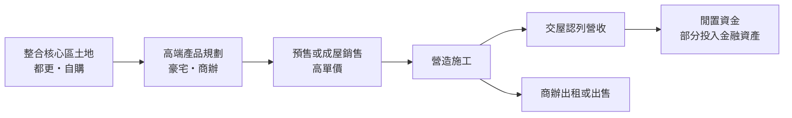
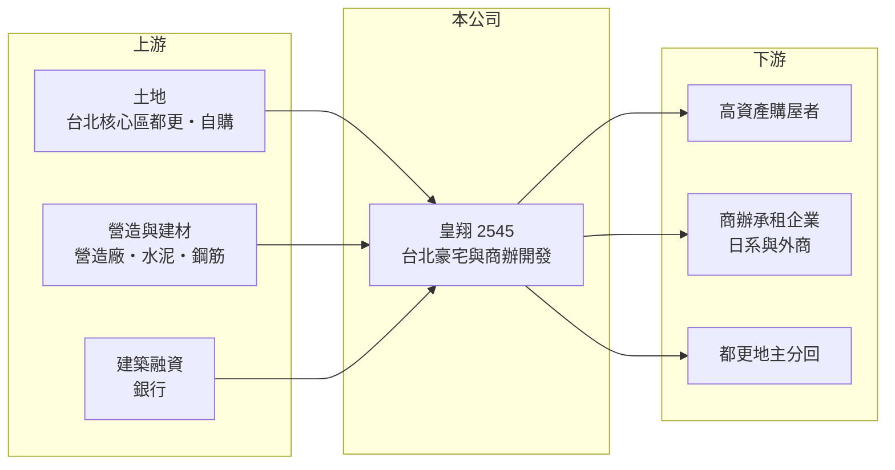

# 2545 皇翔

> 上市｜[[產業索引-建材營造業|建材營造業]]｜上市（櫃）日期 2000/09/11

# 第一章：企業模式與商業藍圖

> [!info] 撰寫說明
> 本文由 Claude 依公開資料整理，架構比照 [[2330台積電]] 的四章研究，資料截至 2026-10-08。財務數字來源：Goodinfo 年度經營績效頁、工商時報 2026 年 2 月報導、經濟日報 2026 年 5 月報導、證交所 OpenAPI 2026 年第二季財報與股利資料（經本機資料檔）、Yahoo 股市報導標題；經營團隊資料公開有限，產業描述為整理性內容，尚未逐條比對原始文件。#待校對

在評估單一個股的長期投資價值時，首要步驟是拆解企業的底層獲利邏輯。本章說明皇翔建設（股票代號：2545，以下簡稱皇翔）如何以台北核心地段的高價住宅與商辦為主軸，經營一家「少量、高單價、高毛利」的建商。

## 一、核心定位：台北核心區的高價住宅開發商

皇翔總部位於台北市中正區，核心策略是「地段精選」與高端定位，住宅與辦公大樓並行開發。推案集中在信義永康、信義計畫區、中正區文教區、捷運東門站周邊與台北西區門戶計畫範圍。代表建案包括 2025 年 4 月推出的「皇翔柏悅」、信義永康的「柏金」與信義計畫區的「皇翔御琚」，報導中御琚 2025 年上半年成交每坪約 250 萬元，是台北頂級住宅市場的指標價位之一。

建商的營收在[[建案交屋]]時才一次認列。皇翔每年完工的案數不多，但單價極高，一個豪宅案交屋就能讓營收翻倍，2024 年營收 124 億元、2025 年 60.8 億元，就是這種特性的結果。

## 二、營收結構：豪宅交屋為主、商辦為輔

皇翔的營收主要來自豪宅交屋，商辦則以「皇翔臺北廣場」為代表。這棟位於台北西區、2025 年初啟用的辦公大樓，租戶包括三井物產、麒麟啤酒、任天堂等日系與外商企業。公開資料未提供住宅與商辦的營收比重，因此不繪製圓餅圖。

除了本業，皇翔近年也把部分資金投入上市電子股。經濟日報報導，2024 年 9 月央行第七波[[信用管制]]後房市買氣轉弱，公司陸續買進 [[2330台積電]]、[[2308台達電]] 與 [[2382廣達]] 等股票。2026 年上半年淨利率 21.7% 高於營業利益率 12.7%，就是業外收益的貢獻。

## 三、資本轉化邏輯：都更取得核心區土地

台北核心區幾乎沒有大面積空地，取得土地主要靠[[都更]]。皇翔正在推動 SOGO 敦化館（敦化南路與仁愛路口）的都更，該館已於 2025 年底結束營業；永和大陳都更 3 案也已動土，預計約 4.5 年完工。都更讓皇翔能在核心區取得稀有土地，但從整合到完工常需多年，資本占用時間長。

## 四、企業長期藍圖：核心區地標與商辦

皇翔的長期方向是持續在台北核心區打造地標型住宅與商辦。SOGO 敦化館都更案位於台北最具代表性的路口之一，若順利完成，將是公司未來十年最重要的案子。商辦部分則希望以皇翔臺北廣場的經驗，填補台北高端辦公室的供給缺口。

# 第二章：護城河深度與競爭優勢

「護城河」指企業抵禦競爭、維持超額利潤的保護機制。本章分析皇翔在台北豪宅市場的優勢與限制。

## 一、皇翔護城河的核心組成要素

皇翔的優勢來自稀有地段與品牌。台北核心區的土地供給極少，能取得並整合這些土地的建商本身就有限；皇翔長期在信義、大安、中正等區推出高價住宅，累積了在豪宅客群中的知名度。高端產品的毛利率也較高，2021 至 2025 年毛利率都在 40% 以上。

第二個優勢是商辦經營能力，皇翔臺北廣場吸引日系與外商企業進駐，顯示公司具備招商與規劃辦公大樓的實力。不過這些優勢都屬於「窄護城河」，豪宅市場的需求本身受經濟與政策影響很大。

## 二、主要競爭對手格局

| 對手 | 定位 | 對皇翔的威脅 |
|---|---|---|
| [[2538基泰]] | 台北核心區精品住宅與都更 | 在信義、大安高價住宅與都更競爭 |
| [[2534宏盛]] | 大台北住宅，曾開發帝寶 | 在高價住宅市場競爭 |
| [[2501國建]] | 全台住宅與商用開發 | 在台北中高價住宅與商辦競爭 |
| 遠雄、華固等台北豪宅建商 | 台北頂級住宅 | 在豪宅地段與客群直接競爭 |

## 三、優勢轉化：守得住／守不住／觀察重點

守得住的是核心區地段的稀缺價值與高毛利率。守不住的是銷售速度：豪宅買方對信用管制與資本市場非常敏感，房市轉冷時成交量萎縮最明顯，公司也因此把部分資金轉向股票投資。長期觀察重點是 SOGO 敦化館都更的進度、永和大陳三案的施工，以及業外投資占整體獲利的比重是否過高。

# 第三章：財務體質與盈利規模

資料日期：2026-10-08，表格是撰寫當時的快照；最新月營收、毛利率、累計 EPS 由自動排程寫在本筆記的屬性欄位（月營收、毛利率、累計EPS 等）。#待校對

財務報表是檢驗護城河是否真實存在的最終標準。本章用五年的三率、ROE、營建業專屬指標與資本報酬，檢視皇翔的獲利品質。

## 一、獲利能力的基石：三率

| 年度 | 營收（新台幣） | [[毛利率]] | [[營業利益率]] | EPS（元） | [[ROE]] |
|---|---|---|---|---|---|
| 2021 | 78.5 億 | 47.5% | 36.3% | 7.46 | 20.5% |
| 2022 | 70.7 億 | 42.8% | 28.5% | 5.78 | 15.4% |
| 2023 | 47.5 億 | 41.1% | 26.4% | 2.32 | 6.43% |
| 2024 | 124 億 | 43.3% | 32.8% | 9.05 | 23.6% |
| 2025 | 60.8 億 | 40.5% | 24.2% | 1.92 | 4.76% |

2021 至 2025 年平均 ROE 約 14.1%（推算），營收年複合成長率約 -6%（推算），但營收高低主要取決於交屋年度，成長率參考價值有限。毛利率十年來大多在 30% 至 47%，在建商中屬於高水準；ROE 則在 0.14% 到 23.6% 之間大幅擺盪，2019 年幾乎沒有獲利。

## 二、營建業指標：推案量、已售未入帳與存貨

皇翔沒有公布[[已售未入帳]]總額，主要能見度來自都更案與已推案件。財務槓桿高：2026 年第二季資產總額約 644.9 億元、負債約 498.5 億元，負債比約 77%，主要是土地與在建工程所對應的建築融資。高單價產品搭配高槓桿，代表銷售順利時 ROE 很高，銷售停滯時利息負擔也重。2025 年股本從 32.8 億元增加到 38 億元，是近十年第一次明顯擴大。

## 三、[[ROE]] 與股利

Goodinfo 統計皇翔歷年平均現金股利約 2.55 元，在營建股中屬於較高水準；2025 年度配發現金股利 2.8 元，高於當年 EPS 1.92 元，資金部分來自過去累積的盈餘。皇翔在獲利高峰年度通常大方配息，低谷年度仍盡量維持，對重視現金股利的投資人有一定吸引力。

## 四、[[ROIC]] 與 [[WACC]]：價值創造利差

**ROIC 推算：** 2025 年營業利益約 14.7 億元（60.8 億 × 24.2%），稅後約 11.8 億元。以 2026 年第二季權益 146.5 億元加上有息負債（假設為負債 498.5 億元的六成，約 299 億元，推估），投入資本約 446 億元，2025 年 ROIC 約 2.6%（推算）。2021 至 2025 年平均稅後營業利益約 18.7 億元，平均 ROIC 約 4.2%（推算）。

**WACC 推算：** 假設台灣 10 年期公債殖利率 1.75%、市場風險溢酬 6%、β 取營建同業常見值 0.9，股東權益成本約 7.2%。負債成本假設 3%，稅後 2.4%；權益占投入資本約 33%（推估），WACC 約 4.0%（推算）。槓桿高於同業，實際 β 與 WACC 可能更高。

**結論：** 皇翔的 ROIC 五年平均約與 WACC 相當，2025 年則低於資金成本。高 ROE 主要來自財務槓桿，而非本業資本報酬特別突出。核心區都更案的完成速度，以及業外投資是否持續貢獻，將決定皇翔能否長期創造高於資金成本的報酬。

# 第四章：總體風險與地緣政治

任何企業都無法脫離宏觀環境獨立存在。本章分析皇翔長期必須面對的房市週期、政策與資產配置風險。

## 一、產業週期與市場結構

台北豪宅市場的成交量對景氣、利率與股市非常敏感。景氣好時豪宅成交價屢創新高，景氣轉弱時買方觀望、成交量大幅萎縮。皇翔每年完工案數少，單一建案的去化速度就足以左右整年獲利。

## 二、政策與金融風險

央行的[[信用管制]]對高價住宅限制最多，例如豪宅貸款成數上限，直接影響買方購買力。皇翔負債比約 77%，若銷售放緩、存貨增加，利息負擔與再融資壓力都會上升。

## 三、都更執行風險

SOGO 敦化館與永和大陳等都更案涉及多方地主與審議程序，時程可能延長。大型都更案的延遲會讓資本長期無法回收，拉低 ROIC。

## 四、業外投資風險

公司把部分資金投入上市電子股，股市上漲時能增加業外收益，但下跌時同樣會造成損失或權益減少。這讓皇翔的獲利同時受到房市與股市兩種週期影響，長期投資人應把本業與業外分開評估。

# 專有名詞解析

## 金融

- **[[信用管制]]**：央行限制購屋與建商貸款成數的政策，會影響房市成交與建商資金。
- **[[ROIC]]**：投入資本報酬率，稅後營業利益除以股東權益加有息負債，衡量本業運用資本的效率。
- **[[WACC]]**：加權平均資金成本，股東與債權人要求報酬率的加權平均，是 ROIC 要超越的門檻。

## 產業

- **[[建案交屋]]**：建商在房屋完工並交付買方時才認列營收，因此營建公司的營收常集中在交屋年度。
- **[[都更]]**：都市更新，由地主與建商合作把老舊建物改建，地主依權利價值分回房地或收益。
- **[[已售未入帳]]**：已經賣出、但尚未完工交屋而未認列營收的建案金額，是建商未來營收的主要能見度指標。

# 核心供應鏈

## 1. 上游：土地、營造與資金
- 土地：台北信義、大安、中正等核心區都更與自購土地
- 建材：[[1101台泥]]、[[2002中鋼]]
- 資金：銀行建築融資

## 2. 中游：皇翔與同業
- 同業：[[2538基泰]]、[[2534宏盛]]、[[2501國建]]

## 3. 下游：客戶
- 台北高資產購屋者、都更地主
- 皇翔臺北廣場的承租企業

## 4. 業外投資
- 持有上市電子股：[[2330台積電]]、[[2308台達電]]、[[2382廣達]]

## 最新新聞
<!-- news:start -->
<!-- news:end -->

## 相關連結
- [公開資訊觀測站](https://mopsov.twse.com.tw/mops/web/t05st03?step=1&firstin=1&co_id=2545)
- [Goodinfo](https://goodinfo.tw/tw/StockDetail.asp?STOCK_ID=2545)
- [Yahoo 股市](https://tw.stock.yahoo.com/quote/2545)
- [鉅亨網新聞](https://www.cnyes.com/twstock/2545/news)
