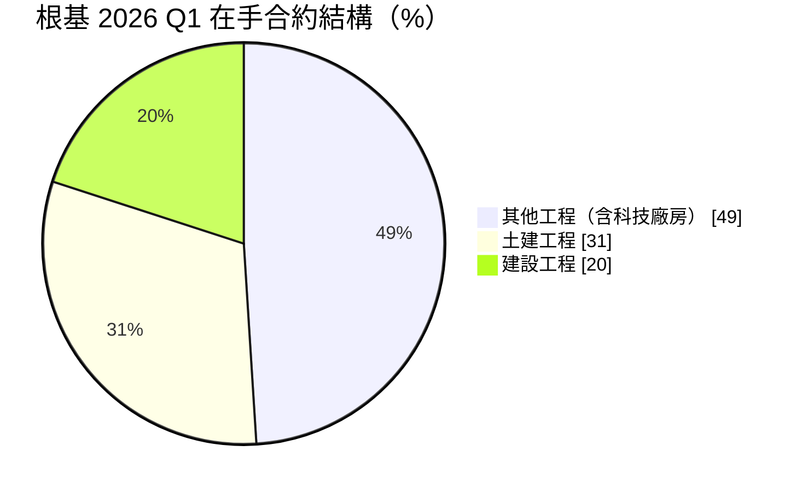
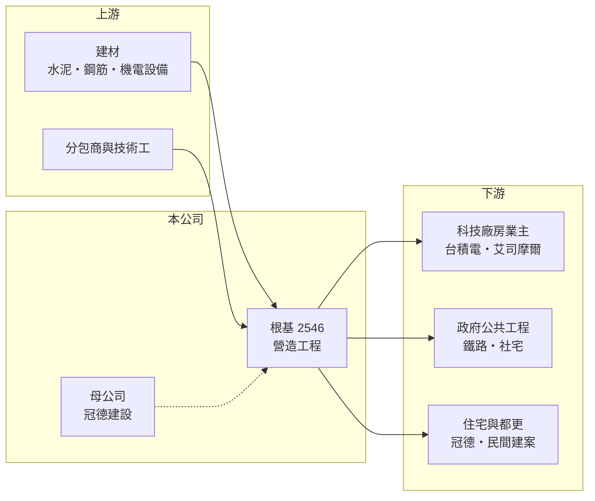

# 2546 根基

> 上市｜[[產業索引-建材營造業|建材營造業]]｜上市（櫃）日期 2000/09/11

# 第一章：企業模式與商業藍圖

> [!info] 撰寫說明
> 本文由 Claude 依公開資料整理，架構比照 [[2330台積電]] 的四章研究，資料截至 2026-10-08。財務數字來源：Goodinfo 年度經營績效頁、富果研究 2026 年 6 月法說會整理；產業描述為整理性內容，尚未逐條比對原始文件。#待校對

在評估單一個股的長期投資價值時，首要步驟是拆解企業的底層獲利邏輯。本章說明根基營造（股票代號：2546，以下簡稱根基）如何從建設集團內的營造廠，成長為承接科技廠房、軌道建設與住宅的綜合型營造公司。

## 一、核心定位：冠德集團旗下的甲級營造廠

根基的母公司是 [[2520冠德]]，早期主要承攬集團自己的住宅建案，後來逐步把業務擴展到政府公共工程與民間大型建築。營造廠的商業模式是「接案施工、依工程進度認列營收」，和建商要等到交屋才一次認列不同，因此營收曲線相對平滑，但毛利率也低得多，2019 至 2025 年大致落在 6% 至 11%。

根基的工程分成三類：住宅工程（冠德建案與民間[[都更]]案）、土木工程（鐵路地下化、高架化、橋梁與車站），以及其他工程（科技廠房、企業總部、社會住宅與公共建築）。近年營收主力是第三類，尤其是半導體廠房與基樁工程。

## 二、在手合約結構：科技廠房成為主力

依 2026 年第一季法說會，根基在手合約總額約 925 億元，尚未認列營收約 427 億元，約為 2025 年營收的兩倍。合約結構如下：

科技廠房的代表案包括 [[2330台積電]] 嘉義 AP7、南科 AP8、高雄 F22 的建廠與基樁工程，以及艾司摩爾林口廠統包案；土木工程則有台南鐵路地下化與嘉義鐵路高架化。這個組合讓根基同時受惠於半導體資本支出與政府交通建設，降低對單一房市景氣的依賴。

## 三、長期方向：工法升級與人力替代

營造業最大的長期限制是缺工與工料上漲。根基的對策是導入 [[BIM]] 智慧建模、系統模板、預鑄工法與營建機器人，減少對基層技術工的依賴，並以統購併案發包和 200 多家供應商的長期合作控制成本。2026 年公司設定新接工程約 200 億元，並強調鎖定毛利較高的案源，代表經營層更重視接案品質而非單純衝量。

# 第二章：護城河深度與競爭優勢

「護城河」指企業抵禦競爭、維持超額利潤的保護機制。營造業進入門檻不高、價格競爭激烈，本章說明根基靠什麼取得相對穩定的訂單。

## 一、護城河的組成

第一是集團內的穩定案源。冠德的住宅與都更案提供基本工作量，使根基在公共工程或民間景氣轉弱時仍有案可做。第二是大型科技廠房的施工實績。半導體廠工期緊、品質要求高，業主傾向找已有實績的營造廠，一旦進入供應名單，後續擴廠案較容易再取得。第三是軌道工程等大型土木案的資格與經驗，這類工程需要甲級營造資格與大量技術人力，能參與的廠商有限。

## 二、主要競爭對手

| 對手 | 定位 | 對根基的威脅 |
|---|---|---|
| [[2597潤弘]] | 預鑄工法，科技廠辦為主 | 在科技廠房與高毛利民間案直接競爭 |
| 互助營造、皇昌營造等 | 大型科技廠房與公共工程 | 爭取同一批半導體業主 |
| 日商與國際營造廠 | 大型統包與海外業主 | 在外商來台建廠案具優勢 |

## 三、守得住／守不住／觀察重點

守得住的是集團案源與科技廠房的施工實績；守不住的是工料價格，營造合約多為固定總價，工期中原物料或人工上漲會直接壓縮毛利，2021 至 2025 年毛利率從 11% 左右回落到 8.5% 就反映這個壓力。長期觀察重點是新接案的毛利率、科技廠房占比能否維持，以及在手合約能否持續維持在營收的兩倍以上。

# 第三章：財務體質與盈利規模

資料日期：2026-10-08。數字取自 Goodinfo 年度經營績效與富果研究法說會整理，表格是撰寫當時的快照；最新月營收、毛利率、累計 EPS 由自動排程寫在本筆記的屬性欄位（月營收、毛利率、累計EPS 等）。#待校對

財務報表是檢驗護城河是否真實存在的最終標準。本章用五年的三率、ROE 與資本報酬檢視根基的獲利品質。

## 一、多年度經營績效

| 年度 | 營收（新台幣） | [[毛利率]] | [[營業利益率]] | EPS（元） | [[ROE]] |
|---|---|---|---|---|---|
| 2021 | 108 億 | 11.1% | 8.13% | 6.98 | 22.5% |
| 2022 | 142 億 | 11.3% | 9.03% | 8.98 | 27.2% |
| 2023 | 143 億 | 10.5% | 8.19% | 8.20 | 22.0% |
| 2024 | 142 億 | 9.25% | 6.87% | 7.10 | 17.2% |
| 2025 | 215 億 | 8.52% | 6.67% | 9.52 | 21.9% |

2021 至 2025 年營收年複合成長率約 19%（推算），平均 ROE 約 22%（推算）。營造業毛利率雖低，但不需要大量固定資產，加上業主預付款與應付工程款提供營運資金，股東權益相對小，因此 ROE 明顯高於多數建商。2025 年度配發現金股利 4.8 元與股票股利 1.2 元，配發率約 63%，股利長期穩定。

## 二、營造業指標：在手合約與未認列營收

截至 2026 年第一季，在手合約 925 億元、未認列 427 億元，2026 年第二季又新接三個科技廠房案，工期約 10 至 18 個月。對營造廠而言，未認列營收除以年營收大約等於「訂單可支撐的年數」，根基目前約兩年，屬於能見度良好的水準。

## 三、[[ROIC]] 與 [[WACC]]：價值創造利差

**ROIC 推算：** 2025 年營業利益約 14.3 億元（215 億 × 6.67%），稅後約 11.5 億元。股東權益約 60.5 億元（每股淨值 46.22 元 × 約 1.31 億股），依 ROA 8.8% 推算總資產約 142 億元，負債多為合約負債與應付工程款，假設有息負債約 10 億元（推估），投入資本約 70 億元，ROIC 約 16%（推算）。

**WACC 推算：** 假設台灣 10 年期公債殖利率 1.75%、市場風險溢酬 6%、β 取營建同業常見值 0.9，股東權益成本約 7.2%；負債成本 3%、稅後 2.4%，權益占投入資本約 86%，WACC 約 6.5%（推算）。

**結論：** 根基的 ROIC 長期明顯高於 WACC，代表本業確實創造價值。這份超額報酬主要來自輕資產與預收款的營運模式，而非高毛利，因此能否持續取決於接案毛利與工程成本控制。

# 第四章：總體風險與地緣政治

任何企業都無法脫離宏觀環境獨立存在。本章分析根基長期必須面對的產業週期與營運風險。

## 一、產業週期

營造業的需求來自三個不同週期：房市、政府公共建設預算與企業資本支出。根基近年訂單高度受惠半導體與 AI 帶動的建廠潮，一旦科技業資本支出放緩，新接訂單可能明顯減少；住宅工程則受央行[[信用管制]]影響，法說會形容目前是「公強民弱」。

## 二、成本與人力風險

營造合約多為固定總價，2022 年至 2026 年 4 月勞務物價指數上漲約 7% 至 11%，機電設備與瀝青漲幅超過 20%。缺工是長期結構問題，少子化與高齡化讓基層技術工持續減少，若無法以工法升級抵銷，毛利率會被長期壓縮。

## 三、集中度與執行風險

大型科技廠房與軌道工程金額大、工期長，單一案件延誤、變更設計或與業主的追加款爭議，都可能影響當年獲利。客戶集中於少數半導體業主，也代表議價能力有限。

# 專有名詞解析

## 金融

- **[[信用管制]]**：央行限制購屋與建商貸款成數的政策，會影響房市成交與建商資金。
- **[[ROIC]]**：投入資本報酬率，稅後營業利益除以股東權益加有息負債，衡量本業運用資本的效率。
- **[[WACC]]**：加權平均資金成本，股東與債權人要求報酬率的加權平均，是 ROIC 要超越的門檻。

## 產業

- **[[都更]]**：都市更新，由地主與建商合作把老舊建物改建，地主依權利價值分回房地或收益。
- **[[BIM]]**：建築資訊模型，以 3D 數位模型整合設計、施工與機電資訊，用來減少施工衝突與浪費。

# 核心供應鏈

## 1. 上游：建材與分包
- 建材：[[1101台泥]]、[[2002中鋼]] 等水泥與鋼材供應商；機電設備與 200 多家長期合作分包商

## 2. 中游：根基與集團
- 母公司：[[2520冠德]]
- 同業：[[2597潤弘]]

## 3. 下游：業主
- 科技廠房：[[2330台積電]]、艾司摩爾
- 公共工程：鐵道局鐵路地下化與高架化、社會住宅
- 住宅：冠德與民間都更案

## 最新新聞
<!-- news:start -->
<!-- news:end -->

## 相關連結
- [公開資訊觀測站](https://mopsov.twse.com.tw/mops/web/t05st03?step=1&firstin=1&co_id=2546)
- [Goodinfo](https://goodinfo.tw/tw/StockDetail.asp?STOCK_ID=2546)
- [Yahoo 股市](https://tw.stock.yahoo.com/quote/2546)
- [鉅亨網新聞](https://www.cnyes.com/twstock/2546/news)
