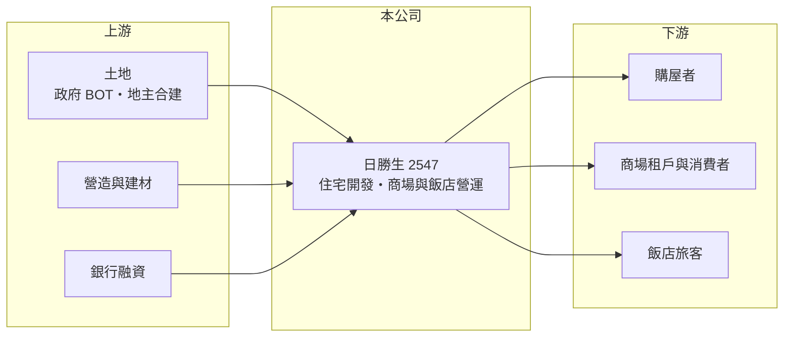

# 2547 日勝生

> 上市｜[[產業索引-建材營造業|建材營造業]]｜上市（櫃）日期 2000/12/22

# 第一章：企業模式與商業藍圖

> [!info] 撰寫說明
> 本文由 Claude 依公開資料整理，架構比照 [[2330台積電]] 的四章研究，資料截至 2026-10-08。財務數字來源：Goodinfo 年度經營績效頁；集團、京站與飯店等事業描述為整理性內容，本次未查得法說會或年報原文，公開資料有限，尚未逐條比對原始文件。#待校對

在評估單一個股的長期投資價值時，首要步驟是拆解企業的底層獲利邏輯。本章說明日勝生活科技（股票代號：2547，以下簡稱日勝生）如何以住宅開發為起點，延伸到大型[[BOT]]商場與飯店等長期持有型資產。

## 一、核心定位：開發加持有的雙軌模式

日勝生屬於威京集團體系（集團關係為整理性內容），早年以台北都會區住宅開發與大型合宜住宅、整體開發案聞名。和一般「蓋好就賣」的建商不同，日勝生同時持有並經營商業不動產，最具代表性的是台北車站旁的台北轉運站 BOT 案與京站商場，以及與日本加賀屋合作的北投溫泉飯店（以上為整理性內容，待校對）。

這種模式的意義在於收入來源不同步：住宅銷售要等到[[建案交屋]]才一次認列，波動很大；商場租金與飯店營收則每年都有，提供較穩定的現金流。Goodinfo 數據顯示，日勝生 2019 至 2025 年營收大致維持在 58 億至 75 億元之間，毛利率長期在 40% 至 50%，遠高於純住宅建商，推估與商場租賃收入占比高有關（推估，營收結構未查得）。

## 二、資本轉化邏輯：重資產、長回收

持有型資產的代價是資本長期被綁住。依 Goodinfo ROE 與 ROA 推算，2025 年總資產約為股東權益的四倍多（推算），代表公司以大量負債支撐商場與土地資產。BOT 案在特許期間內由民間興建營運、期滿移轉給政府，回收期往往長達數十年，因此日勝生的價值更像是「一組長期租約加上一家建設公司」。

## 三、長期方向

日勝生長期方向是在既有商場與飯店的現金流基礎上，持續推動住宅與都市更新開發。由於公開資料有限，本次未查得具體推案量與[[已售未入帳]]金額，讀者應以公司年報與法說會資料補充。

# 第二章：護城河深度與競爭優勢

「護城河」指企業抵禦競爭、維持超額利潤的保護機制。本章分析日勝生的優勢來源與限制。

## 一、護城河的組成

日勝生最明顯的優勢是區位難以複製的資產。台北車站周邊是全台交通量最大的節點，BOT 商場在特許期間內享有地段帶來的穩定人流與租金，這類資產新進者幾乎無法取得。第二是大型整體開發的經驗，能承接需要整合政府、交通與商業機能的複合案。

## 二、主要競爭對手

| 對手 | 定位 | 對日勝生的威脅 |
|---|---|---|
| [[2501國建]] | 全台住宅開發，兼營飯店與服務 | 在住宅與多角化經營上競爭 |
| [[2520冠德]] | 雙北住宅、商場與捷運聯開 | 爭取大型開發與聯開案 |
| 百貨與購物中心業者 | 新光三越、微風等 | 在商場租戶與消費人流上競爭 |

## 三、守得住／守不住／觀察重點

守得住的是特許期間內的地段與租金收入；守不住的是 BOT 期滿後的資產歸屬，以及住宅業務的景氣循環。長期觀察重點是商場出租率與租金走勢、BOT 剩餘年限，以及高負債結構下的利息負擔能否隨獲利改善而下降。

# 第三章：財務體質與盈利規模

資料日期：2026-10-08。數字取自 Goodinfo 年度經營績效，表格是撰寫當時的快照；最新月營收、毛利率、累計 EPS 由自動排程寫在本筆記的屬性欄位（月營收、毛利率、累計EPS 等）。#待校對

財務報表是檢驗護城河是否真實存在的最終標準。本章用五年的三率、ROE 與資本報酬檢視日勝生的獲利品質。

## 一、多年度經營績效

| 年度 | 營收（新台幣） | [[毛利率]] | [[營業利益率]] | EPS（元） | [[ROE]] |
|---|---|---|---|---|---|
| 2021 | 68.7 億 | 40.3% | 12.0% | 0.07 | 0.53% |
| 2022 | 58.6 億 | 49.6% | 17.3% | 0.08 | 0.87% |
| 2023 | 74.8 億 | 40.4% | 14.3% | -0.11 | -0.14% |
| 2024 | 70.6 億 | 42.8% | 16.2% | -0.08 | -0.31% |
| 2025 | 61.5 億 | 50.7% | 18.5% | 2.85 | 21.5% |

日勝生的特色是「毛利率高、淨利低」：營業利益率多在 12% 至 18%，但 2021 至 2024 年 EPS 幾乎為零，推估是大量借款的利息費用吃掉了本業獲利（推估）。2025 年 EPS 2.85 元、ROE 21.5%，但同年營業利益僅約 11.4 億元，淨利卻約 29.6 億元（推算），顯示獲利主要來自業外或一次性收益，原因未查得。2021 至 2025 年平均 ROE 約 4.5%（推算），營收年複合成長率約 -2.7%（推算）。Goodinfo 統計歷年平均現金股利約 0.47 元，配息不穩定。

## 二、營建業指標

本次未查得推案量與已售未入帳金額。依 ROE 與 ROA 推算，2025 年負債約 483 億元、股東權益約 143 億元（推算），負債比約 77%，在上市建商中屬偏高水準，與 BOT 商場及土地的長期融資有關。

## 三、[[ROIC]] 與 [[WACC]]：價值創造利差

**ROIC 推算：** 2025 年營業利益約 11.4 億元（61.5 億 × 18.5%），稅後約 9.1 億元。股東權益約 143 億元（每股淨值 13.79 元 × 約 10.4 億股），假設負債中六成為有息負債約 290 億元（推估），投入資本約 433 億元，ROIC 約 2.1%（推算）。

**WACC 推算：** 台灣 10 年期公債 1.75%、市場風險溢酬 6%、β 取營建同業常見值 0.9，股東權益成本約 7.2%；負債成本 3%、稅後 2.4%；權益占投入資本約 33%，WACC 約 4.0%（推算）。

**結論：** 日勝生本業 ROIC 長期低於 WACC，代表重資產模式雖帶來穩定營收，卻沒有為股東創造足夠的超額報酬。2025 年的高 EPS 不宜直接外推，需確認是否為一次性收益。

# 第四章：總體風險與地緣政治

任何企業都無法脫離宏觀環境獨立存在。本章分析日勝生長期必須面對的財務、產業與營運風險。

## 一、利率與財務槓桿

高負債是日勝生最核心的風險。利率每上升一碼，就會直接增加利息支出，而公司過去數年本業獲利大多被財務成本抵銷。若房市轉弱導致住宅銷售不如預期，償債壓力會更集中在商場租金現金流上。

## 二、房市與商場景氣

住宅銷售受央行[[信用管制]]與房市週期影響；商場則面臨電商與新購物中心的競爭，租戶結構與人流若下滑，租金難以調升。

## 三、BOT 與特許期限風險

BOT 資產在特許期滿後須移轉給政府，持有價值會隨剩餘年限遞減。續約條件、政府權利金調整與相關法律爭議，都可能影響長期現金流。

# 專有名詞解析

## 金融

- **[[信用管制]]**：央行限制購屋與建商貸款成數的政策，會影響房市成交與建商資金。
- **[[ROIC]]**：投入資本報酬率，稅後營業利益除以股東權益加有息負債，衡量本業運用資本的效率。
- **[[WACC]]**：加權平均資金成本，股東與債權人要求報酬率的加權平均，是 ROIC 要超越的門檻。

## 產業

- **[[BOT]]**：興建、營運、移轉，民間出資興建公共設施並在特許期間營運收費，期滿後移轉給政府。
- **[[建案交屋]]**：建商在房屋完工並交付買方時才認列營收，因此營建公司的營收常集中在交屋年度。
- **[[已售未入帳]]**：已經賣出、但尚未完工交屋而未認列營收的建案金額，是建商未來營收的主要能見度指標。

# 核心供應鏈

## 1. 上游：土地、營造與資金
- 土地：政府 BOT 與公有地開發、民間合建
- 營造：同集團的 [[2515中工]]（集團關係為整理性內容）
- 資金：銀行長期融資

## 2. 中游：日勝生
- 同業：[[2501國建]]、[[2520冠德]]

## 3. 下游：客戶
- 自住購屋者、商場租戶與消費者、飯店旅客

## 最新新聞
<!-- news:start（自動產生，請勿手動編輯此範圍） -->
- 2026-10-08 📰 媒體 18:21｜營收速報 - 日勝生(2547)9月營收11.09億元年增率高達157.14％｜[鉅亨網](https://news.cnyes.com/news/id/6625162)

完整紀錄：[[2547日勝生 新聞]]
<!-- news:end -->

## 相關連結
- [公開資訊觀測站](https://mopsov.twse.com.tw/mops/web/t05st03?step=1&firstin=1&co_id=2547)
- [Goodinfo](https://goodinfo.tw/tw/StockDetail.asp?STOCK_ID=2547)
- [Yahoo 股市](https://tw.stock.yahoo.com/quote/2547)
- [鉅亨網新聞](https://www.cnyes.com/twstock/2547/news)
