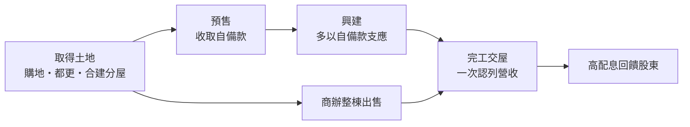
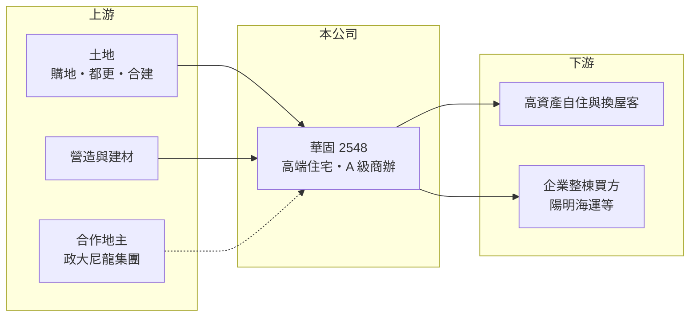

# 2548 華固

> 上市｜[[產業索引-建材營造業|建材營造業]]｜上市（櫃）日期 2002/08/26

# 第一章：企業模式與商業藍圖

> [!info] 撰寫說明
> 本文由 Claude 依公開資料整理，架構比照 [[2330台積電]] 的四章研究，資料截至 2026-10-08。財務數字來源：Goodinfo 年度經營績效頁、富果研究 2025 年 12 月法說會整理；產業描述為整理性內容，尚未逐條比對原始文件。#待校對

在評估單一個股的長期投資價值時，首要步驟是拆解企業的底層獲利邏輯。本章說明華固建設（股票代號：2548，以下簡稱華固）如何專注大台北與台中的高端住宅和 A 級商辦，以高毛利、少量精選的方式經營建設本業。

## 一、核心定位：高端住宅與整棟商辦

華固的推案集中在台北市、新北市與台中市，產品以高單價住宅、頂級豪宅與 A 級商辦為主。代表案包括信義「無雙」、大直「時代置地」、新店「預成」、士林北投「華固芙清」，以及台中「頂匯」「峯會」「世紀匯」。這些地段的土地稀缺、單價高，使華固的[[毛利率]]長期維持在 24% 至 36%，明顯高於一般大眾型建商。

商辦是華固另一條重要路線。公司常採「整棟出售」模式，例如「華固中央置地」整棟售予陽明海運，合約金額 112 億元。整棟出售可以一次回收資金、降低零售去化的時間風險，代價是需要找到有能力一次買下整棟的企業客戶。

## 二、資本轉化邏輯：自備款支應興建

華固在法說會表示，多數建案靠客戶自備款即可支應興建成本，建築融資額度雖有申請但很少動用。這代表公司的財務槓桿主要用在土地，而不是工程款，財務結構相對穩健。

## 三、長期藍圖：政大新店案與敦化都更

華固最大的長期案源是與政大尼龍集團合作的「政大新店案」，華固可售總銷約 588 億元，預計在未來 3 至 4 年陸續開發；另有忠孝敦化站附近的敦化[[都更]]案，預期單價約每坪 200 萬元。公司預估 2026、2027 年營收與 2025 年相近，每年約 180 億元，並指出 2030 至 2032 年案量有空窗，規劃購地補足約 200 多億元案量。

# 第二章：護城河深度與競爭優勢

「護城河」指企業抵禦競爭、維持超額利潤的保護機制。本章分析華固在高端住宅市場的優勢與限制。

## 一、護城河的組成

華固的第一個優勢是品牌與產品定位。高端住宅買方重視地段、建築品質與交屋紀錄，華固長期在信義、大直等精華區推案，累積了「華固」在豪宅市場的辨識度。第二是土地取得能力，透過都更、合建分屋、合建分售等多元合作模式，華固能在精華區取得單純購地難以取得的基地。第三是穩健財務，自備款支應興建降低了景氣反轉時的資金壓力。

## 二、主要競爭對手

| 對手 | 定位 | 對華固的威脅 |
|---|---|---|
| [[2520冠德]] | 雙北住宅與大型開發 | 在台北精華區住宅競爭 |
| [[5534長虹]] | 雙北中高價住宅 | 爭取同一批換屋與高資產客群 |
| [[2545皇翔]] | 台北豪宅與商辦 | 在豪宅與商辦整棟出售市場競爭 |

## 三、守得住／守不住／觀察重點

守得住的是精華區土地帶來的高毛利與品牌溢價；守不住的是豪宅市場對政策特別敏感，央行[[信用管制]]對高價住宅與第二戶的限制、豪宅稅等，都可能讓去化放慢。長期觀察重點是政大新店案的推進速度、商辦整棟出售的買方是否持續出現，以及 2030 年後的案量空窗能否補足。

# 第三章：財務體質與盈利規模

資料日期：2026-10-08。數字取自 Goodinfo 年度經營績效與富果研究法說會整理，表格是撰寫當時的快照；最新月營收、毛利率、累計 EPS 由自動排程寫在本筆記的屬性欄位（月營收、毛利率、累計EPS 等）。#待校對

財務報表是檢驗護城河是否真實存在的最終標準。本章用五年的三率、ROE 與資本報酬檢視華固的獲利品質。

## 一、多年度經營績效

| 年度 | 營收（新台幣） | [[毛利率]] | [[營業利益率]] | EPS（元） | [[ROE]] |
|---|---|---|---|---|---|
| 2021 | 135 億 | 32.2% | 26.1% | 10.56 | 16.2% |
| 2022 | 149 億 | 31.9% | 25.1% | 10.69 | 15.6% |
| 2023 | 158 億 | 33.0% | 27.5% | 12.95 | 17.8% |
| 2024 | 72.1 億 | 35.8% | 26.3% | 4.58 | 6.67% |
| 2025 | 182 億 | 28.2% | 21.8% | 10.15 | 15.0% |

華固 2021 至 2025 年平均 ROE 約 14.3%（推算），營收年複合成長率約 7.8%（推算），但單一年度營收會因交屋時點大幅波動，例如 2024 年營收僅 72 億元。毛利率長期維持在 28% 以上、營業利益率 21% 以上，是上市建商中獲利率較高的一群。2025 年度擬配發現金股利 8 元及股票股利 0.5 元，公司改採 70% 至 80% 的股利配發率政策，Goodinfo 統計歷年平均現金股利約 4.3 元，配息穩定度高。

## 二、營建業指標

本次未查得已售未入帳總額，但公司預估 2026、2027 年營收維持約 180 億元，主要來自「華固上文林」「華固一莊」「時代置地」「華固頂匯」與「木川」等案交屋；頂匯總銷約 108 億元，第一期 200 戶已完銷。依 ROE 與 ROA 推算，2025 年總資產約為股東權益的 2.5 倍（推算），負債比約 60%，以建商而言屬中等。

## 三、[[ROIC]] 與 [[WACC]]：價值創造利差

**ROIC 推算：** 2025 年營業利益約 39.7 億元（182 億 × 21.8%），稅後約 31.7 億元。股東權益約 225 億元（每股淨值 70.15 元 × 約 3.2 億股），依 ROA 5.85% 推算總負債約 331 億元，假設其中四成為有息負債約 130 億元（推估，公司表示建融少動用），投入資本約 355 億元，ROIC 約 8.9%（推算）；以 2021 至 2025 年平均營業利益約 35 億元計算，ROIC 約 7.9%（推算）。

**WACC 推算：** 台灣 10 年期公債 1.75%、市場風險溢酬 6%、β 取營建同業常見值 0.9，股東權益成本約 7.2%；負債成本 3%、稅後 2.4%；權益占投入資本約 63%，WACC 約 5.4%（推算）。

**結論：** 華固 ROIC 長期高於 WACC 約 2 至 3 個百分點，屬於能穩定創造價值的建商，關鍵在於精華區土地帶來的高毛利。若未來購地成本上升而售價無法同步調漲，利差會被壓縮。

# 第四章：總體風險與地緣政治

任何企業都無法脫離宏觀環境獨立存在。本章分析華固長期必須面對的房市、政策與營運風險。

## 一、房市週期與政策

房地產景氣循環長達 7 至 10 年，豪宅與商辦又比一般住宅更受資金與政策影響。央行信用管制、房地合一稅與高價住宅貸款限制，都會直接影響華固主力產品的買氣；法說會也提到台中等區域仍有市場賣壓待消化。

## 二、案量空窗與土地成本

華固 2030 至 2032 年案量有空窗，需購地補足。精華區土地價格高、可取得基地少，若補地不順或以過高價格買地，未來的毛利率與營收連續性都會受影響。

## 三、營建成本與大型案執行

缺工、建材與土方處理成本上升是全產業壓力。政大新店案規模大、開發期長，若時程延誤，資本會長期壓在土地上，降低資本報酬率。

# 專有名詞解析

## 金融

- **[[信用管制]]**：央行限制購屋與建商貸款成數的政策，會影響房市成交與建商資金。
- **[[ROIC]]**：投入資本報酬率，稅後營業利益除以股東權益加有息負債，衡量本業運用資本的效率。
- **[[WACC]]**：加權平均資金成本，股東與債權人要求報酬率的加權平均，是 ROIC 要超越的門檻。

## 產業

- **[[建案交屋]]**：建商在房屋完工並交付買方時才認列營收，因此營建公司的營收常集中在交屋年度。
- **[[都更]]**：都市更新，由地主與建商合作把老舊建物改建，地主依權利價值分回房地或收益。
- **[[合建分售]]**：地主出地、建商出資興建，完工後雙方依比例各自出售房地的合作模式。

# 核心供應鏈

## 1. 上游：土地與營造
- 土地：精華區購地、都更、合建分屋與合建分售
- 建材：[[1101台泥]]、[[2002中鋼]] 等

## 2. 中游：華固與同業
- 同業：[[2520冠德]]、[[5534長虹]]、[[2545皇翔]]

## 3. 下游：客戶
- 高資產自住與換屋客、整棟商辦買方（如 [[2609陽明]]）

## 最新新聞
<!-- news:start -->
<!-- news:end -->

## 相關連結
- [公開資訊觀測站](https://mopsov.twse.com.tw/mops/web/t05st03?step=1&firstin=1&co_id=2548)
- [Goodinfo](https://goodinfo.tw/tw/StockDetail.asp?STOCK_ID=2548)
- [Yahoo 股市](https://tw.stock.yahoo.com/quote/2548)
- [鉅亨網新聞](https://www.cnyes.com/twstock/2548/news)
