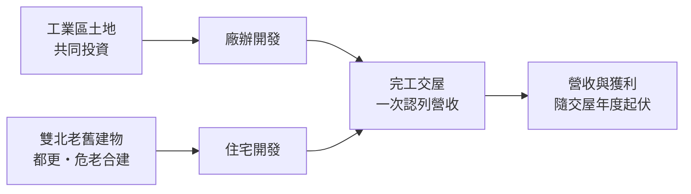
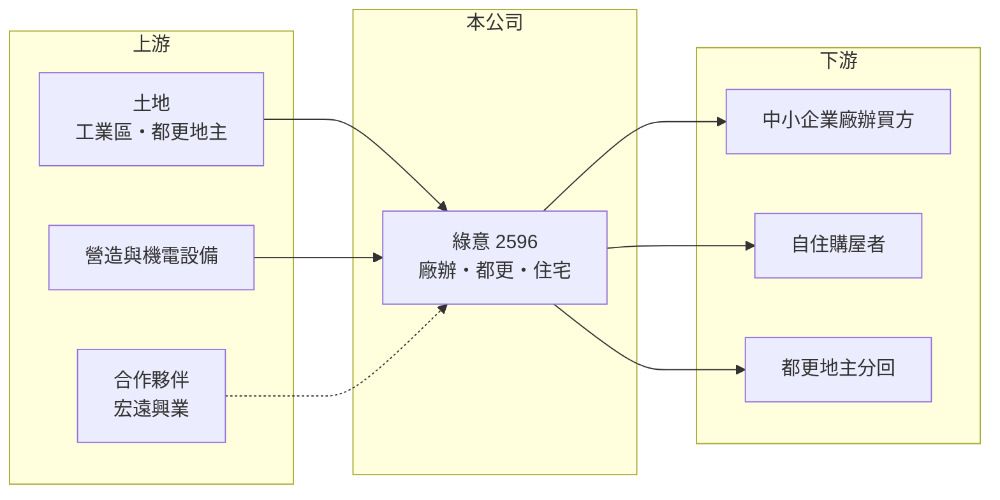

# 2596 綠意

> 上櫃｜[[產業索引-建材營造業|建材營造業]]｜上市（櫃）日期 2009/06/01

# 第一章：企業模式與商業藍圖

> [!info] 撰寫說明
> 本文由 Claude 依公開資料整理，架構比照 [[2330台積電]] 的四章研究，資料截至 2026-10-08。財務數字來源：Goodinfo 年度經營績效頁、富果研究 2025 年 11 月法說會整理；公開資料有限，產業描述為整理性內容，尚未逐條比對原始文件。#待校對

在評估單一個股的長期投資價值時，首要步驟是拆解企業的底層獲利邏輯。本章說明綠意開發（股票代號：2596，以下簡稱綠意）如何以廠辦大樓與雙北都更為主軸，在小型建商中找出自己的利基。

## 一、核心定位：廠辦與都更並行的小型開發商

綠意的業務包括住宅大樓、廠辦大樓與透天住宅開發，股本約 10 億元，屬於規模較小的上市建商。它的特色是把重心放在兩個政策驅動的市場：一是配合政府「工業區立體化」政策開發廠辦，例如桃園中壢工業區的「綠意領航一號」與土城「綠意永寧一號」；二是雙北[[都更]]與[[危老重建]]，包括汐止新峯段、新店安和段、士林永平段與南港玉成段。

廠辦的買方主要是需要擴充產能或辦公空間的中小企業，需求來自製造業的實際使用，而不是投資客，因此受住宅[[信用管制]]的影響相對小。都更與危老則是雙北少數還能取得建地的管道，案源穩定但整合期長。

## 二、資本轉化邏輯：小規模、案件集中

綠意每年只有一到兩個建案交屋，營收高度集中在少數案子，例如 2025 年第一季認列「綠意順光天下」約 6 億元，就占當年營收近一半。這讓公司營收在 4 億至 15 億元之間大幅擺盪，是小型建商的典型特性。

## 三、長期方向

綠意的長期方向是持續累積工業區廠辦與雙北都更兩類案源，並以穩健銷售為原則，避免依賴短期政策刺激。都更案從整合到動工常需數年，汐止新峯段預計取得建照後動工、新店安和段與宏遠興業合作仍在設計階段，這些案子決定了公司 2027 年以後的營收規模。

# 第二章：護城河深度與競爭優勢

「護城河」指企業抵禦競爭、維持超額利潤的保護機制。建設業門檻低，小型建商尤其難有明顯護城河，本章說明綠意的相對優勢與限制。

## 一、相對優勢

綠意的優勢主要在於選對利基市場。工業區立體化廠辦的競爭者比一般住宅少，開發需要熟悉工業區法規與污水排放等審查流程，綠意已有多個廠辦實績，法說會提到中壢案的污水審查時程從半年以上縮短到兩個月內，顯示累積的審查經驗具有實際價值。都更方面，與地主及合作夥伴（如宏遠興業）建立的關係，也是後續案源的基礎。

## 二、主要競爭對手

| 對手 | 定位 | 對綠意的威脅 |
|---|---|---|
| [[2520冠德]] | 雙北住宅與都更 | 在雙北都更案源上競爭 |
| 各地區域型建商 | 工業區廠辦與透天 | 以在地人脈爭取土地與買方 |
| 大型建商的廠辦產品 | 科技廠辦與商辦 | 品牌與資金規模較大 |

## 三、守得住／守不住／觀察重點

守得住的是廠辦利基與都更經驗；守不住的是規模，案量少使營收與獲利高度依賴單一建案的交屋時點。長期觀察重點是都更案能否如期取得建照、廠辦去化速度，以及每年能否維持穩定的推案節奏。

# 第三章：財務體質與盈利規模

資料日期：2026-10-08。數字取自 Goodinfo 年度經營績效與富果研究法說會整理，表格是撰寫當時的快照；最新月營收、毛利率、累計 EPS 由自動排程寫在本筆記的屬性欄位（月營收、毛利率、累計EPS 等）。#待校對

財務報表是檢驗護城河是否真實存在的最終標準。本章用五年的三率、ROE 與資本報酬檢視綠意的獲利品質。

## 一、多年度經營績效

| 年度 | 營收（新台幣） | [[毛利率]] | [[營業利益率]] | EPS（元） | [[ROE]] |
|---|---|---|---|---|---|
| 2021 | 14.8 億 | 33.1% | 23.6% | 3.05 | 12.2% |
| 2022 | 4.13 億 | 36.8% | 19.0% | 0.58 | 2.21% |
| 2023 | 9.13 億 | 16.8% | 6.05% | 0.82 | 3.29% |
| 2024 | 8.13 億 | 20.3% | 10.0% | 0.67 | 2.70% |
| 2025 | 13.0 億 | 26.1% | 17.5% | 1.86 | 7.52% |

2021 至 2025 年平均 ROE 約 5.6%（推算），營收沒有明確成長趨勢，主要隨交屋案件起伏。毛利率在 17% 至 37% 之間，取決於當年交屋的是住宅還是廠辦、以及土地取得成本。2022 至 2024 年每年配發現金股利 1.0 元，公司表示以穩定配息為原則，但這三年 EPS 均低於 1 元，代表部分年度配息超過當年獲利，長期能否維持需看後續交屋。

## 二、營建業指標

截至 2025 年第三季，總資產約 55.8 億元、股東權益約 23.8 億元，負債約 32 億元（推算），負債比約 57%。未查得已售未入帳總額；已知「綠意久康」危老合建案與「綠意永寧一號」廠辦（142 戶）預計 2026 年完工。

## 三、[[ROIC]] 與 [[WACC]]：價值創造利差

**ROIC 推算：** 2025 年營業利益約 2.3 億元（13 億 × 17.5%），稅後約 1.8 億元。股東權益約 21 億元（每股淨值 21.06 元 × 1 億股），假設有息負債約 22 億元（推估，約負債的七成），投入資本約 43 億元，ROIC 約 4.2%（推算）；以 2021 至 2025 年平均營業利益約 1.6 億元計算，ROIC 約 3%（推算）。

**WACC 推算：** 台灣 10 年期公債 1.75%、市場風險溢酬 6%、β 取營建同業常見值 0.9，股東權益成本約 7.2%；負債成本 3%、稅後 2.4%；權益占投入資本約 49%，WACC 約 4.7%（推算）。

**結論：** 綠意的 ROIC 在交屋大年接近 WACC，平均則略低於資金成本，代表目前規模下還沒有穩定創造超額報酬。廠辦與都更案若能形成連續交屋，才有機會改善。

# 第四章：總體風險與地緣政治

任何企業都無法脫離宏觀環境獨立存在。本章分析綠意長期必須面對的產業與營運風險。

## 一、產業週期與政策

住宅市場受央行信用管制與房市週期影響；廠辦需求則跟製造業景氣連動，景氣下行時中小企業擴廠意願會降低。工業區立體化屬政策導向，若政策方向或容積獎勵改變，廠辦案源也會受影響。

## 二、都更審查與時程風險

都更與危老案需要整合多位地主並通過審議，時程難以掌握，例如士林永平段因既成巷道問題審查已逾一年半。時程延誤代表資金與人力被長期占用。

## 三、營建成本與工期

營建業缺工、電梯等機電設備產能滿載，已導致「綠意永寧一號」工期延長。對案量少的小型建商而言，單一案件延期就會造成整年營收落差。

# 專有名詞解析

## 金融

- **[[信用管制]]**：央行限制購屋與建商貸款成數的政策，會影響房市成交與建商資金。
- **[[ROIC]]**：投入資本報酬率，稅後營業利益除以股東權益加有息負債，衡量本業運用資本的效率。
- **[[WACC]]**：加權平均資金成本，股東與債權人要求報酬率的加權平均，是 ROIC 要超越的門檻。

## 產業

- **[[都更]]**：都市更新，由地主與建商合作把老舊建物改建，地主依權利價值分回房地或收益。
- **[[危老重建]]**：依危老條例針對屋齡老舊或耐震不足的建物重建，整合門檻比都更低、規模較小。
- **[[工業區立體化]]**：政府鼓勵把工業區平面廠房改建成多層廠辦，以提高土地利用率並提供容積獎勵。

# 核心供應鏈

## 1. 上游：土地與營造
- 土地：工業區共同投資、雙北都更與危老合建
- 合作夥伴：[[1460宏遠]]（新店安和段都更）
- 營造與機電：電梯等設備供應商

## 2. 中游：綠意與同業
- 同業：[[2520冠德]] 及各地區域型建商

## 3. 下游：客戶
- 廠辦買方（中小製造業）、自住購屋者、都更地主

## 最新新聞
<!-- news:start -->
<!-- news:end -->

## 相關連結
- [公開資訊觀測站](https://mopsov.twse.com.tw/mops/web/t05st03?step=1&firstin=1&co_id=2596)
- [Goodinfo](https://goodinfo.tw/tw/StockDetail.asp?STOCK_ID=2596)
- [Yahoo 股市](https://tw.stock.yahoo.com/quote/2596)
- [鉅亨網新聞](https://www.cnyes.com/twstock/2596/news)
