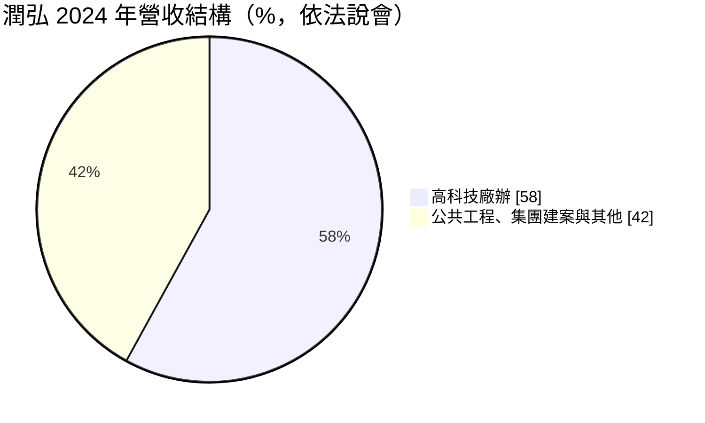
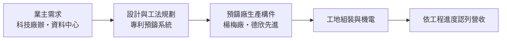
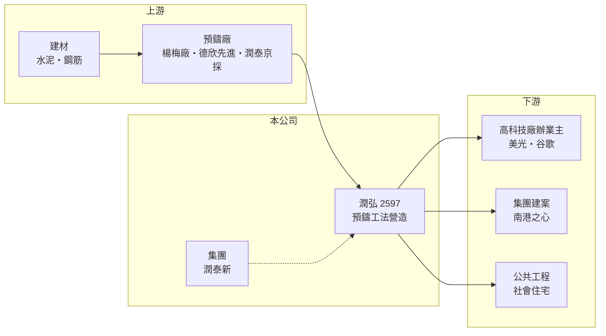

# 2597 潤弘

> 上市｜[[產業索引-建材營造業|建材營造業]]｜上市（櫃）日期 2010/03/26

# 第一章：企業模式與商業藍圖

> [!info] 撰寫說明
> 本文由 Claude 依公開資料整理，架構比照 [[2330台積電]] 的四章研究，資料截至 2026-10-08。財務數字來源：Goodinfo 年度經營績效頁、富果研究 2025 年 7 月法說會整理；產業描述為整理性內容，尚未逐條比對原始文件。#待校對

在評估單一個股的長期投資價值時，首要步驟是拆解企業的底層獲利邏輯。本章說明潤弘精密工程（股票代號：2597，以下簡稱潤弘）如何以[[預鑄工法]]把一般營造業的紅海，轉成技術門檻較高的利基市場。

## 一、核心定位：預鑄工法的專業營造廠

潤弘是潤泰集團旗下的甲級營造廠，核心能力是預鑄工法，也就是先在工廠把柱、梁、樓板等結構構件做好，再運到工地組裝。公司提供從設計、施工、機電到材料供應的一條龍服務，並擁有 788 項專利，研發團隊包含 7 名博士與數十名碩士。

經營層的說法很直接：傳統營造競爭激烈、毛利率約 4% 至 6%，是紅海市場；預鑄工法技術門檻高、競爭者少，是藍海市場。預鑄結構約占總造價 15% 至 20%，但它決定了工期與品質，這正是高科技廠房業主最在意的兩件事。

## 二、營收結構：高科技廠辦為主力

2024 年高科技廠辦約占營收 58%，客戶包括美光、谷歌等國際大廠與台灣高科技業者。公司每年只少量承接毛利較低的公共工程（如社會住宅）與集團建案；潤泰新的集團案量約占在手訂單兩成，最大案是金額近 300 億元的「南港之心」。

## 三、資本轉化邏輯：預鑄廠產能決定接單上限

潤弘的瓶頸不在接單，而在預鑄產能與人力。公司已擴充楊梅廠，並透過子公司取得預鑄廠德欣先進 35% 股權，使預鑄產能擴大近四倍，但仍供不應求。子公司還包括水泥製品廠潤泰京採與室內設計公司潤德。

## 四、長期藍圖

潤弘的長期方向是以併購與策略合作擴大預鑄產能，並把預鑄工法從科技廠房推廣到一般建築市場。若預鑄能在住宅與商辦普及，潤弘的可服務市場將明顯擴大；這也呼應營建業長期缺工的趨勢，工廠化生產比工地現場施工更不依賴基層技術工。

# 第二章：護城河深度與競爭優勢

「護城河」指企業抵禦競爭、維持超額利潤的保護機制。本章分析潤弘在營造業少見的技術型護城河。

## 一、護城河的組成

第一是工法專利與技術累積。788 項專利與長期的預鑄工程實績，讓競爭者難以在短期內複製同樣的工期與品質。第二是產能本身。預鑄廠需要土地、模具與熟練工班，新進者要花多年才能建立；潤弘擁有的產能越大，越能承接大型、工期緊的科技廠案。第三是客戶黏著。高科技業主擴廠頻繁，一旦對某家營造廠的交期與品質滿意，後續廠區擴建通常會優先找同一家。

## 二、主要競爭對手

| 對手 | 定位 | 對潤弘的威脅 |
|---|---|---|
| [[2546根基]] | 冠德集團營造廠，科技廠房與軌道工程 | 在科技廠房市場直接競爭 |
| 互助營造、皇昌營造等 | 大型科技廠房營造 | 以傳統工法爭取同一批業主 |
| 日商營造廠 | 外資業主與統包 | 在外商建廠案具優勢 |

## 三、守得住／守不住／觀察重點

守得住的是預鑄技術與科技廠房實績；守不住的是對科技業資本支出的依賴，若半導體與資料中心建廠潮放緩，高毛利案源會減少。公司內部盡量不接工期超過兩年的案子，以控制物價風險，這是值得肯定的紀律。長期觀察重點是預鑄產能擴充進度、人才招募，以及預鑄工法在一般建築市場的滲透。

# 第三章：財務體質與盈利規模

資料日期：2026-10-08。數字取自 Goodinfo 年度經營績效與富果研究法說會整理，表格是撰寫當時的快照；最新月營收、毛利率、累計 EPS 由自動排程寫在本筆記的屬性欄位（月營收、毛利率、累計EPS 等）。#待校對

財務報表是檢驗護城河是否真實存在的最終標準。本章用五年的三率、ROE 與資本報酬檢視潤弘的獲利品質。

## 一、多年度經營績效

| 年度 | 營收（新台幣） | [[毛利率]] | [[營業利益率]] | EPS（元） | [[ROE]] |
|---|---|---|---|---|---|
| 2021 | 213 億 | 15.4% | 10.8% | 9.96 | 25.7% |
| 2022 | 246 億 | 13.8% | 9.92% | 11.14 | 26.1% |
| 2023 | 225 億 | 15.4% | 10.9% | 10.28 | 25.2% |
| 2024 | 262 億 | 17.8% | 13.5% | 10.71 | 31.8% |
| 2025 | 315 億 | 17.4% | 13.6% | 10.75 | 33.5% |

潤弘的毛利率 14% 至 18%，約為傳統營造廠的兩到三倍，正是預鑄工法護城河的財務證據。2021 至 2025 年營收年複合成長率約 10%（推算），平均 ROE 約 28.5%（推算）。公司傾向把扣除法定盈餘公積後的盈餘幾乎全數以現金或股票股利發放，股本因股票股利由 2019 年 13.5 億元增加到 2025 年約 31 億元，因此每股盈餘持平而總獲利持續成長；Goodinfo 統計歷年平均現金股利約 5.02 元。

## 二、營造業指標：在手訂單

截至 2025 年 5 月，在手合約總額約 1,144 億元、未認列金額約 603 億元，約為 2024 年營收的 2.3 倍，可支撐至少三年營運；另有開發中案量約 496 億元，公司估計六至七成可轉為正式合約。

## 三、[[ROIC]] 與 [[WACC]]：價值創造利差

**ROIC 推算：** 2025 年營業利益約 42.8 億元（315 億 × 13.6%），稅後約 34.3 億元。股東權益約 91 億元（每股淨值 29.18 元 × 約 3.11 億股），營造廠負債多為合約負債與應付工程款，假設有息負債約 15 億元（推估），投入資本約 106 億元，ROIC 約 32%（推算）。

**WACC 推算：** 台灣 10 年期公債 1.75%、市場風險溢酬 6%、β 取營建同業常見值 0.9，股東權益成本約 7.2%；負債成本 3%、稅後 2.4%；權益占投入資本約 86%，WACC 約 6.5%（推算）。

**結論：** 潤弘 ROIC 遠高於 WACC，是營建類股中少數長期大幅創造價值的公司。超額報酬來自高毛利工法與預收款帶來的輕資本營運，只要預鑄技術領先與科技廠房需求延續，這個利差就有機會維持。

# 第四章：總體風險與地緣政治

任何企業都無法脫離宏觀環境獨立存在。本章分析潤弘長期必須面對的產業與營運風險。

## 一、科技業資本支出週期

潤弘過半營收來自高科技廠辦，訂單與半導體、記憶體與雲端資料中心的建廠計畫高度連動。科技業資本支出具有明顯循環，景氣反轉時新廠延後或縮減，會直接影響新接訂單與毛利。

## 二、產能與人力

經營層坦言主要挑戰是產能與人力不足，而非業務開發。預鑄廠擴產需要時間，工程師與技術人力也需長期培養；若擴產進度落後，訂單消化速度與成長都會受限。

## 三、工料價格與集團關係

固定總價合約下，鋼筋、水泥與機電設備漲價會壓縮毛利，公司以限制工期兩年內來控制這個風險。集團案（如南港之心）占在手訂單兩成，關係人交易的條件與時程也是需要留意的面向。

# 專有名詞解析

## 金融

- **[[ROIC]]**：投入資本報酬率，稅後營業利益除以股東權益加有息負債，衡量本業運用資本的效率。
- **[[WACC]]**：加權平均資金成本，股東與債權人要求報酬率的加權平均，是 ROIC 要超越的門檻。

## 產業

- **[[預鑄工法]]**：先在工廠製作柱、梁、樓板等結構構件，再運到工地組裝的施工方式，可縮短工期並穩定品質。
- **[[統包工程]]**：由同一家廠商負責設計與施工的承攬方式，業主只需面對單一窗口。

# 核心供應鏈

## 1. 上游：建材與預鑄產能
- 建材：[[1101台泥]]、[[2002中鋼]] 等
- 預鑄與水泥製品：潤泰京採、德欣先進（轉投資）

## 2. 中游：潤弘與同業
- 集團：[[9945潤泰新]]、[[2915潤泰全]]
- 同業：[[2546根基]]

## 3. 下游：業主
- 高科技廠辦：美光、[[GOOGL谷歌]] 等
- 集團建案與公共工程

## 最新新聞
<!-- news:start -->
<!-- news:end -->

## 相關連結
- [公開資訊觀測站](https://mopsov.twse.com.tw/mops/web/t05st03?step=1&firstin=1&co_id=2597)
- [Goodinfo](https://goodinfo.tw/tw/StockDetail.asp?STOCK_ID=2597)
- [Yahoo 股市](https://tw.stock.yahoo.com/quote/2597)
- [鉅亨網新聞](https://www.cnyes.com/twstock/2597/news)
