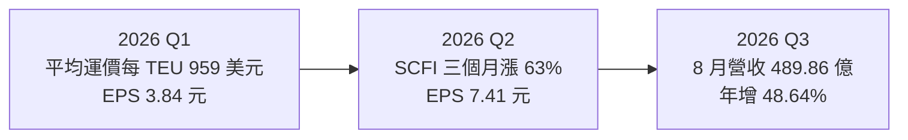
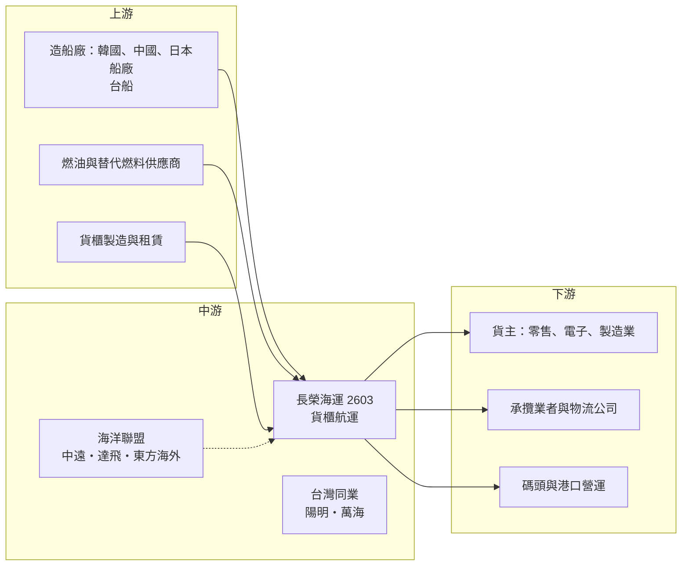

# 2603 長榮

> 上市｜[[產業索引-航運業|航運業]]｜上市（櫃）日期 1987/09/21

# 第一章：企業模式與商業藍圖

> [!info] 撰寫說明
> 本文由 Claude 依公開資料整理，架構比照 [[2330台積電]] 的四章研究，資料截至 2026-10-07。財務數字來源：長榮 2025 年財報與 2026 年第一季、上半年財報新聞（優分析、旺得富、商業周刊、聯合新聞網）、工商時報船隊報導、豐存股與 winvest 財務摘要；產業描述為整理性內容，尚未逐條比對原始文件。#待校對

在評估單一個股的長期投資價值時，首要步驟是拆解企業的底層獲利邏輯。本章針對長榮海運（股票代號：2603，以下簡稱長榮）的商業模式進行定性分析，說明一家貨櫃航商如何把船舶、貨櫃與航線網路轉化為營收，以及為何它的獲利會隨運價大起大落。

## 一、核心定位：全球第七大、台灣最大的貨櫃航商

長榮成立於 1968 年，是長榮集團的起家事業，1987 年上市。公司以貨櫃運輸為本業，在全球主要東西向航線（亞洲至北美、亞洲至歐洲、跨大西洋）與亞洲區間航線提供定期班輪服務。依工商時報 2026 年 4 月的報導，長榮運力約 197 萬 [[TEU]]，全球排名第七，公司目標在 2026 年第三季突破 200 萬 TEU，十年間運力約翻倍。

長榮的定位有三個特點：

* **規模最大的台灣航商：** 2025 年營收 3,790.69 億元，約為 [[2609陽明]] 的 2.3 倍、[[2615萬海]] 的 2.7 倍，在台灣貨櫃三雄中規模居首。
* **聯盟成員：** 長榮是[[航運聯盟]]「海洋聯盟（OCEAN Alliance）」成員，與中遠海運（含東方海外）、達飛共享艙位，2026 年聯盟整體合作運力約 508 萬 TEU。透過聯盟，長榮不必獨力在每條航線派足船舶，就能提供高頻率班次。
* **自有船比重高：** 公司表示[[租船]]比率在 30% 以下，是全球前七大船東中最低，船舶成本受租金行情影響較小。

## 二、終端應用板塊：航線布局與貨量結構

長榮未公開最新一期的航線營收比重，因此本節不畫圓餅圖，改以定性描述（依 2025 年下半年鉅亨號研究文章與公司說法整理）：

* **遠洋東西向航線：** 亞洲至北美（美西、美東）與亞洲至歐洲，是營收主體，也是運價波動最大的部分。2026 年 3 月至 6 月中旬，上海出口集裝箱運價指數（[[SCFI]]）上漲 63.42%，其中美西線翻倍、美東線漲逾九成、歐洲線漲近八成，直接帶動長榮第二季獲利跳升。
* **新興市場航線：** 公司近年刻意降低對美中航線的依賴，強化南美、中東與印度市場，以分散美中貿易戰與[[港口費]]的衝擊。
* **亞洲區間航線：** 東北亞、東南亞之間的短程航線，貨量穩定但單價較低，用來餵給遠洋幹線。
* **碼頭與周邊：** 長榮在全球多個港口經營或投資貨櫃碼頭，並有貨櫃租賃子公司（2026 年 3 月子公司長榮亞洲以 7 年期承租 2.5 萬只貨櫃），屬於支援本業的資產。

2026 年第一季長榮貨量為 264 萬 TEU，年增 1.6%，平均運價每 TEU 959 美元，年減 21.5%，說明貨量穩定、獲利主要由運價決定。

## 三、資本轉化邏輯：重資產、高槓桿的運價機器

* **固定成本高、營運槓桿大：** 一艘船不論裝滿與否，船員、折舊、港口與燃油成本大致固定。運價上漲時，增加的收入幾乎全數轉為利潤；運價下跌時，獲利也會快速萎縮。2022 年長榮[[毛利率]]高達 63.52%，2023 年降到 18.04%，就是這種槓桿的結果。
* **長約與即期的組合：** 北美線每年春季議定一年期[[長約運價]]，其餘多以[[即期運價]]計價。即期比重越高，對運價變化越敏感。
* **成本控制工具：** 長榮船隊安裝[[脫硫塔]]的比例超過八成，為業界最高，可以使用較便宜的高硫燃油。2026 年中東戰事期間低硫燃油價格一度由每噸約 500 美元漲到 1,120 美元，法人認為長榮受燃油成本衝擊相對較小。

## 四、企業長期藍圖：船隊更新與低碳轉型

* **雙燃料船隊：** 2023 至 2025 年間長榮合計訂造 55 艘[[雙燃料船]]，包括 24 艘 1.6 萬 TEU 甲醇雙燃料船、6 艘 2,400 TEU 甲醇雙燃料船，以及 2025 年下單的 11 艘 2.4 萬 TEU 與 14 艘 1.4 萬 TEU 液化天然氣（LNG）雙燃料船。公司規劃到 2030 年雙燃料船運能占比超過三成。
* **運能擴張：** 2026 年交船量較多，年總運能由 2025 年的 195 萬 TEU 增至約 205 萬 TEU（工商時報 2026 年 1 月報導）。
* **資產配置：** 公司強調「策略韌性」與「資產配置效率」，在景氣高峰累積的現金用於船舶更新、碼頭與貨櫃投資，同時維持約五成的配息率。

# 第二章：護城河深度與競爭優勢

在長期價值投資中，「護城河」指企業抵禦競爭、維持超額利潤的保護機制。本章分析長榮的護城河構成、全球主要競爭對手，以及這些優勢在運價下行週期中能守住多少。

## 一、長榮護城河的核心組成要素

貨櫃航運本質上是高度同質的商品化服務，運價由全球供需決定，個別航商很難長期維持高於同業的價格。因此長榮的護城河屬於「成本與規模型的窄護城河」，由三個要素組成：

* **1. 成本結構：** 自有船比重高（租船比率 30% 以下）、脫硫塔裝設率八成以上，讓長榮在燃油與租金上漲時的成本壓力低於多數同業。新交付的大型船舶單位艙位成本也較低。
* **2. 網路與聯盟：** 海洋聯盟提供高頻率、廣覆蓋的航線組合，對大型貨主而言，能一次滿足多條航線需求的航商更有議價籌碼。
* **3. 財務體質：** 2021 至 2024 年景氣高峰累積大量現金，讓長榮能在低谷期繼續下單新船與維持配息，不必在景氣差時被迫出售資產或增資。

## 二、全球主要競爭對手格局

| 對手 | 定位 | 對長榮的威脅 |
|---|---|---|
| 地中海航運（MSC） | 全球最大，持續大量下單新船 | 以規模壓低單位成本，在運價下行時能承受更低報價 |
| 馬士基（Maersk） | 第二大，推動端到端物流整合 | 搶大型貨主的整合物流合約 |
| 達飛（CMA CGM）、中遠海運 | 海洋聯盟夥伴，同時也是競爭者 | 在同一條航線上爭奪同一批貨主 |
| 赫伯羅特、ONE、HMM | 歐日韓主要航商 | 東西向主航線直接競爭 |
| [[2609陽明]]、[[2615萬海]] | 台灣同業 | 陽明在遠洋線、萬海在亞洲區間線與長榮重疊 |

## 三、優勢轉化：哪些市場守得住、哪些守不住

* **守得住：** 成本端的優勢，以及在燃油價格上漲期間的相對競爭力。2026 年上半年同業因中東戰事燃油大漲時，長榮受衝擊相對小。
* **守不住：** 運價本身。2025 年在全球新船大量交付、運價回落下，長榮營收年減 18.23%、稅後純益年減 50.82%，說明再好的成本控制也擋不住產業運價下跌。
* **觀察重點：** 全球運力供給（依 Alphaliner 與 Drewry 2026 年 7 月報告，2026 年運力增幅約 4.2% 至 4.4%，需求成長約 2.1% 至 2.5%）、紅海與荷莫茲海峽航道何時恢復正常、以及大型雙燃料新船交付後的單位成本表現。

# 第三章：財務體質與盈利規模

資料日期：2026-10-07。數字取自公司財報新聞與財經媒體整理，表格是撰寫當時的快照；最新月營收、毛利率、累計 EPS 由自動排程寫在本筆記的屬性欄位（月營收、毛利率、累計EPS 等）。#待校對

財務報表是檢驗護城河是否真實存在的最終標準。本章用三率、ROE、現金流與資本報酬，檢視長榮在運價週期中的獲利品質。

## 一、獲利能力的基石：三率

| 項目 | 2025 全年 | 2026 Q1 | 2026 Q2 | 2026 上半年 |
|---|---|---|---|---|
| 營收（新台幣） | 3,790.69 億 | 865.11 億 | 約 1,050 億（推算） | 約 1,917 億（推算） |
| [[毛利率]] | 24.45% | 未查得 | 未查得 | 19.49% |
| [[營業利益率]] | 19.55% | 未查得 | 未查得 | 14.77% |
| 稅後純益 | 685.81 億 | 83.04 億 | 未查得 | 未查得 |
| EPS（元） | 31.68 | 3.84 | 7.41 | 11.24 |

註：2026 年上半年與第二季營收由 1 至 8 月累計營收 2,887.37 億元扣除 7、8 月營收推算，僅供參考。

* **[[毛利率]]：** 長榮的毛利率幾乎完全由運價決定。2022 年 63.52%、2023 年 18.04%、2024 年 37.99%、2025 年 24.45%，波動幅度遠大於一般製造業。
* **[[營業利益率]]：** 管銷費用占營收比例低，營業利益率與毛利率走勢一致，差距大約 5 個百分點。
* **第二季回升的原因：** 中東戰事導致繞航與塞港、運力實質減少，加上旺季提前備貨，運價自 3 月底起急漲，第二季 EPS 季增約 93%。

## 二、[[ROE]]：資本效率

依豐存股整理，長榮 ROE 在 2022 年高達 76.04%，2023 年 7.12%，2024 年 27.34%，2025 年 11.99%。由於帳上累積大量權益，景氣普通年份 ROE 會落在個位數到一成多，只有運價飆漲時才會大幅拉升。評估長榮時，ROE 必須搭配運價週期位置一起看。

## 三、資本支出與自由現金流

* **[[CapEx]]：** 55 艘雙燃料新船陸續交付，2026 年起每年都有大額造船款支出，具體金額依各期公告為準（未逐筆彙整）。
* **[[自由現金流]]：** 景氣好時營業現金流遠大於造船支出；景氣差時兩者可能接近，需動用帳上現金或融資。
* **股利政策：** 2025 年度每股配發現金股利 16 元，配息率約五成（優分析 2026 年 3 月報導）。豐存股資料另列 2025 年度配發 32.5 元，兩者可能是發放年度與所屬年度的認列差異，待校對。

## 四、[[ROIC]] 與 [[WACC]]：價值創造利差

貨櫃航運的 ROIC 在景氣高峰期遠高於資金成本，低谷期則可能低於 WACC。長榮的優勢在於自有船比重高、負債比低，資金成本相對低。推估在 2025 至 2026 年的正常化期間，ROIC 仍略高於 WACC，但具體數值未查得。新船交付後折舊增加，若運價回落，利差可能再度縮小。

# 第四章：總體風險與地緣政治

任何企業都無法脫離宏觀環境獨立存在。本章分析長榮未來必須面對的地緣政治、產業週期與營運風險。

## 一、地緣政治風險

* **中東戰事與航道：** 2026 年美伊衝突造成荷莫茲海峽通行受限，長榮有 3 艘船（2 艘 9,000 TEU、1 艘 5,500 TEU）一度滯留波灣，貨物轉運至安全港口。紅海航道也尚未全面恢復，航商仍以繞行好望角為主。戰事推升運價，但也帶來燃油成本、保險與船舶安全風險。
* **美中貿易與港口費：** 2025 年 10 月美中同步開徵港口費，將貿易戰延伸到海運。長榮雖非中資，但部分航線仍會受到艙位配置與貨流改變的影響。
* **關稅：** 美國關稅政策影響貨主出貨時點，可能造成提前拉貨後需求回落的波動。

## 二、產業週期與市場結構風險

* **新船過剩：** 2023 年以來全球新船大量交付，2026 年運力增幅仍高於需求成長。一旦紅海或荷莫茲航道恢復，繞航吸收的運力會釋放回市場，運價可能快速回落。
* **[[長鞭效應]]：** 零售商庫存調整會放大訂艙需求的波動，旺季可能提前或延後。
* **匯率：** 營收以美元計價，新台幣升值會壓縮以台幣表示的營收與獲利（2025 年 5 月營收曾因新台幣升值而雙減）。

## 三、營運環境的隱性風險

* **燃油價格：** 中東戰事讓低硫燃油價格大幅波動，脫硫塔可部分對沖，但整體燃油成本仍隨油價變動。
* **新船折舊：** 55 艘雙燃料船陸續交付，未來折舊增加，若運價下行，毛利率承壓會更明顯。
* **聯盟變動：** 航運聯盟每隔數年重組，夥伴改變會影響航線網路與艙位成本。

## 四、法規與技術演進風險

* **減碳法規：** 國際海事組織（IMO）的溫室氣體減量規範與歐盟碳排放交易制度（EU ETS）納入航運，未使用低碳燃料的船舶將面臨額外成本。長榮的雙燃料船布局是因應措施，但甲醇與 LNG 燃料供應與價格仍有不確定性。
* **燃料路線選擇：** 長榮同時下單甲醇與 LNG 雙燃料船，分散押注，但若未來某種燃料成為主流，另一類船舶可能面臨資產價值折減。

# 專有名詞解析

## 金融

- **[[自由現金流]]**：營業活動現金流減去資本支出，代表企業可自由用於配息、還債或併購的現金。
- **[[長鞭效應]]**：終端需求的小幅變動，沿供應鏈往上游傳遞時被逐級放大，造成上游庫存與訂單劇烈波動。

## 產業

- **[[TEU]]**：二十呎標準貨櫃（Twenty-foot Equivalent Unit），用來衡量貨櫃船運力與貨量的單位，一個四十呎櫃等於 2 TEU。
- **[[SCFI]]**：上海出口集裝箱運價指數，每週公布從上海出發主要航線的即期運價，是觀察貨櫃航運景氣最常用的指標。
- **[[航運聯盟]]**：多家航商共享船舶艙位、共同排班的合作組織，例如海洋聯盟、雙子星聯盟、Premier Alliance。
- **[[長約運價]]**：貨主與航商簽訂、通常為期一年的運價合約，北美線多在每年 4 至 5 月議定，波動小於即期運價。
- **[[即期運價]]**：依當下市場供需逐週報價的運價，反映市況最快，也是航商獲利波動的主要來源。
- **[[脫硫塔]]**：裝在船上的廢氣洗滌設備，可讓船舶使用較便宜的高硫燃油而仍符合排放規範。
- **[[雙燃料船]]**：可同時使用傳統燃油與甲醇或液化天然氣等低碳燃料的船舶，用來因應國際減碳法規。
- **[[租船]]**：航商向船東租用船舶而非自有，租金隨市況波動，租船比率越高成本越不穩定。
- **[[港口費]]**：針對特定國籍航商或船舶在港口加收的費用，2025 年美中互相開徵，成為貿易戰的一環。
- **[[繞航]]**：因航道風險（如紅海、荷莫茲海峽）改走較遠航線，會拉長航程並吸收市場運力。
- **[[燃油附加費]]**：航商依燃油價格向貨主加收的費用，用來轉嫁油價上漲的成本。

# 核心供應鏈

## 1. 上游：船舶、燃油與貨櫃
- 造船：韓國與中國大型船廠承造長榮多數新船，台灣的 [[2208台船]] 承造部分中型船舶
- 燃油：傳統低硫與高硫燃油、甲醇、液化天然氣供應商（中油等）
- 貨櫃：中國貨櫃製造商與貨櫃租賃公司

## 2. 中游：長榮本身、聯盟夥伴與同業
- 海洋聯盟夥伴：中遠海運（含東方海外）、達飛
- 台灣同業：[[2609陽明]]、[[2615萬海]]
- 集團關係企業：[[2618長榮航]]、[[2607榮運]]

## 3. 下游：貨主與物流
- 美國與歐洲零售商、電子與製造業出口商
- 承攬業者：2636台驊投控 等國內外貨運承攬公司

## 4. 下游：港口與碼頭
- 台北港、高雄港貨櫃中心，以及長榮在海外投資的貨櫃碼頭

## 最新新聞
<!-- news:start -->
<!-- news:end -->

## 相關連結
- [公開資訊觀測站](https://mopsov.twse.com.tw/mops/web/t05st03?step=1&firstin=1&co_id=2603)
- [Goodinfo](https://goodinfo.tw/tw/StockDetail.asp?STOCK_ID=2603)
- [Yahoo 股市](https://tw.stock.yahoo.com/quote/2603)
- [鉅亨網新聞](https://www.cnyes.com/twstock/2603/news)
