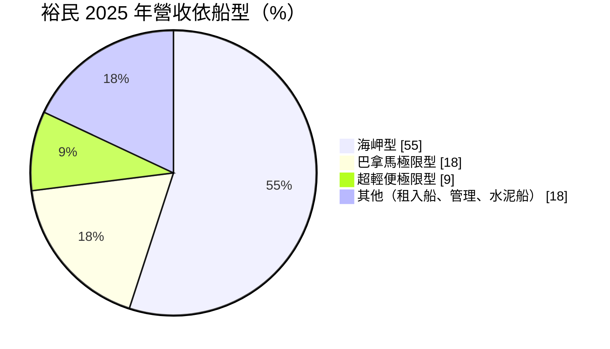
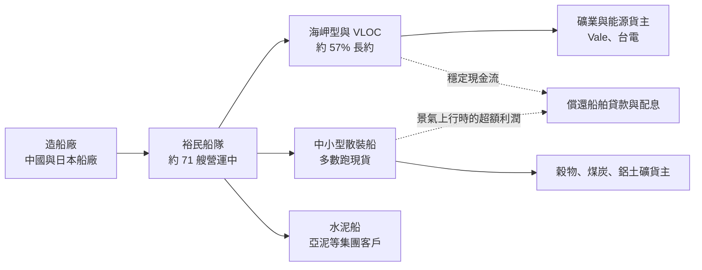
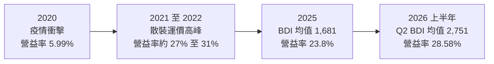
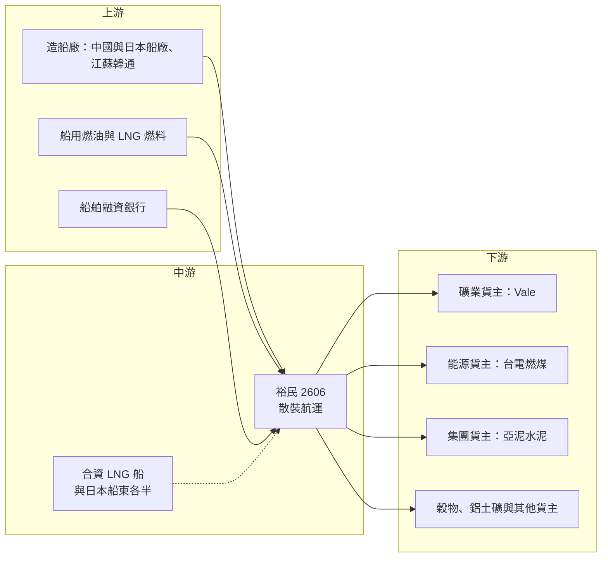

# 2606 裕民

> 上市｜[[產業索引-航運業|航運業]]｜上市（櫃）日期 1990/12/08

# 第一章：企業模式與商業藍圖

> [!info] 撰寫說明
> 本文由 Claude 依公開資料整理，架構比照 [[2330台積電]] 的四章研究，資料截至 2026-10-08。財務數字來源：Goodinfo 年度經營績效頁、證交所開放資料（基本資料、綜合損益、資產負債、營益分析、股利）、富果研究 2026 年 3 月法說會整理、旺得富（2026 年 8 月財報報導）、中央社（2020 年 12 月 Vale 長約報導）、股感（公司介紹）；產業描述為整理性內容，尚未逐條比對原始文件。#待校對

航運股的股價經常隨運價大起大落，但不同航商的體質差異很大。本章針對裕民航運（股票代號：2606，以下簡稱裕民）的商業模式進行定性分析，說明它如何以大型散裝船、長期運送合約與年輕船隊，在高度循環的散裝航運業中建立相對穩定的獲利基礎。

## 一、核心定位：遠東集團旗下、以大型散裝船為主力的自營航商

裕民的前身是 1968 年成立的「裕民運輸」，最初經營貨車陸運；1980 年散裝水泥船「亞泥一號」交船，成為第一艘營運船舶；1984 年改組為裕民航運，正式轉型為海運公司，1990 年股票上市（股感，公司介紹）。裕民隸屬遠東集團，董事長為徐旭東（證交所基本資料），[[1102亞泥]] 既是主要股東，也是長期客戶。

裕民的業務是以散裝船載運鐵礦砂、煤炭、穀物、水泥等大宗物資。和以出租船舶為主的 [[2637慧洋-KY]] 不同，裕民的收入主要來自自己承攬貨載、收取運費（股感，公司介紹），也就是直接面對貨主，而不是把船租給其他航商。

截至 2026 年 3 月，裕民營運中的船隊共 71 艘（含自有、管理與合資），另有 13 艘建造中，合計 84 艘；自有船隊平均船齡約 7.5 年，遠低於市場平均的 12.9 年，節能環保船占比約 94%（富果研究，2026 年 3 月法說）。2026 年 8 月的報導指出，船隊總運力已突破 1,000 萬載重噸（旺得富）。

## 二、終端應用／產品板塊：海岬型船貢獻過半

依富果研究整理的 2026 年 3 月法說內容，2025 年裕民營收依船型區分如下：

* **[[海岬型船]]（Capesize）：** 載重約 18 萬噸以上、無法通過巴拿馬運河的大型散裝船，主要載運鐵礦砂與煤炭。2025 年占營收 55%，是裕民的核心。裕民另擁有 32.5 萬噸級的超大型礦砂船（[[VLOC]]），專門配合長期礦砂運送合約。
* **巴拿馬極限型與超輕便極限型：** 中小型散裝船，載運穀物、煤炭、鋁土礦等貨物，2025 年合計約 27%，以現貨市場為主。
* **其他：** 包括租入船舶的營運收入、船舶管理收入，以及服務亞泥等水泥客戶的水泥船。

依合約性質區分，海岬型船約 57% 簽有長期合約，中小型船約 73% 至 74% 跑現貨市場（富果研究，2026 年 3 月法說）。這種「大船簽長約、小船賺現貨」的組合，是裕民平衡穩定性與景氣彈性的方式。

## 三、資本轉化邏輯（營運模式）：以長約鎖定大船收入

* **長期運送合約：** 最具代表性的是與巴西礦業公司 Vale 簽訂的 25 年鐵礦砂運送合約，由兩艘 32.5 萬噸 VLOC（裕元輪、裕智輪）承運，合約總收入超過 6 億美元（中央社，2020 年 12 月）。這類合約在簽約時就鎖定了多年的運費收入，船舶的造價與貸款也依合約現金流規劃，幾乎消除了景氣風險。
* **台電煤輪合約與集團貨載：** 台電燃煤運輸合約與亞泥水泥運輸是另外兩項穩定收入來源（股感，公司介紹），讓裕民在景氣低迷時仍有基本的貨源。
* **現貨市場的上檔空間：** 中小型船與部分海岬型船跑現貨，運價上漲時可以立刻受惠。2026 年第二季波羅的海乾散貨指數（[[BDI]]）平均 2,751 點，年增 88%，裕民當季淨利年增 204%（旺得富，2026 年 8 月）。

## 四、企業長期藍圖：百船計畫、綠色船隊與跨入 LNG 運輸

* **百船與千萬噸目標：** 公司長期目標是船隊超過 100 艘、總運力超過 1,000 萬載重噸（富果研究，2026 年 3 月法說），運力目標在 2026 年已達成。2026 年 6 月再向江蘇韓通船舶重工訂造兩艘 21.1 萬噸級紐卡索型散裝船（旺得富）。
* **逆週期造船的紀律：** 2008 年景氣高峰時裕民沒有大量訂船，而是在景氣反轉後的 2010 年起以較低價格訂造新船（股感，公司介紹）。這種逆週期投資習慣，是裕民能維持年輕船隊又不背負過高船價的原因。
* **跨入 LNG 運輸：** 裕民與日本船東各持股 50% 合資的 LNG 運輸船預計 2026 年交船營運，搭配 10 至 15 年的長期租約；由於是合資，獲利以[[權益法]]認列，不計入合併營收（富果研究、旺得富）。這是裕民首次跨出散裝航運，進入合約期更長、景氣波動較小的能源運輸。
* **綠色船隊：** 在 VLOC 加裝轉子帆可減少約 12% 的二氧化碳排放，LNG [[雙燃料船]]比傳統燃油船減少約 35% 排放（富果研究）。在國際海事組織碳排規範日趨嚴格的背景下，年輕且節能的船隊將成為接長約的重要條件。

# 第二章：護城河深度與競爭優勢

在長期價值投資中，「護城河」指企業抵禦競爭、維持超額利潤的保護機制。散裝航運是高度同質化、幾乎沒有定價權的產業，因此本章要回答的問題是：裕民在這樣的產業中，能否建立比同業更穩定的獲利能力。

## 一、裕民護城河的核心組成要素

散裝航運整體只有「窄護城河」，裕民的優勢主要來自以下三點：

* **1. 長期合約與貨主關係：** Vale 的 25 年合約、台電煤輪合約與亞泥水泥運輸，讓裕民有一部分收入不受運價波動影響。長期合約需要航商具備可靠的履約紀錄、適合的船型與財務實力，新進者很難取得。
* **2. 年輕節能的船隊：** 自有船隊平均船齡 7.5 年、節能船比重 94%（富果研究），燃油效率較高，在碳排規範趨嚴時更容易取得重視永續的貨主合約，也較不受老舊船舶限制航行或加徵碳費的影響。
* **3. 集團背景與財務紀律：** 遠東集團的信用有助於取得較低成本的船舶融資，逆週期造船的習慣則讓船隊成本低於在景氣高峰大量訂船的同業。

## 二、全球主要競爭對手格局

| 對手 | 定位 | 與裕民的比較 |
|---|---|---|
| [[2637慧洋-KY]] | 台灣最大散裝船東之一，以出租船舶給其他航商為主 | 租船模式收入較穩定但上檔空間較小，裕民以自營貨載為主 |
| [[2605新興]] | 散裝與油輪，長約比重高 | 同樣偏好長約，船隊規模較小 |
| [[5608四維航]] | 散裝航運，船隊以中小型船為主 | 現貨比重高，景氣敏感度較高 |
| [[2612中航]] | 中鋼集團相關的散裝航商 | 依附鋼鐵集團貨載，模式與裕民依附亞泥類似 |
| 國際散裝船東 | 希臘、中國、日本的大型散裝航商 | 船隊規模遠大於台灣航商，主導全球運價 |

## 三、優勢轉化：哪些市場守得住、哪些守不住

* **守得住：** 長約保護的海岬型與 VLOC 船隊收入，以及集團與台電的穩定貨載。這部分收入可以支撐船舶貸款與基本股利，讓裕民在景氣谷底也不至於出現嚴重虧損。
* **守不住：** 現貨市場的運價。裕民是運價的接受者而不是決定者，2025 年 BDI 平均 1,681 點、年減 4.2%，裕民稅後淨利年減 22.2%（富果研究）。運價下跌時，跑現貨的中小型船利潤會快速縮水。
* **觀察重點：** 第一，長約占比是否隨新船交付而提高；第二，LNG 運輸船投入營運後的權益法收益；第三，新造船的造價與交船時點是否落在景氣低檔，避免在運價高峰時接收高價新船。

# 第三章：財務體質與盈利規模

資料日期：2026-10-08。數字取自 Goodinfo 年度經營績效頁、證交所開放資料（綜合損益、資產負債、營益分析、股利）與富果研究、旺得富的法說及財報整理，表格是撰寫當時的快照；最新月營收、毛利率、累計 EPS 由自動排程寫在本筆記的屬性欄位（月營收、毛利率、累計EPS 等）。#待校對

財務報表是檢驗護城河是否真實存在的最終標準。本章用多年度的三率、ROE 與資本報酬，檢視裕民在散裝航運循環中的獲利品質。

## 一、獲利能力的基石：三率

| 年度 | 營收（新台幣） | [[毛利率]] | [[營業利益率]] | EPS（元） | [[ROE]] |
|---|---|---|---|---|---|
| 2019 | 101 億 | 18.8% | 14.5% | 1.92 | 6.18% |
| 2020 | 85.1 億 | 11.0% | 5.99% | 1.04 | 3.51% |
| 2021 | 140 億 | 31.6% | 27.2% | 5.79 | 20.0% |
| 2022 | 142 億 | 35.8% | 30.6% | 5.21 | 15.0% |
| 2023 | 144 億 | 23.5% | 18.8% | 3.24 | 8.0% |
| 2024 | 163 億 | 31.9% | 27.4% | 5.54 | 12.6% |
| 2025 | 156 億 | 28.8% | 23.8% | 4.31 | 9.18% |
| 2026 上半年 | 89.1 億 | 33.88% | 28.58% | 3.51 | 約 15%（年化） |

註：2019 至 2025 年取自 Goodinfo 年度經營績效；2026 上半年取自證交所營益分析與綜合損益開放資料，ROE 為 Goodinfo 年化數字。

* **[[毛利率]]：** 七年間毛利率從 2020 年谷底的 11% 到 2022 年高峰的 35.8%，波動幅度超過 20 個百分點，這是散裝航運的本質。不過 2023 年以後，即使運價回落，毛利率仍維持在 23% 以上，顯示長約比重與船隊效率提升後，獲利的「地板」已經墊高。
* **[[營業利益率]]：** 航運業的營業費用率很低，營業利益率與毛利率只差約 5 個百分點，獲利幾乎完全取決於運價與船舶成本。
* **低稅負特性：** 2026 年上半年稅前淨利約 30.3 億元，所得稅費用僅約 0.65 億元（證交所綜合損益），有效稅率約 2%（推算）。航運業普遍適用噸位稅制，使稅後淨利接近稅前淨利。
* **營收趨勢：** 2019 至 2025 年營收從 101 億元成長到 156 億元，年複合成長率約 7.5%（推算），主要來自船隊擴充。

## 二、[[ROE]]：資本效率

2021 至 2025 年的平均 ROE 約 13.0%（推算），但年度間差異很大，從 2021 年的 20% 到 2023 年的 8%。若把 2019、2020 年的景氣谷底也納入，過去七年的平均約 10.6%（推算）。航運股的 ROE 必須用一整個景氣循環的平均來看，單一年度的高 ROE 往往不能延續。

## 三、資本支出、自由現金流與股利

航運業的資本支出集中在新造船，造價動輒每艘數千萬美元，且付款依造船進度分期支付。裕民 2026 年 3 月仍有 13 艘新船在建造中（富果研究），並在 6 月追加兩艘紐卡索型船，代表未來幾年的資本支出仍高，具體金額未查得。在大量造船的年度，[[自由現金流]]可能為負，需要靠船舶貸款支應（推估）。2026 年第二季底負債總計約 510 億元，高於權益總計約 403 億元（證交所資產負債資料），財務槓桿明顯高於一般製造業。股利方面，2025 年度每股現金股利 2.8 元，以 EPS 4.31 元計算配發率約 65%（推算）；公司章程規定股利原則上不低於可分配盈餘的 50%，但保留了在重大資本支出時調整的彈性。

## 四、[[ROIC]] 與 [[WACC]]：價值創造利差

**ROIC 推算：** 2025 年營業利益約 37.04 億元（富果研究）。若依實際接近零的稅負計算，稅後營業利益約 36.3 億元；若依本系列統一假設的 20% 稅率，約 29.6 億元。2026 年第二季底權益總計約 403.2 億元，負債總計約 510.3 億元，其中船舶貸款與租賃負債等有息負債假設約占八成、約 410 億元（推估）。投入資本約 813 億元，ROIC 約 3.6% 至 4.5%（推算）。以 2026 年上半年營業利益 25.45 億元年化計算，ROIC 約 5% 至 6.3%（推算）。

**WACC 推算：** 假設台灣 10 年期公債殖利率 1.75%、市場風險溢酬 6%、β 取航運業常見值 1.1（假設值），股東權益成本約 8.35%。船舶貸款多為美元浮動利率，負債成本假設 4%、稅後約 3.2%；以帳面價值計，權益約占 50%、負債約占 50%，WACC 約 5.8%（推算）。

**結論：** 在 2025 年這種運價平淡的年份，裕民的 ROIC 低於 WACC，代表並未創造超額價值；在 2021、2022 年與 2026 年上半年的運價高峰期，ROIC 則可達到或超過 WACC。整體而言，裕民屬於「景氣好時創造價值、景氣差時侵蝕價值」的循環型公司，長期能否創造價值，取決於能否在景氣低檔造船、在景氣高檔簽下更多長約。

# 第四章：總體風險與地緣政治

任何企業都無法脫離宏觀環境獨立存在。本章分析裕民未來必須面對的地緣政治、產業週期、營運環境以及環保法規演進。

## 一、地緣政治

* **中國需求與貿易政策：** 全球海運鐵礦砂與煤炭的最大買家是中國，中國鋼鐵產量與房地產景氣直接影響海岬型船的需求。中美貿易摩擦、中國經濟放緩或鋼鐵減產，都會壓低散裝運價。
* **航道與衝突風險：** 中東局勢緊張被公司列為 2026 年的風險之一（富果研究）。航道受阻時船舶需要繞航，短期會推升運價，但也增加燃油成本與營運不確定性。
* **新礦源改變航線：** 西非 Simandou 鐵礦逐步投產，被視為延長鐵礦砂運距的因素（旺得富，2026 年 8 月）。運距拉長會增加船舶需求，對海岬型船是長期利多，但投產進度若延後，效果也會遞延。

## 二、產業週期與市場結構

* **散裝運價的高度循環：** 散裝運價由全球船舶供給與貨物需求決定，新船從下單到交船約需數年，供需常常錯配。2026 年新造船訂單約占現有船隊的 13.8%（旺得富），未來幾年若大量新船交付，可能壓低運價。
* **貨種結構轉變：** 煤炭需求因能源轉型而長期走弱，2026 年全年煤炭噸海里成長預估僅 0.4%；穀物與鋁土礦則是成長最快的貨種（旺得富）。裕民的船隊需要持續調整，以承接成長型貨種。
* **景氣週期的觀察指標：** BDI 的季平均值是最直接的觀察指標，2025 年均值 1,681 點，2026 年第二季均值 2,751 點，可以看出不到一年之內景氣就可能大幅轉向。

## 三、營運環境的隱性風險

* **匯率與利率：** 運費以美元計價，船舶貸款多為美元浮動利率，美國利率上升會提高利息支出，新台幣升值則會壓低以台幣計算的營收。
* **燃油成本：** 長約通常有燃油成本調整機制，但現貨航次的燃油成本由航商自行吸收，油價上漲會直接侵蝕利潤。
* **新船交付風險：** 大量新船同時交付時，若剛好遇上運價低迷，可能出現新船無長約可簽、只能跑低價現貨的情況。

## 四、科技或法規演進

* **國際海事組織碳排規範：** 國際海事組織逐步推動船舶碳強度指標與溫室氣體減量目標，老舊高耗能船舶將被迫降速或提早退役。裕民船隊年輕、節能船占比高，在規範趨嚴時相對有利；但未來若需全面改用 LNG、甲醇或氨燃料，船隊更新的資本支出會大幅增加。
* **綠色航運走廊與燃料轉型：** 裕民已嘗試轉子帆與雙燃料船等技術，這些投資短期增加成本，長期則決定能否取得重視碳足跡的大型礦業與能源貨主合約。

# 專有名詞解析

## 金融

- **[[權益法]]**：持股 20% 至 50% 等具重大影響力的投資，按持股比例認列被投資公司損益，不計入合併營收。
- **[[ROE]]**：股東權益報酬率，稅後淨利除以股東權益，衡量公司運用股東資金賺錢的效率。
- **[[ROIC]]**：投入資本報酬率，稅後營業利益除以股東權益加有息負債，衡量本業運用全部資本的效率。
- **[[WACC]]**：加權平均資金成本，股東權益成本與負債成本依資本結構加權的平均值，是投資報酬的最低門檻。
- **[[自由現金流]]**：營業活動現金流減去資本支出，代表企業可自由用於配息、還債或併購的現金。

## 產業

- **[[海岬型船]]**：載重約 18 萬噸以上的大型散裝船，因船體過大無法通過巴拿馬運河，需繞行好望角或合恩角，主要載運鐵礦砂與煤炭。
- **[[VLOC]]**：超大型礦砂船，載重約 25 萬至 40 萬噸，專門運送鐵礦砂，通常搭配礦業公司的長期運送合約。
- **[[BDI]]**：波羅的海乾散貨指數，綜合各型散裝船運價編製，是觀察散裝航運景氣最常用的指標。
- **[[租船]]**：船東把船舶出租給航商或貨主使用並收取租金的經營模式，收入較穩定但上檔空間較小。
- **[[長約運價]]**：航商與貨主簽訂多年期運送合約時約定的運價，不隨短期市場波動，可提供穩定收入。
- **[[即期運價]]**：依當下市場供需決定的單次航程運價，景氣好時上漲快速，景氣差時也下跌快速。
- **[[雙燃料船]]**：可使用傳統燃油與 LNG 等替代燃料的船舶，能降低碳排放，因應國際海事組織的減碳規範。

# 核心供應鏈

## 1. 上游：造船與融資
- 造船廠：中國與日本船廠，2026 年訂單由江蘇韓通船舶重工承造
- 船舶融資：國內外銀行（未逐一查證）

## 2. 中游：裕民本身與同業
- 散裝航運：裕民（海岬型、VLOC、巴拿馬極限型、超輕便極限型、水泥船）
- 合資 LNG 運輸船：與日本船東各持股 50%
- 台灣同業：[[2637慧洋-KY]]、[[2605新興]]、[[5608四維航]]、[[2612中航]]

## 3. 下游：主要貨主
- 鐵礦砂長約：Vale（巴西）
- 燃煤運輸：台電
- 水泥運輸與集團關係：[[1102亞泥]]

## 最新新聞
<!-- news:start（自動產生，請勿手動編輯此範圍） -->
- 2026-10-08 📰 媒體 17:23｜營收速報 - 裕民(2606)9月營收17.99億元年增率高達25.68％｜[鉅亨網](https://news.cnyes.com/news/id/6625002)

完整紀錄：[[2606裕民 新聞]]
<!-- news:end -->

## 相關連結
- [公開資訊觀測站](https://mopsov.twse.com.tw/mops/web/t05st03?step=1&firstin=1&co_id=2606)
- [Goodinfo](https://goodinfo.tw/tw/StockDetail.asp?STOCK_ID=2606)
- [Yahoo 股市](https://tw.stock.yahoo.com/quote/2606)
- [鉅亨網新聞](https://www.cnyes.com/twstock/2606/news)
