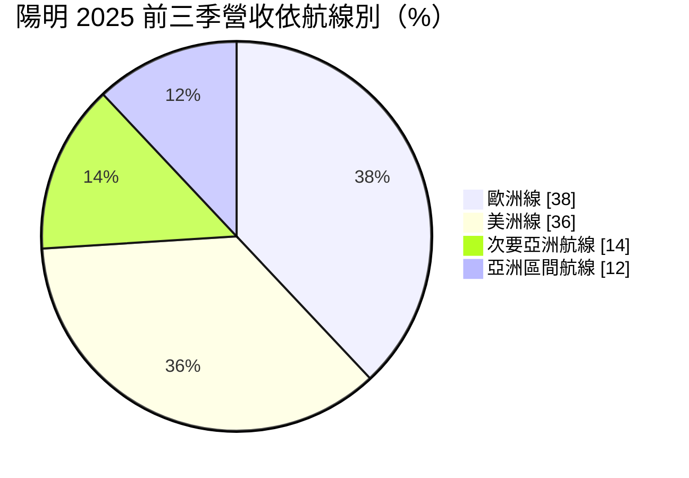
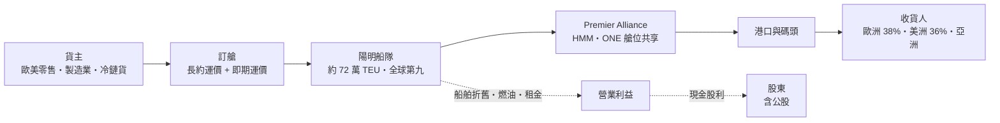
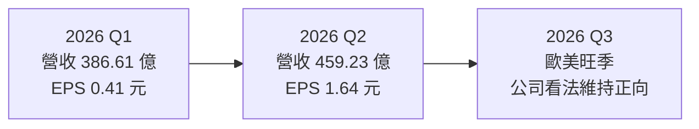
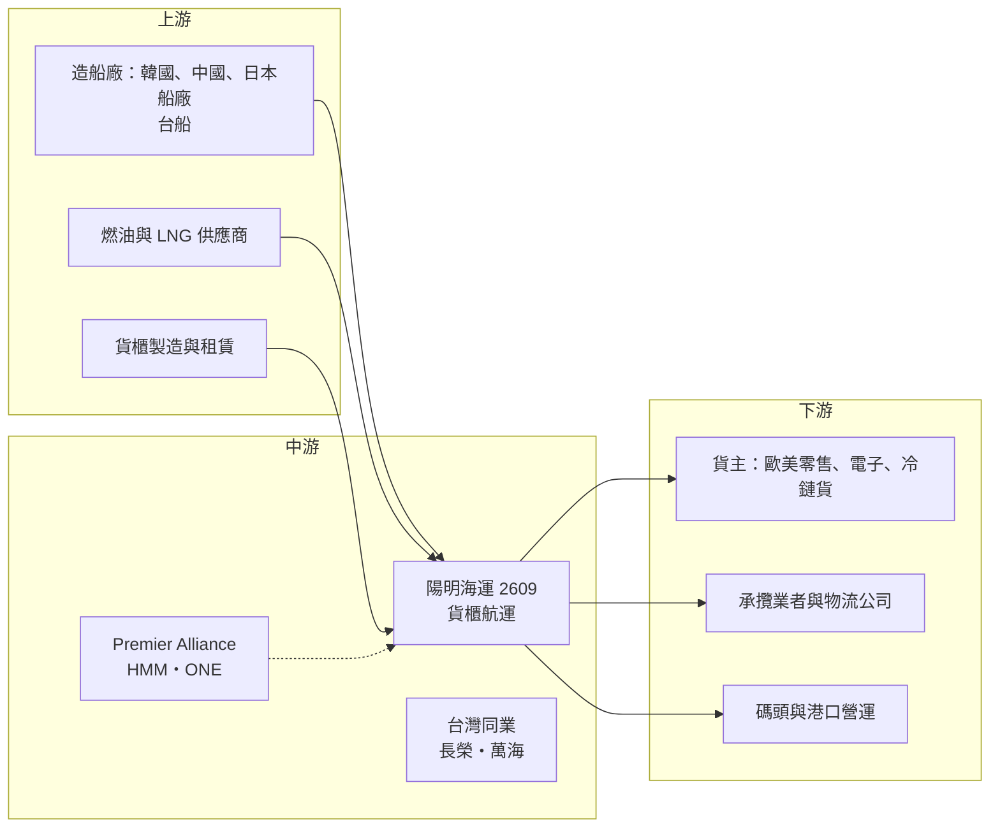

# 2609 陽明

> 上市｜[[產業索引-航運業|航運業]]｜上市（櫃）日期 1992/04/20

# 第一章：企業模式與商業藍圖

> [!info] 撰寫說明
> 本文由 Claude 依公開資料整理，架構比照 [[2330台積電]] 的四章研究，資料截至 2026-10-07。財務數字來源：陽明 2025 年財報新聞（工商時報）、2025 年 12 月法說會摘要（富果研究）、2026 年第一季與上半年財報新聞（旺得富、ETtoday）、豐存股財務摘要；產業描述為整理性內容，尚未逐條比對原始文件。#待校對

在評估單一個股的長期投資價值時，首要步驟是拆解企業的底層獲利邏輯。本章針對陽明海運（股票代號：2609，以下簡稱陽明）的商業模式進行定性分析，說明這家以遠洋航線為主的公股色彩航商，如何在運價週期中取得收入，以及它和 [[2603長榮]]、[[2615萬海]] 的差異。

## 一、核心定位：以歐美遠洋線為主的中型航商

陽明成立於 1972 年，是台灣貨櫃三雄之一，政府相關單位為重要股東，具有公股色彩。依 2025 年 12 月法說會資料，陽明船隊運能約 72.1 萬 [[TEU]]，全球排名第九。和長榮、萬海相比，陽明的特點是：

* **遠洋航線比重最高：** 歐洲與美洲航線合計占營收約 74%，對東西向主航線的運價最敏感。
* **聯盟策略：** 2025 年 2 月起與韓國 HMM、日本 ONE 組成[[航運聯盟]]「Premier Alliance」，涵蓋亞洲至北美、亞洲至歐洲等主要東西向航線。透過聯盟，陽明以中型規模參與大型主航線的競爭。
* **資產自有化：** 自有[[貨櫃]]比例由 2022 年的 36% 提高到 47%，降低租櫃成本與市場租金波動的影響。

## 二、終端應用板塊：航線營收結構

* **歐洲線（38%）：** 亞洲至北歐、地中海航線。紅海危機後多數船舶繞行好望角，航程拉長、運力被吸收，是近兩年運價支撐的主要來源，也是紅海恢復通航時最大的風險。
* **美洲線（36%）：** 亞洲至美西、美東。北美線多以一年期[[長約運價]]為主，其餘以[[即期運價]]計價，行情常以 [[SCFI]] 觀察；受美國關稅與[[港口費]]政策影響大。
* **次要亞洲航線（14%）：** 亞洲至印度、中東、澳洲等航線，2026 年中東戰事期間航次配置受到干擾。
* **亞洲區間（12%）：** 東北亞與東南亞之間的短程航線，貨量穩定但單價較低。

陽明也把冷鏈貨物（水果、藥品、生技產品）列為重點業務，以冷凍櫃提高單櫃收入。

## 三、資本轉化邏輯：運價決定一切的槓桿模式

* **高營運槓桿：** 貨櫃航運的成本大部分固定，運價變動幾乎直接反映在利潤。陽明 2024 年[[毛利率]] 34.86%、[[營業利益率]] 30.34%，2026 年上半年降到 12.86% 與 7.60%，同一套船隊在不同運價下的獲利差距極大。
* **歐美線集中的雙面性：** 運價上漲期間，陽明的獲利彈性最大；運價回落時，也最先受傷。2026 年第一季陽明 EPS 僅 0.41 元，第二季旺季提前與運價急漲後回升到 1.64 元。
* **燃油成本：** 陽明的[[脫硫塔]]比例低於長榮，2026 年中東戰事期間燃油價格飆升，對陽明成本的衝擊相對較大（法人看法，推估）。

## 四、企業長期藍圖：船隊汰舊換新與規模目標

* **新船：** 2026 年 3 月董事會決定建造 6 艘 1.3 萬 TEU 液化天然氣（LNG）[[雙燃料船]]，用以汰換 4,250 至 6,500 TEU 的舊船。
* **2032 年目標：** 營運船隊 124 艘、總運力 125 萬 TEU，全球市占率 3.0% 至 3.5%。這代表運力要從約 72 萬 TEU 成長約七成，是三雄中擴張幅度最大的計畫之一。
* **營運韌性：** 公司強調已連續六年獲利，2026 年持續推動貨櫃汰換、提升自有資產比例，以降低租金與維修成本。

# 第二章：護城河深度與競爭優勢

在長期價值投資中，「護城河」指企業抵禦競爭、維持超額利潤的保護機制。本章分析陽明的護城河構成、全球主要競爭對手，以及它在運價下行週期中的防守能力。

## 一、陽明護城河的核心組成要素

貨櫃航運的服務同質性高，運價由全球供需決定，陽明的護城河屬於「窄護城河」，甚至在景氣低谷時幾乎不存在。可以列出的要素包括：

* **1. 聯盟網路：** 透過 Premier Alliance，陽明能以中型船隊提供接近大型航商的航線覆蓋與班次密度，對大型貨主維持競爭力。
* **2. 冷鏈與特殊貨利基：** 冷凍櫃與高價值貨物的運價較一般乾貨櫃穩定，可提供部分利潤緩衝。
* **3. 公股背景與財務體質：** 景氣高峰期累積的現金與政府股東背景，讓陽明在低谷期仍能下單新船與維持營運，較不易出現財務危機。

## 二、全球主要競爭對手格局

| 對手 | 定位 | 對陽明的威脅 |
|---|---|---|
| 地中海航運（MSC）、馬士基 | 全球前二大，規模為陽明數倍 | 以單位成本優勢在歐美線壓價 |
| 達飛、中遠海運、赫伯羅特 | 全球前十大 | 東西向主航線直接競爭 |
| HMM、ONE | Premier Alliance 夥伴 | 合作共享艙位，但也在同航線爭取貨主 |
| [[2603長榮]] | 台灣最大航商，全球第七 | 規模與成本優勢較陽明大 |
| [[2615萬海]] | 亞洲區間航線為主 | 在亞洲與新興市場航線競爭 |

## 三、優勢轉化：哪些市場守得住、哪些守不住

* **守得住：** 聯盟提供的航線覆蓋，以及冷鏈等特殊貨源。
* **守不住：** 歐美線運價。陽明 2025 年營收年減 26.55%、稅後純益年減逾七成，降幅大於長榮與萬海，反映遠洋線集中度高的弱點。
* **觀察重點：** 紅海與荷莫茲海峽航道恢復時程、北美長約運價水準、6 艘 LNG 雙燃料新船的交付與成本效益，以及 2032 年運能目標的執行進度。

# 第三章：財務體質與盈利規模

資料日期：2026-10-07。數字取自公司財報新聞與財經媒體整理，表格是撰寫當時的快照；最新月營收、毛利率、累計 EPS 由自動排程寫在本筆記的屬性欄位（月營收、毛利率、累計EPS 等）。#待校對

財務報表是檢驗護城河是否真實存在的最終標準。本章用三率、ROE、現金流與資本報酬，檢視陽明在運價週期中的獲利品質。

## 一、獲利能力的基石：三率

| 項目 | 2025 全年 | 2026 Q1 | 2026 Q2 | 2026 上半年 |
|---|---|---|---|---|
| 營收（新台幣） | 1,635.58 億 | 386.61 億 | 459.23 億 | 845.84 億 |
| [[毛利率]] | 未查得 | 未查得 | 未查得 | 12.86% |
| [[營業利益率]] | 未查得 | 未查得 | 未查得 | 7.60% |
| 稅後純益 | 170.97 億 | 14.36 億 | 57.34 億 | 71.69 億 |
| EPS（元） | 4.90 | 0.41 | 1.64 | 2.05 |

* **[[毛利率]]：** 2024 年為 34.86%，2026 年上半年降到 12.86%。陽明遠洋線比重高，毛利率波動幅度在三雄中屬於較大的一家。
* **[[營業利益率]]：** 2024 年 30.34%，2026 年上半年 7.60%，管銷費用相對固定，營收下降時營業利益率收縮更快。
* **[[淨利率]]與業外：** 2026 年第二季稅後純益 57.34 億元，若以營收 459.23 億元計算淨利率約 12.5%，高於上半年營業利益率，推估有利息收入與匯兌等業外收益挹注。

## 二、[[ROE]]：資本效率

陽明在 2021 至 2022 年景氣高峰時 ROE 極高，此後隨運價正常化大幅下降。以 2026 年上半年 EPS 2.05 元推估，年化 ROE 落在個位數（推估，具體數值未查得）。陽明帳上權益龐大，景氣普通年份 ROE 偏低，是投資人評估時必須注意的地方。

## 三、資本支出與自由現金流

* **[[CapEx]]：** 6 艘 1.3 萬 TEU LNG 雙燃料船與貨櫃汰換計畫，未來數年都有固定的造船與購櫃支出（總金額未查得）。
* **[[自由現金流]]：** 景氣高峰累積的現金足以支應新船，但若運價長期低迷，自由現金流可能轉弱。
* **股利政策：** 2025 年度每股配發現金股利 2 元，以宣布當時收盤價 62.1 元計算，現金殖利率 3.22%。前一年度（2024 年度）配發 7.5 元，2022 年度配發 20 元，股利隨獲利大幅波動。

## 四、[[ROIC]] 與 [[WACC]]：價值創造利差

貨櫃航運的 ROIC 在景氣高峰遠高於資金成本，低谷期則可能低於 WACC。陽明在 2026 年第一季 EPS 僅 0.41 元時，推估 ROIC 已接近或低於資金成本；第二季運價回升後利差改善。由於擴張至 125 萬 TEU 需要大量資本投入，新船能否在正常運價下維持 ROIC 高於 WACC，是長期價值的關鍵（推估，具體數值未查得）。

# 第四章：總體風險與地緣政治

任何企業都無法脫離宏觀環境獨立存在。本章分析陽明未來必須面對的地緣政治、產業週期與營運風險。

## 一、地緣政治風險

* **中東戰事：** 2026 年美伊衝突造成荷莫茲海峽通行受限，陽明第一季財報直接指出船隊部署受到中東地緣政治干擾。戰事推升運價，但也帶來燃油、保險與航次調度成本。
* **紅海航道：** 歐洲線占陽明營收約 38%，紅海通航與否直接影響歐洲線運力與運價。若紅海全面恢復通航，[[繞航]]吸收的運力釋放，歐洲線運價可能快速下滑。
* **美中貿易與港口費：** 美國線占比高，美國關稅與港口費政策會改變貨主出貨節奏與艙位配置。

## 二、產業週期與市場結構風險

* **運力過剩：** 依 Alphaliner 與 Drewry 2026 年 7 月報告，全年運力供給增幅約 4.2% 至 4.4%，需求成長約 2.1% 至 2.5%，供給成長仍快於需求；2026 年預計約 161 萬 TEU 新船交付。
* **[[長鞭效應]]：** 歐美零售商庫存調整會放大訂艙需求的起伏。
* **匯率：** 營收以美元計價，新台幣升值會壓縮台幣營收與獲利。

## 三、營運環境的隱性風險

* **燃油價格：** 中東戰事期間低硫燃油價格大幅波動，脫硫塔比例較低的航商成本壓力較大。
* **擴張執行風險：** 2032 年目標運力 125 萬 TEU，若在運價低迷時大量交船，可能壓低整體報酬。
* **公股治理：** 政府股東在董事會的角色可能影響股利政策與重大投資決策的節奏。

## 四、法規與技術演進風險

* **減碳法規：** 國際海事組織溫室氣體減量規範與歐盟碳排放交易制度納入航運，舊船營運成本增加。陽明以 LNG 雙燃料船作為因應，但 LNG 仍屬化石燃料，長期可能需再轉向更低碳的燃料。
* **數位化與自動化：** 陽明推動數位化轉型，但大型航商在訂艙平台與端到端物流的投資規模更大，數位競爭力差距可能擴大。

# 專有名詞解析

## 金融

- **[[自由現金流]]**：營業活動現金流減去資本支出，代表企業可自由用於配息、還債或併購的現金。
- **[[長鞭效應]]**：終端需求的小幅變動，沿供應鏈往上游傳遞時被逐級放大，造成上游庫存與訂單劇烈波動。

## 產業

- **[[TEU]]**：二十呎標準貨櫃（Twenty-foot Equivalent Unit），用來衡量貨櫃船運力與貨量的單位，一個四十呎櫃等於 2 TEU。
- **[[SCFI]]**：上海出口集裝箱運價指數，每週公布從上海出發主要航線的即期運價，是觀察貨櫃航運景氣最常用的指標。
- **[[航運聯盟]]**：多家航商共享船舶艙位、共同排班的合作組織，例如海洋聯盟、雙子星聯盟、Premier Alliance。
- **[[長約運價]]**：貨主與航商簽訂、通常為期一年的運價合約，北美線多在每年 4 至 5 月議定，波動小於即期運價。
- **[[即期運價]]**：依當下市場供需逐週報價的運價，反映市況最快，也是航商獲利波動的主要來源。
- **[[脫硫塔]]**：裝在船上的廢氣洗滌設備，可讓船舶使用較便宜的高硫燃油而仍符合排放規範。
- **[[雙燃料船]]**：可同時使用傳統燃油與甲醇或液化天然氣等低碳燃料的船舶，用來因應國際減碳法規。
- **[[港口費]]**：針對特定國籍航商或船舶在港口加收的費用，2025 年美中互相開徵，成為貿易戰的一環。
- **[[繞航]]**：因航道風險（如紅海、荷莫茲海峽）改走較遠航線，會拉長航程並吸收市場運力。
- **[[貨櫃]]**：航商自有或租用的標準化貨櫃，自有比例越高，越不受租櫃市場租金波動影響。

# 核心供應鏈

## 1. 上游：船舶、燃油與貨櫃
- 造船：韓國、中國與日本大型船廠，以及 [[2208台船]]
- 燃油：傳統燃油與液化天然氣供應商
- 貨櫃：中國貨櫃製造商與租櫃公司

## 2. 中游：陽明本身、聯盟夥伴與同業
- Premier Alliance 夥伴：HMM、ONE
- 台灣同業：[[2603長榮]]、[[2615萬海]]

## 3. 下游：貨主與物流
- 歐美零售商、電子與製造業出口商、冷鏈貨主
- 承攬業者：2636台驊投控 等國內外貨運承攬公司

## 4. 下游：港口與碼頭
- 高雄港、基隆港等台灣港口，以及海外合作碼頭

## 最新新聞
<!-- news:start（自動產生，請勿手動編輯此範圍） -->
- 2026-10-08 📰 媒體 18:21｜營收速報 - 陽明(2609)9月營收217.00億元年增率高達69.94％｜[鉅亨網](https://news.cnyes.com/news/id/6625164)
- 2026-10-05 📰 媒體 19:24｜高雄港啟動生質燃油加注 陽明、萬海加註1200萬公噸創綠色航運新紀元｜[鉅亨網](https://news.cnyes.com/news/id/6621844)

完整紀錄：[[2609陽明 新聞]]
<!-- news:end -->

## 相關連結
- [公開資訊觀測站](https://mopsov.twse.com.tw/mops/web/t05st03?step=1&firstin=1&co_id=2609)
- [Goodinfo](https://goodinfo.tw/tw/StockDetail.asp?STOCK_ID=2609)
- [Yahoo 股市](https://tw.stock.yahoo.com/quote/2609)
- [鉅亨網新聞](https://www.cnyes.com/twstock/2609/news)
