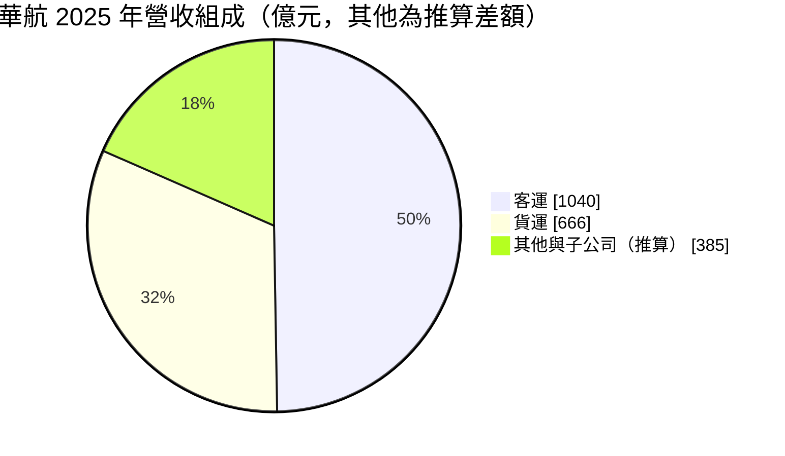
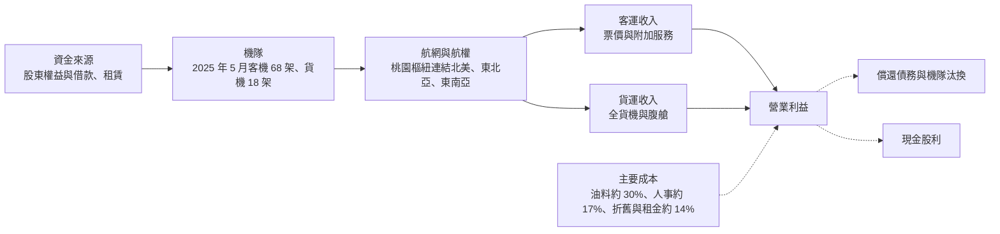
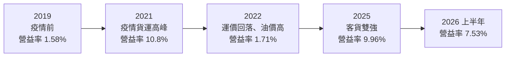
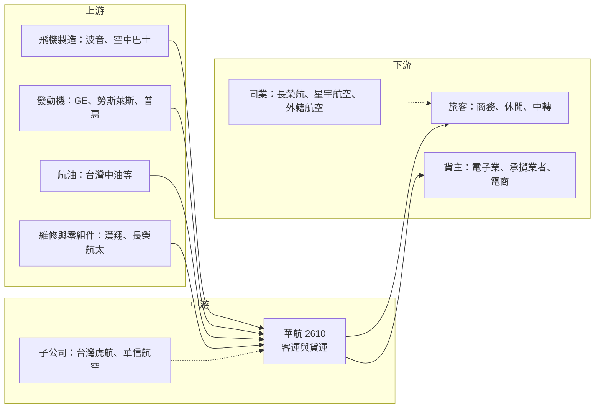

# 2610 華航

> 上市｜[[產業索引-航運業|航運業]]｜上市（櫃）日期 1993/02/26

# 第一章：企業模式與商業藍圖

> [!info] 撰寫說明
> 本文由 Claude 依公開資料整理，架構比照 [[2330台積電]] 的四章研究，資料截至 2026-10-08。財務數字來源：Goodinfo 年度經營績效、證交所開放資料（基本資料、資產負債、綜合損益、營益分析、股利）、富果研究 2025 年法說會整理、ETtoday 財經；產業描述為整理性內容，尚未逐條比對原始文件。#待校對

在評估航空公司的長期投資價值時，最重要的是理解它的成本結構與景氣循環，而不是單一年度的獲利。本章針對中華航空（股票代號：2610，以下簡稱華航）的商業模式進行定性分析，說明它為何是台灣唯一同時具備大型貨機隊與完整長程客運網路的航空集團，以及這種「客貨雙引擎」結構如何決定它的獲利型態。

## 一、核心定位：以台灣為樞紐的客貨兩用國籍航空

華航成立於 1959 年，是台灣歷史最悠久、規模最大的國籍航空公司之一，以桃園國際機場為主要樞紐。它的特色是同時經營兩種性質很不一樣的業務：一是載運旅客的客運，二是以全貨機和客機[[腹艙]]載運貨物的貨運。依富果研究整理的 2025 年法說會資料，華航 2025 年客運收入約 1,040 億元、貨運收入約 666 億元，貨運占比在全球大型航空公司中屬於偏高的一群。

這種結構有兩層商業意義：

* **貨運提供逆週期的緩衝：** 2020 至 2021 年疫情期間國際客運幾乎停擺，但全球海運塞港、空運需求暴增，華航靠著貨機隊撐住營收與獲利，2021 年營業利益率反而達到 10.8%。這說明貨運不只是附加業務，而是讓公司在客運低谷中仍能存活的支柱。
* **地理位置帶來中轉需求：** 台灣位在東北亞與東南亞之間，又是飛往北美的出發點。華航可以把東南亞旅客與貨物先集中到桃園，再轉往北美，形成「[[樞紐]]轉運」的網路效果。北美航線約占貨運收入近三分之二，正是這個位置優勢的直接結果。

華航的大股東為中華航空事業發展基金會，背後與政府關係密切，因此在國籍航空的角色、航權分配與國家重大運輸任務上，經常扮演代表性角色。這也意味著公司在經營決策上，除了股東報酬之外，也需要兼顧公共性與政策目標。

## 二、終端應用與產品板塊

依 2025 年法說會資料，華航的收入可分為三大塊。客運與貨運金額為公司口徑，「其他」為合併營收 2,091.4 億元扣除兩者後的推算差額，包含子公司營收與附加服務等：

* **客運：** 2025 年客運收入中，東北亞約占 29%、北美約 22%、東南亞約 18%。商務艙與豪華經濟艙等高艙等產品占比提升到 31%，代表公司刻意提高每位旅客帶來的收入，而不是單純追求載客人數。高艙等旅客對價格敏感度較低，是長程航線獲利的關鍵。
* **貨運：** 2025 年貨運收入年增 10.2%，公司明確表示要聚焦 AI 伺服器、半導體、電商與醫藥冷鏈等高價值貨源。台灣是全球 AI 伺服器與半導體的出貨基地，這類貨品體積小、價值高、對時效要求嚴格，天然適合空運，讓華航的貨運具有一般航空公司沒有的本地貨源優勢。
* **子公司與附加服務：** 集團內有低成本航空 [[6757台灣虎航]]、區域航空華信航空，以及空廚、地勤、維修等周邊事業。附加服務收入（選位、行李、哩程等）2025 年約 26.5 億元，雖然金額不大，但毛利高，是全球航空業近年積極發展的收入來源。

## 三、資本轉化邏輯：重資產、高槓桿的營運模式

航空業是典型的重資產產業。一架長程廣體客機動輒上百億元，公司必須先投入大量資本購買或租賃飛機，再透過多年營運慢慢回收。這帶來三個特性：

* **固定成本高、[[營運槓桿]]大：** 飛機折舊、租金、人事與維修費用不會因為少載幾位旅客而減少。因此[[載客率]]或貨運需求小幅變化，獲利就會大幅波動。2022 年毛利率只有 7.54%，2025 年回到 17.8%，就是這種槓桿效果的展現。
* **油價是最大變動成本：** 依法說會資料，油料約占營業成本 30%。油價每上漲一段，若無法透過[[燃油附加費]]或票價轉嫁，就會直接侵蝕利潤。2025 年燃油採購成本較前一年減少約 30.8 億元，是當年獲利成長的重要原因之一。
* **負債比例偏高：** 為了購置飛機，航空公司普遍大量使用借款與[[租賃負債]]。華航 2025 年第一季負債比率約 71%，雖然比疫情前的約 79% 明顯改善，但仍屬高槓桿結構。景氣好時槓桿放大股東報酬，景氣差時則放大虧損與財務壓力。

## 四、企業長期藍圖：機隊汰舊換新與高價值客群

* **大規模機隊更新：** 依 2025 年法說會資料，華航未來規劃引進客機 55 架，包括 A321neo 11 架、787-9/10 共 24 架、A350-1000 10 架與 777-9 10 架，另規劃引進 777-8F 貨機。A330-300 預計 2027 年全數汰除，737-800 預計 2028 年全數汰除。新世代飛機油耗較低、座位配置較有彈性，汰換完成後可降低單位成本並提升高艙等產品競爭力，但在交機期間會推升資本支出與折舊。
* **鞏固台灣樞紐地位：** 公司策略是發揮桃園的地理優勢拓展中轉市場，並深化與天合聯盟（SkyTeam）的[[航空聯盟]]合作。中轉旅客能讓長程航線的座位填得更滿，也是華航面對外國航空直飛競爭時的主要防線。
* **貨運聚焦高價值貨源：** 在北美主力市場之外優化東南亞貨機航網，配合台灣 AI 與半導體產業的出貨需求。長期來看，台灣電子產業的出口結構越往高價值、小體積產品移動，華航的貨運需求基礎就越穩固。
* **數位化與會員經營：** 透過客戶關係管理、哩程制度與機上服務升級，提升新世代旅客的黏著度。這類投入的回報較慢，但有助於提高高艙等占比與附加服務收入。

# 第二章：護城河深度與競爭優勢

航空業是競爭激烈、差異化有限的產業，多數航空公司長期很難維持高於資金成本的報酬。本章分析華航的競爭優勢來源，以及這些優勢在面對國內外對手時能守住多少。

## 一、護城河的核心組成要素

* **航權與時間帶：** 國際航線需要雙邊航權協議，熱門機場的起降時間帶（slot）更是稀缺資源。華航作為老牌國籍航空，擁有長年累積的航權與桃園、東京、香港、北美等主要機場的時間帶，新進者很難在短時間內取得同等條件。這是一種制度性的進入門檻。
* **貨機隊規模與經驗：** 經營全貨機需要專門的機隊、地勤設施、貨站與攬貨業務網路。華航長年經營 747 與 777 貨機，與台灣電子業和貨運承攬業者關係深厚，這種營運經驗與客戶關係是競爭對手短期難以複製的。
* **桃園樞紐的網路效應：** 航點越多、班次越密，轉機旅客越方便，就越能吸引更多中轉需求，進一步支撐更多航點。這種網路效應讓台灣兩家大型航空公司在本地市場具有規模優勢。
* **集團化經營：** 透過子公司台灣虎航經營低成本航線，華航可以同時服務價格敏感的休閒旅客與重視服務的商務旅客，避免低價市場被外國廉航完全拿走。

## 二、全球主要競爭對手格局

| 對手 | 類型 | 主要競爭領域 | 與華航的關係 |
|---|---|---|---|
| [[2618長榮航]] | 台灣全服務航空 | 北美長程客運、貨運 | 最直接的對手，北美航網與服務評價強勢 |
| [[2646星宇航空]] | 台灣新興全服務航空 | 東北亞、東南亞、北美客運 | 以新機與服務品質爭取高端客源 |
| 國泰航空 | 香港全服務航空 | 東南亞至北美中轉 | 香港樞紐與台灣樞紐直接競爭中轉旅客 |
| 日本航空、全日空 | 日本全服務航空 | 東北亞、北美中轉 | 東京樞紐競爭北美轉機客 |
| 樂桃、酷航等廉航 | 低成本航空 | 台日、台韓、東南亞短程 | 壓低短程航線票價 |
| 聯邦快遞、UPS 等 | 整合型貨運業者 | 跨太平洋空運 | 以自有機隊與物流網路競爭高價值貨源 |

## 三、優勢轉化：守得住與守不住

* **守得住：** 台灣本地出發的商務客、高價值電子產品的貨運，以及需要長程直飛的北美航線。這些需求重視航班密度、準點與貨運處理能力，華航的航權、貨機隊與樞紐網路可以提供穩定的競爭力。
* **守不住：** 短程休閒航線的票價。廉價航空與新進業者持續加入台日、台韓與東南亞航線，旅客對價格高度敏感，華航在這塊市場較難維持溢價，只能透過子公司虎航應戰。
* **觀察重點：** 第一，機隊汰換能否如期完成並真正降低單位成本；第二，與長榮航之間在北美航線與高艙等產品的服務差距能否縮小；第三，疫情後的高票價環境若隨全球運能恢復而回落，貨運與客運的收益率能維持在什麼水準。這三點決定華航能否擺脫過去「好年賺小錢、壞年虧大錢」的形象。

# 第三章：財務體質與盈利規模

資料日期：2026-10-08。數字取自 Goodinfo 年度經營績效、證交所開放資料與富果研究法說會整理，表格是撰寫當時的快照；最新月營收、毛利率、累計 EPS 由自動排程寫在本筆記的屬性欄位（月營收、毛利率、累計EPS 等）。#待校對

財務報表是檢驗護城河是否真實存在的最終標準。本章用多年度的三率、ROE 與資本報酬，檢視華航在航空景氣循環中的獲利品質，以及疫情前後的結構變化。

## 一、獲利能力的基石：三率

| 年度 | 營收（新台幣） | [[毛利率]] | [[營業利益率]] | EPS（元） | [[ROE]] |
|---|---|---|---|---|---|
| 2019 | 1,684 億 | 9.91% | 1.58% | -0.22 | -1.12% |
| 2020 | 1,153 億 | 8.87% | 1.90% | 0.03 | -0.46% |
| 2021 | 1,388 億 | 16.8% | 10.8% | 1.67 | 13.0% |
| 2022 | 1,507 億 | 7.54% | 1.71% | 0.48 | 3.0% |
| 2023 | 1,848 億 | 12.9% | 5.50% | 1.13 | 9.97% |
| 2024 | 2,039 億 | 16.8% | 8.93% | 2.38 | 18.4% |
| 2025 | 2,091 億 | 17.8% | 9.96% | 2.42 | 16.8% |
| 2026 上半年 | 1,208 億 | 15.60% | 7.53% | 1.08 | 未查得 |

註：2019 至 2025 年取自 Goodinfo；2026 上半年取自證交所營益分析與綜合損益開放資料。

* **[[毛利率]]：** 疫情前的 2019 年，華航毛利率不到一成，營業利益率只有 1.58%，反映傳統航空業競爭激烈、利潤微薄的本質。2021 年靠貨運運價暴漲把毛利率推高到 16.8%，2022 年貨運運價回落、油價又大漲，毛利率一度跌回 7.54%。2024 至 2025 年客運需求全面恢復且票價維持高檔，毛利率回到 17% 上下，是近十年較好的水準。
* **[[營業利益率]]：** 航空業的營業費用以行銷、訂位系統與管理費用為主，金額相對穩定，因此營業利益率與毛利率高度連動。2025 年營業淨利約 208.4 億元，年增 14.5%（富果研究整理）。
* **營收趨勢：** 2020 年營收 1,153 億元成長到 2025 年的 2,091 億元，年複合成長率約 12.6%（推算）。若以疫情前 2019 年為基期，6 年成長約 24%，年複合成長率約 3.7%（推算），這比較接近航空業的長期常態成長速度。
* **2026 上半年：** 營收約 1,208 億元，營業利益率 7.53%，低於 2025 年全年水準，顯示高票價環境已逐步正常化（證交所營益分析）。

## 二、[[ROE]]：資本效率

2021 至 2025 年平均 ROE 約 12.2%（推算），但年度間差距極大，從 2022 年的 3% 到 2024 年的 18.4%。航空公司的 ROE 高度依賴景氣與財務槓桿：負債比率約七成，代表股東權益只占資產的三成左右，當營業利益率提高幾個百分點，ROE 就會被放大數倍。反過來說，2019 年營業利益率僅 1.58% 時，ROE 就已是負數。2026 年第二季底每股淨值約 16.29 元（證交所資產負債開放資料），股價淨值比約 1.23 倍（證交所本益比資料，2026 年 10 月初）。

## 三、資本支出、自由現金流與股利

航空公司的[[CapEx]]主要用於購機與預付款，金額大且集中在交機年份。華航規劃引進 55 架客機與新一代貨機，未來數年將是資本支出的高峰期，具體年度金額未查得。由於飛機可以透過融資或租賃取得，資本支出往往不會一次反映在現金流，而是轉成長期負債與每年的折舊與利息。

股利方面，2025 年度配發現金股利 0.82 元（證交所股利資料），以 EPS 2.42 元計算[[配息率]]約 34%（推算）。公司章程規定現金股利不低於全部股利的 30%，法說會則表示會依獲利、營運狀況與未來資本支出規劃分配。在機隊大規模更新期間，保留盈餘以降低負債比率，是可以理解的資本配置選擇。疫情前多年 EPS 接近零或為負，股利並不穩定，長期投資人不宜把華航視為穩定配息股。

## 四、[[ROIC]] 與 [[WACC]]：價值創造利差

**ROIC 推算：** 2025 年合併營業淨利約 208.4 億元，扣除 20% 稅率後約 166.7 億元。2026 年第二季底權益總計約 1,053 億元，總負債約 2,857 億元，假設其中約 55% 為有息負債與租賃負債（推估，約 1,571 億元），投入資本約 2,624 億元，ROIC 約 6.4%（推算）。以同樣方法回推疫情前 2019 年（營業利益約 26.6 億元），ROIC 不到 1%（推算，資本基礎以近期數字代替）。

**WACC 推算：** 假設台灣 10 年期公債殖利率 1.75%、市場風險溢酬 6%、β 取航空業常見值 1.0（推估），股東權益成本約 7.75%。負債成本假設 2.5%，稅後約 2.0%；以帳面價值計，權益約占 40%、負債約占 60%，WACC 約 4.3%（推算）。

**結論：** 2024 至 2025 年華航的 ROIC 約 6% 至 7%，高於約 4% 至 5% 的資金成本，屬於創造價值的期間。但拉長到十年來看，疫情前多數年份 ROIC 明顯低於 WACC，長期平均大致只是打平（推估）。這是全球航空業的共同特性：景氣好時賺得多，但需要用這些盈餘彌補景氣差時的虧損。投資人評估華航時，應以完整循環的平均報酬，而不是高峰年份的數字作為判斷基礎。

# 第四章：總體風險與地緣政治

任何企業都無法脫離宏觀環境獨立存在。航空業對地緣政治、油價、匯率與疫情等外部衝擊特別敏感。本章分析華航必須長期面對的四類風險。

## 一、地緣政治風險

* **兩岸關係與航權：** 兩岸直航航線的開放程度與政治關係直接相關，兩岸關係緊張時航線可能縮減。此外，台海情勢若升溫，可能影響飛航路線、保險成本與國際旅客來台意願。
* **空域與繞飛：** 俄烏戰爭後，部分歐洲航線需要繞開俄羅斯空域，飛行時間與油耗增加。中東局勢也可能影響航路與油價。這類事件不在公司控制範圍內，卻會直接改變單位成本。
* **美中貿易與關稅：** 華航貨運高度依賴台灣到北美的出口貨源，美國關稅政策改變或供應鏈轉移，可能影響空運需求的結構與地點。

## 二、產業週期與市場結構風險

* **運能循環：** 航空業景氣好時，各家航空公司會同時訂購新飛機，數年後交機時往往造成運能過剩、票價下滑。疫情後的高票價是供給不足的結果，隨著飛機製造商交機恢復，收益率有回落壓力。
* **貨運運價波動：** 空運運價與海運塞港、電子產品出貨週期和電商需求高度相關。2021 年的貨運高峰不太可能重現，貨運獲利會隨全球貿易週期起伏，並受[[長鞭效應]]放大。
* **競爭加劇：** 星宇航空擴張、外國航空加開台灣航點與廉航持續進入，都會壓縮票價空間。

## 三、營運環境的隱性風險

* **油價與匯率：** 油料約占營業成本三成，油價大漲是航空業最常見的獲利殺手。航空公司收入以多國貨幣計價，但飛機與油料多以美元支付，匯率波動也會影響成本與負債評價。
* **飛安與聲譽：** 航空公司的品牌高度依賴飛安紀錄，重大事故會在短期內重創訂位需求與保險成本。
* **人力與勞資關係：** 機師、空服員與維修人員是專業且稀缺的人力，勞資爭議或罷工可能造成航班大量取消。
* **新機交付延遲：** 波音與空中巴士近年交機普遍延遲，可能打亂機隊汰換計畫，使老舊飛機必須延長服役，推升維修成本。

## 四、科技或法規演進

國際民航組織推動的國際航空碳抵換及減量計畫（CORSIA），以及歐盟等地區提高[[永續航空燃油]]（SAF）摻混比例的要求，將在未來十年逐步提高航空業的燃料與碳成本。新世代飛機可降低油耗，但無法完全抵銷。長期而言，航空公司能否把減碳成本轉嫁給旅客與貨主，以及台灣能否建立穩定的 SAF 供應，是影響華航成本結構的重要變數。此外，視訊會議普及可能永久降低部分商務旅行需求，使航空公司更依賴休閒旅客與貨運。

# 專有名詞解析

## 金融

- **[[營運槓桿]]**：固定成本占比高的企業，營收小幅變動就會造成獲利大幅變動的現象。
- **[[租賃負債]]**：企業以租賃方式取得資產時，依會計準則認列未來租金現值的負債，航空公司租用飛機會產生大量租賃負債。
- **[[配息率]]**：現金股利占每股盈餘的比例，用來觀察公司把多少獲利分配給股東。
- **[[毛利率]]**：營業毛利占營收的比例，反映產品或服務扣除直接成本後的獲利空間。
- **[[營業利益率]]**：營業利益占營收的比例，反映本業扣除營業費用後的獲利能力。
- **[[ROE]]**：股東權益報酬率，稅後淨利除以股東權益，衡量公司用股東資金賺錢的效率。
- **[[ROIC]]**：投入資本報酬率，稅後營業利益除以股東權益與有息負債之和，衡量所有投入資本的報酬。
- **[[WACC]]**：加權平均資金成本，依權益與負債比重加權的資金成本，是 ROIC 需要超越的門檻。
- **[[CapEx]]**：資本支出，企業購置飛機、廠房、設備等長期資產的支出。
- **[[長鞭效應]]**：終端需求的小幅變動，沿供應鏈往上游傳遞時被逐級放大，造成上游庫存與訂單劇烈波動。

## 產業

- **[[腹艙]]**：客機機身下層用來裝載行李與貨物的空間，航空公司可利用客運航班同時運送貨物，增加每趟航班的收入。
- **[[樞紐]]**：航空公司集中航班、讓旅客與貨物在此轉機的主要機場，航點越多轉機越方便，能形成網路效應。
- **[[載客率]]**：實際售出座位占可用座位的比例，是衡量航空公司運能是否被充分利用的核心指標。
- **[[燃油附加費]]**：航空公司在票價之外，依油價水準向旅客或貨主加收的費用，用來轉嫁燃油成本波動。
- **[[航空聯盟]]**：多家航空公司結盟共享航網、代碼共享與貴賓室，主要有星空聯盟、天合聯盟與寰宇一家。
- **[[永續航空燃油]]**：以廢食用油、農林廢棄物等原料製成的航空燃料，可降低生命週期碳排放，但價格明顯高於傳統航油。

# 核心供應鏈

## 1. 上游：飛機、發動機、航油與維修
- 飛機製造：波音、空中巴士（787、A350、A321neo、777 系列）
- 發動機：GE、勞斯萊斯、普惠
- 航油：台灣中油與國際油商
- 維修與零組件：[[2634漢翔]]、[[2645長榮航太]]

## 2. 中游：華航集團
- 低成本航空：[[6757台灣虎航]]
- 區域航空：華信航空
- 空廚、地勤、貨站等周邊事業

## 3. 下游：客戶
- 旅客：商務客、休閒旅客、經桃園轉機的東南亞與北美旅客
- 貨主：台灣 AI 伺服器、半導體與電子製造業者、貨運承攬業者、跨境電商

## 4. 同業競爭
- 國內：[[2618長榮航]]、[[2646星宇航空]]
- 國際：國泰航空、日本航空、全日空等

## 最新新聞
<!-- news:start（自動產生，請勿手動編輯此範圍） -->
- 2026-10-08 📰 媒體 18:21｜營收速報 - 華航(2610)9月營收209.33億元年增率高達31.86％｜[鉅亨網](https://news.cnyes.com/news/id/6625166)
- 2026-10-06 📰 媒體 19:44｜華航攜手Discovery頻道推紀錄片 揭密飛機維修第一線｜[鉅亨網](https://news.cnyes.com/news/id/6622898)

完整紀錄：[[2610華航 新聞]]
<!-- news:end -->

## 相關連結
- [公開資訊觀測站](https://mopsov.twse.com.tw/mops/web/t05st03?step=1&firstin=1&co_id=2610)
- [Goodinfo](https://goodinfo.tw/tw/StockDetail.asp?STOCK_ID=2610)
- [Yahoo 股市](https://tw.stock.yahoo.com/quote/2610)
- [鉅亨網新聞](https://www.cnyes.com/twstock/2610/news)
