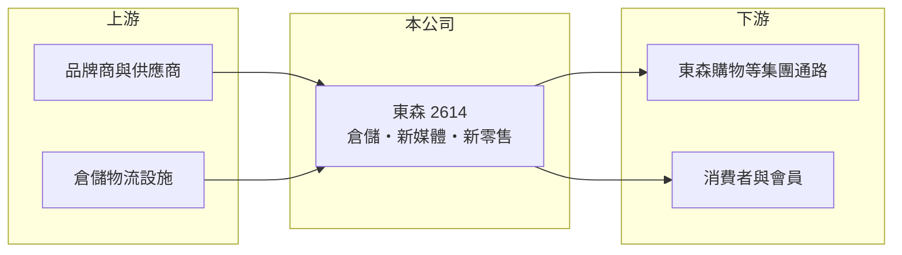

# 2614 東森

> 上市｜[[產業索引-其他業|其他業]]｜上市（櫃）日期 1995/09/23

# 第一章：企業模式與商業藍圖

> [!info] 撰寫說明
> 精簡版，由 Claude 依公開資料整理，架構比照 [[2330台積電]]，資料截至 2026-10-07。來源：優分析東森上半年獲利報導、winvest 營收快訊。#待校對

東森國際是東森集團的上市平台，推動倉儲、新媒體與[[新零售]]三大事業，並透過轉投資東森購物與自然美獲利。

- **核心業務：** 公司持續推動三大事業：倉儲、新媒體與新零售。
- **營收結構：** 本次未查到三大事業的營收比重；月營收約 4.4 億至 4.6 億元。
- **營運據點：** 本次未查到倉儲據點明細。
- **長期方向：** 轉投資的自然美整合 AI 科技與美容健康服務，上半年服務收入年增超過 200%。

# 第二章：護城河深度與競爭優勢

東森的優勢在於集團內的媒體、電商與倉儲資源可以互相支援。

- **競爭優勢：** 轉投資東森購物上半年稅後純益 5.77 億元、EPS 6.61 元，是重要的[[轉投資收益]]來源。
- **主要對手：** 電視購物與電商平台業者，如 [[8454富邦媒]]，以及倉儲物流同業。
- **觀察重點：** 公司辦理 20 億元[[現金增資]]，觀察償還借款後利息支出下降的效果。

# 第三章：財務體質與盈利規模

資料日期：2026-10-07，以下數字是撰寫當時的快照；最新月營收、毛利率、累計 EPS 由自動排程寫在本筆記的屬性欄位（月營收、毛利率、累計EPS 等）。#待校對

東森上半年獲利小幅成長，但正以現增改善資本結構。

- **營收規模：** 2026 年上半年合併營收 25.45 億元；8 月營收 4.44 億元，年減 6.45%。
- **獲利：** 上半年稅後純益 2.73 億元，年增 7.4%，EPS 0.83 元。
- **財務特色：** 現增發行 1.25 億股、募資 20 億元，其中原股東認購 80%、員工 10%、公開承銷 10%，資金用於償還銀行借款。

# 第四章：總體風險與地緣政治

東森的風險在於轉投資獲利波動與現增稀釋。

- **產業週期：** 零售與電視購物需求跟隨消費景氣，電商競爭也持續加劇。
- **營運風險：** 獲利相當部分來自轉投資，子公司表現變化會直接影響東森 EPS。
- **其他風險：** 現增使股本增加，若新事業效益未如預期，每股獲利將被稀釋。

# 專有名詞解析

## 金融

- **[[轉投資收益]]**：依持股比例認列被投資公司獲利，屬於本業以外的收益。
- **[[現金增資]]**：公司發行新股向股東或大眾募集資金，會增加股本並可能稀釋每股獲利。

## 產業

- **[[新零售]]**：結合實體通路、電商與數據分析的零售模式。

# 核心供應鏈

- 上游：商品品牌商與供應商、倉儲物流設施（推估）
- 下游／客戶：集團內電視購物與電商通路、終端消費者（推估）
- 同業：[[8454富邦媒]]等電商與購物平台業者（推估）

## 最新新聞
<!-- news:start -->
<!-- news:end -->

## 相關連結
- [公開資訊觀測站](https://mopsov.twse.com.tw/mops/web/t05st03?step=1&firstin=1&co_id=2614)
- [Goodinfo](https://goodinfo.tw/tw/StockDetail.asp?STOCK_ID=2614)
- [Yahoo 股市](https://tw.stock.yahoo.com/quote/2614)
- [鉅亨網新聞](https://www.cnyes.com/twstock/2614/news)
