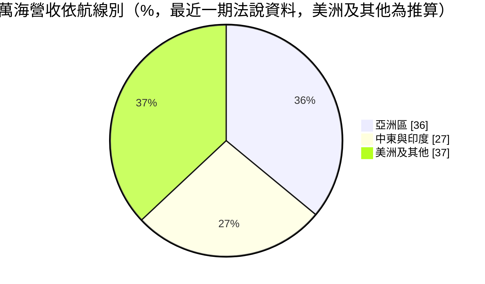
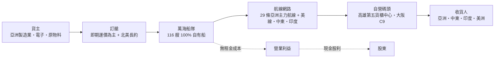
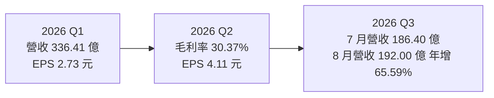
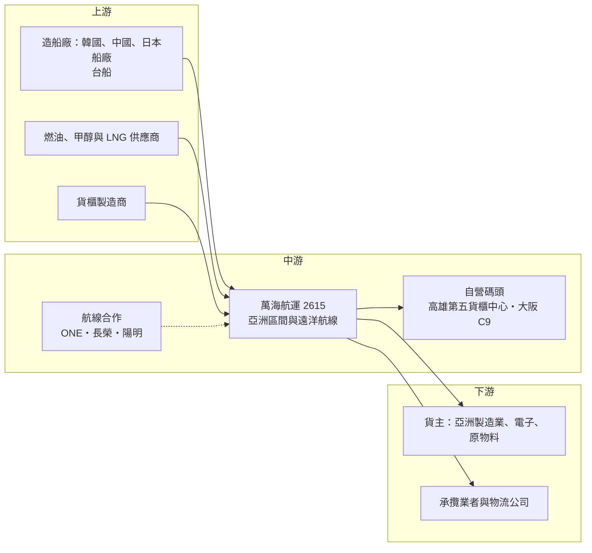

# 2615 萬海

> 上市｜[[產業索引-航運業|航運業]]｜上市（櫃）日期 1996/05/16

# 第一章：企業模式與商業藍圖

> [!info] 撰寫說明
> 本文由 Claude 依公開資料整理，架構比照 [[2330台積電]] 的四章研究，資料截至 2026-10-07。財務數字來源：萬海 2025 年財報新聞（旺得富）、2026 年第一季與上半年財報新聞（旺得富、優分析、理財周刊）、法說會報導（聯合新聞網）、winvest 財務摘要；產業描述為整理性內容，尚未逐條比對原始文件。#待校對

在評估單一個股的長期投資價值時，首要步驟是拆解企業的底層獲利邏輯。本章針對萬海航運（股票代號：2615，以下簡稱萬海）的商業模式進行定性分析，說明這家以[[亞洲區間航線]]起家、全數使用自有船的航商，如何在運價週期中取得收入，以及它為何能在 2026 年的運價回升中拿出三雄中最亮眼的獲利成長。

## 一、核心定位：亞洲區間航線的專家，逐步走向遠洋

萬海成立於 1965 年，1996 年上市，是台灣貨櫃三雄中最早以亞洲區間航線為核心的航商。依 2026 年法說會資料，萬海營運 29 條亞洲主力航線，擁有自有船舶 116 艘，100% 自有、不[[租船]]，總運力約 57.3 萬 [[TEU]]。

萬海的定位有三個特點：

* **亞洲區間為根：** 東北亞、東南亞、中國與台灣之間的短程航線是萬海的基本盤，貨量占比超過一半，船舶小而靈活、靠港密集。
* **向遠洋與新興市場延伸：** 近年積極開拓美西直航、東地中海、印度與南美西岸航線。2026 年 5 月與 ONE 合作開辦第二條洛杉磯直航線（AP2）。
* **不參加大型聯盟：** 萬海沒有加入三大[[航運聯盟]]，而是以艙位交換或個別航線合作（例如與長榮、陽明合作的華北至印尼直航線）彈性布局。

## 二、終端應用板塊：航線營收結構

依法說會報導，萬海的貨量約 55% 來自亞洲區（亞洲區間航線約占 58% 的說法亦見於同篇報導），但亞洲區營收占比已由 47% 降至 36%；中東與印度航線貨量占比由 22% 升至 25%，營收占比由 23% 升至 27%。下圖其餘部分為推算：

* **亞洲區間：** 貨量大、單價低、運價相對穩定，是萬海獲利的底盤。
* **中東與印度：** 2026 年中東戰事期間，此區運價與附加費大幅上升，但也伴隨航行安全與[[塞港]]風險。
* **美洲線：** 包括北美與南美，萬海持續強化亞洲至北美西岸直航，是運價彈性最大的板塊。
* **碼頭：** 高雄港第五貨櫃中心 2026 年 2 月試營運、年底前全面啟用，9 月起承租日本大阪港 C9 碼頭，強化亞洲轉運能力。

## 三、資本轉化邏輯：全自有船的成本結構

* **100% 自有船：** 不需支付船租，運價上漲時利潤彈性大，運價下跌時也不必擔心高額租約。代價是必須自己承擔造船資本支出與折舊。
* **年輕的貨櫃與船隊：** 自有貨櫃比例 83%，平均櫃齡 5.2 年，低於業界平均 6.8 年。新船載運量提高約 20%、油耗降低一成以上（2025 年研究報告引述）。
* **航線轉換彈性：** 船型以中型為主，可以快速在亞洲區間、中東、印度與美線之間調度，在 2026 年中東戰事期間能較快把運力移到高運價航線。

## 四、企業長期藍圖：大規模船隊擴張

* **新船計畫：** 2026 年新增 7 艘新船（約 4.88 萬 TEU），2027 至 2030 年預計再接收 36 至 42 艘新船（不同報導口徑不同），新增運力約 40.7 萬至 47.5 萬 TEU。2026 年 3 月董事會通過再購 6 艘新船（9,200 TEU 甲醇[[雙燃料船]]與 6,000 TEU LNG 雙燃料船），投資金額約 160.22 億至 175.48 億元。
* **規模翻倍：** 若計畫如期完成，萬海運力將由約 57 萬 TEU 擴增至接近百萬 TEU，在亞洲以外的航線上取得更大規模（推估）。
* **碼頭布局：** 高雄港與大阪港碼頭強化亞洲轉運樞紐，配合中東、印度與美洲航線的延伸。

# 第二章：護城河深度與競爭優勢

在長期價值投資中，「護城河」指企業抵禦競爭、維持超額利潤的保護機制。本章分析萬海的護城河構成、主要競爭對手，以及這些優勢在運價下行週期中能守住多少。

## 一、萬海護城河的核心組成要素

貨櫃航運服務同質性高，萬海的護城河屬於「成本與網路型的窄護城河」，由三個要素組成：

* **1. 全自有船的成本優勢：** 116 艘船全部自有，沒有租金負擔，在租船市場行情高漲時，成本明顯低於依賴租船的同業。
* **2. 亞洲區間的高密度網路：** 29 條亞洲主力航線、密集的靠港與轉運安排，讓萬海在亞洲區間市場有長期累積的貨主關係與港口作業效率，新進者不易複製。
* **3. 營運彈性：** 不受大型聯盟排班限制，可以快速調整航線與運力配置。

## 二、全球主要競爭對手格局

| 對手 | 定位 | 對萬海的威脅 |
|---|---|---|
| 海豐國際（SITC）、德翔、高麗海運等 | 亞洲區間航線專業航商 | 亞洲區間市場的直接對手，報價競爭激烈 |
| 地中海航運、馬士基、達飛 | 全球大型航商 | 大型航商也經營亞洲區間支線，並在美線、中東、印度線具規模優勢 |
| ONE、HMM | 日韓航商 | 美線競爭者，同時與萬海有航線合作 |
| [[2603長榮]]、[[2609陽明]] | 台灣同業 | 在亞洲區間、美線與新興市場航線部分重疊 |

## 三、優勢轉化：哪些市場守得住、哪些守不住

* **守得住：** 亞洲區間的網路與貨主關係，以及全自有船帶來的成本穩定性。2025 年萬海營收年減 13.25%，降幅小於長榮（18.23%）與陽明（26.55%），顯示亞洲區間與新興市場航線的防禦性較佳。
* **守不住：** 美線與中東線的運價波動。萬海越往遠洋擴張，獲利對運價的敏感度就越接近長榮、陽明。
* **觀察重點：** 2027 至 2030 年大量新船交付後的運力消化能力、美線直航的長約運價水準，以及中東與印度航線在戰事平息後的運價回落幅度。

# 第三章：財務體質與盈利規模

資料日期：2026-10-07。數字取自公司財報新聞與財經媒體整理，表格是撰寫當時的快照；最新月營收、毛利率、累計 EPS 由自動排程寫在本筆記的屬性欄位（月營收、毛利率、累計EPS 等）。#待校對

財務報表是檢驗護城河是否真實存在的最終標準。本章用三率、ROE、現金流與資本報酬，檢視萬海在運價週期中的獲利品質。

## 一、獲利能力的基石：三率

| 項目 | 2025 全年 | 2026 Q1 | 2026 Q2 | 2026 上半年 |
|---|---|---|---|---|
| 營收（新台幣） | 1,403.53 億 | 336.41 億 | 429.00 億 | 765.41 億 |
| [[毛利率]] | 未查得 | 約 22.8%（推算） | 30.37% | 27.03% |
| [[營業利益率]] | 23.7%（推算） | 17.3%（推算） | 25.95% | 22.2%（推算） |
| 營業利益 | 332.14 億 | 58.25 億 | 111.33 億 | 169.60 億 |
| EPS（元） | 11.21 | 2.73 | 4.11 | 6.84 |

註：推算值以營業利益或毛利除以營收計算。

* **[[毛利率]]：** 第二季在運價急漲下升到 30.37%，比第一季推算值高約 7.5 個百分點，顯示全自有船的營運槓桿。
* **[[營業利益率]]：** 第二季 25.95%，營業利益年增約 28.5%。
* **業外收益：** 第一季稅後純益 76.72 億元高於營業利益 58.25 億元，推估有利息、投資或處分船舶等業外收益挹注；評估本業時應以營業利益為準。

## 二、[[ROE]]：資本效率

萬海在 2021 至 2022 年景氣高峰時 ROE 極高，之後隨運價正常化下降。2025 年 EPS 11.21 元為公司史上第四高，2026 年上半年 EPS 6.84 元已超過前一年同期近一倍，推估 2026 年 ROE 將明顯回升（具體數值未查得）。

## 三、資本支出與自由現金流

* **[[CapEx]]：** 萬海是三雄中新船計畫相對規模最大的一家，僅 2026 年 3 月新增的 6 艘船投資就達 160 億元以上，2027 至 2030 年每年都有大額造船款。
* **[[自由現金流]]：** 全自有船策略意味著所有運力擴張都要以自有資金或借款支應，自由現金流在造船高峰期可能偏低，需留意負債比變化。
* **股利政策：** 2025 年度每股配發現金股利 3 元，以宣布時股價 79.2 元計算殖利率 3.79%，配息率約 27%，低於長榮，反映公司保留資金造船的取向。

## 四、[[ROIC]] 與 [[WACC]]：價值創造利差

萬海的 ROIC 取決於運價與新船單位成本。全自有船使投入資本高於租船為主的航商，但沒有租金支出，景氣高峰時 ROIC 明顯高於 WACC。大量新船在 2027 年後交付，若當時運價回落，新增資本的報酬可能低於資金成本（推估，具體數值未查得）。

# 第四章：總體風險與地緣政治

任何企業都無法脫離宏觀環境獨立存在。本章分析萬海未來必須面對的地緣政治、產業週期與營運風險。

## 一、地緣政治風險

* **中東戰事：** 中東與印度航線占萬海營收約 27%，2026 年美伊衝突與荷莫茲海峽通行受限，使亞洲多個轉運港（印度、斯里蘭卡、新加坡、馬來西亞等）出現塞港。萬海總經理謝福隆表示主要航線運價「欲小不易」，但戰事平息後運價回落的風險也相對集中。航道風險使航商[[繞航]]，[[SCFI]] 在 2026 年 8 月 28 日升至 3,509.54 點。
* **美國關稅與[[港口費]]：** 美線比重提高後，美國關稅政策與港口費對萬海的影響逐漸增加；2025 年第二季萬海曾因關稅與匯損導致獲利下滑。
* **兩岸與亞洲區間：** 亞洲區間航線大量經過台灣海峽與南海，區域緊張情勢會影響航行安全與保險成本。

## 二、產業週期與市場結構風險

* **新船過剩：** 依 Alphaliner 與 Drewry 2026 年 7 月報告，全年運力供給增幅約 4.2% 至 4.4%，高於需求成長 2.1% 至 2.5%。萬海本身也在大量擴張運力，若市場供過於求，新船可能拉低整體運價與利用率。
* **[[長鞭效應]]：** 亞洲製造業出口受歐美庫存調整影響，訂艙需求會被放大。
* **匯率：** 營收以美元為主，新台幣升值造成匯損。

## 三、營運環境的隱性風險

* **燃油成本：** 中東戰事期間低硫燃油價格一度從每噸約 500 美元漲到 1,120 美元，萬海須透過[[燃油附加費]]轉嫁，轉嫁不及時會壓縮毛利。
* **資本支出壓力：** 新船與碼頭投資同時進行，若景氣反轉，財務槓桿會上升。
* **港口壅塞：** 亞洲轉運港塞港會降低船舶周轉率，等於實質減少可用運力。

## 四、法規與技術演進風險

* **減碳法規：** 國際海事組織溫室氣體減量規範與歐盟碳排放交易制度，會提高舊船營運成本。萬海新船同時採用甲醇與 LNG 雙燃料，分散燃料路線風險，但替代燃料的價格與供應仍不確定。
* **船舶大型化：** 亞洲區間航線的船舶也逐漸大型化，若港口與碼頭跟不上，大船的成本優勢難以發揮。

# 專有名詞解析

## 金融

- **[[自由現金流]]**：營業活動現金流減去資本支出，代表企業可自由用於配息、還債或併購的現金。
- **[[長鞭效應]]**：終端需求的小幅變動，沿供應鏈往上游傳遞時被逐級放大，造成上游庫存與訂單劇烈波動。

## 產業

- **[[TEU]]**：二十呎標準貨櫃（Twenty-foot Equivalent Unit），用來衡量貨櫃船運力與貨量的單位，一個四十呎櫃等於 2 TEU。
- **[[SCFI]]**：上海出口集裝箱運價指數，每週公布從上海出發主要航線的即期運價，是觀察貨櫃航運景氣最常用的指標。
- **[[航運聯盟]]**：多家航商共享船舶艙位、共同排班的合作組織，例如海洋聯盟、雙子星聯盟、Premier Alliance。
- **[[亞洲區間航線]]**：在亞洲各港口之間往返的短程貨櫃航線，船型較小、靠港密集，運價波動通常小於遠洋航線。
- **[[租船]]**：航商向船東租用船舶而非自有，租金隨市況波動，租船比率越高成本越不穩定。
- **[[雙燃料船]]**：可同時使用傳統燃油與甲醇或液化天然氣等低碳燃料的船舶，用來因應國際減碳法規。
- **[[燃油附加費]]**：航商依燃油價格向貨主加收的費用，用來轉嫁油價上漲的成本。
- **[[港口費]]**：針對特定國籍航商或船舶在港口加收的費用，2025 年美中互相開徵，成為貿易戰的一環。
- **[[繞航]]**：因航道風險（如紅海、荷莫茲海峽）改走較遠航線，會拉長航程並吸收市場運力。
- **[[塞港]]**：港口作業量超過處理能力，船舶需在港外排隊等待靠泊，會降低船隊周轉率。

# 核心供應鏈

## 1. 上游：船舶、燃油與貨櫃
- 造船：日本、韓國與中國船廠，以及 [[2208台船]]
- 燃油：傳統燃油、甲醇與液化天然氣供應商
- 貨櫃：中國貨櫃製造商

## 2. 中游：萬海本身、合作夥伴與同業
- 航線合作：ONE（洛杉磯直航 AP2）、[[2603長榮]]、[[2609陽明]]（華北至印尼直航線）
- 亞洲區間同業：海豐國際、德翔、高麗海運

## 3. 下游：貨主與物流
- 亞洲製造業、電子業與原物料出口商
- 承攬業者：2636台驊投控 等國內外貨運承攬公司

## 4. 碼頭與港口
- 高雄港第五貨櫃中心（自營）、日本大阪港 C9 碼頭（承租）

## 最新新聞
<!-- news:start（自動產生，請勿手動編輯此範圍） -->
- 2026-10-08 📰 媒體 18:21｜營收速報 - 萬海(2615)9月營收217.75億元年增率高達97.63％｜[鉅亨網](https://news.cnyes.com/news/id/6625168)
- 2026-10-05 📰 媒體 19:24｜高雄港啟動生質燃油加注 陽明、萬海加註1200萬公噸創綠色航運新紀元｜[鉅亨網](https://news.cnyes.com/news/id/6621844)

完整紀錄：[[2615萬海 新聞]]
<!-- news:end -->

## 相關連結
- [公開資訊觀測站](https://mopsov.twse.com.tw/mops/web/t05st03?step=1&firstin=1&co_id=2615)
- [Goodinfo](https://goodinfo.tw/tw/StockDetail.asp?STOCK_ID=2615)
- [Yahoo 股市](https://tw.stock.yahoo.com/quote/2615)
- [鉅亨網新聞](https://www.cnyes.com/twstock/2615/news)
