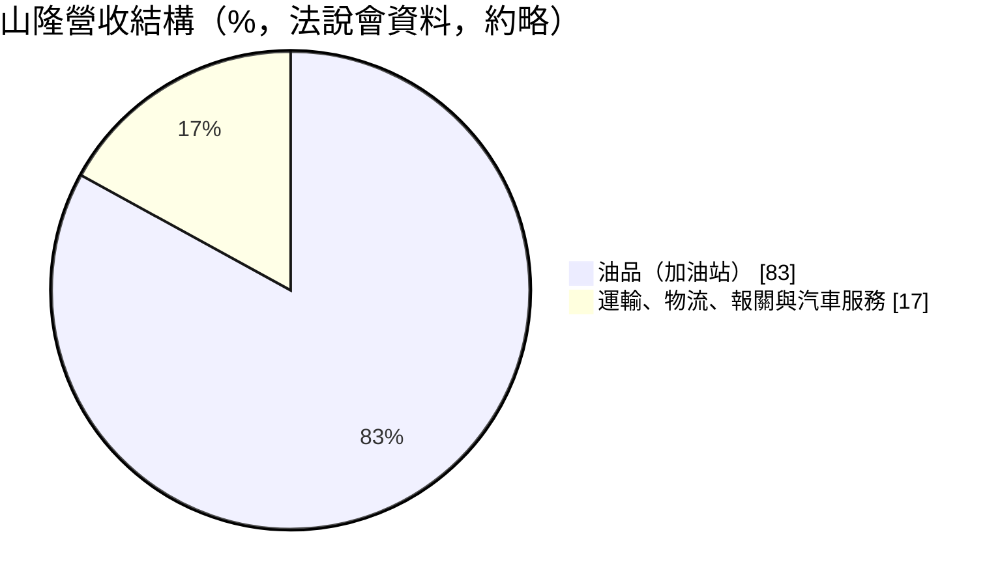
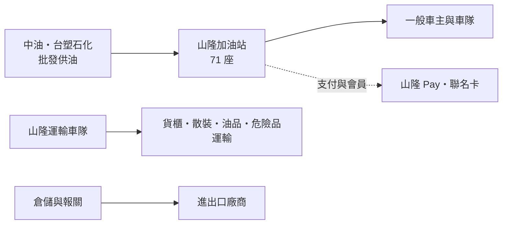
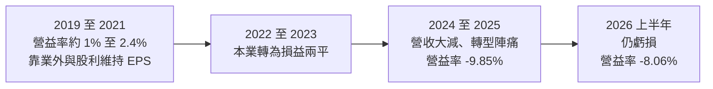
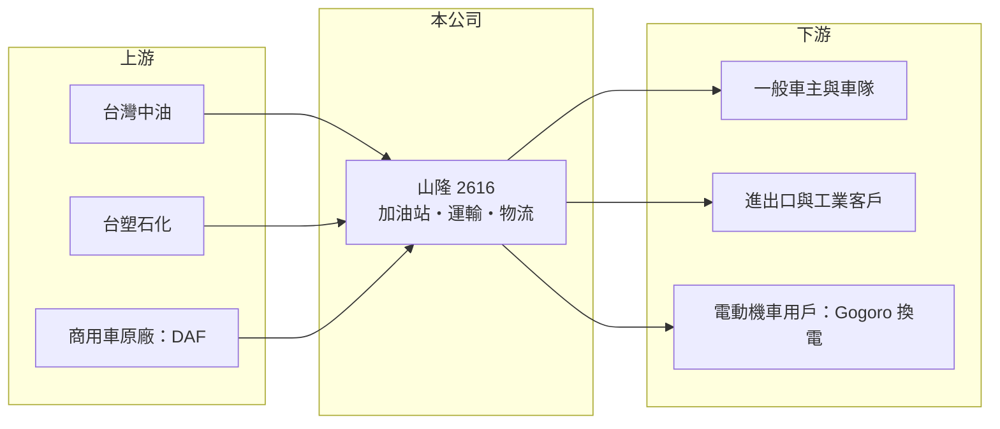

# 2616 山隆

> 上市｜[[產業索引-油電燃氣業|油電燃氣業]]｜上市（櫃）日期 1997/11/08

# 第一章：企業模式與商業藍圖

> [!info] 撰寫說明
> 本文由 Claude 依公開資料整理，架構比照 [[2330台積電]] 的四章研究，資料截至 2026-10-08。財務數字來源：Goodinfo 年度經營績效頁、富果研究 2025 年 8 月法說會整理（AI 摘要，期間標示可能有誤）、證交所開放資料（基本資料、2026 年第二季資產負債與綜合損益、股利、每月營收）；產業描述為整理性內容，尚未逐條比對原始文件。#待校對

在評估單一個股的長期投資價值時，首要步驟是拆解企業的底層獲利邏輯。本章說明山隆通運（股票代號：2616，以下簡稱山隆）這家以加油站為主體的通路業者，為何在近年陷入連續虧損，以及它試圖如何轉型。

## 一、核心定位：民營加油站通路，兼營運輸與物流

山隆成立於 1976 年，1997 年上市，實收資本額約 13.7 億元。公司名稱中的「通運」來自它最早的運輸本業，但今天山隆最大的營收來源是加油站。依富果研究整理的 2025 年法說會資料，山隆經營 71 座加油站，油品業務約占營收的 83%，其餘為運輸、倉儲物流、報關與汽車服務。

台灣的加油站市場由[[中油]]與台塑石化兩大供油商主導，民營加油站業者向供油商進油，再以自己的站點零售給車主。這種模式的利潤來自「批發價與零售價之間的價差」加上站點的附加服務，而油價由供油商與政府的價格政策決定，零售業者幾乎沒有定價權。因此加油站的獲利關鍵在於站點地段、加油量與租金、人事等固定成本的控制。

## 二、業務板塊

* **油品：** 71 座加油站，推出「山隆 Pay」與玉山銀行聯名卡，並與 Gogoro 合作設置換電站。
* **運輸：** 全台 8 個據點，經營貨櫃、散裝、油品與危險品運輸。危險品運輸需要特殊執照與車輛，是山隆的傳統專長。
* **倉儲物流與報關：** 全台 13 個物流服務據點，報關業務在板橋總部、基隆、台中、高雄設有據點，並取得 [[AEO 認證]]。
* **汽車服務：** 在桃園大園、台中、高雄設點，經營荷蘭商用車品牌 DAF 的經銷維修廠，以及彰化、苗栗的驗車相關據點。

## 三、資本轉化邏輯：固定成本高的通路生意

加油站是典型的高固定成本生意：站點租金、人事、設備維護不論加油量多寡都要支付。加油量下降時，固定成本無法被攤提，虧損就會快速擴大。依富果研究整理，近年虧損的主因包括：加油站設備升級期間停業、客戶不習慣自助加油導致油量流失，以及運輸業務的主要客戶需求疲弱，車隊與人力閒置。另外，部分站點因地主把土地賣給建商而必須結束營業，影響站點的穩定性。

## 四、企業長期藍圖

山隆管理層把數位轉型列為核心策略，包括智慧加油、全自助化與電動機車充換電，並計畫擴大汽車服務據點與尋求策略合作。全自助化的長期邏輯是以設備投資取代人力，降低加油站的固定人事成本；但轉換期間油量流失，短期反而擴大虧損。這是一場「先付代價、再看成果」的轉型，成敗需要用數年的時間來檢驗。

# 第二章：護城河深度與競爭優勢

本章分析山隆在加油站與運輸物流市場的競爭位置，以及在能源轉型下這些資產的長期價值。

## 一、競爭優勢的組成要素

* **站點網絡：** 71 座加油站分布在都會區與交通要道，好地段的加油站很難新設，既有站點具有一定的稀缺性。
* **危險品運輸專長：** 油品與危險品運輸需要特殊車輛、執照與安全管理經驗，進入門檻高於一般貨運。
* **多元服務整合：** 加油、運輸、物流、報關與商用車維修的組合，讓山隆可以對企業客戶提供多項服務。

整體而言，山隆的護城河偏弱。加油站的產品（汽柴油）高度同質，價格由供油商決定，消費者選擇加油站主要看距離與便利性，忠誠度低。

## 二、主要競爭對手格局

| 對手 | 定位 | 與山隆的比較 |
|---|---|---|
| 中油直營與加盟站 | 全台最大加油站網絡 | 規模與品牌遠大於山隆 |
| [[6505台塑化]] 加油站 | 第二大供油商的直營與加盟站 | 掌握油源，價格策略主導 |
| 全國加油站等民營連鎖 | 民營通路 | 與山隆同為民營業者，直接競爭 |
| 一般貨運與物流業者 | 運輸物流 | 競爭激烈，價格敏感 |

## 三、優勢轉化：守得住、守不住與觀察重點

* **守得住：** 位置良好、加油量穩定的自有或長租站點，以及需要專業執照的危險品運輸。
* **守不住：** 租約到期或地主出售土地的站點，以及價格敏感的一般運輸業務。
* **觀察重點：** 第一，全自助化完成後油量能否回升、人事成本能否下降；第二，電動車充換電能否在加油站場域產生新收入；第三，虧損期間的財務結構是否惡化。

# 第三章：財務體質與盈利規模

資料日期：2026-10-08。數字取自 Goodinfo 年度經營績效頁、富果研究法說會整理與證交所開放資料，表格是撰寫當時的快照；最新月營收、毛利率、累計 EPS 由自動排程寫在本筆記的屬性欄位（月營收、毛利率、累計EPS 等）。#待校對

財務報表是檢驗護城河是否真實存在的最終標準。本章用多年度的三率與 ROE，檢視山隆從微利到連續虧損的過程。

## 一、獲利能力的基石：三率

| 年度 | 營收（新台幣） | [[毛利率]] | [[營業利益率]] | EPS（元） | [[ROE]] |
|---|---|---|---|---|---|
| 2019 | 180 億 | 8.22% | 0.96% | 2.14 | 8.40% |
| 2020 | 160 億 | 10.9% | 2.43% | 2.73 | 8.02% |
| 2021 | 188 億 | 9.49% | 2.00% | 3.06 | 7.91% |
| 2022 | 185 億 | 7.66% | 0.59% | 2.12 | 5.44% |
| 2023 | 164 億 | 7.42% | -0.22% | 0.48 | 1.57% |
| 2024 | 108 億 | 7.08% | -4.96% | -3.43 | -9.96% |
| 2025 | 81.8 億 | 6.93% | -9.85% | -6.25 | -25.6% |
| 2026 上半年 | 43.7 億 | 6.56% | -8.06% | -2.63 | 未查得 |

* **毛利率：** 加油站的毛利率長期只有 7% 至 11%，因為油品成本占售價的絕大部分。毛利率的高低主要取決於供油商給的批發價差。
* **營業利益率：** 2019 至 2021 年營業利益率只有 1% 至 2.4%，EPS 有相當部分靠股利收入與業外收益支撐。2023 年起本業轉為虧損，2025 年營業利益率跌到 -9.85%。
* **營收萎縮：** 2021 至 2025 年營收從 188 億元降到 81.8 億元，年複合成長率約 -18.8%（推算）。油價變動、自助化轉換期的油量流失與站點減少可能都有影響（推估）。2026 年 1 至 8 月累計營收約 59.5 億元，年增約 10.6%（證交所開放資料），營收已有止跌跡象，但仍未轉虧為盈。

## 二、[[ROE]]：資本效率

2021 至 2025 年平均 ROE 約 -4.1%（推算），2025 年 ROE 為 -25.6%。連續虧損侵蝕股東權益，2026 年第二季底權益約 25.3 億元、負債約 55.4 億元（證交所開放資料），負債比約 69%。加油站的長期租約在會計上列為[[租賃負債]]，是負債比偏高的原因之一。

## 三、資本支出、自由現金流與股利

自助化設備升級需要資本支出，加上營業虧損，近年自由現金流很可能為負（推估，具體金額未查得）。股利方面，2025 年度在虧損下仍以資本公積配發現金 0.3 元（證交所開放資料），Goodinfo 統計長期一般平均現金股利約 0.93 元。以資本公積配發代表公司想維持配息紀錄，但這不是來自當年獲利。

## 四、[[ROIC]] 與 [[WACC]]：價值創造利差

**ROIC 推算：** 2025 年營業損失約 8.06 億元（營收 81.8 億元 × 營業利益率 -9.85%），ROIC 為負值。以 2026 年第二季底權益約 25.3 億元、假設有息負債與租賃負債約 27.7 億元（負債總計的一半，推估）計算，投入資本約 53 億元，ROIC 約 -15%（推算，虧損不計稅盾）。即使回到 2021 年的獲利水準（營業利益約 3.8 億元，稅後約 3.0 億元），ROIC 也只有約 5% 至 6%（推算）。

**WACC 推算：** 假設台灣 10 年期公債殖利率 1.75%、市場風險溢酬 6%、β 取通路與運輸業常見值 0.8，股東權益成本約 6.55%。負債成本假設 2.5%，稅後約 2.0%；以帳面價值計權益約占 48%、負債約占 52%，WACC 約 4.2%（推算）。

**結論：** 山隆近年 ROIC 明顯低於資金成本，正在毀損價值；即使在 2019 至 2021 年較好的年份，本業的資本報酬也只略高於資金成本。山隆的長期價值能否回升，取決於自助化轉型能否把營業利益率拉回正值，以及站點與土地等資產是否有其他更好的運用方式。

# 第四章：總體風險與地緣政治

任何企業都無法脫離宏觀環境獨立存在。本章分析山隆長期必須面對的能源轉型、產業結構與營運風險。

## 一、能源轉型的結構性風險

* **電動車取代燃油車：** 台灣政府規劃 2040 年新售機車與小客車全面電動化。燃油需求長期下滑，加油站的核心生意會逐步萎縮。山隆與 Gogoro 合作換電站是因應方向，但充換電的收入規模遠小於油品銷售。
* **油價與政策：** 台灣油價受政府價格平穩機制影響，供油商與零售商的價差空間受政策限制，零售業者難以靠提價改善獲利。

## 二、產業週期與市場結構

* **加油站市場成熟飽和：** 台灣加油站數量多、市場高度成熟，民營業者面對中油與台塑化的直營網絡，議價能力有限。
* **運輸業的景氣循環：** 貨櫃、散裝運輸需求隨進出口與工業景氣變化，主要客戶需求疲弱時，車隊閒置成本高。

## 三、營運環境的隱性風險

* **站點租約與土地：** 部分站點因地主出售土地給建商而必須關閉，租約到期與租金上漲是長期風險。
* **持續虧損的財務壓力：** 連續虧損侵蝕股東權益，若持續數年，可能需要處分資產或增資。
* **轉型執行：** 自助化與數位支付的轉換期間，客戶流失可能比預期更嚴重。

## 四、法規與安全

油品與危險品運輸受嚴格的安全與環保法規規範，事故可能帶來重大賠償與停業風險。加油站土壤與地下水污染整治也是潛在成本。

# 專有名詞解析

## 金融

- **[[租賃負債]]**：依會計準則把長期租約的未來租金折現列為負債，加油站等租用場地的業者金額較大。
- **[[ROIC]]**：投入資本報酬率，稅後營業利益除以股東權益與有息負債的合計，衡量本業對所有資金提供者的報酬。
- **[[WACC]]**：加權平均資金成本，依股東權益與負債的比重加權計算的資金成本，ROIC 高於它才代表創造價值。

## 產業

- **[[中油]]**：台灣中油公司，國營石油公司，是台灣最大的油品供應商與加油站經營者。
- **[[AEO 認證]]**：優質企業認證，海關對安全與守法紀錄良好的業者給予通關便利的制度。
- **[[全自助加油]]**：由車主自行加油與付款的加油站經營模式，可降低人力成本。

# 核心供應鏈

## 1. 上游：油源與車輛
- 供油商：台灣中油、[[6505台塑化]]
- 商用車品牌：DAF（經銷維修）

## 2. 中游：山隆本身與同業
- 民營加油站通路：全國加油站等
- 電動機車換電合作：Gogoro

## 3. 下游：客戶
- 一般車主、企業車隊
- 需要貨櫃、散裝、危險品運輸與報關服務的進出口與工業客戶

## 最新新聞
<!-- news:start -->
<!-- news:end -->

## 相關連結
- [公開資訊觀測站](https://mopsov.twse.com.tw/mops/web/t05st03?step=1&firstin=1&co_id=2616)
- [Goodinfo](https://goodinfo.tw/tw/StockDetail.asp?STOCK_ID=2616)
- [Yahoo 股市](https://tw.stock.yahoo.com/quote/2616)
- [鉅亨網新聞](https://www.cnyes.com/twstock/2616/news)
