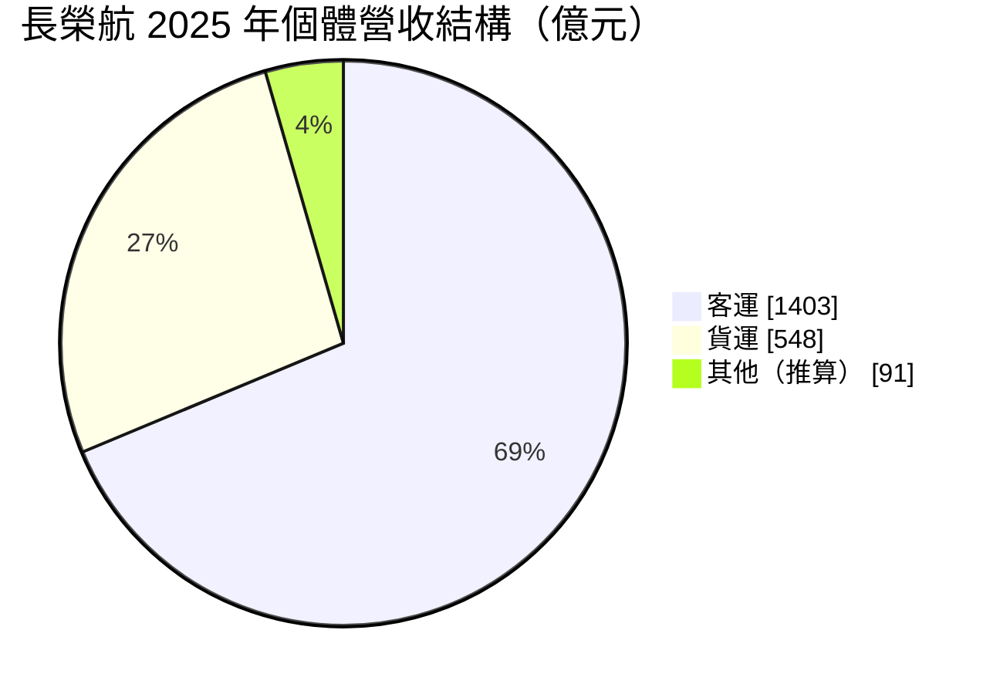
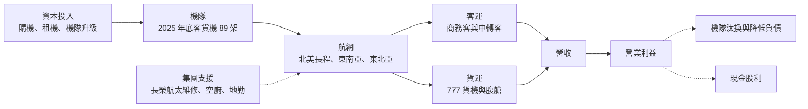
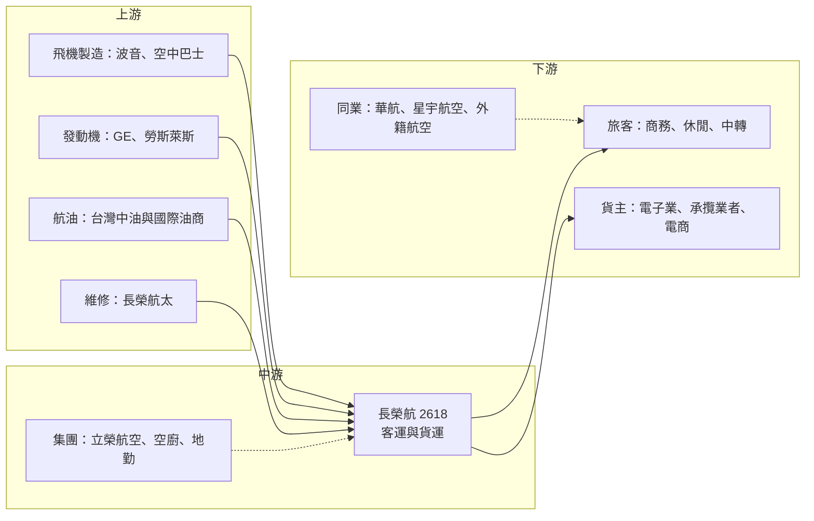

# 2618 長榮航

> 上市｜[[產業索引-航運業|航運業]]｜上市（櫃）日期 2001/09/17

# 第一章：企業模式與商業藍圖

> [!info] 撰寫說明
> 本文由 Claude 依公開資料整理，架構比照 [[2330台積電]] 的四章研究，資料截至 2026-10-08。財務數字來源：Goodinfo 年度經營績效、證交所開放資料（基本資料、資產負債、綜合損益、營益分析、股利）、旺得富（工商時報）2025 年財報報導、工商時報購機報導、民報；產業描述為整理性內容，尚未逐條比對原始文件。#待校對

航空業向來被視為難以長期賺錢的產業，但長榮航空在疫情後連續數年交出台灣航空業最好的獲利成績。本章針對長榮航空（股票代號：2618，以下簡稱長榮航）的商業模式進行定性分析，說明它如何以北美長程航線、桃園轉機樞紐與貨運雙引擎，建立高於同業的獲利水準。

## 一、核心定位：以北美長程與中轉旅客為核心的全服務航空

長榮航成立於 1989 年，由長榮集團創辦人張榮發創立，是台灣第一家民營國際航空公司，1991 年開航。它屬於「全服務航空」，提供商務艙、豪華經濟艙與經濟艙的完整服務，並在 2013 年加入星空聯盟。依證交所開放資料，公司實收資本額約 540 億元。

長榮航的定位有三個核心：

* **北美長程航網：** 長榮航在台灣飛往北美的航班密度與航點覆蓋度領先同業，涵蓋美西、美東與加拿大主要城市。長程航線的票價高、競爭者較少，且需要大型廣體客機與成熟的營運經驗，進入門檻高於短程航線。
* **「東南亞—台灣—北美」中轉樞紐：** 台灣位於東南亞與北美之間，長榮航把東南亞旅客先載到桃園，再轉往北美，讓長程航班的座位填得更滿。這類轉機旅客常選擇長榮航，是因為航班銜接順暢與服務評價好，願意支付較高的票價。
* **客貨並重：** 除了客運之外，長榮航經營 777 全貨機隊，也運用客機[[腹艙]]載貨。2025 年 AI 伺服器與電商出貨需求強勁，貨運吃下大量高單價空運訂單，讓獲利更為穩定。

## 二、終端應用與產品板塊

依旺得富報導的 2025 年個體財報，長榮航全年個體營收 2,042.5 億元，合併營收 2,203.3 億元。個體營收結構如下（「其他」為推算差額）：

* **客運：** 2025 年客運收入約 1,403 億元，年減 3.2%；載客人數約 1,333 萬人次，年增 1%，[[載客率]] 77.8%。人數成長但收入下滑，代表票價已從疫情後的高點逐步回落，這是觀察客運獲利的關鍵訊號。
* **貨運：** 2025 年貨運收入約 548 億元，年增 5.0%；載貨量約 84 萬噸，年增 7%，貨運載運率 71.5%。台灣出口的 AI 伺服器、半導體與電子產品體積小、價值高，提供長榮航穩定的本地貨源。
* **其他與子公司：** 合併報表另包含區域航空立榮航空、飛機維修的 [[2645長榮航太]]，以及空廚、地勤等集團事業，構成完整的航空服務生態系。

## 三、資本轉化邏輯：以服務品質換取票價溢價

* **以服務換溢價：** 長榮航長期在國際評比中獲得較好的服務評價，這讓它在長程航線上可以收取比部分同業更高的票價，或在相同票價下吸引更多旅客。全服務航空的競爭本質是「讓旅客願意多付一點」，服務品質因此不是成本，而是收入來源。
* **集中機型降低成本：** 長榮航的長程機隊以波音 777-300ER 與 787 為主，並逐步引進空中巴士 A350-1000。機型越集中，機師訓練、零件庫存與維修就越有效率，這是降低單位成本的重要手段。
* **集團內垂直整合：** 飛機維修由集團內的長榮航太負責，空廚與地勤也由集團公司提供。這讓長榮航在維修排程、品質管控與成本上有較大的掌握度，也是它在疫情後能快速恢復運能的原因之一。
* **重資產與高槓桿：** 和所有航空公司一樣，長榮航需要大量借款與[[租賃負債]]購置飛機，2026 年第二季底負債總計約 2,458 億元，約占總資產 62%（證交所資產負債開放資料，推算）。

## 四、企業長期藍圖：機隊升級與高端客源

* **大規模機隊更新：** 依工商時報 2025 年 12 月報導，長榮航增購 4 架 787-9，交易總額不超過 19.4 億美元；另有 24 架 A350-1000 自 2027 年起陸續交付、18 架 A321neo 自 2029 年起交付，以及 787-9 與 787-10 各數架預計在 2033 年前交付。新機油耗較低，能降低單位成本並提升產品力。
* **客艙升級：** 自 2026 年起升級 777-300ER 客艙，升級後共 20 架，並增加商務艙座位，目標與 2027 年引進的 A350-1000 客艙產品一致。增加商務艙座位代表公司押注高端客源，這是提高每架飛機收益的直接方式。
* **深化樞紐與聯盟：** 透過星空聯盟夥伴與航班銜接，擴大中轉客源。長期來看，桃園機場第三航廈完工後的容量提升，將決定長榮航能否繼續擴大轉運規模。
* **貨運聚焦高價值貨源：** 在 AI 伺服器、半導體與電商需求帶動下，維持全貨機隊的競爭力。貨運的高獲利期不一定持久，但台灣作為全球電子製造中心的地位，提供了相對穩定的需求基礎。

# 第二章：護城河深度與競爭優勢

航空業的產品同質性高、競爭者多，能長期維持超額報酬的航空公司並不多。本章分析長榮航的競爭優勢來源，以及它在國內外對手夾擊下能守住多少。

## 一、護城河的核心組成要素

* **北美航權與時間帶：** 國際航線需要雙邊航權，熱門機場的起降時間帶又極為稀缺。長榮航在北美累積了大量航點與班次，新進者即使有飛機，也難以在短時間取得同等的時段與航網，這是制度性與時間累積形成的門檻。
* **品牌與服務口碑：** 長榮航在國際評比中長期有好成績，形成高端旅客與轉機旅客的品牌偏好。品牌口碑需要多年穩定服務累積，一旦建立，就能轉化為票價溢價與較高的載客率。
* **桃園樞紐的網路效應：** 長榮航在桃園的航點與班次越多，旅客轉機越方便，就越能吸引中轉客，進而支撐更多航點。這種正向循環讓大型業者具有規模優勢。
* **集團資源與財務紀律：** 長榮集團旗下有海運、航空維修、地勤等事業，可以提供維修、物流與資金上的協同效應。集團傳統上重視成本控管，這種管理文化是長榮航獲利率高於同業的重要原因。

## 二、全球主要競爭對手格局

| 對手 | 類型 | 主要競爭領域 | 與長榮航的關係 |
|---|---|---|---|
| [[2610華航]] | 台灣全服務航空 | 北美長程客運、貨運 | 最直接的對手，貨機隊規模較大 |
| [[2646星宇航空]] | 台灣新興全服務航空 | 東北亞、東南亞、北美客運 | 以新機與精品化服務爭取高端客源 |
| 國泰航空 | 香港全服務航空 | 東南亞至北美中轉 | 香港樞紐直接競爭中轉旅客 |
| 日本航空、全日空 | 日本全服務航空 | 北美中轉、東北亞 | 東京樞紐競爭跨太平洋轉機客 |
| 美國聯合航空、達美航空 | 美國全服務航空 | 跨太平洋直飛 | 在美國端擁有龐大國內航網 |
| 廉價航空 | 低成本航空 | 台日、台韓、東南亞短程 | 壓縮短程航線票價 |

## 三、優勢轉化：守得住與守不住

* **守得住：** 北美長程航線、商務艙旅客與東南亞到北美的轉機客。這些市場重視航班密度、銜接與服務品質，長榮航的航網、品牌與集團支援可以提供持續的競爭力。
* **守不住：** 短程航線的票價與疫情後的超額收益率。廉航與新進業者持續擴張，加上全球運能恢復，客運票價已開始回落，2025 年客運收入在載客人數成長下仍年減 3.2%，就是明確的訊號。
* **觀察重點：** 第一，A350-1000 在 2027 年起交付後能否如期提升單位收益；第二，星宇航空擴張北美航線對高端客源的影響；第三，客運收益率回落後，營業利益率能否穩定在疫情前明顯更高的水準。若能維持兩位數營業利益率，代表長榮航已從循環股轉為結構性較強的航空公司。

# 第三章：財務體質與盈利規模

資料日期：2026-10-08。數字取自 Goodinfo 年度經營績效、證交所開放資料與旺得富 2025 年財報報導，表格是撰寫當時的快照；最新月營收、毛利率、累計 EPS 由自動排程寫在本筆記的屬性欄位（月營收、毛利率、累計EPS 等）。#待校對

財務報表是檢驗護城河是否真實存在的最終標準。本章用多年度的三率、ROE 與資本報酬，檢視長榮航在疫情前後的獲利結構變化。

## 一、獲利能力的基石：三率

| 年度 | 營收（新台幣） | [[毛利率]] | [[營業利益率]] | EPS（元） | [[ROE]] |
|---|---|---|---|---|---|
| 2019 | 1,813 億 | 12.6% | 5.21% | 0.83 | 6.55% |
| 2020 | 890 億 | 9.61% | -0.93% | -0.69 | -4.23% |
| 2021 | 1,039 億 | 18.6% | 9.97% | 1.31 | 7.89% |
| 2022 | 1,381 億 | 14.3% | 7.10% | 1.34 | 8.28% |
| 2023 | 2,004 億 | 21.6% | 14.8% | 4.01 | 21.7% |
| 2024 | 2,210 億 | 24.4% | 17.5% | 5.37 | 24.5% |
| 2025 | 2,203 億 | 23.4% | 16.4% | 4.84 | 19.7% |
| 2026 上半年 | 1,283 億 | 19.83% | 13.25% | 2.24 | 未查得 |

註：2019 至 2025 年取自 Goodinfo；2026 上半年取自證交所營益分析與綜合損益開放資料。

* **[[毛利率]]：** 疫情前長榮航毛利率約 12% 至 13%，2023 至 2025 年提升到 21% 至 24%。這段期間全球飛機交付不足、旅遊需求報復性反彈，票價維持高檔，是毛利率大幅提升的主因。2026 上半年毛利率降到 19.83%，顯示票價正常化正在發生。
* **[[營業利益率]]：** 2024 年營業利益率 17.5% 是歷史高點，在全球大型航空公司中也屬前段。2019 年僅 5.21%，代表即使正常化，長榮航的獲利率也很難長期停留在疫情後的高峰。
* **營收趨勢：** 以 2019 年為基期，2025 年營收成長約 21.5%，6 年年複合成長率約 3.3%（推算）；若以疫情低點 2020 年為基期，5 年年複合成長率約 19.9%（推算），但這主要是復甦效果，不代表長期成長速度。
* **[[淨利率]]：** 2025 年合併稅後淨利約 275 億元，歸屬母公司淨利約 261.5 億元（證交所股利資料），EPS 4.84 元接近歷史高點。

## 二、[[ROE]]：資本效率

2021 至 2025 年平均 ROE 約 16.4%（推算），2023 至 2025 年連續三年在 19% 以上，遠高於疫情前約 6.5% 的水準。高 ROE 一部分來自營業利益率提升，一部分來自財務槓桿。2026 年第二季底每股淨值約 25.80 元，股價淨值比約 1.61 倍（證交所開放資料，2026 年 10 月初），高於華航，反映市場給予長榮航較高的獲利品質評價。

## 三、資本支出、自由現金流與股利

長榮航正進入機隊更新高峰：增購 787-9、改裝 777-300ER，加上 2027 年起陸續交付的 24 架 A350-1000 與 2029 年起的 A321neo，未來數年的[[CapEx]]將明顯增加。工商時報報導，僅 4 架 787-9 加上 6 架 777-300ER 客艙升級合計約 20.92 億美元。年度資本支出與[[自由現金流]]的具體數字未查得。疫情後幾年獲利豐厚、現金累積，讓公司有餘裕在不大幅提高負債比率的情況下更新機隊（推估）。

股利方面，2025 年度配發現金股利 2.0 元（證交所股利資料），以 EPS 4.84 元計算[[配息率]]約 41%（推算）。公司章程僅規定現金股利至少占股利總額 10%，配息彈性大。在機隊更新期間保留約六成盈餘，反映管理層優先強化資產負債表。疫情前多年配息偏低且不穩定，長期股利穩定度仍需觀察循環下行時的表現。

## 四、[[ROIC]] 與 [[WACC]]：價值創造利差

**ROIC 推算：** 2025 年合併營業利益約 361 億元（營收 2,203 億元乘以營業利益率 16.4%，推算），扣除 20% 稅率後約 289 億元。2026 年第二季底權益總計約 1,482 億元，總負債約 2,458 億元，假設其中約 55% 為有息負債與租賃負債（推估，約 1,352 億元），投入資本約 2,834 億元，ROIC 約 10.2%（推算）。以同樣方法估算 2019 年（營業利益約 94 億元），ROIC 約 3% 上下（推算，資本基礎以近期數字代替）。

**WACC 推算：** 假設台灣 10 年期公債殖利率 1.75%、市場風險溢酬 6%、β 取航空業常見值 1.0（推估），股東權益成本約 7.75%。負債成本假設 2.5%，稅後約 2.0%；以帳面價值計，權益約占 52%、負債約占 48%，WACC 約 5.0%（推算）。

**結論：** 2023 至 2025 年長榮航的 ROIC 約 10%，是 WACC 的兩倍左右，屬於明顯創造價值的期間。但疫情前的 ROIC 約與資金成本打平甚至略低，說明航空業的超額報酬具有強烈的週期性。長榮航能否在票價正常化後仍讓 ROIC 穩定高於 WACC，取決於機隊更新後的單位成本下降，以及高端客源與貨運能否維持溢價。

# 第四章：總體風險與地緣政治

任何企業都無法脫離宏觀環境獨立存在。航空業對地緣政治、油價、匯率與公共衛生事件特別敏感。本章分析長榮航必須長期面對的風險。

## 一、地緣政治風險

* **台海與兩岸情勢：** 台海情勢升溫可能影響飛航安全評估、保險費率與外國旅客來台意願。兩岸航線的開放程度也受政治關係左右。
* **空域限制：** 俄烏戰爭與中東衝突使部分航路必須繞飛，增加飛行時間與油耗。長榮航的歐洲航線受影響較北美航線大。
* **美國貿易政策：** 長榮航貨運高度依賴台灣到北美的電子產品出口，美國關稅或供應鏈轉移若改變出貨地點，可能削弱台灣作為空運起點的地位。

## 二、產業週期與市場結構風險

* **運能過剩循環：** 疫情後各大航空公司大量下單，隨著波音與空中巴士交機恢復，全球運能增加，票價有下行壓力。2025 年客運收入下滑已反映這個趨勢。
* **貨運運價波動：** 空運運價受海運供需、電子產品週期與電商需求影響，波動很大，且會被[[長鞭效應]]放大。AI 伺服器出貨帶來的貨運紅利未必能長期維持。
* **新進者與擴張：** 星宇航空擴張北美與東南亞航網，外國航空與廉航持續加開台灣航點，競爭只會更激烈。

## 三、營運環境的隱性風險

* **油價與匯率：** 油料是航空業最大的變動成本，油價急漲若無法以[[燃油附加費]]轉嫁，會直接壓縮獲利。飛機與航油多以美元計價，匯率變動影響成本與負債評價。
* **人力與勞資關係：** 長榮航曾在 2019 年經歷空服員罷工，造成大量航班取消與營收損失。機師與空服員人力短缺、薪資上漲，是長期成本壓力。
* **新機交付延遲：** 波音與空中巴士的生產問題可能延後交機，使老舊飛機延役，推升維修成本並延遲產品升級。
* **飛安與聲譽：** 任何重大飛安事件都會重創品牌與訂位，長榮航的高端定位尤其依賴安全與服務紀錄。

## 四、科技或法規演進

國際航空碳抵換及減量計畫（CORSIA）與各國提高[[永續航空燃油]]（SAF）使用比例的要求，將在未來十年持續提高燃料成本。新世代飛機可降低油耗約一到兩成，但減碳法規會讓航空業整體成本上升。另一方面，視訊會議與遠距工作可能永久降低部分商務旅行，使高端客源的成長速度放緩。長榮航把資源押注在商務艙與長程航線，這兩個趨勢將是長期需要追蹤的結構性風險。

# 專有名詞解析

## 金融

- **[[租賃負債]]**：企業以租賃方式取得資產時，依會計準則認列未來租金現值的負債，航空公司租用飛機會產生大量租賃負債。
- **[[配息率]]**：現金股利占每股盈餘的比例，用來觀察公司把多少獲利分配給股東。
- **[[自由現金流]]**：營業活動現金流減去資本支出，代表企業可自由用於配息、還債或併購的現金。
- **[[淨利率]]**：稅後淨利占營收的比例，反映所有成本、費用與稅負後的最終獲利能力。
- **[[毛利率]]**：營業毛利占營收的比例，反映產品或服務扣除直接成本後的獲利空間。
- **[[營業利益率]]**：營業利益占營收的比例，反映本業扣除營業費用後的獲利能力。
- **[[ROE]]**：股東權益報酬率，稅後淨利除以股東權益，衡量公司用股東資金賺錢的效率。
- **[[ROIC]]**：投入資本報酬率，稅後營業利益除以股東權益與有息負債之和，衡量所有投入資本的報酬。
- **[[WACC]]**：加權平均資金成本，依權益與負債比重加權的資金成本，是 ROIC 需要超越的門檻。
- **[[長鞭效應]]**：終端需求的小幅變動，沿供應鏈往上游傳遞時被逐級放大，造成上游庫存與訂單劇烈波動。

## 產業

- **[[腹艙]]**：客機機身下層用來裝載行李與貨物的空間，航空公司可利用客運航班同時運送貨物，增加每趟航班的收入。
- **[[樞紐]]**：航空公司集中航班、讓旅客與貨物在此轉機的主要機場，航點越多轉機越方便，能形成網路效應。
- **[[載客率]]**：實際售出座位占可用座位的比例，是衡量航空公司運能是否被充分利用的核心指標。
- **[[燃油附加費]]**：航空公司在票價之外，依油價水準向旅客或貨主加收的費用，用來轉嫁燃油成本波動。
- **[[永續航空燃油]]**：以廢食用油、農林廢棄物等原料製成的航空燃料，可降低生命週期碳排放，但價格明顯高於傳統航油。
- **[[垂直整合]]**：企業把上下游的生產或服務環節納入集團內部，以掌握成本、品質與交期。

# 核心供應鏈

## 1. 上游：飛機、發動機、航油與維修
- 飛機製造：波音（777-300ER、787-9、787-10）、空中巴士（A350-1000、A321neo）
- 發動機：GE、勞斯萊斯
- 航油：台灣中油與國際油商
- 飛機維修：[[2645長榮航太]]

## 2. 中游：長榮航與集團事業
- 區域航空：立榮航空
- 集團關係企業：[[2603長榮]]（長榮海運）、[[2607榮運]]
- 空廚、地勤、貨運站等周邊事業

## 3. 下游：客戶
- 旅客：北美商務客、東南亞經桃園轉往北美的轉機客、休閒旅客
- 貨主：台灣 AI 伺服器、半導體與電子製造業者、貨運承攬業者、跨境電商

## 4. 同業競爭
- 國內：[[2610華航]]、[[2646星宇航空]]
- 國際：國泰航空、日本航空、全日空、美國聯合航空等

## 最新新聞
<!-- news:start（自動產生，請勿手動編輯此範圍） -->
- 2026-10-08 📰 媒體 19:51｜營收速報 - 長榮航(2618)9月營收207.49億元年增率高達32.86％｜[鉅亨網](https://news.cnyes.com/news/id/6625867)

完整紀錄：[[2618長榮航 新聞]]
<!-- news:end -->

## 相關連結
- [公開資訊觀測站](https://mopsov.twse.com.tw/mops/web/t05st03?step=1&firstin=1&co_id=2618)
- [Goodinfo](https://goodinfo.tw/tw/StockDetail.asp?STOCK_ID=2618)
- [Yahoo 股市](https://tw.stock.yahoo.com/quote/2618)
- [鉅亨網新聞](https://www.cnyes.com/twstock/2618/news)
