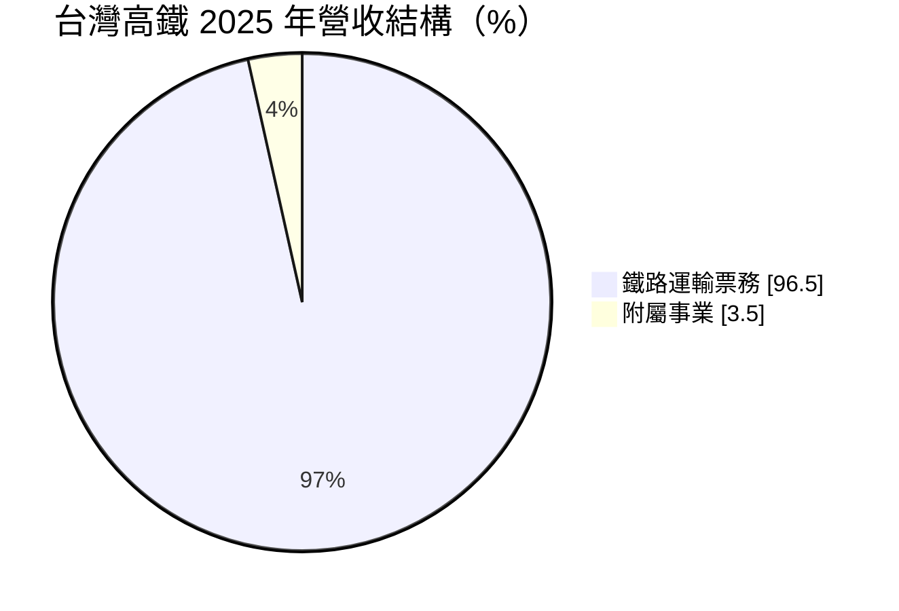
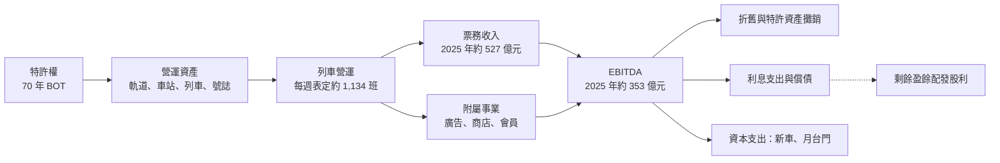
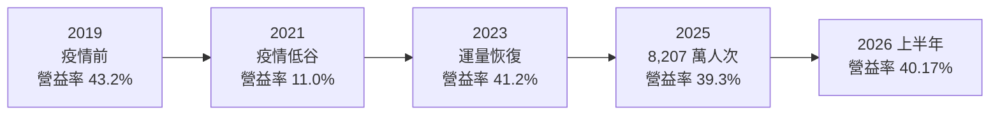
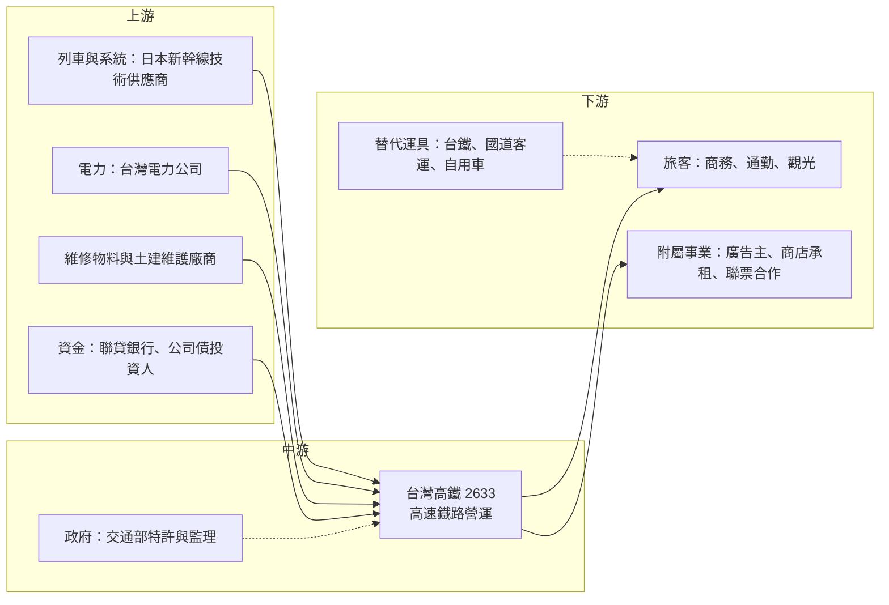

# 2633 台灣高鐵

> 上市｜[[產業索引-航運業|航運業]]｜上市（櫃）日期 2016/10/27

# 第一章：企業模式與商業藍圖

> [!info] 撰寫說明
> 本文由 Claude 依公開資料整理，架構比照 [[2330台積電]] 的四章研究，資料截至 2026-10-08。財務數字來源：Goodinfo 年度經營績效、證交所開放資料（基本資料、資產負債、綜合損益、營益分析、股利）、富果研究 2025 年法說會整理、工商時報、股感；產業描述為整理性內容，尚未逐條比對原始文件。#待校對

台灣高鐵是台灣少數具備獨占性質的上市公司，但它的獲利型態與一般企業很不一樣：營業利益率極高，淨利率卻被利息與特許相關成本大幅壓縮。本章針對台灣高速鐵路公司（股票代號：2633，以下簡稱台灣高鐵）的商業模式進行定性分析，說明它的特許經營結構、獲利來源，以及這種「類公用事業」的長期投資特性。

## 一、核心定位：西部走廊唯一的高速鐵路特許經營者

台灣高鐵成立於 1998 年，以 [[BOT]]（興建、營運、移轉）模式取得政府特許，興建並營運南港至左營的高速鐵路，2007 年通車。依股感整理，高鐵建設成本約 4,500 億元，是台灣規模最大的民間參與公共建設案。

它的定位有三個關鍵：

* **特許獨占：** 台灣西部走廊只有一條高速鐵路，台灣高鐵是唯一的營運者。在 300 公里左右的城際距離，高鐵在時間上明顯優於公路與傳統鐵路，價格又低於航空，因此形成難以替代的運輸地位。
* **特許期有限：** 原始特許期為 35 年，2015 年財務解決方案後延長為 70 年（股感）。依 1998 年簽約起算，特許期約至 2068 年（推算）。特許期屆滿時營運資產需移轉給政府，因此公司的價值本質上是「有期限的現金流」，而不是永續經營的企業。
* **政府深度參與：** 2015 年財務解決方案引進泛公股資金，依證交所基本資料，公司有私募股數 30 億股，交通部為大股東。票價調整須經董事會決議後送交通部備查，這讓台灣高鐵兼具上市公司與公共運輸服務的雙重身分。

2015 年財務解決方案是理解今日台灣高鐵的關鍵。在此之前，公司因特許期太短、折舊與利息負擔過重而累積大量虧損，面臨財務危機。延長特許期讓龐大的建設成本可以攤提到更長的期間，每年的攤銷費用大幅下降；再加上減資、增資與聯貸再融資，公司才從長期虧損轉為穩定獲利。股感指出，公司[[自由現金流]]在 2017 年轉正。

## 二、終端應用與產品板塊

依富果研究整理的 2025 年法說會資料，台灣高鐵的收入幾乎全部來自票務：

* **鐵路運輸票務：** 2025 年票務收入約 527.3 億元，年增 2.9%。全年旅客 8,207 萬人次，年增 4.9%，首次突破 8,000 萬人次並創通車以來新高；延人公里數年增 3.0%。通車至今累計旅客已超過 9.8 億人次（工商時報）。旅運量是高鐵最核心的行業指標，它反映台灣西部城市間的通勤、商務與觀光需求。
* **附屬事業：** 2025 年約 19.18 億元，包含車站與車廂廣告、商店租金、會員與聯票等。附屬收入金額雖小，但可以利用既有車站與會員流量，以低邊際成本增加收入。Tgo 會員已超過 300 萬人，公司正推動購物平台與聯名商品。

值得注意的是，旅客人數成長 4.9%，票務收入只成長 2.9%，代表平均票價因早鳥優惠、會員折扣與長短程結構變化而小幅下降。在票價長期未調漲的情況下，營收成長主要依賴運量增加。

## 三、資本轉化邏輯：高固定成本、高 EBITDA 的現金流機器

* **極高的[[營運槓桿]]：** 高鐵的主要成本是資產攤銷、人事、電費與維修，幾乎都是固定成本。多載一位旅客的邊際成本極低，因此運量成長時獲利擴張很快，運量下滑時（例如疫情期間）獲利也會急速萎縮。2021 年營收降到 302 億元，營業利益率從疫情前的 43.2% 降到 11%，就是最好的例證。
* **[[EBITDA]] 是最真實的現金創造力：** 2025 年 EBITDA 約 353 億元，EBITDA 利潤率 64.6%（2024 年為 67.6%），遠高於約 39% 的營業利益率。差距來自龐大的折舊與特許資產攤銷，這些是非現金費用。對高鐵而言，觀察 EBITDA 比觀察 EPS 更能理解它的現金流能力。
* **利息吃掉大部分營業利益：** 2026 年上半年營業利益約 111.7 億元，但營業外淨支出約 67.8 億元，稅前淨利只剩約 43.9 億元（證交所綜合損益開放資料）。營業外支出主要是借款利息與特許相關的財務成本（推估），這是高鐵淨利率遠低於營業利益率的原因。
* **以營業現金流償債與配息：** 2025 年營業活動淨現金流入約 206.9 億元，資本支出約 98.7 億元，並償還公司債 40 億元、商業本票 15.75 億元，發放現金股利 59 億元。這個結構說明高鐵的現金流大致依序用於維持營運、償債與配息。

## 四、企業長期藍圖：新車擴充運能與服務升級

* **12 組新世代列車：** 台灣高鐵採購 12 組新列車，首組預計 2026 年 8 月抵台，經半年以上測試後最快 2027 年下半年營運，2028 年底全數上線。完成後尖峰運能預計提升約 25%，目標包括台北到台中尖峰每小時 4 班直達車。這是通車以來最重要的運能擴充，也是公司明確表示的主要成長動能。
* **左營第二基地：** 預計 2027 年 12 月完工，維修能量由約 38 組提升到 47 組，最大停放量由 44 組提升到 50 組（工商時報）。新車與基地同步到位，才能真正把運能轉為營收。
* **月台門與車站更新：** 除台北站外，其餘 11 個車站的月台門預計 2028 年全數完工，並同步更新車站設施與票務系統。這類投資主要提升安全與服務品質，不直接增加營收，但屬於長期必要支出。
* **延伸路線評估：** 對政府主導的高鐵延伸宜蘭與南延屏東計畫，公司表態支持，但會依營運條件與財務狀況審慎評估參與方式。延伸路線若由公司參與，可能帶來新的運量，也可能帶來新的資本負擔。

# 第二章：護城河深度與競爭優勢

台灣高鐵的競爭優勢與一般企業不同，它的護城河主要來自特許制度與基礎建設本身。本章分析這種獨占地位的來源、它面對的替代競爭，以及特許制度本身帶來的限制。

## 一、護城河的核心組成要素

* **特許獨占與法律保障：** 高鐵路線由政府特許，在特許期內沒有第二家業者可以經營同一條高速鐵路。這是最強的制度性護城河，也是台灣高鐵能長期維持約四成營業利益率的根本原因。
* **不可複製的基礎建設：** 興建一條新的高速鐵路需要數千億元投資與十年以上的時間，土地徵收與環評更是困難。即使沒有特許限制，也幾乎不可能有競爭者另建一條平行路線。
* **時間優勢與網路地位：** 高鐵以約 90 分鐘左右連結台北與高雄，主要車站與捷運、台鐵、機場捷運銜接，已成為西部走廊的運輸骨幹。城市發展與通勤習慣圍繞高鐵站形成，進一步鞏固它的需求基礎。
* **營運安全紀錄：** 高鐵通車以來的安全與準點紀錄，是旅客信任與政府支持的基礎，也是任何替代方案難以在短期內追上的無形資產。

## 二、全球主要競爭對手格局

台灣高鐵沒有直接的同業競爭者，它面對的是不同運具的替代競爭：

| 替代運具 | 主要競爭區間 | 競爭特性 | 對高鐵的影響 |
|---|---|---|---|
| 台鐵（國營臺灣鐵路公司） | 短中程與沿海城市 | 票價較低、站點較多 | 搶占價格敏感與短程旅客 |
| 國道客運 | 台北至台中、台南、高雄 | 票價低、班次密 | 在離峰與學生族群具競爭力 |
| 自用車 | 中短程、家庭出遊 | 彈性高、多人分攤成本低 | 連假與家庭旅遊的主要替代 |
| 國內航線 | 台北至高雄（已大幅萎縮） | 高鐵通車後市場被取代 | 影響已有限 |
| 未來自駕車與電動車 | 中短程城際 | 長期可能降低駕駛成本與疲勞 | 長期潛在替代風險 |

## 三、優勢轉化：守得住與守不住

* **守得住：** 中長程城際旅運與商務通勤。台北、台中、高雄之間的商務旅客重視時間，高鐵在這個市場幾乎沒有替代者。運能擴充後，尖峰時段一位難求的情況可望改善，進一步把需求轉成營收。
* **守不住：** 票價調整的自主權與成本轉嫁能力。依合約，通膨達一定程度時公司有權調整票價，但交通部為大股東，董事長也表示要在 12 組新車全數到位、服務品質改善後才會考慮調漲。這代表電費、人事與物料上漲的成本，短期內只能由公司吸收，2025 年 EBITDA 利潤率下降 3 個百分點就是例證。
* **觀察重點：** 第一，新車在 2027 至 2028 年上線後，運量能否明顯突破 8,000 萬人次；第二，2028 年後是否啟動票價調整；第三，負債比率持續下降的速度，這決定利息負擔能釋放多少盈餘給股東。

# 第三章：財務體質與盈利規模

資料日期：2026-10-08。數字取自 Goodinfo 年度經營績效、證交所開放資料與富果研究法說會整理，表格是撰寫當時的快照；最新月營收、毛利率、累計 EPS 由自動排程寫在本筆記的屬性欄位（月營收、毛利率、累計EPS 等）。#待校對

財務報表是檢驗護城河是否真實存在的最終標準。本章用多年度的三率、ROE、現金流與資本報酬，檢視台灣高鐵在特許結構下的獲利品質。

## 一、獲利能力的基石：三率

| 年度 | 營收（新台幣） | [[毛利率]] | [[營業利益率]] | EPS（元） | [[ROE]] | 旅運量 |
|---|---|---|---|---|---|---|
| 2019 | 475 億 | 45.8% | 43.2% | 1.42 | 11.4% | 未查得 |
| 2020 | 391 億 | 33.3% | 30.2% | 1.04 | 8.28% | 未查得 |
| 2021 | 302 億 | 15.0% | 11.0% | 0.64 | 5.24% | 未查得 |
| 2022 | 371 億 | 30.3% | 26.7% | 0.67 | 5.58% | 未查得 |
| 2023 | 498 億 | 44.6% | 41.2% | 1.39 | 11.3% | 未查得 |
| 2024 | 532 億 | 43.9% | 40.4% | 1.15 | 9.0% | 約 7,824 萬人次（推算） |
| 2025 | 546 億 | 43.3% | 39.3% | 1.17 | 9.09% | 8,207 萬人次 |
| 2026 上半年 | 278 億 | 44.12% | 40.17% | 0.67 | 未查得 | 未查得 |

註：2019 至 2025 年取自 Goodinfo；2026 上半年取自證交所營益分析與綜合損益開放資料；2025 年旅運量取自法說會，2024 年由年增 4.9% 回推。

* **[[毛利率]]與[[營業利益率]]：** 正常年份高鐵毛利率約 43% 至 46%，營業利益率約 39% 至 43%，兩者差距很小，因為營業費用只占營收約 4%。這是典型的基礎建設型企業：主要成本都在營業成本中的資產攤銷、人事與電費。2023 年以後毛利率從 44.6% 緩降到 43.3%，反映人事與電費上漲但票價未調整。
* **淨利率被利息壓縮：** 2025 年營收 546.5 億元、稅後淨利約 65.8 億元，[[淨利率]]約 12%（推算），不到營業利益率的三分之一。利息與特許相關財務成本是高鐵股東報酬最大的減項。
* **營收趨勢：** 以 2019 年為基期，2025 年營收成長約 15%，6 年年複合成長率約 2.3%（推算）。高鐵的營收成長主要靠運量，在新車上線前，運能限制讓成長空間有限。

## 二、[[ROE]]：資本效率

2021 至 2025 年平均 ROE 約 8.0%（推算），正常年份約 9% 至 11%。高鐵股東權益占總資產的比例偏低（2026 年第二季底權益約 700.5 億元，總資產約 3,859 億元，證交所資產負債開放資料），意味著 ROE 中有相當部分是財務槓桿的貢獻。隨著負債逐年償還、利息下降，淨利有機會提升，但權益基礎也會因保留盈餘而變大。每股淨值約 12.45 元，股價淨值比約 2.06 倍（證交所開放資料，2026 年 10 月初），反映市場以「穩定配息的特許資產」而非帳面價值評價高鐵。

## 三、資本支出、自由現金流與股利

2025 年營業活動淨現金流入約 206.9 億元，資本支出約 98.7 億元，[[自由現金流]]約 108 億元（推算）。資本支出主要用於新車、月台門與車站設施，在 2026 至 2028 年新車交付期間會維持較高水準。公司也評估發行永續發展債券支應月台門等支出。負債占資產比率在 2025 年底降至 80.9%，自 2012 年以來持續下降。

股利是高鐵最受投資人關注的特性。公司章程規定每年就可供分配盈餘提撥不低於 60% 分配股東股息紅利，2025 年度配發現金股利 1.15 元（證交所股利資料），以 EPS 1.17 元計算[[配息率]]約 98%（推算）。幾乎把當年盈餘全數發放，代表高鐵是典型的收益型股票，但也意味著股利成長只能依賴盈餘成長，而盈餘成長又受限於運能與票價。

## 四、[[ROIC]] 與 [[WACC]]：價值創造利差

**ROIC 推算：** 2025 年營業利益約 214.8 億元（營收 546.5 億元乘以營業利益率 39.3%，推算），扣除 20% 稅率後約 171.8 億元。2026 年第二季底權益總計約 700.5 億元，總負債約 3,159 億元，假設其中約 75% 為有息負債（推估，約 2,369 億元），投入資本約 3,070 億元，ROIC 約 5.6%（推算）。

**WACC 推算：** 假設台灣 10 年期公債殖利率 1.75%、市場風險溢酬 6%、β 取公用事業型企業常見值 0.5（推估），股東權益成本約 4.75%。負債成本假設 3.5%（推估，考量營業外淨支出年化約 136 億元的財務負擔），稅後約 2.8%；以帳面價值計，權益約占 23%、負債約占 77%，WACC 約 3.3%（推算）。

**結論：** 在正常營運年份，台灣高鐵的 ROIC 約 5% 至 6%，高於約 3% 的資金成本，代表 2015 年財務解決方案後的結構可以穩定創造價值。不過利差並不大，而且需要考慮兩個特殊因素：一是特許期屆滿時資產需移轉給政府，公司價值有明確的期限；二是票價調整受政府節制，成本上升時利差會被壓縮。對長期投資人而言，台灣高鐵比較像一張有固定到期日、配息與運量連動的長期債券，而不是高成長股。

# 第四章：總體風險與地緣政治

任何企業都無法脫離宏觀環境獨立存在。台灣高鐵的風險與一般製造業不同，主要集中在政策、成本、天災與重大公共衛生事件。本章分析它必須長期面對的四類風險。

## 一、地緣政治與政策風險

* **政府角色的雙面性：** 交通部為大股東，政府支持是高鐵穩定經營的基礎，但也意味著票價、延伸路線與公共服務要求可能優先考量公共利益，而非股東報酬。
* **特許合約條款：** 特許期、營運資產移轉與票價機制都寫在合約中，任何合約修訂或政府政策轉向，都會直接影響公司價值。
* **台海情勢：** 若台海緊張升高，國內旅運可能受影響，高鐵作為關鍵基礎設施也可能面臨安全防護成本上升。

## 二、產業週期與市場結構風險

* **運量與經濟、人口連動：** 高鐵運量與台灣經濟活動、商務往來與觀光需求高度相關。長期來看，台灣人口高齡化與少子化可能使通勤與學生旅運成長趨緩。
* **重大公共衛生事件：** 2021 年疫情使營收降到 302 億元、EPS 降到 0.64 元，顯示固定成本結構在需求驟降時的脆弱性。
* **替代運具演進：** 自駕車、電動車普及若大幅降低開車的成本與疲勞，可能在中短程城際市場侵蝕高鐵的需求。

## 三、營運環境的隱性風險

* **電費與人事成本：** 法說會指出電價與人事成本持續上揚，是未來獲利的主要挑戰。高鐵是用電大戶，電價政策直接影響毛利率。
* **天災與設備老化：** 台灣地震頻繁，高鐵路線經過斷層帶與地層下陷區域。通車近 20 年後，軌道、號誌與列車的維修與汰換需求將逐步增加。
* **新車導入風險：** 12 組新車若交付或測試延誤，運能擴充與營收成長都會遞延。
* **利率風險：** 高鐵負債龐大，利率上升會增加再融資成本，壓縮淨利與股利。

## 四、科技或法規演進

高鐵的核心系統來自日本新幹線技術，車輛、號誌與維修高度依賴日方供應商，系統更新與零件取得都需要長期合作。法規方面，月台門等安全設施的要求提高，以及減碳政策下綠電使用比例的要求，都可能增加資本支出與營運成本。另一方面，鐵路屬於低碳運具，在減碳趨勢下有機會獲得政策支持，例如延伸路線與轉乘整合，這是長期的潛在正面因素。

# 專有名詞解析

## 金融

- **[[EBITDA]]**：稅前息前折舊攤銷前利潤，排除利息、稅與非現金攤提費用，用來觀察企業的現金創造能力。
- **[[營運槓桿]]**：固定成本占比高的企業，營收小幅變動就會造成獲利大幅變動的現象。
- **[[自由現金流]]**：營業活動現金流減去資本支出，代表企業可自由用於配息、還債或併購的現金。
- **[[配息率]]**：現金股利占每股盈餘的比例，用來觀察公司把多少獲利分配給股東。
- **[[淨利率]]**：稅後淨利占營收的比例，反映所有成本、費用與稅負後的最終獲利能力。
- **[[毛利率]]**：營業毛利占營收的比例，反映產品或服務扣除直接成本後的獲利空間。
- **[[營業利益率]]**：營業利益占營收的比例，反映本業扣除營業費用後的獲利能力。
- **[[ROE]]**：股東權益報酬率，稅後淨利除以股東權益，衡量公司用股東資金賺錢的效率。
- **[[ROIC]]**：投入資本報酬率，稅後營業利益除以股東權益與有息負債之和，衡量所有投入資本的報酬。
- **[[WACC]]**：加權平均資金成本，依權益與負債比重加權的資金成本，是 ROIC 需要超越的門檻。

## 產業

- **[[BOT]]**：興建、營運、移轉的公共建設模式，民間業者出資興建並在特許期內營運收費，期滿後將資產移轉給政府。
- **[[特許期]]**：政府授權民間業者經營公共建設的期限，台灣高鐵的特許期由 35 年延長為 70 年，屆滿時資產須移轉政府。
- **[[延人公里]]**：旅客人數乘以每位旅客搭乘距離的總和，比單純計算人次更能反映運輸量與收入規模。
- **[[附屬事業]]**：運輸本業以外、利用車站與會員流量產生的收入，例如廣告、商店租金與聯票。
- **[[月台門]]**：設置在月台邊緣、與列車車門同步開關的安全門，可防止旅客跌落軌道。

# 核心供應鏈

## 1. 上游：列車、電力、維修與資金
- 列車與核心系統：日本新幹線體系的車輛與號誌供應商（新世代列車 12 組）
- 電力：台灣電力公司
- 軌道、車站與設備的維修物料與工程廠商
- 資金來源：聯貸銀行團與公司債投資人

## 2. 中游：台灣高鐵與主管機關
- 營運者：台灣高鐵
- 特許與監理：交通部（同時為大股東）

## 3. 下游：客戶與合作夥伴
- 旅客：西部走廊商務客、通勤族、觀光旅客、Tgo 會員
- 附屬事業：車站與車廂廣告主、商店承租業者、飯店與旅遊聯票合作夥伴

## 4. 替代競爭
- 國營臺灣鐵路公司、國道客運業者、自用車
- 國內航線：[[2610華航]]、[[2618長榮航]] 旗下區域航空在西部走廊的角色已大幅萎縮

## 最新新聞
<!-- news:start -->
<!-- news:end -->

## 相關連結
- [公開資訊觀測站](https://mopsov.twse.com.tw/mops/web/t05st03?step=1&firstin=1&co_id=2633)
- [Goodinfo](https://goodinfo.tw/tw/StockDetail.asp?STOCK_ID=2633)
- [Yahoo 股市](https://tw.stock.yahoo.com/quote/2633)
- [鉅亨網新聞](https://www.cnyes.com/twstock/2633/news)
