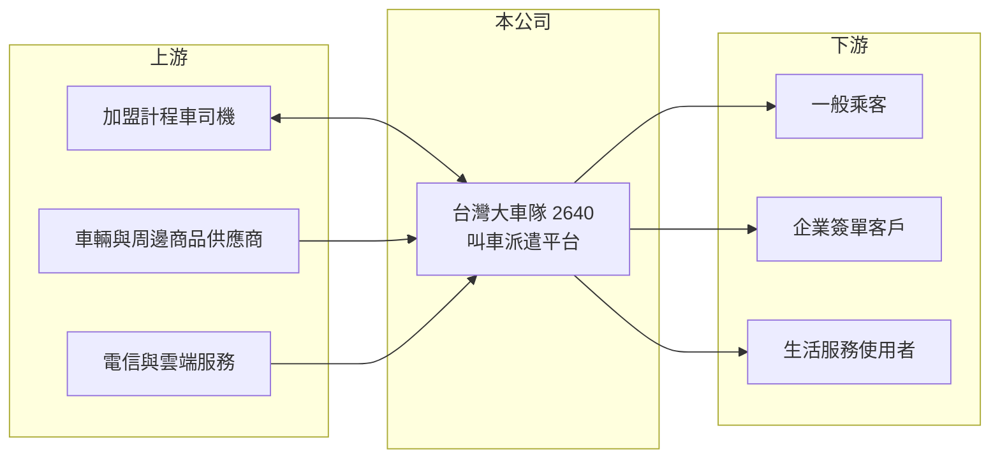

# 2640 大車隊

> 上櫃｜[[產業索引-數位雲端|數位雲端]]｜上市（櫃）日期 2012/11/07

# 第一章：企業模式與商業藍圖

> [!info] 撰寫說明
> 精簡版，由 Claude 依公開資料整理，架構比照 [[2330台積電]]，資料截至 2026-10-08。來源：櫃買中心開放資料（基本資料、資產負債、綜合損益、本益比殖利率、每月營收）、Goodinfo 年度經營績效、富邦 e 點通（MoneyDJ）公司基本資料。叫車服務名稱與商業模式描述為整理性內容，車隊規模與市占率未查得。#待校對

本章說明台灣大車隊（2640）如何以叫車派遣平台連結乘客與司機，並向司機收取媒合與周邊服務收入。

- **核心業務：** 台灣大車隊成立於 2005 年，2012 年上櫃，董事長林村田，實收資本額約 5.9 億元。公司經營計程車派遣平台，乘客透過電話與 App 叫車，平台把訂單派給加盟的司機。依 MoneyDJ 2025 年營收比重，資訊媒合占 69.7%、平台周邊銷售占 29.3%、其他約 1%。
- **商業模式：** 大車隊本身不擁有大量車輛，而是讓個人司機加入車隊，按月繳交派遣與資訊服務費，屬於[[雙邊平台]]：乘客越多，司機越願意加入；司機越多，派車越快、乘客越願意使用。周邊銷售則是向會員司機銷售車輛相關商品與服務，把平台上的司機變成第二個收入來源。
- **營收結構：** 媒合收入以月費為主，性質接近訂閱制，因此營收穩定、可預測。近年公司在核心叫車之外，推出企業簽單、預約接送與生活服務（例如家電清潔、寵物友善車）等加值服務，目的是提高每位會員與乘客帶來的收入。
- **長期方向：** 台灣計程車市場成熟，總量成長有限，大車隊的長期成長來自三個方向：提高平台市占、增加每位司機的服務收入、把車隊網絡延伸到物流與生活服務。2020 至 2025 年營收從 19.9 億元成長到 31.5 億元，說明這些延伸策略已帶來實際成長。

# 第二章：護城河深度與競爭優勢

本章分析大車隊平台的護城河與競爭者。

- **競爭優勢：** 平台事業最重要的護城河是[[網路效應]]。大車隊經營多年累積的司機與乘客規模，讓派車速度與覆蓋率優於小型車隊，新進者很難同時吸引兩邊的使用者。司機繳交月費後，轉換到其他平台需要重新適應派單規則與客源，形成一定的轉換成本。
- **主要對手：** Uber 以多元計程車與 App 叫車進入台灣市場，資金與國際品牌是其優勢；和泰集團的 yoxi、LINE TAXI 等也在 App 叫車市場競爭，另有大量地區性車隊與無線電台。競爭主要在補貼、司機抽成與乘客體驗，若對手長期以低抽成搶司機，大車隊的月費模式會受到壓力。
- **觀察重點：** 第一是會員司機人數與每位司機月費能否維持成長。第二是 App 叫車占比，數位化程度決定平台能否持續降低派單成本。第三是周邊銷售與加值服務的成長，這決定公司能否擺脫計程車市場總量的限制。

# 第三章：財務體質與盈利規模

資料日期：2026-10-08，表格是撰寫當時的快照；最新月營收、毛利率、累計 EPS 由自動排程寫在本筆記的屬性欄位（月營收、毛利率、累計EPS 等）。#待校對

本章用六年數字檢視大車隊平台模式的獲利品質。

| 年度 | 營收（新台幣） | [[毛利率]] | [[營業利益率]] | EPS（元） | [[ROE]] |
|---|---|---|---|---|---|
| 2020 | 19.9 億 | 49.4% | 20.9% | 5.22 | 19.5% |
| 2021 | 20.9 億 | 45.6% | 15.8% | 4.11 | 14.3% |
| 2022 | 25.3 億 | 47.8% | 19.4% | 6.00 | 18.2% |
| 2023 | 28.7 億 | 46.9% | 19.5% | 7.08 | 20.9% |
| 2024 | 30.2 億 | 48.8% | 22.4% | 8.93 | 25.2% |
| 2025 | 31.5 億 | 50.0% | 20.9% | 9.01 | 23.6% |

- **營收規模：** 2020 至 2025 年營收年複合成長率約 9.6%（推算），只有 2021 年疫情期間成長放緩。依櫃買中心資料，2026 年上半年營收約 16.7 億元、營業利益約 3.6 億元、EPS 4.86 元，1 至 8 月累計營收較前一年同期成長約 10%。
- **獲利：** 毛利率長期穩定在 46% 至 50%，營業利益率約 2 成，EPS 從 2021 年的 4.11 元增加到 2025 年的 9.01 元。近五年（2021 至 2025）平均 ROE 約 20.4%（推算），在國內服務業中屬於高水準。
- **財務特色：** 2026 年第二季歸屬母公司權益約 20.0 億元，每股淨值 33.79 元，總負債約 20.1 億元（流動 16.8 億、非流動 3.3 億），MoneyDJ 所列負債比例約 49%；平台業者的負債中常有司機保證金與預收款，不全是借款（組成未查得）。依櫃買中心資料，最近年度現金股利每股 8 元，以 2025 年 EPS 9.01 元計算[[配息率]]約 89%（推算），Goodinfo 統計加權平均現金股利約 4.91 元。
- **[[ROIC]] 與 [[WACC]]：** 2025 年營業利益約 6.6 億元（31.5 億 × 20.9%），以稅率 20% 計稅後約 5.3 億元；投入資本以股東權益 20.0 億元加上假設的有息負債約 4 億元（總負債兩成，實際數字未查得），合計約 24 億元，ROIC 約 22%（推算）。WACC 以 CAPM 推估：無風險利率 1.75%、市場風險溢酬 6%，MoneyDJ 的 β 為 0.11 不具代表性，改用服務業常見值 0.8，股東權益成本約 6.55%；負債成本 2%、稅後約 1.6%；股權權重約 83%，WACC 約 5.7%（推算）。ROIC 高出 WACC 約 16 個百分點，代表平台模式能用很少的資本創造高報酬，是典型的價值創造型公司。

# 第四章：總體風險與地緣政治

本章整理大車隊長期必須面對的風險。

- **產業週期：** 計程車需求與景氣、觀光人潮相關，但屬於民生交通，波動遠小於製造業；疫情等極端事件會讓叫車量短期驟降，2021 年營業利益率就降到 15.8%。司機收入下降時，部分司機可能退出車隊，影響月費收入。
- **營運風險：** 平台的價值建立在司機與乘客規模上，若對手以高額補貼搶走司機，網路效應可能反轉。周邊銷售毛利較低，若比重持續提高，可能拉低整體毛利率。
- **其他風險：** 計程車與多元計程車的法規（車資、牌照、保險規定）由政府決定，政策變動會改變競爭條件；自駕車與 Robotaxi 長期可能改變載客產業的成本結構，傳統以司機會費為基礎的模式需要轉型。

# 專有名詞解析

## 金融

- **[[配息率]]**：現金股利占每股盈餘的比例，反映公司把多少獲利發還股東。
- **[[ROIC]]**：投入資本報酬率，稅後營業利益除以投入資本，衡量本業運用資金創造報酬的能力。
- **[[WACC]]**：加權平均資金成本，股東與債權人要求報酬率的加權平均，ROIC 高於 WACC 才代表創造價值。

## 產業

- **[[雙邊平台]]**：同時服務兩群使用者（例如乘客與司機）的平台，一邊使用者增加會吸引另一邊加入。
- **[[網路效應]]**：使用者越多、服務對每位使用者越有價值的現象，是平台型企業最主要的護城河。

# 核心供應鏈

- 上游：加盟司機（同時是平台的會員客戶）、車輛與周邊商品供應商、電信服務（例如 [[2412中華電]]、[[3045台灣大]]、[[4904遠傳]]，產業參考，實際合作對象未查得）。
- 下游／客戶：一般叫車乘客、企業簽單與預約接送客戶、生活服務使用者。
- 同業：Uber、yoxi、LINE TAXI 與各地區計程車隊。

## 最新新聞
<!-- news:start（自動產生，請勿手動編輯此範圍） -->
- 2026-10-06 🏛️ 重訊 17:42｜代重要子公司全球商務科技股份有限公司公告 董事會決議不分配114年度股利｜[觀測站](https://mops.twse.com.tw/mops/#/web/t05st01)
- 2026-10-06 🏛️ 重訊 17:42｜代重要子公司全球商務科技股份有限公司公告 董事會決議召開115年股東常會相關事宜｜[觀測站](https://mops.twse.com.tw/mops/#/web/t05st01)
- 2026-10-06 🏛️ 重訊 17:42｜代重要子公司全球商務科技股份有限公司公告115年 股東常會重要決議事項｜[觀測站](https://mops.twse.com.tw/mops/#/web/t05st01)
- 2026-10-05 🏛️ 重訊 23:58｜公告本公司董事會決議委任第五屆薪資報酬委員會委員｜[觀測站](https://mops.twse.com.tw/mops/#/web/t05st01)

完整紀錄：[[2640大車隊 新聞]]
<!-- news:end -->

## 相關連結
- [公開資訊觀測站](https://mopsov.twse.com.tw/mops/web/t05st03?step=1&firstin=1&co_id=2640)
- [Goodinfo](https://goodinfo.tw/tw/StockDetail.asp?STOCK_ID=2640)
- [Yahoo 股市](https://tw.stock.yahoo.com/quote/2640)
- [鉅亨網新聞](https://www.cnyes.com/twstock/2640/news)
