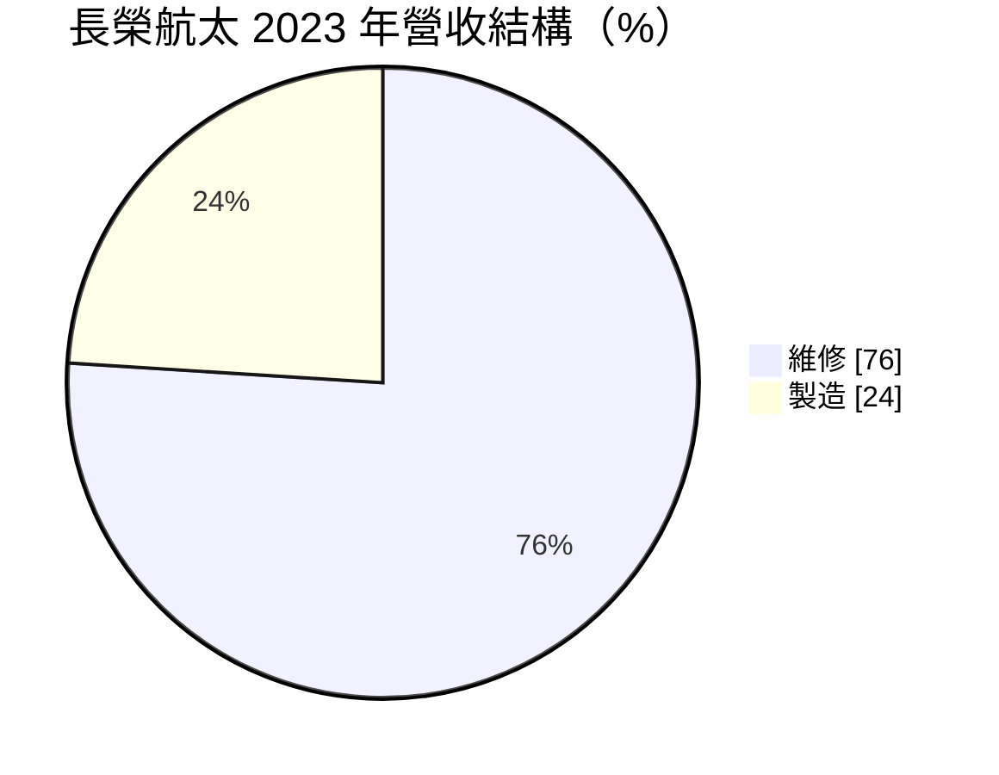
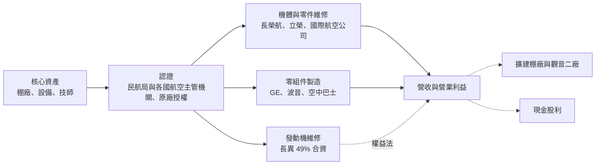
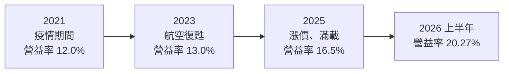
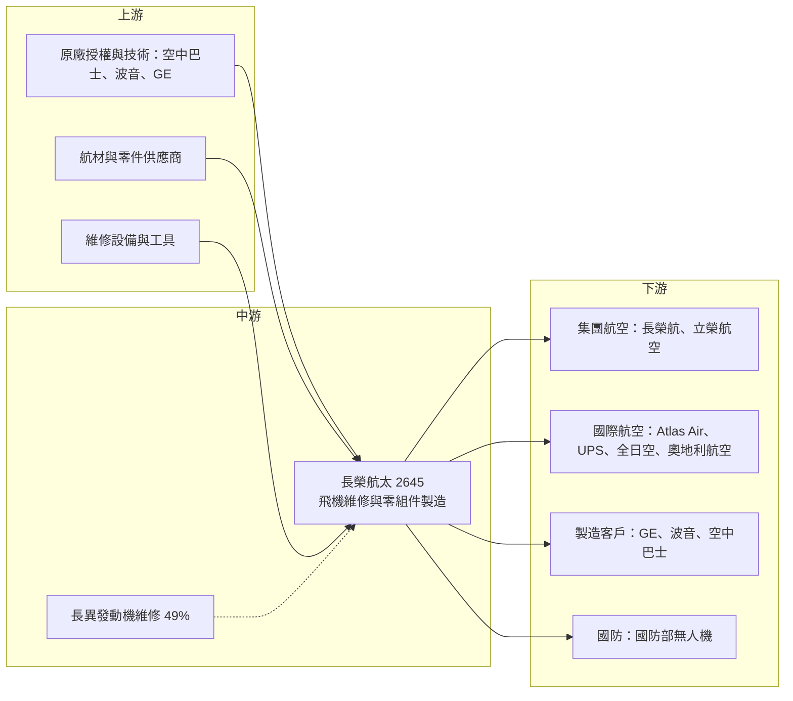

# 2645 長榮航太

> 上市｜[[產業索引-航運業|航運業]]｜上市（櫃）日期 2023/03/14

# 第一章：企業模式與商業藍圖

> [!info] 撰寫說明
> 本文由 Claude 依公開資料整理，架構比照 [[2330台積電]] 的四章研究，資料截至 2026-10-08。財務數字來源：Goodinfo 年度經營績效、證交所開放資料（基本資料、資產負債、綜合損益、營益分析、股利）、工商時報 2026 年 4 月報導、CMoney 投資筆記、Allen's Cashflow 整理；產業描述為整理性內容，尚未逐條比對原始文件。#待校對

飛機維修是航空產業中最穩定、也最容易被忽略的一環。航空公司的獲利隨景氣大起大落，但只要飛機還在飛，就必須定期維修。本章針對長榮航太科技（股票代號：2645，以下簡稱長榮航太）的商業模式進行定性分析，說明它如何以長榮集團的機隊為基礎，發展成台灣最大的飛機維修公司，並延伸到國際客戶與航太零組件製造。

## 一、核心定位：台灣最大的飛機維修與航太製造公司

長榮航太成立於 1997 年，隸屬長榮集團，以桃園機場旁的棚廠為基地，2023 年 3 月上市。依 CMoney 整理，長榮集團持股約六成。公司的核心業務是[[MRO]]，也就是飛機的維護、修理與大修，涵蓋機體、零組件與發動機維修，同時接單製造飛機與發動機零組件。

它的定位有三個關鍵：

* **集團機隊提供穩定基本盤：** 母公司 [[2618長榮航]] 與立榮航空的機隊需要定期維修，為長榮航太提供穩定、可預期的基本需求。這種「自家客戶」關係讓它在創業初期就有足夠的規模與經驗，不必從零開始爭取訂單。
* **國際第三方客戶擴大成長空間：** 依 CMoney 2023 年整理，外部客戶包括美國的 Atlas Air、UPS，日本的全日空與奧地利航空等。替其他航空公司維修飛機，代表長榮航太的技術與品質已獲國際認可，營收來源也不再完全依賴集團。
* **從維修延伸到製造：** 長榮航太替空中巴士、波音與 GE 航太製造零組件，2025 年 5 月與空中巴士簽約成為機體組件一階供應商（Allen's Cashflow 整理）。製造業務的門檻在於航太品質認證，一旦進入供應鏈，合作關係通常長達數十年。

公司在 2020 年進行業務改制（工商時報），此後的財務數字與改制前不完全可比。

## 二、終端應用與產品板塊

依 CMoney 2023 年 8 月整理，長榮航太的營收結構如下（較新的比重未查得）：

* **維修（MRO）：** 包含機體定期檢修（例如 C check、D check 等重度檢修）、零組件修理與發動機相關維修。維修需求與全球機隊規模、飛行時數高度相關，疫情後航空公司全面恢復飛行，加上新機交付延遲使老飛機延役，讓維修需求大增。公司 2025 年起將維修價格調漲約 3% 至 15%（Allen's Cashflow 整理），反映棚廠產能供不應求。
* **製造：** 主要為發動機零組件與機體組件，客戶包括 GE 航太、波音與空中巴士。製造業務的單價與毛利取決於零件複雜度，進入門檻在於長時間的認證與品質紀錄。
* **發動機維修合資：** 長榮航太持有長異發動機維修公司 49% 股權（Allen's Cashflow 整理），與 GE 合作經營發動機維修。工商時報報導，長異維修量能持續提升，法人估計 2026 年轉虧為盈。
* **國防與無人機：** 2024 年 11 月交付首批國防部艦載型監偵無人機，合約值約 4.2 億元。這塊業務目前占比很小，但代表公司嘗試把航太技術延伸到國防市場。

## 三、資本轉化邏輯：棚廠、技師與認證的累積

* **產能就是棚廠與人力：** 飛機維修需要能容納大型客機的棚廠、專用設備與持證技師。棚廠的數量直接決定能同時維修幾架飛機，因此是最核心的產能限制。公司員工約 2,200 人，並將人力從一班制提升到二班制以擴大產出（工商時報）。
* **認證是無形資產：** 每一種機型與每一類維修工作，都需要取得航空主管機關與原廠的認證。例如公司預計 2025 年取得 A350 的維修認證，2027 年起規劃大規模接單。認證需要時間累積，一旦取得就能持續接單，這是 MRO 業者的核心競爭力。
* **長約與穩定現金流：** 維修合約多為多年期，客戶更換維修廠的成本高，因為需要重新安排排程、轉移紀錄與驗證品質。這讓長榮航太的營收波動比航空公司小得多。

## 四、企業長期藍圖：擴產與國際化

* **觀音二廠：** 預計 2026 年第四季完工、2027 年投產，主要供應後續的製造訂單（工商時報）。這代表製造業務的比重有望提高，營收結構將更分散。
* **桃園新棚廠：** 機棚的進一步擴充需要等待 2027 年桃園機場第三航廈周邊工程完成，公司另投資約 4.84 億元興建新廠房（Allen's Cashflow 整理）。棚廠擴充是維修營收能否持續成長的關鍵。
* **新機型認證：** 隨著長榮航 2027 年起引進 A350-1000，以及全球 A350、787 機隊擴大，取得新機型的維修能力，是長榮航太未來十年維修需求的基礎。
* **擴大國際客戶：** 公司 2024 年新增 5 家歐洲客戶與 1 家美系客戶，2025 年目標再爭取 2 家歐洲與 1 家美系客戶（Allen's Cashflow 整理）。國際客戶比重提升，能降低對集團機隊的依賴，並分散單一航空公司景氣波動的風險。

# 第二章：護城河深度與競爭優勢

飛機維修市場看似是勞力密集的服務業，但實際上門檻很高，因為飛航安全容不下任何錯誤。本章分析長榮航太的競爭優勢來源、主要對手，以及這些優勢在全球 MRO 市場中能守住多少。

## 一、護城河的核心組成要素

* **安全認證與原廠授權：** 飛機維修必須取得民航主管機關、外國航空主管機關與飛機、發動機原廠的認證或授權。這些認證需要多年的品質紀錄與大量投資，新進者很難在短時間內取得，構成很高的進入門檻。
* **集團機隊的基本盤：** 長榮航的機隊為長榮航太提供穩定的維修需求與規模經濟，讓它可以分攤棚廠與設備的固定成本，並在新機型導入時率先累積經驗。
* **高轉換成本：** 航空公司一旦選定維修廠，更換需要重新驗證品質、轉移維修紀錄與調整排程，風險與成本都很高。因此客戶關係通常可以延續多年。
* **地理位置與成本：** 桃園位於亞太航空樞紐，接近東亞與東南亞的航空公司客戶；台灣技師的人力成本低於歐美維修廠，在價格上具備競爭力。

## 二、全球主要競爭對手格局

| 對手 | 地區 | 主要業務 | 與長榮航太的關係 |
|---|---|---|---|
| 新加坡科技工程（ST Engineering） | 新加坡 | 全球最大第三方 MRO 之一 | 亞太地區最主要的國際對手 |
| 港機工程（HAECO） | 香港 | 機體與零件維修 | 爭取亞太航空公司的維修訂單 |
| 漢莎技術（Lufthansa Technik） | 德國 | 全方位 MRO | 技術與規模領先，主要市場在歐洲 |
| [[2634漢翔]] | 台灣 | 軍機、民機零組件與發動機維修 | 國內航太製造與維修的主要同業 |
| 華航修護工廠 | 台灣 | 華航機隊維修 | 以自家機隊為主，部分承接外部客戶 |

## 三、優勢轉化：守得住與守不住

* **守得住：** 長榮集團機隊的維修需求，以及已取得認證、合作多年的國際客戶。全球維修產能供不應求，公司能調漲價格且訂單滿載，說明在現階段具備定價能力。
* **守不住：** 需要大量資本與技術的發動機大修市場。發動機原廠傾向自己掌握高價值的發動機維修，第三方業者只能透過合資或授權參與，長榮航太在這塊主要依靠與 GE 的合資公司。
* **觀察重點：** 第一，觀音二廠與新棚廠能否如期投產，這決定營收成長的天花板；第二，長異發動機維修能否穩定獲利；第三，外部客戶占營收的比重能否持續提升。若這三點都順利，長榮航太將從「集團維修部門」轉型為真正具國際競爭力的航太服務公司。

# 第三章：財務體質與盈利規模

資料日期：2026-10-08。數字取自 Goodinfo 年度經營績效、證交所開放資料與工商時報報導，表格是撰寫當時的快照；最新月營收、毛利率、累計 EPS 由自動排程寫在本筆記的屬性欄位（月營收、毛利率、累計EPS 等）。#待校對

財務報表是檢驗護城河是否真實存在的最終標準。本章用多年度的三率、ROE 與資本報酬，檢視長榮航太在業務改制後的獲利品質。

## 一、獲利能力的基石：三率

| 年度 | 營收（新台幣） | [[毛利率]] | [[營業利益率]] | EPS（元） | [[ROE]] |
|---|---|---|---|---|---|
| 2020 | 107 億 | 18.8% | 13.9% | 1.85 | 9.87% |
| 2021 | 96.2 億 | 16.5% | 12.0% | 2.50 | 8.95% |
| 2022 | 118 億 | 16.0% | 11.8% | 4.48 | 15.3% |
| 2023 | 148 億 | 17.9% | 13.0% | 4.95 | 15.4% |
| 2024 | 163 億 | 19.2% | 14.9% | 4.90 | 14.0% |
| 2025 | 182 億 | 20.3% | 16.5% | 5.46 | 15.3% |
| 2026 上半年 | 99.6 億 | 24.28% | 20.27% | 4.59 | 未查得 |

註：2020 至 2025 年取自 Goodinfo；2026 上半年取自證交所營益分析與綜合損益開放資料。2019 年在業務改制前，營收與股本基礎不同，不列入比較。2025 年 EPS 工商時報報導為 5.44 元，以年報為準。

* **[[毛利率]]：** 2021 年至 2025 年毛利率由 16.5% 穩定上升到 20.3%，2026 年上半年再升至 24.28%。這段期間全球維修產能吃緊、公司調漲維修價格，加上產品組合優化，是毛利率持續擴張的主因。
* **[[營業利益率]]：** 營業費用只占營收約 4%，營業利益率隨毛利率同步提升，2026 上半年達 20.27%，是改制以來最高。
* **營收趨勢：** 2020 年 107 億元成長到 2025 年 182 億元，5 年年複合成長率約 11.2%（推算）。即使在 2021 年航空業最低迷時，營收也只小幅下滑，顯示維修業務的抗景氣能力明顯優於航空公司。
* **2025 年：** 營收約 181.8 億元，稅後淨利約 20.4 億元，創歷史新高；當年認列匯兌損失約 2.33 億元（工商時報），本業表現實際上更好。

## 二、[[ROE]]：資本效率

2021 至 2025 年平均 ROE 約 13.8%（推算），2022 年以後穩定在 14% 至 15% 之間，波動遠小於航空公司。長榮航太的資本效率來自兩個因素：一是維修業務的資本需求主要是棚廠與設備，金額遠低於購買飛機；二是高配息政策讓權益基礎不會過度膨脹。2026 年第二季底每股淨值約 35.81 元，股價淨值比約 4.82 倍（證交所開放資料，2026 年 10 月初），反映市場給予穩定成長的溢價。

## 三、資本支出、自由現金流與股利

長榮航太的[[CapEx]]主要用於棚廠、廠房與設備，包括約 4.84 億元的新廠與觀音二廠，2026 至 2027 年將是擴產投資較集中的期間。年度資本支出與[[自由現金流]]的完整數字未查得，但從高配息能力推估，營業現金流足以支應擴產並維持配息（推估）。

公司章程規定每年提撥不低於當期稅後淨利 50% 為股東紅利。2025 年度配發現金股利 5.0 元（證交所股利資料），以 EPS 5.46 元計算[[配息率]]約 92%（推算）。高配息率代表公司把大部分盈餘還給股東，但在擴產期間若資本支出增加，未來配息率可能回到較保守的水準。

## 四、[[ROIC]] 與 [[WACC]]：價值創造利差

**ROIC 推算：** 2025 年營業利益約 30.0 億元（營收 182 億元乘以營業利益率 16.5%，推算），扣除 20% 稅率後約 24.0 億元。2026 年第二季底權益總計約 134.1 億元，總負債約 130.3 億元，假設其中約 40% 為有息負債與租賃負債（推估，約 52 億元），投入資本約 186 億元，ROIC 約 12.9%（推算）。

**WACC 推算：** 假設台灣 10 年期公債殖利率 1.75%、市場風險溢酬 6%、β 取航太維修業常見值 0.8（推估），股東權益成本約 6.55%。負債成本假設 2.5%，稅後約 2.0%；以帳面價值計，權益約占 72%、負債約占 28%，WACC 約 5.3%（推算）。

**結論：** 長榮航太的 ROIC 約 13%，是 WACC 的兩倍以上，而且這種利差在 2022 年以後相當穩定，代表公司長期在創造價值。這與航空公司的高度週期性形成鮮明對比：同樣服務航空業，維修業者承擔的景氣風險較小，資本報酬卻更穩定。未來利差能否維持，取決於擴產後的產能利用率，以及維修價格在全球產能增加後能否守住。

# 第四章：總體風險與地緣政治

任何企業都無法脫離宏觀環境獨立存在。長榮航太雖然比航空公司穩定，但仍受全球航空業景氣、供應鏈與人力市場影響。本章分析它必須長期面對的風險。

## 一、地緣政治風險

* **台海情勢：** 國際航空公司把飛機送到台灣維修，需要對當地的安全與穩定有信心。台海情勢升高可能影響國際客戶的委修意願。
* **美國關稅與供應鏈政策：** 航太製造訂單來自美國與歐洲客戶，美國對進口零組件的關稅政策或在地化要求，可能影響製造業務的接單條件。
* **國防業務的政策依賴：** 無人機等國防訂單取決於政府預算與政策，金額與時程較不穩定。

## 二、產業週期與市場結構風險

* **航空業景氣：** 全球航空業若再度遭遇疫情或經濟衰退，航空公司會延後維修、停飛飛機，維修需求將下降。2021 年營收小幅下滑就是例證。
* **集團依賴：** 長榮航仍是最大客戶之一，若集團機隊策略改變，或長榮航本身經營遇到困難，長榮航太會受到直接影響。
* **全球產能增加：** 目前全球維修產能吃緊，各大 MRO 業者都在擴產，數年後若產能過剩，維修價格可能回落，壓縮毛利率。

## 三、營運環境的隱性風險

* **技師人力短缺：** 合格的飛機維修技師需要長時間培訓與證照，人力不足會限制產能擴充，薪資上漲則壓縮利潤。
* **匯率：** 維修與製造合約多以美元計價，新台幣升值會直接減少以台幣計算的營收與毛利，2025 年認列約 2.33 億元匯兌損失就是例子。
* **擴產執行風險：** 觀音二廠與新棚廠若延後完工，營收成長會遞延；完工後若接單不足，折舊會壓縮毛利率。
* **飛安責任：** 維修品質直接關係飛航安全，任何維修疏失導致的事故，都可能帶來嚴重的法律責任與聲譽損失。

## 四、科技或法規演進

新世代飛機大量使用複合材料與數位化系統，維修技術與設備需要持續更新。飛機原廠也傾向透過資料與授權掌握更多售後維修市場，第三方 MRO 業者若無法取得原廠授權，可能被排除在新機型的高價值維修之外。另一方面，[[預測性維修]]等數位技術能提高維修效率，若長榮航太能及早導入，將成為新的競爭優勢。航空減碳趨勢也可能促使航空公司加速汰換老舊飛機，短期增加新機維修需求，長期則改變維修工作的內容。

# 專有名詞解析

## 金融

- **[[權益法]]**：持有被投資公司 20% 至 50% 股權時，依持股比例認列其損益的會計方法。
- **[[配息率]]**：現金股利占每股盈餘的比例，用來觀察公司把多少獲利分配給股東。
- **[[自由現金流]]**：營業活動現金流減去資本支出，代表企業可自由用於配息、還債或併購的現金。
- **[[CapEx]]**：資本支出，企業購置廠房、設備等長期資產的支出。
- **[[毛利率]]**：營業毛利占營收的比例，反映產品或服務扣除直接成本後的獲利空間。
- **[[營業利益率]]**：營業利益占營收的比例，反映本業扣除營業費用後的獲利能力。
- **[[ROE]]**：股東權益報酬率，稅後淨利除以股東權益，衡量公司用股東資金賺錢的效率。
- **[[ROIC]]**：投入資本報酬率，稅後營業利益除以股東權益與有息負債之和，衡量所有投入資本的報酬。
- **[[WACC]]**：加權平均資金成本，依權益與負債比重加權的資金成本，是 ROIC 需要超越的門檻。

## 產業

- **[[MRO]]**：維護、修理與大修，指飛機在服役期間的定期檢修、零件修理與發動機大修等售後服務。
- **[[C check]]**：飛機的重度定期檢修，通常每一到兩年進行一次，需進棚數週，檢查結構與系統。
- **[[一階供應商]]**：直接供貨給飛機或發動機原廠的供應商，需要通過原廠的品質與製程認證。
- **[[預測性維修]]**：利用感測器與數據分析預測零件何時可能故障，在故障前安排維修，以降低停飛時間與成本。
- **[[無人機]]**：無人駕駛的飛行器，可用於監偵、物流與國防，台灣近年推動國產無人機供應鏈。

# 核心供應鏈

## 1. 上游：原廠授權、航材與設備
- 飛機原廠：空中巴士、波音（機型維修手冊、授權與技術支援）
- 發動機原廠：GE 航太（合資夥伴與製造客戶）
- 航材、零件與維修設備供應商

## 2. 中游：長榮航太與合資公司
- 機體、零件維修與航太零組件製造：長榮航太
- 發動機維修：長異發動機維修公司（持股 49%）
- 國內同業：[[2634漢翔]]

## 3. 下游：維修客戶
- 集團內：[[2618長榮航]]、立榮航空
- 國際航空公司：Atlas Air、UPS、全日空、奧地利航空等

## 4. 下游：製造與國防客戶
- 航太製造：GE 航太、波音、空中巴士
- 國防：國防部艦載型監偵無人機

## 最新新聞
<!-- news:start -->
<!-- news:end -->

## 相關連結
- [公開資訊觀測站](https://mopsov.twse.com.tw/mops/web/t05st03?step=1&firstin=1&co_id=2645)
- [Goodinfo](https://goodinfo.tw/tw/StockDetail.asp?STOCK_ID=2645)
- [Yahoo 股市](https://tw.stock.yahoo.com/quote/2645)
- [鉅亨網新聞](https://www.cnyes.com/twstock/2645/news)
