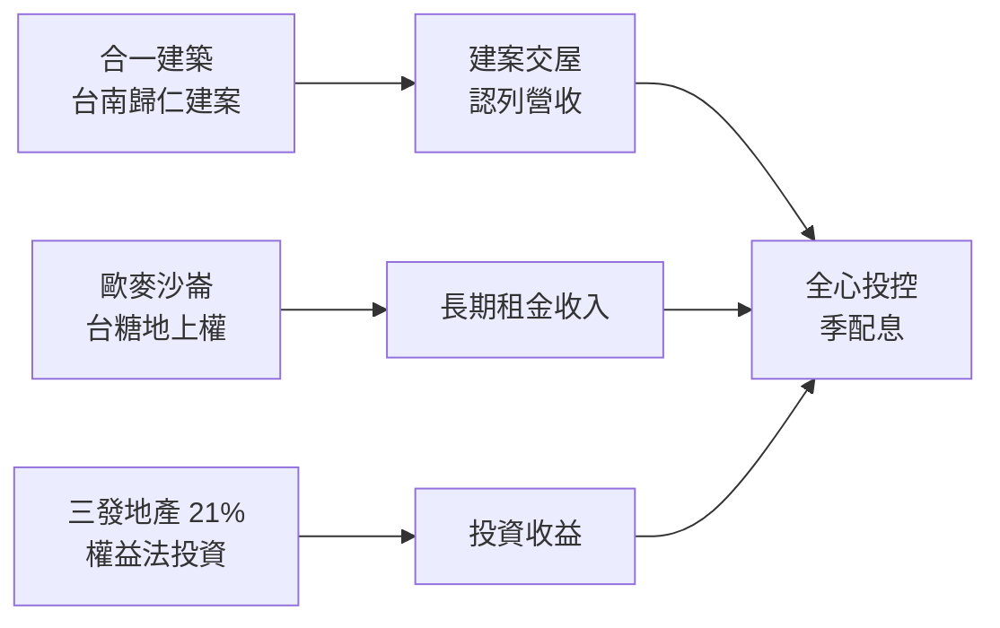
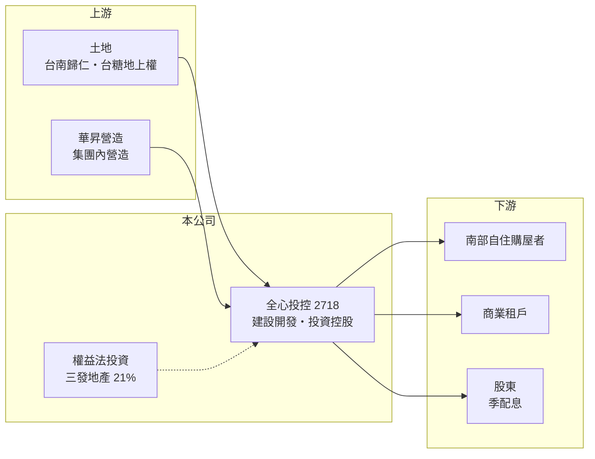

# 2718 全心投控

> 上櫃｜[[產業索引-建材營造業|建材營造業]]｜上市（櫃）日期 2011/03/29

# 第一章：企業模式與商業藍圖

> [!info] 撰寫說明
> 本文由 Claude 依公開資料整理，架構比照 [[2330台積電]] 的四章研究，資料截至 2026-10-08。財務數字來源：Goodinfo 年度經營績效頁、富果研究 2025 年 9 月法說會整理、Yahoo 股市更名公告標題；公開資料有限，產業描述為整理性內容，尚未逐條比對原始文件。#待校對

在評估單一個股的長期投資價值時，首要步驟是拆解企業的底層獲利邏輯。本章說明全心投資控股（股票代號：2718，以下簡稱全心投控）如何從飯店公司轉型為「建設加投資」的控股平台。

## 一、核心定位：從晶悅飯店到投資控股

全心投控原名晶悅國際飯店，2024 年 10 月更名為全心投資控股。依 Goodinfo 數據，2019 至 2022 年公司營收每年不到 1.2 億元，幾乎沒有本業規模；2023 年起子公司的建案開始交屋，營收跳升到 21.8 億元，公司也正式轉為以不動產開發為核心的控股公司。

目前的事業架構由三家 100% 持股子公司與一筆權益法投資組成：合一建築負責建案開發，主要案子是台南歸仁「晶悅合一」（總銷約 50 億元），另有約 3,152 坪的「武東 115/117」土地在規劃中；華昇營造承攬集團內部工程；歐麥沙崙負責台糖[[地上權]]案，規劃以收取固定租金的商業不動產為主。另外，公司在 2025 年 3 月完成公開收購，持有三發地產 21.02%，三發的高雄「首席大院」總銷約 97 億元。

## 二、資本轉化邏輯：建設穩基底，投資創價值

經營層把策略概括為「建設穩基底，投資創價值」雙軌：建設業務提供現金，再把資金投入具穩定獲利、重視現金股利的中大型上市櫃公司，也不排除併購。這種模式更接近控股公司，而不是傳統建商，長期價值取決於經營層的資本配置能力。

## 三、長期方向

在建案方面，「晶悅合一」交屋後的接續案是武東土地；地上權案若完成，可提供每年固定租金，降低對交屋時點的依賴。投資方面，三發地產的獲利會以權益法認列。公司 2025 年起採季配息，首次季配 1.5 元，顯示經營層重視對股東的現金回饋。

# 第二章：護城河深度與競爭優勢

「護城河」指企業抵禦競爭、維持超額利潤的保護機制。全心投控規模小、轉型時間短，本章說明它目前的相對優勢與限制。

## 一、相對優勢

全心投控的優勢在於低成本土地與輕負債結構。2023 至 2025 年毛利率高達 49% 至 81%，遠高於一般建商的 20% 至 30%，推估與台南歸仁土地取得成本低有關（推估）。2025 年上半年負債比約 26%、流動比率約 299%，財務彈性大，讓公司有能力進行公開收購與股權投資。

## 二、主要競爭對手

| 對手 | 定位 | 對全心投控的威脅 |
|---|---|---|
| [[2501國建]] | 全台住宅開發 | 在南部都會區推案競爭 |
| 台南、高雄區域型建商 | 深耕在地 | 爭取同一批南科與高雄自住需求 |
| 三發地產（被投資公司） | 高雄住宅 | 屬合作關係，同時也是投資標的 |

## 三、守得住／守不住／觀察重點

守得住的是目前的低負債與現金部位；守不住的是單一建案的依賴，「晶悅合一」交屋完畢後若沒有接續案，營收會明顯下滑，2025 年營收已從 2024 年的 42.5 億元降至 30.2 億元。長期觀察重點是武東土地與地上權案的推進、對三發地產等投資的報酬，以及經營層的投資紀律。

# 第三章：財務體質與盈利規模

資料日期：2026-10-08。數字取自 Goodinfo 年度經營績效與富果研究法說會整理，表格是撰寫當時的快照；最新月營收、毛利率、累計 EPS 由自動排程寫在本筆記的屬性欄位（月營收、毛利率、累計EPS 等）。#待校對

財務報表是檢驗護城河是否真實存在的最終標準。本章用五年的三率、ROE 與資本報酬檢視全心投控的獲利品質。

## 一、多年度經營績效

| 年度 | 營收（新台幣） | [[毛利率]] | [[營業利益率]] | EPS（元） | [[ROE]] |
|---|---|---|---|---|---|
| 2021 | 0.66 億 | 4.78% | -55.7% | -0.55 | -3.71% |
| 2022 | 0.93 億 | 4.31% | -55.5% | -0.57 | -3.41% |
| 2023 | 21.8 億 | 49.2% | 37.5% | 7.90 | 34.9% |
| 2024 | 42.5 億 | 81.1% | 76.6% | 35.33 | 81.7% |
| 2025 | 30.2 億 | 66.9% | 58.1% | 16.94 | 25.8% |

全心投控的數字呈現明顯的「轉型前後兩段」：2022 年以前營收極小且虧損，2023 年起進入建案交屋期，2024 年 EPS 35.33 元、ROE 81.7%。這樣的高報酬來自單一建案的集中認列與低土地成本，不能視為常態；2021 至 2025 年平均 ROE 約 27%（推算），但被 2024 年大幅拉高。Goodinfo 統計 2007 至 2025 年平均現金股利約 0.93 元，季配息制度則從 2025 年才開始，穩定度仍待觀察。

## 二、營建業指標

「晶悅合一」總銷約 50 億元，2025 年法說時已售約五成；三發地產「首席大院」總銷約 97 億元、已售約五成，以權益法認列。2025 年上半年總資產約 77.6 億元、負債比 26.24%，在建商中屬低槓桿。

## 三、[[ROIC]] 與 [[WACC]]：價值創造利差

**ROIC 推算：** 2025 年營業利益約 17.5 億元（30.2 億 × 58.1%），稅後約 14 億元。股東權益約 63 億元（每股淨值 71.86 元 × 約 0.876 億股），依 2025 年上半年負債比推算負債約 20 億元，假設其中一半為有息負債約 10 億元（推估），投入資本約 73 億元，ROIC 約 19%（推算）。

**WACC 推算：** 台灣 10 年期公債 1.75%、市場風險溢酬 6%、β 取營建同業常見值 0.9，股東權益成本約 7.2%；負債成本 3%、稅後 2.4%；權益占投入資本約 86%，WACC 約 6.5%（推算）。

**結論：** 2023 至 2025 年全心投控的 ROIC 明顯高於 WACC，但這主要來自單一低成本建案，不代表可持續的超額報酬。未來的價值創造取決於資金再投入的報酬率，是典型需要觀察經營層資本配置的公司。

# 第四章：總體風險與地緣政治

任何企業都無法脫離宏觀環境獨立存在。本章分析全心投控長期必須面對的風險。

## 一、營收斷層與案源

公司目前主要營收來自單一建案，交屋結束後若新案未接上，營收與獲利可能出現大幅斷層。武東土地仍在規劃階段，地上權案也需要長時間開發。

## 二、投資與資本配置風險

轉為投資控股後，公司獲利會越來越受被投資公司表現與股市波動影響。公開收購或併購若支付過高價格，或投資標的與本業綜效有限，都可能拉低長期報酬。

## 三、房市與區域風險

推案集中在台南與高雄，受南部科技聚落就業與房價走勢影響；央行[[信用管制]]與房市週期也會影響去化速度。

# 專有名詞解析

## 金融

- **[[權益法]]**：持股 20% 至 50% 的投資，依持股比例認列被投資公司損益的會計方法。
- **[[信用管制]]**：央行限制購屋與建商貸款成數的政策，會影響房市成交與建商資金。
- **[[ROIC]]**：投入資本報酬率，稅後營業利益除以股東權益加有息負債，衡量本業運用資本的效率。
- **[[WACC]]**：加權平均資金成本，股東與債權人要求報酬率的加權平均，是 ROIC 要超越的門檻。

## 產業

- **[[地上權]]**：在他人（如政府或台糖）土地上興建並使用建物的權利，期滿後土地與建物通常歸還地主。
- **[[建案交屋]]**：建商在房屋完工並交付買方時才認列營收，因此營建公司的營收常集中在交屋年度。

# 核心供應鏈

## 1. 上游：土地與營造
- 土地：台南歸仁、台糖地上權（歐麥沙崙）
- 營造：子公司華昇營造

## 2. 中游：全心投控與投資
- 權益法投資：三發地產（持股 21.02%）

## 3. 下游：客戶
- 台南、高雄自住購屋者；地上權商業租戶

## 最新新聞
<!-- news:start -->
<!-- news:end -->

## 相關連結
- [公開資訊觀測站](https://mopsov.twse.com.tw/mops/web/t05st03?step=1&firstin=1&co_id=2718)
- [Goodinfo](https://goodinfo.tw/tw/StockDetail.asp?STOCK_ID=2718)
- [Yahoo 股市](https://tw.stock.yahoo.com/quote/2718)
- [鉅亨網新聞](https://www.cnyes.com/twstock/2718/news)
