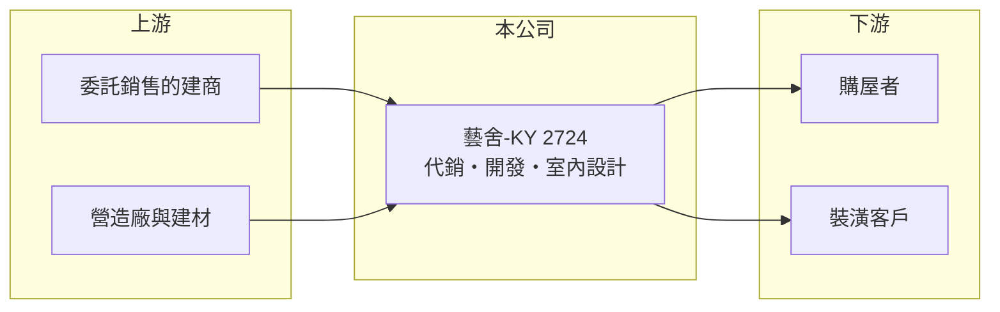

# 2724 藝舍-KY

> 上櫃｜[[產業索引-其他業|其他業]]｜上市（櫃）日期 2012/05/29

# 第一章：企業模式與商業藍圖

> [!info] 撰寫說明
> 精簡版，由 Claude 依公開資料整理，架構比照 [[2330台積電]]，資料截至 2026-10-07。來源：nStock 藝舍-KY 公司簡介、winvest 營收快訊。公開資料有限。#待校對

藝舍-KY 是海外註冊來台掛牌的不動產相關公司，業務涵蓋代銷、開發與室內設計，營收規模小但成長快。

- **核心業務：** 營業項目包括[[不動產代銷]]服務、委託營造廠興建住宅、商業大樓出租出售、投資，以及室內設計及裝潢。
- **營收結構：** 本次未查到代銷、開發與設計各自的營收比重。
- **營運據點：** 公司為 [[KY股]]，掛牌約 14 年，主要營運地區本次未查到。
- **長期方向：** 由代銷與設計服務延伸到自有建案，提升營收規模（推估）。

# 第二章：護城河深度與競爭優勢

藝舍的優勢在於代銷到室內設計的整合服務，但規模仍小。

- **競爭優勢：** 可同時提供銷售與裝潢設計，增加與建商合作的黏著度（推估）。
- **主要對手：** 其他不動產代銷與室內設計公司，本次未查到具體名單。
- **觀察重點：** 7 月營收 3,418.5 萬元，年增 174.56%，觀察高成長能否持續。

# 第三章：財務體質與盈利規模

資料日期：2026-10-07，以下數字是撰寫當時的快照；最新月營收、毛利率、累計 EPS 由自動排程寫在本筆記的屬性欄位（月營收、毛利率、累計EPS 等）。#待校對

藝舍 2026 年營收大幅成長，獲利轉正但本業利潤率偏低。

- **營收規模：** 2026 年 1 至 8 月累計營收 1.64 億元，年增 57.35%，已接近 2025 年全年的 1.69 億元。
- **獲利：** 2026 年第二季 EPS 0.33 元，[[毛利率]] 28.6%，但[[營業利益率]]僅 1.2%，淨利率 28.21%，推估有[[業外收益]]挹注。
- **財務特色：** 資本額 5.97 億元、市值約 8.05 億元，近五年沒有配息紀錄。

# 第四章：總體風險與地緣政治

藝舍的風險在於房市景氣與業務規模小。

- **產業週期：** 代銷與建案業務高度依賴房市景氣，成交量下滑時營收會明顯減少。
- **營運風險：** 本業利潤率低，獲利依賴業外項目，波動較大。
- **其他風險：** KY 公司的資訊揭露與海外營運透明度，以及匯率變動。

# 專有名詞解析

## 金融

- **[[KY股]]**：在海外註冊、來台灣上市櫃的公司，代號後加註 KY。
- **[[業外收益]]**：本業以外的收入，例如投資收益、處分利益或匯兌利益，通常較不穩定。

## 產業

- **[[不動產代銷]]**：受建商委託負責建案廣告與銷售，依成交金額收取服務費。

# 核心供應鏈

- 上游：委託代銷的建商、營造廠與建材供應商（推估）
- 下游／客戶：購屋者與室內裝潢客戶（推估）
- 同業：不動產代銷與室內設計公司（本次未查到具體名單）

## 最新新聞
<!-- news:start -->
<!-- news:end -->

## 相關連結
- [公開資訊觀測站](https://mopsov.twse.com.tw/mops/web/t05st03?step=1&firstin=1&co_id=2724)
- [Goodinfo](https://goodinfo.tw/tw/StockDetail.asp?STOCK_ID=2724)
- [Yahoo 股市](https://tw.stock.yahoo.com/quote/2724)
- [鉅亨網新聞](https://www.cnyes.com/twstock/2724/news)
