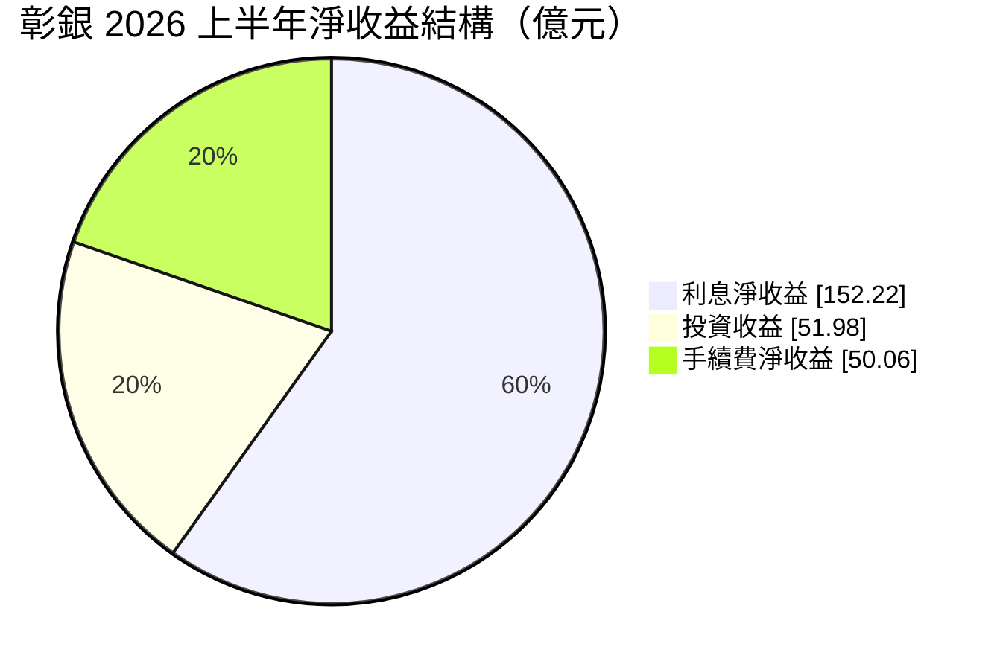
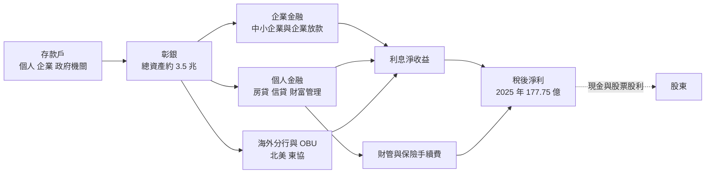
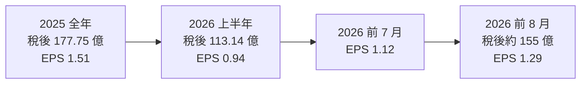
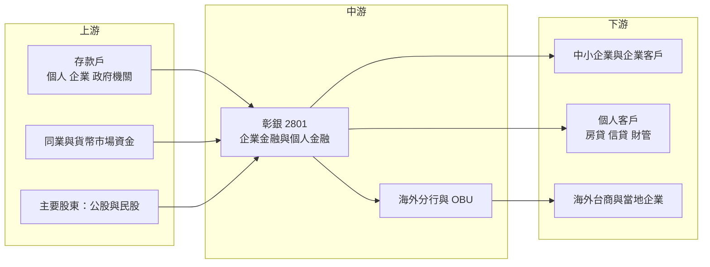

# 2801 彰銀

> 上市｜[[產業索引-金融保險業|金融保險業]]｜上市（櫃）日期 1962/02/15

# 第一章：企業模式與商業藍圖

> [!info] 撰寫說明
> 本文由 Claude 依公開資料整理，架構比照 [[2330台積電]] 的四章研究，資料截至 2026-10-07。財務數字來源：優分析（彰銀 2025 年度、2025 年前三季與 2026 年上半年法說會報導）、工商時報（2026 年 6 月股東會報導）、winvest 除權息資訊；產業描述為整理性內容，尚未逐條比對原始文件。#待校對

在評估單一個股的長期投資價值時，首要步驟是拆解企業的底層獲利邏輯。本章針對彰化商業銀行（股票代號：2801，以下簡稱彰銀）的商業模式進行定性分析，說明一家沒有金控架構的百年公股銀行，如何以企業金融與個人金融「雙翅膀」，搭配財富管理與海外業務提升獲利。

## 一、核心定位：獨立上市的公股商業銀行

彰銀創立於日治時期的 1905 年，是台灣歷史最悠久的商業銀行之一，總部位於台北，起源地在彰化。和多數大型銀行不同，彰銀沒有隸屬於金控，而是以銀行本身直接上市，主要股東包括財政部等公股機構與民股股東（股權結構以最新股東名簿為準，#待校對）。

彰銀的定位有兩個特色：

* **企業金融底子深：** 長期以中小企業與中型企業放款為主力，在台灣中南部的分行網路綿密，是傳統的企業往來銀行。
* **沒有金控的子公司綜效：** 不像 [[2880華南金]]、[[2892第一金]] 有證券、壽險或產險子公司，彰銀的獲利幾乎全來自銀行本業，結構單純，但收入來源也較集中。

## 二、業務板塊：淨收益結構

銀行不適用製造業的營收結構分析，以下以 2026 年上半年合併淨收益組成呈現獲利來源（其餘約 1.6% 為其他收益）：

* **利息淨收益：** 2026 年上半年 152.22 億元，年增 17.4%，占淨收益約 58.9%。主要來自企業放款、房貸與海外放款的[[利差]]。
* **手續費淨收益：** 2026 年上半年 50.06 億元，年增 35.5%，占約 19.4%。財富管理與保險商品銷售是成長主力，2025 年保險商品銷售成長近三成。
* **投資收益：** 2026 年上半年 51.98 億元，占約 20.1%，來自債券、股票等金融資產。這部分受金融市場影響，波動較大。

## 三、資本轉化邏輯：存款轉放款，雙翅膀帶動手續費

* **放款結構：** 依 2025 年前三季資料，合併放款總額約 2 兆 129 億元，年增 5.83%，其中企業金融放款年增 3.99%、個人金融放款年增 5.63%、海外放款年增 22.3%。
* **海外業務：** 2025 年海外與境外金融業務分行（[[OBU]]）獲利占比達 23.9%，海外放款年增超過兩成，是公司明確的成長引擎之一。
* **成本控制：** 2026 年上半年[[成本收入比]]降至 43.46%，比前一年同期下降 2.72 個百分點，代表每賺 100 元淨收益所需的營運費用減少。

## 四、企業長期藍圖：財管與海外雙引擎

* **四大經營方向：** 2025 年度法說會提出「優結構、擴利差、深協作、穩體質」，推動企業與個人金融雙軌發展。
* **五大策略：** 董事長胡光華在 2026 年股東會提出以客戶為中心、AI 驅動數位轉型、強化存放款核心業務、加速財富管理與海外布局，以及永續金融。財富管理與海外業務被定位為帶動成長的「雙引擎」。
* **海外市場：** 強化北美與東協布局，藉海外放款提高整體利差與獲利。

# 第二章：護城河深度與競爭優勢

在長期價值投資中，「護城河」指企業抵禦競爭、維持超額利潤的保護機制。本章分析彰銀的護城河構成、國內主要銀行對手，以及在利率環境與同業競爭下，這些優勢能守住多少。

## 一、彰銀護城河的核心組成要素

銀行業受高度監理，執照本身就是門檻，但台灣銀行家數多、產品同質性高。彰銀的護城河屬於「窄護城河」，由三個要素組成：

* **1. 低成本存款基礎：** 百年歷史與綿密分行網路，累積大量活期存款與政府機關、企業往來存款，資金成本相對低。
* **2. 中小企業客戶關係：** 中小企業的授信需要長期往來與在地了解，客戶轉換銀行的成本高，彰銀在中南部有深厚基礎。
* **3. 資產品質與資本實力：** 2026 年上半年[[逾放比]] 0.15%、[[備抵呆帳覆蓋率]] 901.58%，資產品質在同業中屬優良；[[資本適足率]] 13.99%，符合監理要求並有緩衝。

## 二、全球主要競爭對手格局

| 對手 | 定位 | 對彰銀的威脅 |
|---|---|---|
| [[2892第一金]]、[[2880華南金]]、[[5880合庫金]] | 公股金控，中小企業放款大戶 | 在中小企業放款與政府往來直接競爭，並有證券、保險子公司綜效 |
| [[2891中信金]]、[[2881富邦金]]、[[2882國泰金]] | 民營大型金控 | 財富管理與數位金融資源豐富，搶高資產客戶 |
| [[2887台新新光金]]、[[2884玉山金]] | 民營金控，財管與數位見長 | 在財富管理與信用卡市場競爭 |
| [[2834臺企銀]] | 公股中小企業專業銀行 | 在中小企業放款競爭 |

## 三、優勢轉化：哪些市場守得住、哪些守不住

* **守得住：** 中小企業放款、政府與企業往來存款，以及資產品質。這些業務仰賴長期關係，彰銀的基礎穩固。
* **守不住：** 財富管理與高資產客戶。民營金控在產品、數位平台與人才上投入較多，彰銀起步較晚，手續費收入比重仍低於部分金控。沒有金控子公司，也少了證券與保險的交叉銷售。
* **觀察重點：** 手續費收入能否維持兩位數成長、海外放款成長是否伴隨資產品質穩定、存放利差在利率環境變化下的走勢，以及 ROE 能否從 8% 左右往上提升。

# 第三章：財務體質與盈利規模

資料日期：2026-10-07。數字取自法說會報導與財經媒體，表格是撰寫當時的快照；最新月營收與累計 EPS 由自動排程寫在本筆記的屬性欄位（月營收、累計EPS 等）。#待校對

財務報表是檢驗護城河是否真實存在的最終標準。銀行業不適用毛利率與營業利益率，本章改用稅後淨利、ROE、資產品質與資本適足率及股利政策，檢視彰銀的獲利品質。

## 一、獲利能力的基石：稅後淨利與 EPS

| 項目 | 2025 前三季 | 2025 全年 | 2026 上半年 | 2026 前 7 月 | 2026 前 8 月 |
|---|---|---|---|---|---|
| 稅後淨利（新台幣） | 141.50 億 | 177.75 億 | 113.14 億 | 134.91 億 | 約 155 億 |
| 年增率 | 25.8% | 18.9% | 23.9% | 22.4% | 23.2% |
| EPS（元） | 1.20 | 1.51 | 0.94 | 1.12 | 1.29 |
| [[ROE]] | 6.84%（未年化） | 8.43% | 5.03%（未年化，推估） | 未查得 | 未查得 |

* **利息淨收益：** 2026 年上半年年增 17.4%，成長速度高於放款規模，推估來自海外放款與存放利差改善。
* **手續費：** 上半年年增 35.5%，台股熱絡帶動財富管理與保險商品銷售。
* **獲利動能：** 2026 年前 8 月獲利已接近 2025 年全年的 87%，全年獲利創新高的機率高（推估）。

## 二、[[ROE]] 與資本效率

2025 年 ROE 8.43%、[[ROA]] 0.54%。公股銀行的 ROE 普遍落在 7% 至 10% 之間，彰銀屬於中段。ROE 偏低的原因是淨值持續增加（2026 年上半年淨值 2,297 億元，年增 13.7%），加上配發股票股利使股本擴大。

## 三、資產品質與資本適足

* **[[逾放比]]：** 2026 年上半年 0.15%，維持在歷史低檔。
* **[[備抵呆帳覆蓋率]]：** 901.58%，代表提存的備抵呆帳約為逾期放款的 9 倍，緩衝充足。
* **[[資本適足率]]：** 2026 年上半年 13.99%、第一類資本比率 11.75%，比 2025 年第三季的 14.65% 略降，推估與放款成長、風險性資產增加有關。

## 四、股利政策

彰銀長期採「現金加股票」的股利組合，以股票股利保留資本支應放款成長。2025 年度配發現金股利 0.8 元與股票股利 0.25 元，2026 年 8 月 5 日除權息。股票股利會稀釋 EPS，但能補充資本、減少現金增資的需求。

# 第四章：總體風險與地緣政治

任何企業都無法脫離宏觀環境獨立存在。本章分析彰銀未來必須面對的地緣政治、利率週期與營運風險。

## 一、地緣政治風險

* **兩岸與海外曝險：** 銀行對中國大陸的授信與投資曝險受金管會限制，但台商客戶的營運仍受兩岸關係影響。海外放款快速成長，也帶來當地景氣與政策風險。
* **美國關稅：** 美國關稅政策影響台灣出口型中小企業的營運，可能延伸為授信品質風險。

## 二、利率與景氣週期

* **利率方向：** 銀行獲利與利差高度相關。若央行降息，放款利率調整通常比存款快，利差可能收窄；若升息，利差擴大但債券投資部位可能出現評價損失。
* **景氣循環：** 中小企業對景氣較敏感，經濟下行時逾放比可能上升，目前極低的逾放比不代表會一直維持。
* **金融市場：** 手續費與投資收益占淨收益近四成，台股與債市大幅修正時，這兩項收入會明顯下滑。

## 三、營運環境的隱性風險

* **經營權與治理：** 彰銀過去經歷公股與民股經營權之爭，董事會結構變化可能影響策略延續（具體股權以最新資料為準，#待校對）。
* **房地產集中度：** 房貸與不動產擔保放款比重高，房市修正會影響擔保品價值。
* **股本膨脹：** 持續配發股票股利使股本增加，EPS 成長會被稀釋。

## 四、法規與科技演進

* **資本規範：** 國際資本規範趨嚴，銀行需持續累積資本，限制股利發放空間。
* **數位金融：** 純網銀與民營金控的數位平台搶食年輕客群，彰銀需投入 AI 與數位轉型，短期增加費用。
* **永續金融：** 主管機關推動氣候風險揭露與[[永續金融]]，授信需納入碳排與氣候風險評估。

# 專有名詞解析

## 金融

- **[[利差]]**：銀行放款利率與存款利率的差距，是銀行最主要的獲利來源。
- **[[OBU]]**：國際金融業務分行，承作境外客戶的外幣業務，享有稅負與法規上的優惠。
- **[[成本收入比]]**：營運費用除以淨收益，數字越低代表經營效率越高。
- **[[逾放比]]**：逾期放款占總放款的比例，數字越低代表放款資產品質越好。
- **[[備抵呆帳覆蓋率]]**：備抵呆帳除以逾期放款，衡量銀行為可能的壞帳預先提列了多少緩衝。
- **[[資本適足率]]**：自有資本除以風險性資產，主管機關用來確保金融機構有足夠資本承擔損失。
- **[[ROE]]**：股東權益報酬率，稅後淨利除以股東權益，衡量公司運用股東資本賺錢的效率。
- **[[ROA]]**：資產報酬率，稅後淨利除以總資產，銀行因槓桿高，ROA 通常低於 1%。
- **[[永續金融]]**：在授信與投資決策中納入環境、社會與治理因素的金融業務。

# 核心供應鏈

## 1. 上游：資金來源
- 個人、企業與政府機關存款
- 同業拆借與貨幣市場

## 2. 中游：彰銀本身
- 國內分行網路、海外分行與 OBU

## 3. 下游：主要客群
- 中小企業與中大型企業放款
- 個人房貸、信貸與財富管理客戶

## 4. 同業比較
- 公股金控：[[2880華南金]]、[[2892第一金]]、[[5880合庫金]]、[[2886兆豐金]]
- 公股銀行：[[2834臺企銀]]
- 民營金控：[[2891中信金]]、[[2884玉山金]]

## 最新新聞
<!-- news:start（自動產生，請勿手動編輯此範圍） -->
- 2026-10-06 📰 媒體 17:39｜來抽iPhone 18 Pro！彰銀柴寶貼圖萌趣登場 綁定LINE好友試手氣｜[鉅亨網](https://news.cnyes.com/news/id/6622772)

完整紀錄：[[2801彰銀 新聞]]
<!-- news:end -->

## 相關連結
- [公開資訊觀測站](https://mopsov.twse.com.tw/mops/web/t05st03?step=1&firstin=1&co_id=2801)
- [Goodinfo](https://goodinfo.tw/tw/StockDetail.asp?STOCK_ID=2801)
- [Yahoo 股市](https://tw.stock.yahoo.com/quote/2801)
- [鉅亨網新聞](https://www.cnyes.com/twstock/2801/news)
