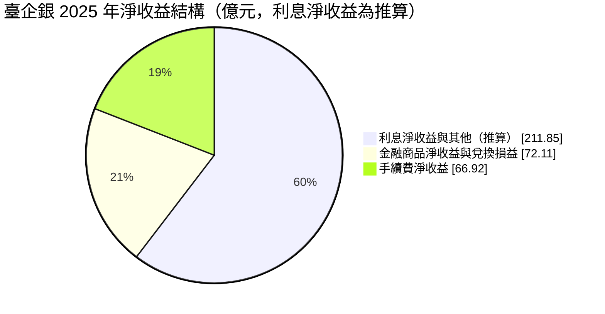
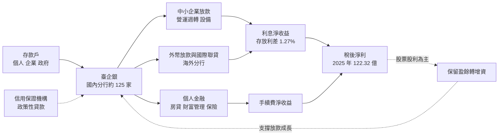
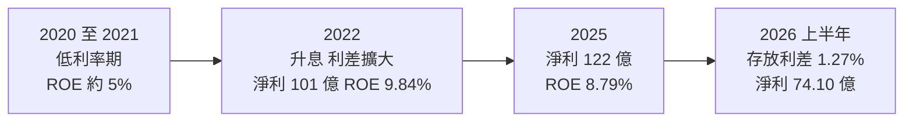
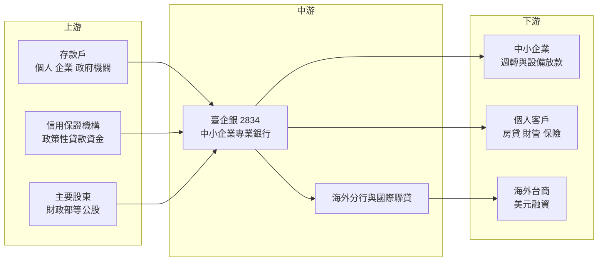

# 2834 臺企銀

> 上市｜[[產業索引-金融保險業|金融保險業]]｜上市（櫃）日期 1998/01/03

# 第一章：企業模式與商業藍圖

> [!info] 撰寫說明
> 本文由 Claude 依公開資料整理，架構比照 [[2330台積電]] 的四章研究，資料截至 2026-10-08。財務數字來源：Goodinfo 年度經營績效頁、優分析（臺企銀 2025 年度與 2026 年第二季法說會報導）、股感（臺企銀個股研究）、證交所開放資料（基本資料、股利、本益比）；產業描述為整理性內容，尚未逐條比對原始文件。#待校對

在評估單一個股的長期投資價值時，首要步驟是拆解企業的底層獲利邏輯。本章針對臺灣中小企業銀行（股票代號：2834，以下簡稱臺企銀）的商業模式進行定性分析，說明一家以「中小企業專業銀行」為法定與歷史定位的公股銀行，如何把存款轉成中小企業放款，又為什麼長年以股票股利保留資本。

## 一、核心定位：全台唯一以中小企業為名的專業銀行

臺企銀的前身可追溯到 1915 年成立的合會組織，歷經多次合併與改名，1976 年 7 月改制為「臺灣中小企業銀行」，1998 年 1 月掛牌上市（證交所登記的公司成立日期為 1950 年 9 月 23 日）。截至 2026 年 10 月，實收資本額約 1,039.8 億元，董事長為李嘉祥、總經理為李國忠，主要股東包括財政部與其他公股機構，屬於公股銀行體系。

臺企銀的商業定位很清楚：台灣近 98% 的企業屬於中小企業，這些企業規模小、財報不透明，大型銀行不一定願意花成本經營，臺企銀則把服務它們當作核心任務。依股感 2019 年的整理，當時中小企業放款約占臺企銀總放款的一半，約八成放款對象的資本額不到 1,000 萬元，住宅貸款只占總授信約 13%，明顯低於一般銀行的兩成左右。這種結構決定了臺企銀的兩個長期特色：

* **利息收入占比高、手續費占比低：** 同一份資料顯示，臺企銀利息收入約占營收 75%，高於本土銀行平均約 60%；手續費收入約占 15%，低於平均約 22%。這代表臺企銀的獲利主要來自「借錢給企業賺利差」，財富管理等收費業務起步較晚。
* **政策性角色：** 身為公股銀行，臺企銀經常配合政府的中小企業紓困、信用保證與產業政策貸款。這讓它在景氣低迷時能維持放款規模，但也意味著放款定價與風險取捨不完全以股東報酬為唯一考量。

## 二、業務板塊：淨收益結構

銀行不適用製造業的產品結構分析，以下用 2025 年全年合併淨收益 350.88 億元的組成呈現獲利來源。利息淨收益的精確金額未在報導中揭露，此處以淨收益扣除手續費與金融商品收益推算，屬推估值。

* **利息淨收益：** 推算約占淨收益六成，是臺企銀最主要的獲利來源。2025 年利息收入年增 7.79%，原因是存放款規模擴大、利差表現優於往年；2026 年上半年存放利差再拉寬 12 個基點至 1.27%，帶動利息淨收益年增 14.05%。
* **手續費淨收益：** 2025 年 66.92 億元，約占 19%。2026 年上半年手續費淨收益 23.77 億元，其中保險手續費約七成、基金手續費比重由 18.40% 升至 29.32%，顯示財富管理正在成為第二條腿。
* **金融商品與兌換損益：** 2025 年 72.11 億元，約占兩成，來自債券、股票與外匯操作，會隨金融市場波動。

## 三、資本轉化邏輯：存款轉放款，以股票股利滾資本

* **低成本存款是起點：** 股感整理顯示，臺企銀的活期存款比率約 45%，高於多數銀行的 30% 至 40%。活期存款利率低，讓臺企銀在承作中小企業放款時有成本優勢，這是利差得以維持的基礎。
* **股票股利是資本循環的關鍵：** 銀行每多放一筆款，就要依[[資本適足率]]規定多留一份資本。臺企銀章程明訂採「剩餘股利政策」，以股票股利保留資金為原則，現金股利不得低於股利總額的 10%。2025 年度配發現金 0.3 元、股票 0.7 元，就是這個邏輯的典型結果：把大部分盈餘留在銀行，換取持續放款的能力。
* **代價是股本膨脹：** 股票股利會讓股數逐年增加，稀釋每股盈餘。2025 年稅後淨利年增 8.85%，但 EPS 只從 1.23 元增加到 1.26 元，差距就來自股本擴大。管理層在 2026 年法說會表示，目標是讓獲利成長速度高於股本膨脹速度，並評估提高現金股利比重。

## 四、企業長期藍圖：從放款銀行走向「跨域並進」

* **財管 2.0 與高資產客戶：** 臺企銀在 2026 年 6 月 18 日獲准開辦高資產客戶金融商品與服務（俗稱財管 2.0），並規劃進駐高雄亞洲資產管理專區。中小企業主本身就是高資產客群的來源，若能把企業往來延伸到老闆的個人財富管理，手續費比重有機會長期提升。
* **外幣放款與國際聯貸：** 2026 年上半年外幣放款年增 21.90%，來自國際聯貸市場與台商海外布局的美元融資需求。這讓臺企銀的客戶從國內中小企業延伸到跟著供應鏈外移的台商。
* **永續與評等：** 臺企銀三度入選標普全球永續年鑑，2026 年版首次進入全球銀行業前 10%，中華信評也將其評等展望調升為正向。對以國內存款為主的銀行而言，評等改善有助於降低未來發債與同業拆借的成本。

# 第二章：護城河深度與競爭優勢

在長期價值投資中，「護城河」指企業抵禦競爭、維持超額利潤的保護機制。本章分析臺企銀的護城河構成、國內主要銀行對手，以及這些優勢在利率與景氣循環中能守住多少。

## 一、臺企銀護城河的核心組成要素

銀行業受高度監理，執照本身就是門檻，但台灣銀行家數多、產品同質性高，單一銀行很難建立寬護城河。臺企銀的護城河屬於「窄護城河」，由三個要素組成：

* **1. 中小企業的關係型授信：** 中小企業沒有完整財報，銀行要靠長期往來、現金流觀察與在地了解來判斷信用。臺企銀數十年累積的客戶資料與徵信經驗，是新進銀行短期內難以複製的資產；企業一旦和銀行建立額度、帳戶與薪轉關係，轉換成本也不低。
* **2. 低成本的活期存款：** 活期存款比率高，代表資金成本低。在升息或降息循環中，低成本存款都能讓利差比同業穩定一些，這是銀行少數真正可以累積的成本優勢。
* **3. 公股背景與政策性業務：** 政府的中小企業信用保證、紓困與產業貸款，臺企銀往往是重要承辦銀行。公股背景也讓存戶與企業對其穩健度有信心，在金融市場動盪時較不容易流失存款。

此外，臺企銀的資產品質目前處於歷史低檔：2026 年第二季[[逾放比]] 0.18%、[[備抵呆帳覆蓋率]] 714.31%、[[信用成本]] 0.10%。不過這是景氣良好時的數字，中小企業授信的真正考驗在景氣下行期。

## 二、全球主要競爭對手格局

| 對手 | 定位 | 對臺企銀的威脅 |
|---|---|---|
| [[2892第一金]]、[[2880華南金]]、[[5880合庫金]]、[[2801彰銀]] | 公股大型銀行，中小企業放款量體大 | 在中小企業放款與政策性貸款直接競爭，且有證券、保險子公司可交叉銷售 |
| [[2891中信金]]、[[2882國泰金]]、[[2881富邦金]] | 民營大型金控 | 財富管理、數位平台與人才資源豐富，搶中小企業主的個人資產 |
| [[2884玉山金]]、[[5876上海商銀]] | 民營銀行，中小企業與貿易融資經驗深 | 以服務品質與數位工具爭取優質中小企業客戶 |
| 純網銀與金融科技業者 | 線上信貸、支付與小額企業貸款 | 以數據與低成本通路切入小微企業的融資需求 |

## 三、優勢轉化：哪些市場守得住、哪些守不住

* **守得住：** 傳統中小企業的營運週轉與設備放款，以及政策性貸款。這些業務靠長期關係與在地網路，臺企銀的分行與徵信能力形成實質優勢，大型民營金控未必願意花同樣的成本經營。
* **守不住：** 高資產客戶的財富管理與年輕世代的數位金融。這兩個市場需要產品廣度、投資研究與數位平台，民營金控投入多年，臺企銀起步較晚，手續費占比長期低於同業平均。優質中小企業一旦長大，也常被大型銀行以較低利率挖角。
* **觀察重點：** 財管 2.0 開辦後手續費比重能否穩定提升、外幣放款高成長是否伴隨資產品質穩定、股本膨脹速度能否低於獲利成長，以及現金股利比重是否真的提高。這四點決定臺企銀能否從「穩健但每股成長慢」的公股銀行，轉成每股價值穩定累積的銀行。

# 第三章：財務體質與盈利規模

資料日期：2026-10-08。數字取自 Goodinfo 年度經營績效頁、優分析法說會報導與證交所開放資料，表格是撰寫當時的快照；最新月營收、累計 EPS 由自動排程寫在本筆記的屬性欄位（月營收、累計EPS 等）。#待校對

財務報表是檢驗護城河是否真實存在的最終標準。銀行業不適用毛利率與營業利益率，本章改用淨收益、稅後淨利、[[ROE]]、[[ROA]]、利差、資產品質與資本適足率，檢視臺企銀的獲利品質。

## 一、獲利能力的基石：淨收益、淨利與利差

| 年度 | 淨收益（新台幣） | 稅後淨利 | EPS（元） | [[ROE]] | [[ROA]] |
|---|---|---|---|---|---|
| 2020 | 219 億 | 47 億 | 0.63 | 4.84% | 0.27% |
| 2021 | 241 億 | 51 億 | 0.66 | 5.09% | 0.27% |
| 2022 | 285 億 | 101 億 | 1.26 | 9.84% | 0.49% |
| 2023 | 319 億 | 106 億 | 1.29 | 9.43% | 0.49% |
| 2024 | 341 億 | 112 億 | 1.23 | 8.93% | 0.49% |
| 2025 | 351 億 | 122 億 | 1.26 | 8.79% | 0.50% |
| 2026 上半年 | 未查得 | 74.10 億 | 0.71 | 未查得 | 未查得 |

註：年度數字取自 Goodinfo 合併報表；2025 年稅後淨利依法說會為 122.32 億元，證交所股利資料的本期淨利為 122.32 億元。

* **淨收益成長：** 2020 至 2025 年淨收益從 219 億元增至 351 億元，年複合成長率約 9.9%（推算）。成長主要來自存放款規模擴大與 2022 年起的升息循環，利差改善直接放大利息收入。
* **稅後淨利成長：** 同期稅後淨利從 47 億元增至 122 億元，年複合成長率約 21%（推算），但大部分躍升發生在 2022 年，之後轉為每年個位數至一成左右的穩定成長。這說明臺企銀獲利對利率環境的敏感度很高。
* **利差與 [[NIM]]：** 2026 年上半年存放利差 1.27%，較前一年同期拉寬 12 個基點。報導未揭露 NIM 精確數字（未查得），但利差走勢是判斷臺企銀獲利方向最重要的單一指標。
* **手續費比重：** 2025 年手續費淨收益約占淨收益 19%，低於大型民營金控，但基金與保險手續費正在成長。

## 二、[[ROE]] 與 [[ROA]]：資本效率

2021 至 2025 年平均 ROE 約 8.4%（推算），ROA 則長期停在 0.5% 左右。ROA 低是銀行業的常態，因為銀行用大量存款槓桿操作；ROE 從 2022 年接近 10% 緩步降到 2025 年的 8.79%，原因是淨值隨股票股利與保留盈餘持續擴大，獲利成長沒有完全跟上。

臺企銀的長期特色是「淨利成長快、EPS 成長慢」：2022 年 EPS 1.26 元，2025 年仍是 1.26 元，四年間淨利增加約兩成，卻全被股本擴大吸收。對長期投資人而言，這代表持有臺企銀的報酬主要來自股票股利累積的股數，而不是每股盈餘成長。

## 三、資產品質與資本適足

* **[[逾放比]]：** 2025 年底 0.16%、2026 年第二季 0.18%，處於歷史低檔。
* **[[備抵呆帳覆蓋率]]：** 2025 年底 830.51%、2026 年第二季 714.31%，提存的備抵呆帳約為逾期放款的 7 至 8 倍，緩衝充足。
* **[[資本適足率]]：** 2026 年第二季 BIS 比率 13.52%、第一類資本比率 11.07%。這個水準符合法規，但在公股銀行中不算寬裕，這也是臺企銀必須以[[股票股利]]保留資本、並在申請財管 2.0 前先讓資本比率達標的原因。公司表示目前沒有現金增資需求。
* **股利：** 2025 年度配發現金 0.3 元與股票 0.7 元，合計 1 元，[[配息率]]（含股票）約 79%（推算，1 ÷ 1.26）。Goodinfo 統計歷年平均現金股利約 0.15 元、股票股利約 0.47 元，股票股利為主的模式相當穩定。

## 四、ROE 與權益資金成本：價值創造利差

**為什麼金融業不用 ROIC：** 一般產業的 [[ROIC]] 把「股東權益加有息負債」當成投入資本，並以 [[WACC]] 比較。但對銀行而言，存款與借款本身就是原料，不是單純的融資來源；利息支出屬於營業成本，把負債算進投入資本會讓 ROIC 失去意義。因此分析銀行時，業界通常直接比較 ROE 與股東要求的報酬（權益資金成本）。

**權益資金成本推算：** 以 [[CAPM]] 估算，假設台灣 10 年期公債殖利率 1.75%、市場風險溢酬 6%、β 取台灣公股銀行常見值 0.7（同業常見值，非來源數字），權益資金成本約為 1.75% ＋ 0.7 × 6% ＝ 5.95%（推算）。若 β 落在 0.6 至 0.8，權益成本約在 5.4% 至 6.6% 之間。

**比較：** 臺企銀 2025 年 ROE 8.79%，高於推算的權益成本約 2.8 個百分點；2022 至 2025 年 ROE 都在 8.8% 至 9.8% 之間，利差穩定為正。但 2020 至 2021 年低利率期 ROE 只有 5% 左右，略低於權益成本。結論是：臺企銀在正常利率環境下能為股東創造小幅超額報酬，但這個利差很依賴利率水準；若台灣重回超低利率，價值創造能力會明顯減弱（推估）。證交所資料顯示其股價淨值比約 1.09 倍，大致反映市場認為其 ROE 只略高於資金成本。

# 第四章：總體風險與地緣政治

任何企業都無法脫離宏觀環境獨立存在。本章分析臺企銀未來必須面對的地緣政治、利率週期與營運風險。

## 一、地緣政治風險

* **台商與兩岸曝險：** 臺企銀的中小企業客戶有不少是出口導向或在中國、東南亞設廠的台商。兩岸關係緊張或中國景氣下滑，會透過客戶營運間接影響授信品質。銀行對中國大陸的直接曝險受金管會限制，但間接曝險不易完全量化。
* **美國關稅與供應鏈移轉：** 美國關稅政策影響台灣出口型中小企業的訂單與毛利，部分企業因此加速海外布局。這同時是風險與機會：舊客戶可能營運受壓，但外幣放款與國際聯貸需求也因此增加，2026 年上半年外幣放款年增 21.90% 就是一例。

## 二、利率與景氣週期

* **利率方向：** 臺企銀利息收入占比高，獲利對利差非常敏感。2020 至 2021 年低利率期 ROE 只有約 5%，2022 年升息後一舉跳到近 10%，說明利率是臺企銀最大的外部變數。若央行降息，放款利率通常調整得比存款快，利差可能收窄。
* **中小企業的景氣敏感度：** 中小企業資本薄、議價力弱，景氣下行時最先出現周轉困難。目前 0.18% 的逾放比反映的是好景氣，下一次景氣衰退時信用成本可能明顯上升，股東應把現在的低提存視為循環高點而非常態（推估）。
* **金融市場：** 金融商品與兌換損益約占淨收益兩成，債市與股市大幅波動時，這部分收益會跟著起伏。

## 三、營運環境的隱性風險

* **政策性任務與股東報酬的取捨：** 公股銀行常被要求配合紓困、優惠貸款等政策，這些業務的風險調整後報酬未必理想。政策目標與股東報酬之間的拉扯，是公股銀行長期 ROE 難以大幅提升的原因之一。
* **股本持續膨脹：** 以股票股利為主的政策讓股本逐年擴大，若獲利成長放緩，EPS 就會停滯甚至下降。這是投資人評估臺企銀時最需要注意的結構性問題。
* **集中度風險：** 放款集中在中小企業與特定產業，單一大型授信案出問題時衝擊較大。股感整理提到 2017 年因慶富案認列約 17 億元呆帳，約等於三個月的獲利，是集中度風險的實例。

## 四、法規與科技演進

* **資本規範趨嚴：** 國際資本規範（巴塞爾協定）持續提高銀行的資本要求，對資本適足率本來就不寬裕的臺企銀而言，這會持續限制現金股利的空間。
* **數位金融與純網銀：** 小微企業貸款正在被大數據授信與線上平台改變。若純網銀或金融科技業者能用交易數據更便宜地評估小企業信用，臺企銀的關係型授信優勢會被侵蝕，因此數位轉型是長期必修課。
* **永續金融：** 主管機關推動氣候風險揭露，中小企業普遍缺乏碳盤查能力，臺企銀需要協助客戶轉型，同時在授信中納入氣候風險，這會增加作業成本，但也可能形成新的綠色放款商機。

# 專有名詞解析

## 金融

- **[[利差]]**：銀行放款利率與存款利率的差距，是銀行最主要的獲利來源；利差擴大或收窄會直接反映在利息淨收益。
- **[[NIM]]**：淨利息收益率，利息淨收益除以生息資產，衡量銀行整體資產賺取利息的效率。
- **[[逾放比]]**：逾期放款占總放款的比例，數字越低代表放款資產品質越好。
- **[[備抵呆帳覆蓋率]]**：備抵呆帳除以逾期放款，衡量銀行為可能的壞帳預先提列了多少緩衝。
- **[[資本適足率]]**：自有資本除以風險性資產，主管機關用來確保金融機構有足夠資本承擔損失；放款越多需要的資本越多。
- **[[信用成本]]**：當期提存的呆帳費用占放款的比例，反映放款實際帶來的信用損失。
- **[[股票股利]]**：公司以發放新股代替現金分配盈餘，可把資金留在公司內部，但會使股本擴大、稀釋每股盈餘。
- **[[配息率]]**：股利占每股盈餘的比例，反映公司把多少獲利分給股東。
- **[[ROE]]**：股東權益報酬率，稅後淨利除以股東權益，衡量公司運用股東資本賺錢的效率。
- **[[ROA]]**：資產報酬率，稅後淨利除以總資產，銀行因槓桿高，ROA 通常低於 1%。
- **[[CAPM]]**：資本資產定價模型，以無風險利率加上 β 乘以市場風險溢酬，推估股東要求的報酬率。
- **[[ROIC]]**：投入資本報酬率，稅後營業利益除以股東權益加有息負債，衡量本業運用資本的效率；不適用於銀行。
- **[[WACC]]**：加權平均資金成本，依股權與負債比重加權的資金成本，是判斷 ROIC 是否創造價值的門檻。

# 核心供應鏈

## 1. 上游：資金來源
- 個人、企業與政府機關存款，活期存款比重高是資金成本低的關鍵
- 中小企業信用保證機制與政府政策性貸款
- 主要股東：財政部等公股機構

## 2. 中游：臺企銀本身
- 國內分行網路、國際金融業務分行與海外分行
- 財富管理：2026 年獲准開辦高資產客戶業務，規劃進駐高雄亞洲資產管理專區

## 3. 下游：主要客群
- 國內中小企業與小微企業
- 中小企業主與一般個人的房貸、財富管理與保險
- 海外布局的台商與國際聯貸

## 4. 同業比較
- 公股金控與銀行：[[2892第一金]]、[[2880華南金]]、[[5880合庫金]]、[[2801彰銀]]、[[2886兆豐金]]
- 民營銀行與金控：[[5876上海商銀]]、[[2884玉山金]]、[[2891中信金]]

## 最新新聞
<!-- news:start（自動產生，請勿手動編輯此範圍） -->
- 2026-10-07 🏛️ 重訊 14:37｜公告本公司115年9月份自結合併盈餘｜[觀測站](https://mops.twse.com.tw/mops/#/web/t05st01)

完整紀錄：[[2834臺企銀 新聞]]
<!-- news:end -->

## 相關連結
- [公開資訊觀測站](https://mopsov.twse.com.tw/mops/web/t05st03?step=1&firstin=1&co_id=2834)
- [Goodinfo](https://goodinfo.tw/tw/StockDetail.asp?STOCK_ID=2834)
- [Yahoo 股市](https://tw.stock.yahoo.com/quote/2834)
- [鉅亨網新聞](https://www.cnyes.com/twstock/2834/news)
