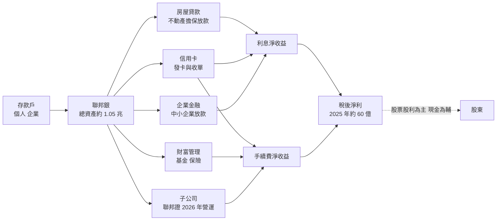
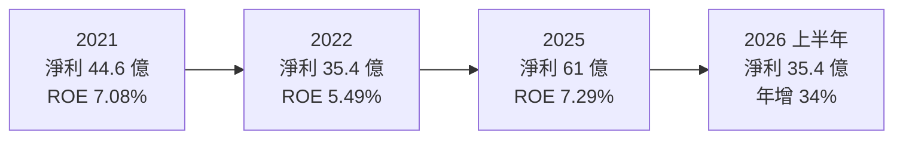
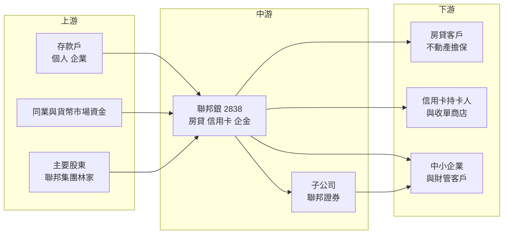

# 2838 聯邦銀

> 上市｜[[產業索引-金融保險業|金融保險業]]｜上市（櫃）日期 1998/06/29

# 第一章：企業模式與商業藍圖

> [!info] 撰寫說明
> 本文由 Claude 依公開資料整理，架構比照 [[2330台積電]] 的四章研究，資料截至 2026-10-08。財務數字來源：Goodinfo 年度經營績效頁、優分析與經濟日報（聯邦銀 2025 年第四季法說會報導）、ETtoday 財經（2026 年第二季法說會報導）、今周刊 2005 年報導（中興銀行標售）、證交所開放資料（基本資料、股利、本益比）；產業描述為整理性內容，尚未逐條比對原始文件。#待校對

在評估單一個股的長期投資價值時，首要步驟是拆解企業的底層獲利邏輯。本章針對聯邦商業銀行（股票代號：2838，以下簡稱聯邦銀）的商業模式進行定性分析，說明一家由建商家族創辦的民營銀行，如何以房貸與信用卡為兩大支柱，並在總資產突破兆元後嘗試往證券與財富管理延伸。

## 一、核心定位：建商家族背景的民營中型銀行

聯邦銀成立於 1991 年 12 月，是台灣 1990 年代開放新銀行設立時的第一批民營銀行之一，1998 年 6 月上市。聯邦銀屬於林榮三家族的聯邦集團，集團以房地產起家，2005 年今周刊報導指出，林家兄弟分家後由林鴻聯負責銀行事業，證交所資料顯示林鴻聯至 2026 年仍擔任董事長，總經理為許維文，實收資本額約 480.8 億元。

聯邦銀的定位有兩個長期特色：

* **房地產專業延伸到房貸：** 集團長年經營建設與土地開發，對不動產價值與區位有深厚判斷力。今周刊 2005 年報導就指出，房貸是聯邦銀最賺錢的業務、房貸逾放比很低，銀行設有監督中心審查企金與房貸案件，使用率低的房子不放款。這種審慎文化延續至今。
* **信用卡與消費金融：** 聯邦銀是國內重要的信用卡發卡與收單銀行之一，2025 年信用卡營收 61.48 億元、有效卡數 185 萬張、有效卡率 67.70%。信用卡帶來循環利息、年費、商店手續費等收入，是房貸之外的第二個獲利支柱。

**併購奠定規模：** 2004 年 12 月，聯邦銀以 71.08 億元標下中興銀行 47 個據點，擊敗中信金、台新金等競爭者，合併後據點增至 87 個。林榮三當時表示買的是據點、與中興銀行的不良債權無關。這次併購讓聯邦銀從新銀行躍升為有一定通路規模的中型銀行，也是理解今天聯邦銀網路分布的關鍵。

## 二、業務板塊：利息淨收益為主，信用卡與財管為輔

報導未揭露聯邦銀淨收益各項目的精確金額，因此不畫比重圓餅圖。以下用質性方式說明主要收入來源：

* **利息淨收益：** 最大的收入來源，來自存放款利差、信用卡循環利息與 RS/RP（附買回、附賣回）交易。2025 年利息淨收益年增 16.84%，2026 年上半年再年增 18.06%，是近年獲利成長的主要動力。
* **手續費淨收益：** 以財富管理（基金、保險）與信用卡相關手續費為主。2025 年年增 5.61%，2026 年上半年受台股熱絡帶動年增 37.44%。
* **信用卡營收：** 2025 年 61.48 億元、年增 11.10%；2026 年上半年 31.78 億元、年增 7.29%，收單簽帳金額 2025 年年增 11.7%。信用卡收入橫跨利息與手續費兩個科目。
* **規模：** 2025 年總資產 1.03 兆元，連續五年成長；總存款平均餘額約 8,324 億元、總放款平均餘額約 6,390 億元，存放比約 77%（推算）。

## 三、資本轉化邏輯：存款轉房貸與消費金融

* **擔保品導向的授信文化：** 房貸以不動產為擔保，違約時損失有限，這讓聯邦銀能以相對低的信用成本放大放款規模。代價是業務與房市高度連動，受央行選擇性信用管制影響明顯。
* **消費金融拉高收益率：** 信用卡循環利息與信用貸款的利率遠高於房貸，可以拉高整體放款收益率；但這類放款景氣變差時壞帳率上升最快，需要嚴格的風控。
* **股票股利保留資本：** 聯邦銀章程規定，若分配後資本比率低於法定加 1 個百分點，得優先採股票股利；2025 年度配發現金 0.46 元與股票 0.6 元，延續「股票為主、現金為輔」的政策。

## 四、企業長期藍圖：從銀行走向小型金融集團

* **設立證券子公司：** 聯邦銀 100% 持有的聯邦證券在 2026 年第二季正式營運，讓集團從單純銀行延伸到證券經紀，可以把銀行的存款與財管客戶導向證券交易，增加手續費來源。這是聯邦銀近年最重要的結構性變化。
* **亞資分行與高資產客戶：** 因應政府「亞洲資產管理中心」政策，聯邦銀設立亞資分行，鎖定高資產客戶的財富管理、放款與跨境金融服務。
* **兆元規模後的效率提升：** 總資產突破兆元後，聯邦銀的重點從規模擴張轉向提升利差、手續費比重與資本效率，能否讓 ROE 從 7% 上下再往上推，是長期觀察重點。

# 第二章：護城河深度與競爭優勢

在長期價值投資中，「護城河」指企業抵禦競爭、維持超額利潤的保護機制。本章分析聯邦銀的護城河構成、國內主要對手，以及在房市循環與消費金融競爭中，這些優勢能守住多少。

## 一、聯邦銀護城河的核心組成要素

台灣銀行業產品同質性高、家數多，中型民營銀行很難有寬護城河。聯邦銀屬於「窄護城河」，由三個要素組成：

* **1. 不動產鑑價與房貸風控能力：** 源自聯邦集團的建設背景，聯邦銀對不動產區位、價值與流動性的判斷是長期累積的專業。這讓房貸資產品質長年穩定，2025 年底全行[[逾放比]] 0.29%、2026 年第二季降至 0.25%。
* **2. 信用卡的規模與商店網路：** 185 萬張有效卡與收單商店網路需要多年經營，新進者難以快速複製。信用卡帶來的消費數據也能用於信貸與財管的交叉銷售。
* **3. 家族經營的穩定性與審慎文化：** 家族長期經營讓策略一致、不易出現經營權爭奪，集團「以現金買地、不舉債」的保守風格反映在銀行的授信紀律上。缺點是決策較保守，成長速度不一定快。

## 二、全球主要競爭對手格局

| 對手 | 定位 | 對聯邦銀的威脅 |
|---|---|---|
| [[2891中信金]]、[[2882國泰金]]、[[2881富邦金]] | 民營大型金控，信用卡與房貸市占高 | 規模、品牌與數位資源遠大於聯邦銀，在信用卡與財管全面競爭 |
| [[2887台新新光金]]、[[2884玉山金]] | 民營金控，消費金融與數位見長 | 信用卡回饋與數位帳戶搶年輕客群 |
| [[2845遠東銀]]、[[2897王道銀行]] | 中型民營銀行 | 在房貸、存款利率與財管客戶上直接競爭 |
| 公股銀行（[[5880合庫金]]、[[2892第一金]]） | 房貸量體大、資金成本低 | 以低利率房貸爭取優質客戶 |

## 三、優勢轉化：哪些市場守得住、哪些守不住

* **守得住：** 以不動產為擔保的房貸與中小企業授信，以及既有的信用卡客群。這些業務依賴風控經驗與長期客戶關係，聯邦銀的專業與資產品質是實際優勢。
* **守不住：** 首購族低利房貸與信用卡高額回饋戰。公股銀行資金成本更低，大型金控行銷預算更多，聯邦銀若硬拚價格會犧牲利差。財富管理方面，聯邦證券剛起步，短期內難以和大型金控的證券與投信資源相比。
* **觀察重點：** 聯邦證營運後能否帶動手續費比重、信用卡營收能否維持成長、房市信用管制對房貸成長的影響，以及資本適足率在放款與子公司擴張下能否維持在 14% 以上。

# 第三章：財務體質與盈利規模

資料日期：2026-10-08。數字取自 Goodinfo 年度經營績效頁、法說會報導與證交所開放資料，表格是撰寫當時的快照；最新月營收、累計 EPS 由自動排程寫在本筆記的屬性欄位（月營收、累計EPS 等）。#待校對

財務報表是檢驗護城河是否真實存在的最終標準。銀行業不適用毛利率與營業利益率，本章改用淨收益、稅後淨利、[[ROE]]、[[ROA]]、資產品質與資本適足率，檢視聯邦銀的獲利品質。

## 一、獲利能力的基石：淨收益、淨利與利差

| 年度 | 淨收益（新台幣） | 稅後淨利 | EPS（元） | [[ROE]] | [[ROA]] |
|---|---|---|---|---|---|
| 2020 | 144 億 | 34.4 億 | 0.96 | 5.91% | 0.47% |
| 2021 | 167 億 | 44.6 億 | 1.21 | 7.08% | 0.56% |
| 2022 | 160 億 | 35.4 億 | 0.85 | 5.49% | 0.42% |
| 2023 | 179 億 | 43.2 億 | 1.02 | 6.46% | 0.48% |
| 2024 | 198 億 | 52.2 億 | 1.16 | 6.96% | 0.54% |
| 2025 | 207 億 | 61 億 | 1.29 | 7.29% | 0.59% |
| 2026 上半年 | 未查得 | 35.4 億 | 0.65 | 未查得 | 未查得 |

註：年度數字取自 Goodinfo 合併報表。2025 年法說會自結數字為稅後淨利 60.24 億元、EPS 1.27 元，證交所股利資料的本期淨利為 61.02 億元，EPS 差異可能來自特別股股息或追溯調整，以年報為準。

* **淨收益成長：** 2020 至 2025 年淨收益從 144 億元增至 207 億元，年複合成長率約 7.5%（推算），成長穩定，2022 年小幅下滑後連續三年成長。
* **淨利成長：** 同期稅後淨利從 34.4 億元增至 61 億元，年複合成長率約 12%（推算）。2022 年獲利下滑，推估與升息初期資金成本上升、金融資產評價波動有關（推估）。
* **利息淨收益：** 2025 年年增 16.84%、2026 年上半年年增 18.06%，存放利差改善與信用卡循環利息是主要來源。報導未揭露 [[NIM]] 精確數字（未查得）。
* **手續費：** 2026 年上半年手續費淨收益年增 37.44%，反映台股熱絡下財管業務的順週期特性。

## 二、[[ROE]] 與 [[ROA]]：資本效率

2021 至 2025 年平均 ROE 約 6.7%（推算），2025 年 ROA 0.59%，在台灣銀行業屬中段水準。ROE 不高的原因有二：一是房貸利差薄，雖然風險低但報酬也低；二是持續配發[[股票股利]]使淨值與股本擴大，攤薄了每股報酬。2020 至 2025 年 EPS 從 0.96 元升至 1.29 元，成長速度明顯慢於淨利的 12% 年複合成長，差距就是股本膨脹的代價。

## 三、資產品質與資本適足

* **[[逾放比]]：** 2025 年底 0.29%、2026 年第二季 0.25%，逾放金額 16.59 億元。
* **[[備抵呆帳覆蓋率]]：** 2025 年底 410.41%、2026 年第二季 510.97%，緩衝足夠，但低於部分公股銀行動輒七、八倍的水準，反映消費金融放款的壞帳率天生較高。
* **[[資本適足率]]：** 2025 年底 15.35%、第一類資本比率 13.97%、普通股權益比率 11.66%；2026 年第二季分別為 14.83%、13.3%、11.11%，下降推估與放款成長及成立證券子公司有關（推估）。
* **股利：** 2025 年度配發現金 0.46 元、股票 0.6 元，合計 1.06 元，[[配息率]]（含股票）約 82%（推算，1.06 ÷ 1.29）。Goodinfo 未列出各年度股利明細，長期股利穩定度未查得。

## 四、ROE 與權益資金成本：價值創造利差

**為什麼金融業不用 ROIC：** [[ROIC]] 把有息負債視為投入資本、以 [[WACC]] 作為門檻，但銀行的存款與借款是營業原料，利息支出是營業成本，無法和「資本」分開計算。因此分析銀行時，直接比較 ROE 與股東要求的報酬率較有意義。

**權益資金成本推算：** 以 [[CAPM]] 估算，假設台灣 10 年期公債殖利率 1.75%、市場風險溢酬 6%、β 取台灣中型民營銀行常見值 0.7（同業常見值，非來源數字），權益資金成本約為 1.75% ＋ 0.7 × 6% ＝ 5.95%（推算）；β 若為 0.8，約 6.55%。

**比較：** 聯邦銀 2025 年 ROE 7.29%，比推算的權益成本高約 1.3 個百分點；2021 至 2025 年平均約 6.7%，僅略高於權益成本，2022 年的 5.49% 則低於權益成本。結論是聯邦銀長期大致在「小幅創造價值」與「打平」之間，2025 至 2026 年獲利成長正在擴大這個利差。證交所資料顯示股價淨值比約 1.05 倍，與 ROE 略高於權益成本的判斷一致。未來若證券子公司與財管能拉高 ROE，價值創造才會明顯（推估）。

# 第四章：總體風險與地緣政治

任何企業都無法脫離宏觀環境獨立存在。本章分析聯邦銀未來必須面對的地緣政治、房市與利率週期，以及營運風險。

## 一、地緣政治風險

* **間接曝險為主：** 聯邦銀以國內房貸與消費金融為主，對中國大陸的直接曝險有限，地緣政治風險主要透過台灣整體經濟、房市信心與金融市場波動間接傳導。
* **極端情境下的擔保品風險：** 若兩岸關係嚴重惡化，台灣房地產價格與流動性可能大幅下滑，以不動產為主要擔保的房貸銀行會面臨擔保品價值縮水的壓力。這是房貸型銀行特有的尾端風險。

## 二、房市、利率與景氣週期

* **房市信用管制：** 管理層在 2025 年法說會指出，2025 年在信用管制下房市交易量約減少 25%。央行的選擇性信用管制直接限制房貸成長，房市冷卻也會影響建商授信與擔保品價值。
* **政策性房貸變化：** 新青年安心成家貸款等政策性房貸的退場或調整，會改變首購族需求，管理層也把相關政策走向列為觀察重點。
* **利率方向：** 房貸多採機動利率，升息時放款利率跟著調升，但存款成本也上升；信用卡循環利率則相對固定。利率快速變動時，利差可能短期受壓。
* **消費金融的景氣敏感度：** 信用卡與信貸在失業率上升時壞帳增加最快，景氣下行時聯邦銀的信用成本可能比以企金為主的銀行更早反映。

## 三、營運環境的隱性風險

* **家族治理：** 家族經營帶來穩定，但也可能出現關係人交易與董事會獨立性的疑慮。投資人宜關注與集團建設事業相關的授信與交易揭露。
* **子公司擴張的執行風險：** 聯邦證券剛開始營運，證券經紀市場高度競爭、手續費折讓普遍，新券商要累積規模需要時間，初期可能拖累整體 ROE。
* **股本膨脹：** 以股票股利為主的政策若持續，每股盈餘成長會被稀釋。

## 四、法規與科技演進

* **資本規範：** 國際資本規範趨嚴與房貸風險權數調整，會提高房貸型銀行的資本需求。
* **支付與信用卡的數位化：** 行動支付、電子支付與純網銀改變消費者的支付習慣，信用卡的商店手續費與回饋競爭越來越激烈，信用卡業務必須靠數據分析與數位服務維持競爭力。
* **AI 與詐騙防制：** 數位通路擴大的同時，詐騙防制與資安法規要求持續提高，相關合規成本會逐年增加。

# 專有名詞解析

## 金融

- **[[利差]]**：銀行放款利率與存款利率的差距，是銀行最主要的獲利來源；利差擴大或收窄會直接反映在利息淨收益。
- **[[NIM]]**：淨利息收益率，利息淨收益除以生息資產，衡量銀行整體資產賺取利息的效率。
- **[[逾放比]]**：逾期放款占總放款的比例，數字越低代表放款資產品質越好。
- **[[備抵呆帳覆蓋率]]**：備抵呆帳除以逾期放款，衡量銀行為可能的壞帳預先提列了多少緩衝。
- **[[資本適足率]]**：自有資本除以風險性資產，主管機關用來確保金融機構有足夠資本承擔損失；放款越多需要的資本越多。
- **[[股票股利]]**：公司以發放新股代替現金分配盈餘，可把資金留在公司內部，但會使股本擴大、稀釋每股盈餘。
- **[[配息率]]**：股利占每股盈餘的比例，反映公司把多少獲利分給股東。
- **[[循環利息]]**：信用卡持卡人未全額繳清帳款時，對未繳餘額收取的利息，利率遠高於一般放款。
- **[[收單]]**：銀行替商店處理信用卡刷卡交易並向商店收取手續費的業務。
- **[[信用管制]]**：央行針對房貸成數、利率與寬限期的選擇性限制，用來抑制房地產過熱。
- **[[ROE]]**：股東權益報酬率，稅後淨利除以股東權益，衡量公司運用股東資本賺錢的效率。
- **[[ROA]]**：資產報酬率，稅後淨利除以總資產，銀行因槓桿高，ROA 通常低於 1%。
- **[[CAPM]]**：資本資產定價模型，以無風險利率加上 β 乘以市場風險溢酬，推估股東要求的報酬率。
- **[[ROIC]]**：投入資本報酬率，稅後營業利益除以股東權益加有息負債，衡量本業運用資本的效率；不適用於銀行。
- **[[WACC]]**：加權平均資金成本，依股權與負債比重加權的資金成本，是判斷 ROIC 是否創造價值的門檻。

# 核心供應鏈

## 1. 上游：資金來源
- 個人與企業存款，總存款平均餘額約 8,489 億元（2026 年上半年）
- 同業拆借與貨幣市場
- 主要股東：聯邦集團林家

## 2. 中游：聯邦銀本身
- 國內分行網路（2004 年承接中興銀行 47 個據點）、亞資分行
- 子公司：聯邦證券（100% 持股，2026 年第二季營運）

## 3. 下游：主要客群
- 房貸與不動產擔保放款客戶
- 信用卡持卡人與收單商店
- 中小企業與財富管理客戶

## 4. 同業比較
- 中型民營銀行：[[2845遠東銀]]、[[2897王道銀行]]
- 民營金控：[[2891中信金]]、[[2884玉山金]]、[[2887台新新光金]]
- 公股銀行：[[5880合庫金]]、[[2892第一金]]

## 最新新聞
<!-- news:start（自動產生，請勿手動編輯此範圍） -->
- 2026-10-06 🏛️ 重訊 17:47｜公布本行115年9月自結盈餘相關資訊。｜[觀測站](https://mops.twse.com.tw/mops/#/web/t05st01)

完整紀錄：[[2838聯邦銀 新聞]]
<!-- news:end -->

## 相關連結
- [公開資訊觀測站](https://mopsov.twse.com.tw/mops/web/t05st03?step=1&firstin=1&co_id=2838)
- [Goodinfo](https://goodinfo.tw/tw/StockDetail.asp?STOCK_ID=2838)
- [Yahoo 股市](https://tw.stock.yahoo.com/quote/2838)
- [鉅亨網新聞](https://www.cnyes.com/twstock/2838/news)
