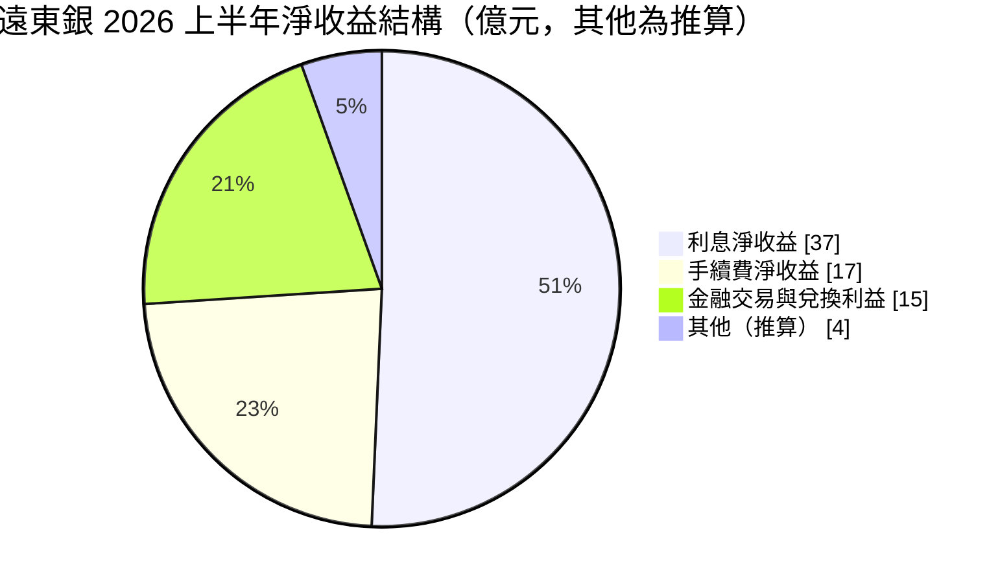
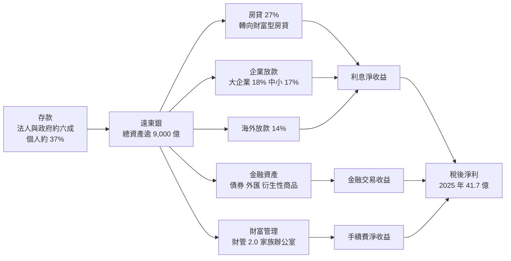
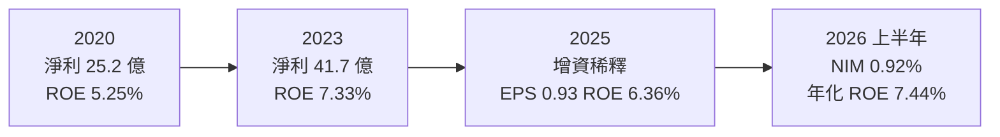
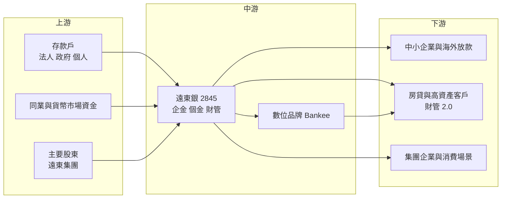

# 2845 遠東銀

> 上市｜[[產業索引-金融保險業|金融保險業]]｜上市（櫃）日期 1998/11/27

# 第一章：企業模式與商業藍圖

> [!info] 撰寫說明
> 本文由 Claude 依公開資料整理，架構比照 [[2330台積電]] 的四章研究，資料截至 2026-10-08。財務數字來源：Goodinfo 年度經營績效頁、經濟日報（遠東銀 2026 年第一季與第二季法說會報導）、優分析（2025 年第三季法說會報導）、聯合報（Bankee 報導）、證交所開放資料（基本資料、股利、本益比）；產業描述為整理性內容，尚未逐條比對原始文件。#待校對

在評估單一個股的長期投資價值時，首要步驟是拆解企業的底層獲利邏輯。本章針對遠東國際商業銀行（股票代號：2845，以下簡稱遠東銀或遠銀）的商業模式進行定性分析，說明一家隸屬遠東集團、沒有金控架構的中型銀行，如何在利差偏薄的台灣市場，以財富管理、海外放款與數位銀行尋找成長。

## 一、核心定位：遠東集團旗下的中型民營銀行

遠東銀成立於 1992 年 1 月，是 1990 年代開放新銀行設立時的民營銀行之一，1998 年 11 月上市，屬於徐家經營的遠東集團。證交所資料顯示，2026 年董事長為周添財、總經理為林建忠，實收資本額約 486.5 億元；2026 年 6 月底總資產突破 9,000 億元、淨值接近 720 億元。

遠東銀的定位可以從三個角度理解：

* **集團綜效：** 遠東集團橫跨石化、紡織、水泥、電信、百貨與零售（如 [[1402遠東新]]、[[4904遠傳]]、[[2903遠百]]、[[1102亞泥]]），集團企業、員工與消費場景是遠東銀的客戶與資金來源之一，也讓銀行有機會把支付、信用卡與點數生態結合。
* **利差偏薄、仰賴非利息收入：** 遠東銀的[[NIM]]在 2026 年上半年才升至 0.92%，存放利差 1.30%，低於以中小企業放款為主的銀行。因此手續費、金融交易收益占淨收益的比重相對高，獲利結構比傳統銀行多元，但也較受金融市場影響。
* **沒有金控的單一銀行：** 遠東銀以銀行身分直接上市，獲利幾乎全來自銀行本業與少數子公司。管理層在 2025 年第三季法說會表示，成立金控「已在備案中」，內部整合一定會做，這是長期可能改變公司結構的選項。

## 二、業務板塊：2026 年上半年淨收益結構

* **利息淨收益：** 37 億元、年增 14.7%，約占淨收益五成。放款總額 5,240 億元，其中房貸約占 27%、重點大企業 18%、中小企業 17%、海外放款 14%。
* **手續費淨收益：** 17 億元、年增 20.3%，約占兩成三，其中財富管理手續費年增 46%，保險代理與企金放款手續費也有貢獻。
* **金融交易與兌換利益：** 15 億元、年增 17.1%，約占兩成，來自債券、外匯與衍生性商品操作。這一塊在 2024 年曾因「吸美元、換台幣」的外匯交換操作而特別高，2025 年回歸本業後縮小，說明它的波動性。

## 三、資本轉化邏輯：存款結構優化、資產往高收益移動

* **存款結構是長期課題：** 2025 年第三季法人與政府戶存款合計約 57%、個人戶 35%，2026 年上半年個人存款占比提升到 37%。法人存款金額大但利率敏感、容易流動，個人存款較穩定。遠東銀刻意拉高個人存款比重，目的就是降低資金成本、改善利差。
* **資產端往高收益移動：** 2026 年遠東銀把[[流動性覆蓋比率]]（LCR）目標由 130% 調降至 120% 區間，把資金從央行轉存款等低收益資產，移往收益較高的放款與金融資產。房貸則從一般購屋貸款轉向利差較好的財富型房貸，並優先發展中小企業與海外放款，而不是和大型銀行硬拚大企業聯貸。
* **增資補資本：** 遠東銀在 2025 年 9 月完成增資，管理層表示普通股權益比率與資本適足率已高於同業平均。增資短期稀釋 EPS，但提供了擴大放款與承擔較多風險的空間。

## 四、企業長期藍圖：財富管理、數位與金控選項

* **財管 2.0 與家族辦公室：** 遠東銀的高資產客戶業務（財管 2.0）於 2026 年 7 月 20 日開辦，重點是跨世代傳承、海外資產配置與稅務信託；並與高雄市政府簽署意願書，規劃進駐高雄亞洲資產管理專區。管理層估計若有 250 戶、每戶資產逾 1 億元的客戶，可形成 250 億元以上的管理資產。
* **Bankee 社群銀行：** 遠東銀旗下的數位品牌 Bankee 以「社群圈」機制讓用戶經營自己的線上分行，推出挑戰型信貸、信用卡分期等產品，2025 年獲 Global Finance 等國際數位銀行獎項。遠東銀自 2019 年起提供虛擬資產出入金服務，2026 年與幣託合作推出美金信託購幣服務，並規劃企業穩定幣收付服務。
* **AI 應用：** 全行有 122 項 AI 提案進入實驗或上線階段，管理層估計全數落地可節省約 75 位全職人力的工時。數位化與 AI 是中型銀行在人力成本上追趕大型金控的主要手段。

# 第二章：護城河深度與競爭優勢

在長期價值投資中，「護城河」指企業抵禦競爭、維持超額利潤的保護機制。本章分析遠東銀的護城河構成、國內主要對手，以及在利差偏薄的環境下，這些優勢能守住多少。

## 一、遠東銀護城河的核心組成要素

遠東銀的護城河較淺，屬於「窄護城河」甚至接近無護城河，競爭力主要來自以下三點：

* **1. 遠東集團的客戶生態：** 集團旗下的百貨、電信、零售與製造事業提供企業往來、員工薪轉與消費場景。集團客戶的存款與支付流量是遠東銀相對穩定的業務基礎，也是 Bankee 社群與信用卡業務可以結合的場景。
* **2. 數位與創新產品的先行經驗：** Bankee 社群銀行、虛擬資產出入金與穩定幣服務，讓遠東銀在數位金融創新上比多數中型銀行早一步。這類能力不一定立刻轉成獲利，但能吸引年輕客群與新業務。
* **3. 資產品質紀律：** 遠東銀管理層多次表示其不良放款比率長期低於市場水準。房貸占比不高、企業放款偏向中小企業與海外，並且不追求大企業聯貸的規模，這種風險取捨有助於維持穩定的信用成本（具體逾放比未查得）。

## 二、全球主要競爭對手格局

| 對手 | 定位 | 對遠東銀的威脅 |
|---|---|---|
| [[2891中信金]]、[[2881富邦金]]、[[2882國泰金]] | 民營大型金控 | 財富管理、信用卡、數位平台全面領先，搶高資產與年輕客群 |
| [[2884玉山金]]、[[2887台新新光金]] | 民營金控，財管與數位見長 | 在財管 2.0、數位帳戶與信用卡回饋上直接競爭 |
| [[2838聯邦銀]]、[[2897王道銀行]]、[[5876上海商銀]] | 中型民營銀行 | 在房貸、中小企業放款與存款利率上競爭 |
| 純網銀（LINE Bank、將來銀行、樂天銀行） | 純數位通路 | 以高利活存與簡易信貸搶年輕客群，與 Bankee 直接競爭 |

## 三、優勢轉化：哪些市場守得住、哪些守不住

* **守得住：** 集團相關的企業金融與支付場景、海外與中小企業放款的利基市場，以及利用集團資源經營的高資產客戶。這些市場大型金控未必專注，遠東銀可以用彈性與專業取勝。
* **守不住：** 大企業聯貸與一般房貸。管理層自己也承認，大企業放款因和大型本土銀行競爭，利潤有限，房貸利差也因央行管制而收窄。在規模型業務上，遠東銀缺乏低成本資金與通路優勢。
* **觀察重點：** NIM 能否從 0.92% 持續往 1% 以上爬升、財管 2.0 的客戶數與管理資產、個人存款比重是否持續提高，以及成立金控的計畫是否落地。這些決定遠東銀能否把 ROE 從 6% 至 7% 推向 8% 以上。

# 第三章：財務體質與盈利規模

資料日期：2026-10-08。數字取自 Goodinfo 年度經營績效頁、法說會報導與證交所開放資料，表格是撰寫當時的快照；最新月營收、累計 EPS 由自動排程寫在本筆記的屬性欄位（月營收、累計EPS 等）。#待校對

財務報表是檢驗護城河是否真實存在的最終標準。銀行業不適用毛利率與營業利益率，本章改用淨收益、稅後淨利、[[ROE]]、[[ROA]]、利差與資本，檢視遠東銀的獲利品質。

## 一、獲利能力的基石：淨收益、淨利與利差

| 年度 | 淨收益（新台幣） | 稅後淨利 | EPS（元） | [[ROE]] | [[ROA]] |
|---|---|---|---|---|---|
| 2020 | 112 億 | 25.2 億 | 0.73 | 5.25% | 0.38% |
| 2021 | 108 億 | 29.4 億 | 0.84 | 5.97% | 0.42% |
| 2022 | 117 億 | 36.8 億 | 1.00 | 7.03% | 0.50% |
| 2023 | 128 億 | 41.7 億 | 1.03 | 7.33% | 0.54% |
| 2024 | 129 億 | 43 億 | 1.01 | 7.15% | 0.52% |
| 2025 | 129 億 | 41.7 億 | 0.93 | 6.36% | 0.48% |
| 2026 上半年 | 73 億 | 未查得（稅前 29 億） | 0.54 | 7.44%（年化） | 0.60%（年化） |

註：年度數字取自 Goodinfo 合併報表；2026 年上半年取自第二季法說會報導。證交所股利資料的 2025 年本期淨利為 41.71 億元。

* **淨收益成長偏慢：** 2020 至 2025 年淨收益從 112 億元增至 129 億元，年複合成長率約 2.9%（推算），2023 至 2025 年幾乎持平。原因之一是 2024 年的外匯交換交易收益在 2025 年縮小，利息淨收益成長被交易收益下滑抵銷。
* **淨利成長：** 同期稅後淨利從 25.2 億元增至 41.7 億元，年複合成長率約 10.6%（推算），淨利成長快於淨收益，代表費用控制與信用成本改善有貢獻。
* **2026 年的轉折：** 上半年淨收益年增 17.4%、稅前淨利年增 39.6%，NIM 升至 0.92%、存放利差 1.30%，顯示存款結構優化與資產重配開始見效。
* **EPS 被增資稀釋：** 2025 年淨利與 2023 年相同，但 EPS 從 1.03 元降到 0.93 元，主因是 2025 年 9 月增資擴大股本。

## 二、[[ROE]] 與 [[ROA]]：資本效率

2021 至 2025 年平均 ROE 約 6.8%（推算），ROA 長期在 0.4% 至 0.55% 之間，低於台灣銀行業的較佳水準。遠東銀 ROE 偏低的根本原因是利差薄：NIM 長期低於 1%，即使手續費與交易收益有補充，也難以撐起高 ROE。2026 年上半年年化 ROE 7.44%、ROA 0.60%，是近年較好的水準，能否持續取決於 NIM 改善是否為結構性而非一次性。

## 三、資產品質與資本適足

* **[[逾放比]]與[[備抵呆帳覆蓋率]]：** 本次查得的報導未揭露具體數字（未查得），管理層表示不良放款比率長期低於市場水準。
* **[[資本適足率]]：** 2025 年 9 月增資後，管理層表示普通股權益比率與 BIS 比率已高於同業平均，具體數字未查得。董事會建議在穩健原則下適度提升風險承擔度，代表資本將用於擴大放款與金融資產。
* **股利：** 2025 年度配發現金 0.514 元與股票 0.1195 元，合計約 0.63 元，[[配息率]]（含股票）約 68%（推算，0.634 ÷ 0.93）。章程規定可分配餘額至少 30% 分派股東紅利、現金部分不低於 10%。Goodinfo 統計歷年平均現金股利約 0.24 元、股票股利約 0.25 元，近年現金比重明顯提高，管理層也表示將審慎考慮是否繼續配發股票股利。

## 四、ROE 與權益資金成本：價值創造利差

**為什麼金融業不用 ROIC：** [[ROIC]] 與 [[WACC]] 的框架假設負債是融資工具、利息是財務成本。但銀行的存款就是原料、利息支出就是營業成本，負債和營運無法拆開，因此 ROIC 對銀行沒有意義，業界改以 ROE 與股東要求報酬（權益資金成本）比較。

**權益資金成本推算：** 以 [[CAPM]] 估算，假設台灣 10 年期公債殖利率 1.75%、市場風險溢酬 6%、β 取台灣中型民營銀行常見值 0.7（同業常見值，非來源數字），權益資金成本約為 1.75% ＋ 0.7 × 6% ＝ 5.95%（推算）；β 若為 0.8，約 6.55%。

**比較：** 遠東銀 2025 年 ROE 6.36%，只比推算的權益成本高約 0.4 個百分點；2021 至 2025 年平均約 6.8%，僅小幅高於權益成本。換言之，遠東銀長期大致處於「勉強賺回資金成本」的狀態。證交所資料顯示其股價淨值比約 0.87 倍，低於 1 倍，反映市場對其 ROE 能否持續高於權益成本仍有保留。2026 年上半年年化 ROE 7.44% 若能維持，利差將擴大到約 1.5 個百分點，是價值創造能力改善的訊號（推估）。

# 第四章：總體風險與地緣政治

任何企業都無法脫離宏觀環境獨立存在。本章分析遠東銀未來必須面對的地緣政治、利率週期與營運風險。

## 一、地緣政治風險

* **海外放款曝險：** 海外放款約占總放款 14%，涵蓋不同國家與產業，當地景氣、匯率與政治風險都會影響資產品質。遠東銀刻意把海外與中小企業放款當成長項，風險也相對集中在這兩塊。
* **集團企業的兩岸布局：** 遠東集團在中國有石化、紡織與水泥等事業（如 [[1102亞泥]] 的中國水泥廠），兩岸關係變化可能透過集團企業間接影響銀行的往來業務。
* **金融市場波動：** 地緣衝突常帶來債市與匯市劇烈波動，金融交易收益約占淨收益兩成，會直接受到影響。

## 二、利率與景氣週期

* **利差敏感度：** 遠東銀 NIM 不到 1%，利率環境變化對它的相對衝擊比高利差銀行更大。降息時存款成本調整較慢、放款利率先降，利差可能再度收窄。
* **外匯交換交易的不穩定性：** 2024 年美元與新台幣利差大時，遠東銀藉外匯交換賺取約 6 億元交易收益，但利息淨收益出現負利差；2025 年市場機會縮小後交易收益下降。這說明部分獲利依賴市場機會，不是穩定的經常性收入。
* **房市與中小企業：** 房貸占比雖已降至 27%，房市修正仍會影響擔保品價值；中小企業放款則在景氣下行時最先出現壞帳。

## 三、營運環境的隱性風險

* **資本的使用效率：** 增資後若新資本無法投入足夠報酬的業務，ROE 會被稀釋。董事會鼓勵適度提升風險承擔，必須在成長與資產品質之間取得平衡。
* **集團關係人交易：** 與遠東集團企業的授信與交易，需要嚴格遵守利害關係人規範，投資人應關注相關揭露。
* **數位創新的風險：** 虛擬資產與穩定幣服務仍處於法規發展初期，若涉及洗錢或詐騙案件，會帶來聲譽與監理風險。Bankee 在詐騙攔阻上的成果，也說明這類業務需要持續投入防制資源。

## 四、法規與科技演進

* **財管 2.0 與亞資中心政策：** 遠東銀的長期成長很大程度押注在政府的亞洲資產管理中心政策，若政策推進不如預期，或高資產客戶偏好大型金控，成效會打折。
* **金控架構：** 若遠東銀成立金控，可能引入證券、保險等子公司，結構會徹底改變；但金控化也需要資本與併購執行能力。
* **AI 與數位轉型：** AI 可以降低人力成本，但模型風險、資料治理與資安法規也在快速演進，合規成本會增加。

# 專有名詞解析

## 金融

- **[[利差]]**：銀行放款利率與存款利率的差距，是銀行最主要的獲利來源；利差擴大或收窄會直接反映在利息淨收益。
- **[[NIM]]**：淨利息收益率，利息淨收益除以生息資產，衡量銀行整體資產賺取利息的效率。
- **[[流動性覆蓋比率]]**：銀行持有的高品質流動資產除以未來 30 天預估淨現金流出，確保銀行能承受短期擠兌；比率越高，低收益資產越多。
- **[[外匯交換]]**：約定現在交換兩種貨幣、未來再換回的交易，銀行可藉兩種貨幣的利差賺取收益。
- **[[家族辦公室]]**：為高資產家族提供資產配置、傳承、稅務與信託規劃的整合性服務。
- **[[逾放比]]**：逾期放款占總放款的比例，數字越低代表放款資產品質越好。
- **[[備抵呆帳覆蓋率]]**：備抵呆帳除以逾期放款，衡量銀行為可能的壞帳預先提列了多少緩衝。
- **[[資本適足率]]**：自有資本除以風險性資產，主管機關用來確保金融機構有足夠資本承擔損失；放款越多需要的資本越多。
- **[[配息率]]**：股利占每股盈餘的比例，反映公司把多少獲利分給股東。
- **[[ROE]]**：股東權益報酬率，稅後淨利除以股東權益，衡量公司運用股東資本賺錢的效率。
- **[[ROA]]**：資產報酬率，稅後淨利除以總資產，銀行因槓桿高，ROA 通常低於 1%。
- **[[CAPM]]**：資本資產定價模型，以無風險利率加上 β 乘以市場風險溢酬，推估股東要求的報酬率。
- **[[ROIC]]**：投入資本報酬率，稅後營業利益除以股東權益加有息負債，衡量本業運用資本的效率；不適用於銀行。
- **[[WACC]]**：加權平均資金成本，依股權與負債比重加權的資金成本，是判斷 ROIC 是否創造價值的門檻。

# 核心供應鏈

## 1. 上游：資金來源
- 法人、政府與個人存款，個人存款占比約 37%（2026 年上半年）
- 同業拆借與貨幣市場
- 主要股東：遠東集團

## 2. 中游：遠東銀本身
- 國內分行、海外放款與財富管理團隊
- 數位品牌：Bankee 社群銀行；虛擬資產合作：幣託 BitoPro

## 3. 下游：主要客群
- 中小企業、海外企業與重點大企業
- 房貸、財富型房貸與高資產客戶
- 遠東集團企業及其消費場景

## 4. 遠東集團關係企業
- [[1402遠東新]]、[[4904遠傳]]、[[2903遠百]]、[[1102亞泥]]

## 5. 同業比較
- 中型民營銀行：[[2838聯邦銀]]、[[2897王道銀行]]、[[5876上海商銀]]
- 民營金控：[[2891中信金]]、[[2884玉山金]]、[[2887台新新光金]]

## 最新新聞
<!-- news:start（自動產生，請勿手動編輯此範圍） -->
- 2026-10-08 🏛️ 重訊 15:27｜公佈本公司115年9月份自結合併淨利及每股盈餘｜[觀測站](https://mops.twse.com.tw/mops/#/web/t05st01)

完整紀錄：[[2845遠東銀 新聞]]
<!-- news:end -->

## 相關連結
- [公開資訊觀測站](https://mopsov.twse.com.tw/mops/web/t05st03?step=1&firstin=1&co_id=2845)
- [Goodinfo](https://goodinfo.tw/tw/StockDetail.asp?STOCK_ID=2845)
- [Yahoo 股市](https://tw.stock.yahoo.com/quote/2845)
- [鉅亨網新聞](https://www.cnyes.com/twstock/2845/news)
