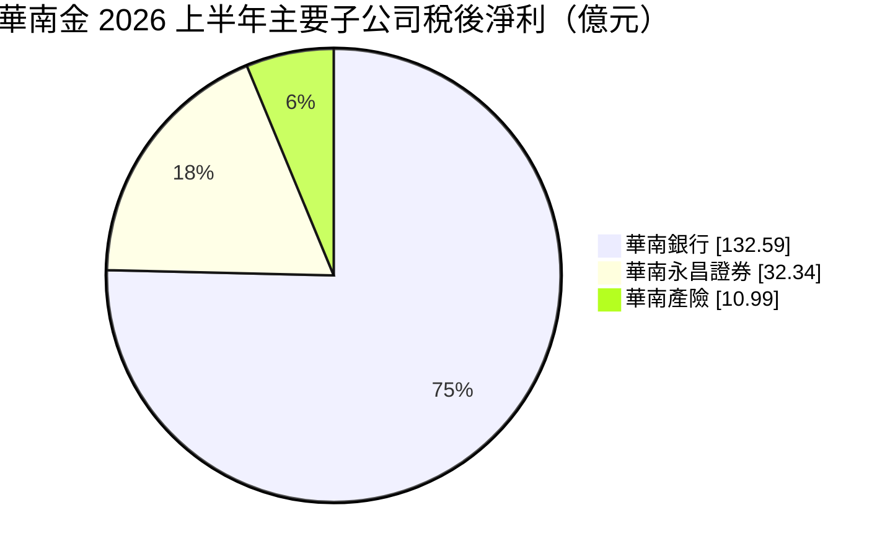
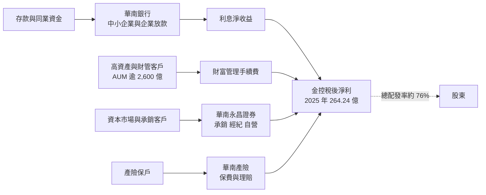
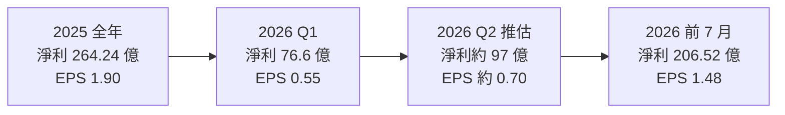
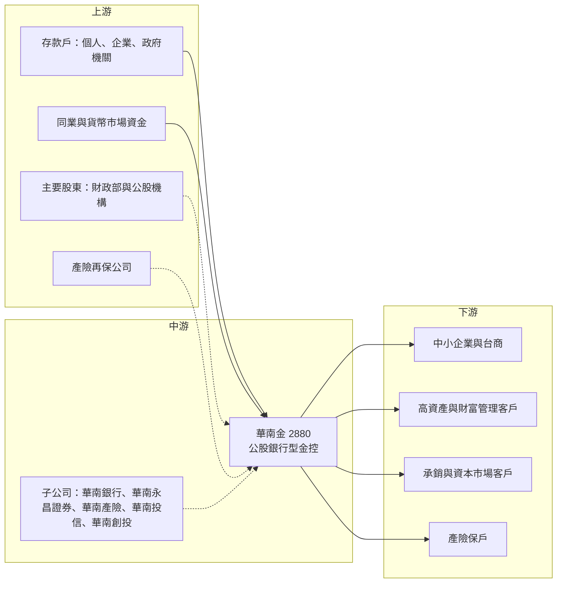

# 2880 華南金

> 上市｜[[產業索引-金融保險業|金融保險業]]｜上市（櫃）日期 2001/12/19

# 第一章：企業模式與商業藍圖

> [!info] 撰寫說明
> 本文由 Claude 依公開資料整理，架構比照 [[2330台積電]] 的四章研究，資料截至 2026-10-07。財務數字來源：優分析（華南金 2025 年法說會、2026 年第一季金控獲利排行）、NOWnews（2026 年上半年法說會）、自由時報與經濟日報（2026 年股東會與股利）、yam 蕃新聞（2026 年上半年金控獲利表）；產業描述為整理性內容，尚未逐條比對原始文件。#待校對

在評估單一個股的長期投資價值時，首要步驟是拆解企業的底層獲利邏輯。本章針對華南金融控股（股票代號：2880，以下簡稱華南金）的商業模式進行定性分析，說明一家傳統公股金控如何靠財富管理、證券與產險，讓非銀行獲利占比提升到近三成，並以資本效率作為新的經營指標。

## 一、核心定位：獲利結構逐步多元化的公股金控

華南金成立於 2001 年底，是台灣最早成立的金控之一，核心子公司華南商業銀行歷史悠久，屬於傳統公股行庫。主要子公司包括華南銀行、華南永昌證券、華南產物保險，以及投信、創投等。

和第一金、合庫金相比，華南金的定位有兩個特色：

* **非銀行占比偏高：** 旗下有一家獲利能力不錯的產險公司，加上證券子公司在台股熱絡期間表現突出，2026 年上半年非銀行子公司獲利占比達 27%，在公股金控中偏高。
* **財富管理先行：** 華南銀行財富管理手續費收入率先突破百億元，讓收費業務成為利差之外的第二支柱。2025 年稅後淨利 264.24 億元、EPS 1.90 元，睽違多年重回公股金控 EPS 前段班。

## 二、業務板塊：子公司獲利貢獻

金控不適用製造業的營收結構分析，以下以 2026 年上半年主要子公司稅後淨利呈現獲利來源：

* **華南銀行：** 集團獲利主體。2025 年稅後淨利 241.52 億元，年增 11.8%。中小企業放款市占約 7.08%，在金融機構中排名第四。財富管理手續費收入 108.31 億元，是首家突破百億元的公股銀行；高資產客戶 AUM 在 2025 年超過 2,000 億元，2026 年上半年已逾 2,600 億元，高資產客戶超過 3,200 戶。
* **華南永昌證券：** 2025 年稅後淨利 20.64 億元、EPS 3.15 元，為公股券商之冠。2026 年上半年在[[承銷]]收入大增帶動下，稅後淨利 32.34 億元，年增 413%。
* **華南產險：** 2025 年稅後淨利 18.02 億元，年增 39.4%，簽單保費總收入 148.92 億元。2026 年上半年稅後淨利 10.99 億元，年增 42%。
* **集團共銷：** 2025 年[[共同行銷]]效益 27.95 億元，2026 年上半年共同行銷收益 24 億元，年增 65%。

## 三、資本轉化邏輯：利差、手續費與保費三條現金流

* **營運據點：** 華南銀行在國內有完整的分行網路，同時布局海外分行與代表處，2026 年上半年國內外放款餘額年增 12%。證券與產險則以國內市場為主。
* **RORWA 管理：** 公司導入「風險加權資產收益率（[[RORWA]]）」作為業務指引，讓每一筆放款都要計算占用多少資本、賺回多少收益，避免為了放款量而犧牲利差。

## 四、企業長期藍圖：五大策略與資本效率

2025 年法說會提出五大策略：

* 提高資本使用效率以提升[[利差]]，以 RORWA 作為業務指引。
* 調整獲利結構並深化客群，擴大財富管理與高資產業務。
* 導入金融科技，深化數位轉型。
* 強化集團共銷動能。
* 嚴格執行風險與績效管理。

公司也提出新的五年策略藍圖，強調資本效率與永續發展。

# 第二章：護城河深度與競爭優勢

在長期價值投資中，「護城河」指企業抵禦競爭、維持超額利潤的保護機制。銀行業的護城河主要來自低成本資金、客戶關係與監管門檻。本章分析華南金的護城河構成、公股與民營兩類主要對手，以及非銀行業務的優勢能否在台股降溫後延續。

## 一、華南金護城河的核心組成要素

* **1. 公股信用與存款基礎：** 和其他公股行庫一樣，華南銀行擁有穩定的存款來源與低資金成本。
* **2. 中小企業客戶群：** 中小企業放款市占約 7%，長期往來關係形成轉換成本。
* **3. 財富管理先行：** 財管手續費率先突破百億元，高資產業務規模兩年內大幅成長，在公股銀行中領先。
* **4. 產險子公司：** 產險獲利相對穩定，且與銀行房貸、企業客戶有交叉銷售機會，是其他公股金控較少擁有的配置。

## 二、主要競爭對手格局

| 對手 | 定位 | 對華南金的威脅 |
|---|---|---|
| [[2892第一金]]、[[5880合庫金]]、[[2886兆豐金]] | 公股金控 | 中小企業放款與企業金融直接競爭 |
| 彰化銀行、臺灣企銀 | 公股銀行 | 同樣以低資金成本搶企業放款 |
| [[2891中信金]]、[[2884玉山金]]、[[2881富邦金]]、[[2882國泰金]] | 民營金控 | 財富管理、信用卡與數位業務具優勢 |
| [[2885元大金]]、[[2883凱基金]] | 證券型金控 | 元大證券、凱基證券在經紀與承銷規模領先 |

## 三、優勢轉化：哪些市場守得住、哪些守不住

* **守得住：** 中小企業放款與傳統企業金融；公股背景帶來的存款與政府相關業務。
* **守不住：** 財富管理雖成長快，但與民營金控相比產品線與行銷資源仍有差距；證券獲利高度依賴台股熱度，承銷收入大增屬於景氣高點的表現。
* **觀察重點：** 高資產業務能否維持成長、非銀行占比在台股降溫後能否維持兩成以上、RORWA 管理能否讓利差持續改善。

# 第三章：財務體質與盈利規模

資料日期：2026-10-07。數字取自公司法說會與財經媒體報導，表格是撰寫當時的快照；最新月營收、毛利率、累計 EPS 由自動排程寫在本筆記的屬性欄位（月營收、毛利率、累計EPS 等）。#待校對

財務報表是檢驗護城河是否真實存在的最終標準。金控不適用製造業的毛利率與營業利益率，本章改以稅後淨利與 EPS、子公司獲利結構、資產品質與資本、股利政策四個面向，檢視華南金獲利多元化的成效。

## 一、獲利能力的基石：稅後淨利與 EPS

| 項目 | 2025 全年 | 2026 Q1 | 2026 上半年 | 2026 前 7 月 |
|---|---|---|---|---|
| 稅後淨利（新台幣） | 264.24 億 | 76.6 億 | 173.64 億 | 206.52 億 |
| 年增率 | 14.2% | 43.5% | 約五成 | 38% |
| EPS（元） | 1.90 | 0.55 | 1.25 | 1.48 |

* 2025 年稅前淨利 326.26 億元，首度突破 300 億元。
* 2026 年上半年淨利年增率有 48.6% 與 58% 兩種報導口徑；依上半年與第一季數字推算，第二季淨利約 97 億元、EPS 約 0.70 元（推估）。
* 2026 年上半年銀行利息淨收益成長約 10%，財富管理業務成長約 32%，收費業務成長速度明顯快於利差業務。

## 二、ROE 與子公司獲利結構

| 子公司 | 2025 全年 | 2026 上半年 | 2026 前 7 月 |
|---|---|---|---|
| 華南銀行 | 241.52 億（年增 11.8%） | 132.59 億（年增 18%） | 162 億（年增 15%） |
| 華南永昌證券 | 20.64 億 | 32.34 億（年增 413%） | 35.31 億 |
| 華南產險 | 18.02 億（年增 39.4%） | 10.99 億（年增 42%） | 13.21 億 |

* 非銀行子公司獲利占比 27%，2025 年證券股票自營報酬率約 32%。
* 金控 [[ROE]] 本次未查得具體數字。以獲利結構推估，銀行提供穩定的基本盤，證券與產險在 2026 年上半年拉高整體 ROE；證券獲利屬週期性，長期 ROE 中樞應以銀行的報酬水準為主（推估）。

## 三、資產品質與資本適足

* 本次未查得華南銀行最新[[逾放比]]、[[備抵呆帳覆蓋率]]與[[資本適足率]]，請以公司最新法說資料為準。
* 公司在 2026 年股東會表示會「保留更多盈餘強化資本結構」，以支應放款與投資擴張，顯示資本仍是經營的約束條件之一，這也是導入 RORWA 管理的背景。

## 四、股利政策

* 2026 年股東會通過以 2025 年盈餘配發每股 1.45 元，其中現金 1.35 元、股票 0.1 元，總配發率約 76%。
* 現金股利連續三年上升：1.2 元、1.25 元、1.35 元。以股東會前收盤價計算，現金殖利率約 3.8%。
* 公司表示未來股利仍以現金為主，若全年獲利成長，總股利金額有機會增加。

# 第四章：總體風險與地緣政治

任何企業都無法脫離宏觀環境獨立存在。本章分析華南金未來必須面對的地緣政治、利率與證券週期、授信與財管銷售的營運風險，以及公股治理與資本規範帶來的限制。

## 一、地緣政治風險

* **兩岸風險：** 銀行在海外有分支機構，台商客戶分布於中國與東南亞，兩岸關係緊張或區域衝突會影響授信品質。
* **美國關稅：** 出口型中小企業若受關稅衝擊，營運資金與還款能力會轉弱。

## 二、利率與景氣週期

* **利差：** 公司以 RORWA 管理利差，但若央行降息，銀行 [[NIM]] 仍會受壓。
* **證券獲利週期：** 2026 年證券獲利大增來自承銷與自營，台股反轉時這部分會快速縮水，非銀行占比可能回落。
* **產險巨災風險：** 颱風、地震等天災會造成理賠上升，影響產險獲利，產險公司透過[[再保險]]分散部分風險。

## 三、營運環境的隱性風險

* **授信集中與景氣：** 中小企業放款占比高，景氣衰退時違約率可能上升。
* **財富管理銷售合規：** 高資產業務快速成長，需注意商品適合度與銷售糾紛。
* **資本與股利：** 配發率已達約 76%，若同時要擴張放款，資本緩衝可能變薄。

## 四、法規與科技演進

* **公股治理：** 經營階層更替與政策性任務可能影響策略連續性。
* **資本規範：** 主管機關對 [[D-SIB]] 或資本適足的要求若提高，需保留盈餘。
* **數位轉型：** 數位銀行與行動支付競爭加劇，需持續投資金融科技與資安。

# 專有名詞解析

## 金融

- **[[利差]]**：銀行放款利率與存款利率的差距，是銀行最主要的獲利來源。
- **[[NIM]]**：淨利息收益率，利息淨收益除以生息資產，衡量銀行整體資產賺取利息的效率。
- **[[RORWA]]**：風險加權資產收益率，收益除以風險加權資產，衡量每單位資本占用能賺回多少收益。
- **[[承銷]]**：券商協助企業發行新股、債券並銷售給投資人，收取承銷費用。
- **[[共同行銷]]**：金控旗下子公司互相銷售彼此的產品，例如銀行客戶購買證券或保險商品。
- **[[逾放比]]**：逾期放款占總放款的比例，數字越低代表放款資產品質越好。
- **[[備抵呆帳覆蓋率]]**：備抵呆帳除以逾期放款，衡量銀行為可能的壞帳預先提列了多少緩衝。
- **[[資本適足率]]**：自有資本除以風險性資產，主管機關用來確保金融機構有足夠資本承擔損失。
- **[[再保險]]**：保險公司把部分承保風險轉給再保公司，以分散巨災等大額理賠風險。
- **[[D-SIB]]**：國內系統性重要銀行，倒閉時會衝擊整體金融體系的銀行，須額外提列資本。
- **[[ROE]]**：股東權益報酬率，稅後淨利除以股東權益，衡量公司運用股東資本賺錢的效率。

# 核心供應鏈

## 1. 上游：資金來源
- 存款戶：個人、企業與政府機關
- 同業與貨幣市場資金
- 主要股東：財政部與相關公股機構
- 產險再保公司（分散巨災風險）

## 2. 中游：華南金與子公司
- 華南商業銀行、華南永昌證券、華南產物保險、華南投信、華南創投

## 3. 下游：主要客群
- 中小企業與台商客戶
- 高資產與財富管理客戶
- 承銷與資本市場客戶
- 產險保戶（車險、火險、工程險等）

## 4. 同業比較
- 公股金控：[[2892第一金]]、[[5880合庫金]]、[[2886兆豐金]]
- 民營金控：[[2891中信金]]、[[2884玉山金]]、[[2881富邦金]]

## 最新新聞
<!-- news:start -->
<!-- news:end -->

## 相關連結
- [公開資訊觀測站](https://mopsov.twse.com.tw/mops/web/t05st03?step=1&firstin=1&co_id=2880)
- [Goodinfo](https://goodinfo.tw/tw/StockDetail.asp?STOCK_ID=2880)
- [Yahoo 股市](https://tw.stock.yahoo.com/quote/2880)
- [鉅亨網新聞](https://www.cnyes.com/twstock/2880/news)
