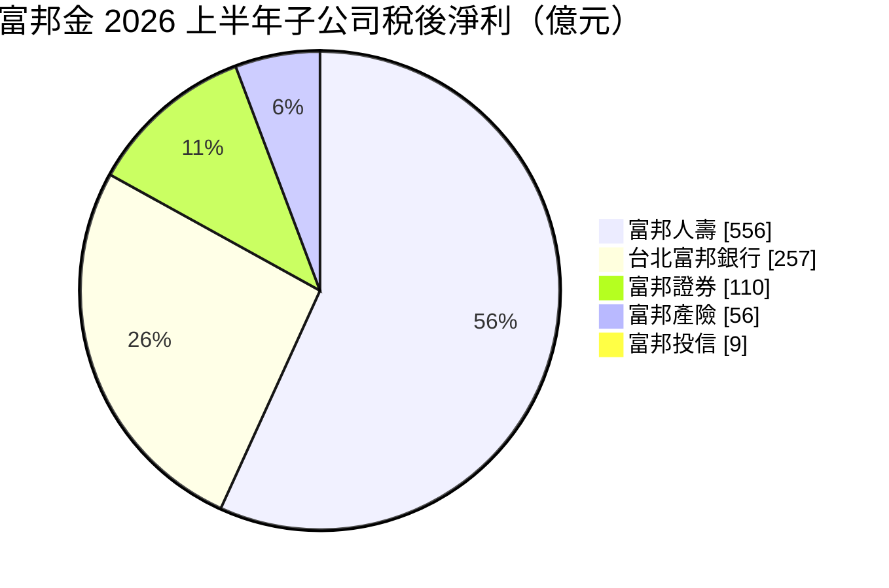
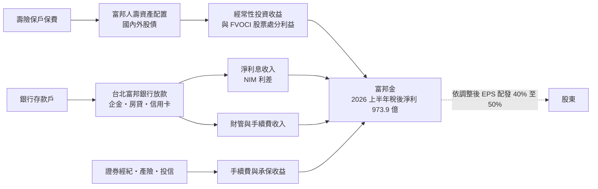
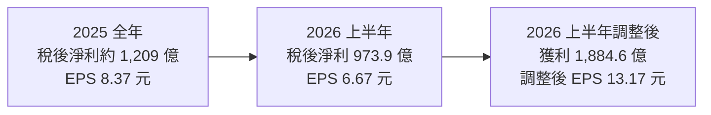
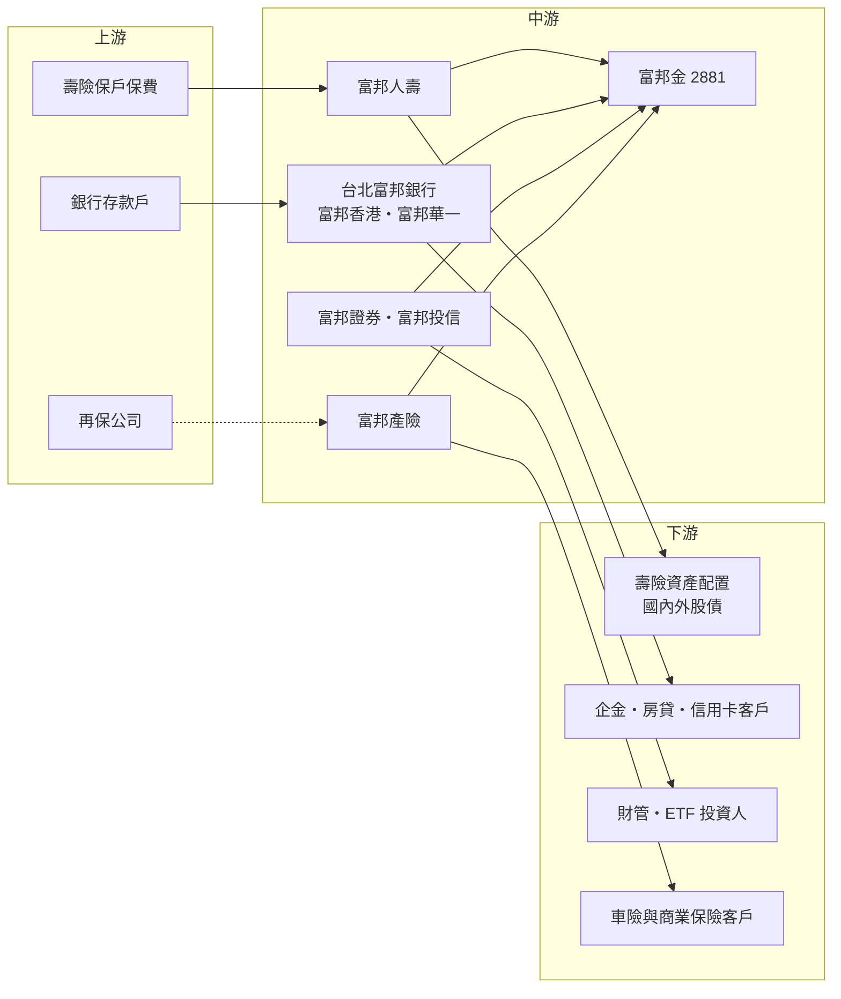

# 2881 富邦金

> 上市｜[[產業索引-金融保險業|金融保險業]]｜上市（櫃）日期 2001/12/19

# 第一章：企業模式與商業藍圖

> [!info] 撰寫說明
> 本文由 Claude 依公開資料整理，架構比照 [[2330台積電]] 的四章研究，資料截至 2026-10-07。財務數字來源：富邦金控官網新聞稿（2025 年度股東常會）、優分析（2025 年第四季與 2026 年上半年法說會）、經濟日報（2025 年度法說會、2026 年上半年法說會）、自由時報（2026 年 6 月自結獲利）；產業描述為整理性內容，尚未逐條比對原始文件。#待校對

在評估金融股的長期投資價值時，首要步驟是看清楚獲利從哪一家子公司、哪一種業務而來。本章針對富邦金融控股（股票代號：2881，以下簡稱富邦金）的商業模式進行定性分析，說明它如何以富邦人壽為獲利主引擎、台北富邦銀行為穩定器，連續多年維持國內[[金控]]獲利與 EPS 第一的地位，以及壽險型金控在股市大好時的高彈性與高波動。

## 一、核心定位：國內獲利規模最大的壽險型金控

富邦金控成立於 2001 年，是國內第一批成立的金控之一，旗下有富邦人壽、台北富邦銀行、富邦產險、富邦證券、富邦投信，海外則有富邦銀行（香港）與上海的富邦華一銀行。依公司 2026 年 6 月股東會新聞稿，富邦金已連續 17 年位居國內金控每股獲利第一。

2025 年全年稅後淨利約 1,209 億元、EPS 8.37 元，總資產約 12.9 兆元。2026 年上半年稅後淨利 973.9 億元、EPS 6.67 元，創歷史同期新高，總資產超過 13.7 兆元，淨值超過 1.2 兆元、年增 55.3%。

對投資人而言，富邦金有兩個基本特徵：

* **壽險決定獲利高度：** 富邦人壽 2026 年上半年稅後淨利約 556 億元，超過集團一半；若加計直接進入保留盈餘的 [[FVOCI]] 股票處分利益，壽險上半年獲利達 1,432 億元以上。
* **銀行決定獲利下限：** 台北富邦銀行 2026 年上半年稅後淨利 257.3 億元、年增 32%，是不受股市漲跌影響的穩定收益來源。

## 二、業務板塊：壽險與銀行雙引擎、證券與產險加分

以 2026 年上半年各子公司稅後淨利來看（不含 FVOCI 處分利益），獲利結構如下：

圖中合計約 988 億元，略高於金控合併稅後淨利 973.9 億元，差額主要來自金控層級費用與合併調整（推估）。

* **富邦人壽：** 國內獲利最大的壽險公司之一。2025 年股票投資實現利益超過 1,700 億元，台股投資報酬率 28.82%；2026 年上半年避險後總投資報酬率 9.18%。新契約價值（[[VNB]]）2025 年約 253 億元。2026 年上半年 [[TIS]] 資本適足水準遠高於內部目標 140%。
* **台北富邦銀行：** 2025 年稅後淨利 363.4 億元、年增 19.5%，放款年增 10.1%、存款年增 6.6%，[[NIM]] 較前一年改善 6 個基點。
* **富邦證券：** 2026 年上半年稅後淨利 110.2 億元、年增 172%，受惠於台股成交熱絡，經紀、融資與債券承銷均居國內前三。
* **富邦產險：** 國內產險龍頭，市占率約 23.7%，2026 年上半年稅後淨利 55.9 億元。
* **富邦投信：** 2026 年 6 月底資產管理規模突破 1.6 兆元，上半年稅後淨利 8.9 億元、年增 75%，主要受惠於 [[ETF]] 規模成長。
* **海外銀行：** 富邦銀行（香港）2025 年獲利年增 51.8%，富邦華一銀行年增 31.0%，2026 年上半年兩者都創同期新高。

## 三、資本轉化邏輯：保費與存款如何變成獲利

金控的「生產線」不是工廠，而是把保費與存款轉成投資與放款，賺取利差、投資收益與手續費。

* **壽險端的兩條入帳路徑：** IFRS 9 下，壽險持有的股票多分類為 FVOCI，賣股利益不經過損益表、直接轉入保留盈餘。因此富邦金除了公布一般 EPS，也公布加計 FVOCI 處分利益的「調整後 EPS」，2026 年上半年分別為 6.67 元與 13.17 元，兩者差距很大。
* **銀行端：** 靠放款利差與財富管理手續費賺錢，台北富邦銀行 2025 年存放款利差擴大約 15 個基點。
* **集團綜效：** 銀行、證券、投信與壽險共用客群，透過[[交叉銷售]]把基金、ETF、保險商品賣給同一批客戶。

在營運據點上，富邦以台灣為核心，香港與中國大陸（富邦華一）為主要海外銀行據點，海外獲利規模仍明顯小於國內。

## 四、企業長期藍圖：資本累積、股利穩定與海外延伸

* **股利政策：** 管理層重申以「調整後獲利」為基準，維持 40% 至 50% 的配發率，以現金股利為主。2025 年度普通股每股配發現金股利 4.25 元、配發率 50.8%，總額約 595 億元。
* **資本累積：** 2026 年 6 月底普通股每股淨值 83.7 元，調整後每股淨值 109.3 元，富邦人壽淨值比超過 15%，為因應 [[ICS]] 新制與 [[IFRS 17]] 提供緩衝。
* **資產管理與 ETF：** 投信規模突破 1.6 兆元，是集團手續費收入的成長來源。
* **公司治理：** 2026 年 6 月股東會完成第十屆董事選舉，15 席董事中 6 席為獨立董事。

# 第二章：護城河深度與競爭優勢

在長期價值投資中，「護城河」指企業抵禦競爭、維持超額利潤的保護機制。金融業產品同質性高，護城河多半來自規模、資本與通路。本章分析富邦金的護城河構成、國內主要競爭對手，以及這些優勢在利率與股市循環中能守住多少。

## 一、護城河的核心組成要素

富邦金的護城河屬於國內金融業中較寬的一類，主要由四個要素組成：

* **1. 資本與投資規模：** 富邦人壽是國內最大的機構投資人之一，淨值逾 1.2 兆元的集團資本，讓它在股市大漲時能實現大額資本利得，也能承受較大的評價波動。
* **2. 多元獲利來源：** 壽險、銀行、證券、產險、投信都位居國內前段班，任何一個子公司表現不佳時，其他子公司可以部分抵銷。2025 年產險獲利年增 130.9%、證券年增 5.7%，就是不同子公司輪流貢獻的例子。
* **3. 產險龍頭地位：** 富邦產險市占率約 23.7%，車險與商業保險規模大，具有定價與理賠數據優勢。
* **4. 保單存量與客戶黏著度：** 長年期壽險保單一旦售出，客戶轉換成本高，形成穩定的負債端資金。

## 二、全球主要競爭對手格局

富邦金的競爭主要在國內，對手可依業務重心分為三群：

| 對手 | 定位 | 對富邦金的威脅 |
|---|---|---|
| [[2882國泰金]] | 壽險規模最大、銀行信用卡強 | 壽險、銀行、證券、投信全面正面競爭 |
| [[2887台新新光金]]、[[2883凱基金]] | 合併後的壽險加銀行或證券型金控 | 在壽險新契約與財管客群直接競爭 |
| [[2891中信金]]、[[2884玉山金]] | 銀行實力強的民營金控 | 在信用卡、財管、企業金融與海外分行競爭 |
| [[2885元大金]] | 證券與 ETF 龍頭 | 在證券經紀與 ETF 市占直接競爭 |

## 三、優勢轉化：哪些守得住、哪些守不住

* **守得住：** 集團資本規模、產險龍頭地位與 EPS 領先，是短期內其他金控難以追上的部分。2025 年富邦金 ROE 12.51%，2026 年上半年 ROE 18.00%，均屬國內前段。
* **守不住：** 壽險獲利高度依賴股市。2026 年上半年調整後獲利中有 910.7 億元來自 FVOCI 股票處分利益，這類收益在股市反轉時會大幅縮水，無法視為經常性獲利。
* **觀察重點：** 富邦人壽的避險成本與匯率曝險、台北富邦銀行 NIM 能否在降息循環中維持，以及 ETF 與財管手續費成長能否部分取代壽險資本利得的波動。這三點決定富邦金能否在股市轉弱時仍維持「金控獲利王」的地位。

# 第三章：財務體質與盈利規模

資料日期：2026-10-07。數字取自公司新聞稿與法說會相關財經媒體報導，表格是撰寫當時的快照；最新月營收、毛利率、累計 EPS 由自動排程寫在本筆記的屬性欄位（月營收、毛利率、累計EPS 等）。#待校對

財務報表是檢驗護城河是否真實存在的最終標準。金控不適用一般產業的毛利率與資本支出概念，本章改用稅後淨利、[[ROE]]、[[每股淨值]]、資本與股利、利差與投資收益等金融業指標，檢視富邦金的獲利品質。

## 一、獲利能力的基石：稅後淨利與子公司貢獻

| 項目 | 2025 全年 | 2026 上半年 |
|---|---|---|
| 稅後淨利（新台幣） | 約 1,209 億 | 973.9 億 |
| EPS（元） | 8.37 | 6.67 |
| 調整後 EPS（含 FVOCI 處分利益，元） | 未查得 | 13.17 |
| [[ROE]] | 12.51% | 18.00% |
| [[ROA]] | 0.97% | 1.47% |
| 普通股[[每股淨值]]（元） | 63.30 | 83.7 |
| 台北富邦銀行稅後淨利 | 363.4 億 | 257.3 億 |

* **成長率要分開看：** 2026 年上半年稅後淨利年增約 270%，一部分來自 2025 年同期基期偏低，一部分來自台股大漲帶動的投資收益。
* **兩種 EPS：** 一般 EPS 反映損益表，調整後 EPS 加計直接進入保留盈餘的股票處分利益；富邦金以調整後獲利作為配息基準，因此股利能力要看調整後數字。
* **獲利品質：** 台北富邦銀行與產險的獲利較具經常性；壽險與證券的獲利與股市高度相關，屬於景氣敏感成分。

## 二、ROE 與每股淨值：資本效率

富邦金 2025 年 ROE 12.51%，2026 年上半年 ROE 18.00%，加計 FVOCI 處分利益則為 34.83%。每股淨值由 2025 年底 63.30 元升至 2026 年 6 月底 83.7 元，主要反映壽險持有股票的評價上升。壽險型金控的淨值隨股債市波動很大，市場反轉時淨值與 ROE 可能同步回落，評估時應看多年平均而非單一年度。

## 三、資本適足與股利政策

* **股利：** 2025 年度普通股每股現金股利 4.25 元，配發率 50.8%，總額約 595.3 億元；另發放特別股股息約 39.6 億元。
* **政策方向：** 以調整後獲利為基準、配發率 40% 至 50%、以現金為主；實際金額取決於子公司資本需求、市場環境與財務狀況。
* **資本指標：** 富邦人壽 2026 年 6 月底淨值比超過 15%，TIS 遠高於 140% 的內部目標；金控層級的[[資本適足率]]與[[雙重槓桿比率]]本次未查得。

## 四、利差與投資收益：取代 ROIC 與 WACC 的觀察指標

對金控而言，類似「投入資本報酬率是否高於資金成本」的概念，反映在銀行的 NIM 與壽險投資收益率和負債成本之間的差距。

* **銀行 NIM：** 台北富邦銀行 2025 年 NIM 較前一年改善 6 個基點，存放款利差擴大約 15 個基點。
* **壽險投資收益：** 富邦人壽 2025 年避險後總投資報酬率 4.90%，2026 年上半年 9.18%；美國與國際債券新錢收益率約 5.2% 至 5.4%。
* **匯率緩衝：** 2025 年法說會揭露[[外匯價格變動準備金]]餘額約 1,421 億元，用來吸收新台幣升值造成的匯損。
* **資產品質：** 銀行[[逾放比]]本次未查得，建議在下一季法說會補充。

# 第四章：總體風險與地緣政治

任何金融機構都無法脫離宏觀環境獨立存在，壽險型金控尤其如此。本章分析富邦金未來必須面對的地緣政治、利率與股市週期、營運風險與法規變化。

## 一、地緣政治風險

* **中國與香港曝險：** 富邦華一銀行與富邦銀行（香港）讓富邦金在兩岸三地都有銀行據點，兩岸關係緊張或中國經濟放緩時，海外子行的資產品質與獲利會受影響。
* **匯率與海外資產：** 富邦人壽大量配置美元債券，新台幣升值會造成匯損並提高避險成本。
* **台股系統性風險：** 兩岸情勢升溫時，台股下跌會同時衝擊壽險資產評價、證券獲利與投信規模。

## 二、產業週期與市場結構風險

* **股市週期：** 2026 年上半年調整後獲利中有 910.7 億元來自股票處分利益，管理層也表示台股在高檔震盪的機率較高。股市修正時，壽險與證券獲利會明顯回落。
* **利率週期：** 降息會壓縮銀行 NIM 與壽險新錢收益率；升息則壓低債券評價。
* **同業競爭：** 財管、信用卡與 ETF 市場競爭激烈，費率可能被壓低。

## 三、營運環境的隱性風險

* **獲利集中於壽險：** 壽險貢獻超過一半獲利，任何投資判斷失誤都會放大到金控層級。
* **淨值波動：** 淨值與每股淨值隨股債評價大幅變動，在市場急跌時可能觸及資本適足門檻，影響配息。
* **產險巨災：** 颱風、地震等巨災會造成產險理賠集中發生，需要依賴[[再保險]]分散。

## 四、法規與技術演進風險

* **[[IFRS 17]] 與 ICS 新制：** 壽險會計與資本規範趨嚴，主管機關可能限制壽險上繳金控的盈餘，間接影響金控股利。
* **配息監理：** 主管機關對壽險型金控的配息常附帶資本條件，調整後獲利能配多少，最終仍需視監理態度。
* **數位與資安：** 數位銀行與純網銀競爭、AI 應用與資安要求，都需要持續投入資訊系統。

# 專有名詞解析

## 金融

- **[[金控]]**：金融控股公司，旗下同時持有銀行、保險、證券等子公司，透過集團整合交叉銷售金融商品。
- **[[FVOCI]]**：透過其他綜合損益按公允價值衡量的金融資產，股票處分利益不進損益表、直接轉入保留盈餘。
- **[[TIS]]**：台灣保險業新一代清償能力制度的資本適足指標，配合 ICS 接軌使用，比率越高代表資本越充足。
- **[[VNB]]**：新契約價值，衡量當期賣出的新保單在未來可為壽險公司創造的利潤現值。
- **[[NIM]]**：淨利差，銀行放款與投資的收益率扣除存款等資金成本後的利差，是銀行獲利能力的核心指標。
- **[[ETF]]**：指數股票型基金，在證券交易所掛牌交易、追蹤特定指數的基金，是投信近年規模成長的主力。
- **[[交叉銷售]]**：把集團內不同子公司的商品賣給同一批客戶，例如向銀行客戶銷售保險與基金。
- **[[ICS]]**：保險資本標準，國際保險監理官協會制定的壽險資本規範，台灣接軌後壽險需準備更多資本。
- **[[IFRS 17]]**：國際保險合約會計準則，改以現值方式衡量保險負債，讓壽險獲利認列更貼近保單實際經濟價值。
- **[[每股淨值]]**：股東權益除以流通股數，代表每股對應的帳面資產價值，壽險型金控受股債評價影響大。
- **[[ROA]]**：資產報酬率，稅後淨利除以總資產，衡量金融機構運用資產創造獲利的效率。
- **[[ROE]]**：股東權益報酬率，稅後淨利除以股東權益，是衡量金控資本效率的主要指標。
- **[[資本適足率]]**：自有資本除以風險性資產的比率，主管機關以此確保金融機構有足夠資本吸收損失。
- **[[雙重槓桿比率]]**：金控對子公司的長期股權投資除以金控淨值，比率過高代表金控以負債支撐子公司資本。
- **[[外匯價格變動準備金]]**：壽險業為因應匯率波動而提存的準備金，新台幣升值時可動用來吸收匯損。
- **[[逾放比]]**：逾期放款占總放款的比率，數字越低代表銀行資產品質越好。

# 核心供應鏈

## 1. 上游：資金與保費來源
- 壽險保戶保費（富邦人壽）
- 銀行存款戶（台北富邦銀行、富邦銀行香港、富邦華一銀行）
- 再保公司：分擔產險與壽險的大額風險

## 2. 中游：富邦金與子公司
- 富邦人壽、台北富邦銀行、富邦證券、富邦產險、富邦投信
- 海外：富邦銀行（香港）、富邦華一銀行

## 3. 下游：主要客群與投資標的
- 企業金融、房貸與信用卡客戶
- 財富管理、基金與 ETF 投資人
- 壽險資產配置：國內外股債，例如 [[2330台積電]] 等權值股

## 4. 同業比較
- 壽險型金控：[[2882國泰金]]、[[2887台新新光金]]、[[2883凱基金]]
- 銀行型民營金控：[[2891中信金]]、[[2884玉山金]]、[[2890永豐金]]
- 證券型金控：[[2885元大金]]
- 公股金控：[[2886兆豐金]]、[[5880合庫金]]

## 最新新聞
<!-- news:start（自動產生，請勿手動編輯此範圍） -->
- 2026-10-09 📰 媒體 12:10｜鉅亨速報 - Factset 最新調查：富邦金(2881-TW)EPS預估上修至11.58元，預估目標價為140元｜[鉅亨網](https://news.cnyes.com/news/id/6626711)
- 2026-10-08 🏛️ 重訊 17:46｜公告本公司受邀參加投資人會議｜[觀測站](https://mops.twse.com.tw/mops/#/web/t05st01)
- 2026-10-08 🏛️ 重訊 17:20｜富邦金控代子公司台北富邦銀行公告取得 「臺北市市政大樓公共事務管理中心」使用權資產｜[觀測站](https://mops.twse.com.tw/mops/#/web/t05st01)
- 2026-10-08 🏛️ 重訊 16:11｜富邦金控代子公司富邦人壽公告取得Coatue Growth VI Offshore Feeder Fund LP｜[觀測站](https://mops.twse.com.tw/mops/#/web/t05st01)
- 2026-10-06 🏛️ 重訊 18:10｜代富邦現代人壽公告取得MIRAE ASSET GLOBAL INFRASTRUCTURE DEBT PRIVATELY PLACED INVESTMENT TRUST 1-4｜[觀測站](https://mops.twse.com.tw/mops/#/web/t05st01)

完整紀錄：[[2881富邦金 新聞]]
<!-- news:end -->

## 相關連結
- [公開資訊觀測站](https://mopsov.twse.com.tw/mops/web/t05st03?step=1&firstin=1&co_id=2881)
- [Goodinfo](https://goodinfo.tw/tw/StockDetail.asp?STOCK_ID=2881)
- [Yahoo 股市](https://tw.stock.yahoo.com/quote/2881)
- [鉅亨網新聞](https://www.cnyes.com/twstock/2881/news)
