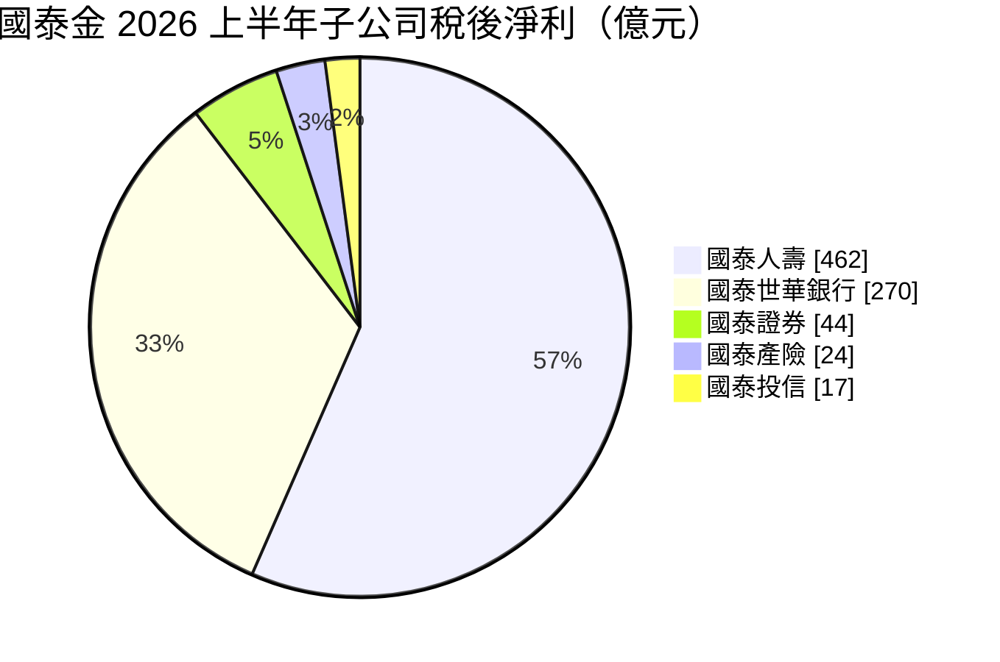
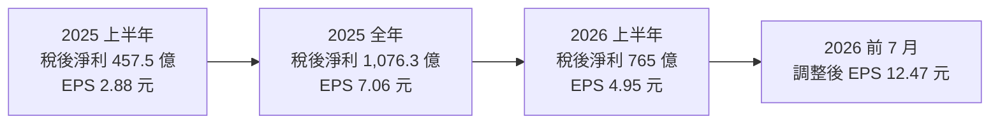
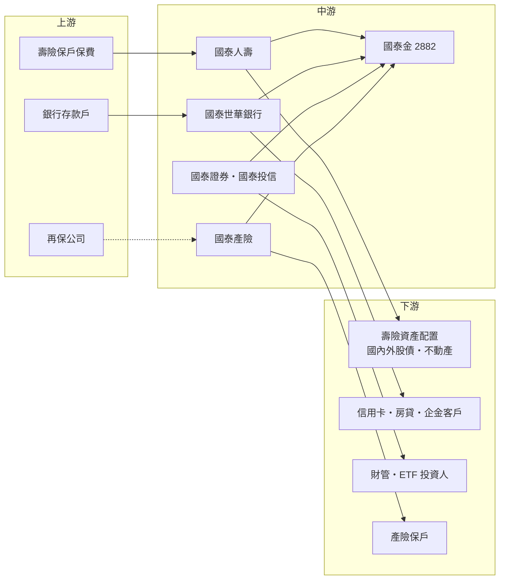

# 2882 國泰金

> 上市｜[[產業索引-金融保險業|金融保險業]]｜上市（櫃）日期 2001/12/31

# 第一章：企業模式與商業藍圖

> [!info] 撰寫說明
> 本文由 Claude 依公開資料整理，架構比照 [[2330台積電]] 的四章研究，資料截至 2026-10-07。財務數字來源：經濟日報（2025 年度股東會、2026 年上半年法說會）、優分析（2025 年全年自結獲利）、自由時報（2026 年第二季法說會）、ETtoday 財經雲（2025 年上半年自結獲利）；產業描述為整理性內容，尚未逐條比對原始文件。#待校對

在評估金融股的長期投資價值時，首要步驟是看清楚獲利從哪一家子公司、哪一種業務而來。本章針對國泰金融控股（股票代號：2882，以下簡稱國泰金）的商業模式進行定性分析，說明國內最大壽險公司國泰人壽與信用卡龍頭國泰世華銀行如何構成雙引擎，以及壽險會計新制下該如何解讀它的獲利。

## 一、核心定位：以國內最大壽險公司為核心的綜合金控

國泰金控成立於 2001 年底，旗下有國泰人壽、國泰世華銀行、國泰產險、國泰證券與國泰投信，是國內資產規模最大的[[金控]]之一。2026 年 6 月底金控淨值達 1.13 兆元，創歷史新高。

2025 年合併稅後盈餘 1,076.3 億元、EPS 7.06 元（股東會報告數字），銀行、產險、證券三家子公司稅後盈餘創歷史新高。2026 年上半年稅後淨利 765 億元、年增 66.67%，EPS 4.95 元；若加計直接進入保留盈餘的 [[FVOCI]] 股票處分利益，調整後 EPS 達 11.04 元。

對投資人而言，國泰金有兩個基本特徵：

* **壽險是獲利與淨值的主體：** 國泰人壽 2026 年上半年稅後淨利 462 億元，占集團一半以上，淨值 9,587 億元，幾乎等於金控淨值的大部分。
* **銀行提供穩定的經常性獲利：** 國泰世華銀行 2025 年稅後淨利 435.1 億元，連續五年創新高，是集團最可預期的獲利來源。

## 二、業務板塊：壽險與銀行為主、投信成長最快

以 2026 年上半年各子公司稅後淨利來看（不含 FVOCI 處分利益），獲利結構如下：



圖中合計約 817 億元，高於金控合併稅後淨利 765 億元，差額主要來自金控層級費用、特別股股息與合併調整（推估）。

* **國泰人壽：** 2026 年上半年新契約 [[CSM]] 539 億元，CSM 餘額 5,470 億元，是未來獲利的「存貨」。負債利息成本降至 2.13%，避險前經常性收益率 3.47%。2025 年新契約 CSM 超過 900 億元，[[外匯價格變動準備金]]累積餘額逾 1,100 億元。
* **國泰世華銀行：** 2026 年上半年稅後淨利 270 億元、年增 15%，淨利息收入年增 14%、淨手續費收入年增 11%。CUBE 信用卡流通卡數超過 600 萬張，是國內信用卡與數位支付的領先者。
* **國泰證券：** 2026 年上半年稅後淨利 44 億元，台股經紀市占率在 2025 年創新高。
* **國泰產險：** 2026 年上半年稅後淨利 24 億元，簽單保費市占率 13.2%，居業界第二。
* **國泰投信：** 2026 年上半年稅後淨利 17 億元、年增約 31%，資產管理規模 3.6 兆元，較 2025 年底的 2.4 兆元大幅成長，主要受惠於 [[ETF]]。

## 三、資本轉化邏輯：保費與存款如何變成獲利

```mermaid
flowchart LR
    A[壽險保戶保費<br/>新契約 CSM 539 億] --> C[國泰人壽資產配置<br/>國內外股債・不動產]
    B[銀行存款戶] --> D[國泰世華放款<br/>企金・房貸・信用卡]
    C --> E[經常性投資收益<br/>避險前 3.47%]
    C --> E2[FVOCI 股票處分利益<br/>直接入保留盈餘]
    D --> F[淨利息收入<br/>年增 14%]
    D --> G[財管與信用卡手續費]
    H[證券・產險・投信] --> I[手續費與承保收益]
    E --> J[國泰金<br/>2026 上半年稅後淨利 765 億]
    F --> J
    G --> J
    I --> J
    E2 -. 調整後 EPS 11.04 元 .-> J
    J -. 現金股利 .-> K[股東]
```

* **壽險端：** 國泰人壽以保費投資國內外股票、債券與不動產，扣除保單負債成本後賺取利差。IFRS 9 下，股票處分利益多數直接進入保留盈餘，所以國泰金同時公布一般 EPS 與調整後 EPS。
* **銀行端：** 國泰世華靠企業與個人放款利差、信用卡與財管手續費賺錢，資產品質佳，2025 年[[逾放比]] 0.15%、[[備抵呆帳覆蓋率]] 1,060%。
* **集團綜效：** 以 CUBE 卡與點數生態圈串連銀行、保險、證券客戶，進行[[交叉銷售]]。

在營運據點上，國泰以台灣為核心，國泰世華在東南亞與中國設有分行或子行，海外布局是 2026 年策略方向之一，但海外獲利占比本次未查得。

## 四、企業長期藍圖：AI 化營運、資本累積與股利成長

* **AI 優化營運：** 2026 年股東會表示持續導入 AI 優化營運，推動生成式 AI 平台 GAIA 2.0、點數生態圈整合與數位轉型。
* **壽險轉型：** 以新契約 CSM 為核心指標，提高保障型與外幣保單比重，並持續降低負債成本。
* **股利成長：** 總經理李長庚表示有信心 2026 年度股利會比過去更好；過去三年平均配發率 53%、過去十年平均 46%。
* **資本累積：** 國泰人壽調整後淨值比 17.1%，為因應 [[ICS]] 與 [[IFRS 17]] 新制保留緩衝。

# 第二章：護城河深度與競爭優勢

在長期價值投資中，「護城河」指企業抵禦競爭、維持超額利潤的保護機制。金融業產品同質性高，護城河多半來自規模、資本、品牌與客戶基礎。本章分析國泰金的護城河構成、主要競爭對手，以及這些優勢能守住多少。

## 一、護城河的核心組成要素

國泰金的護城河屬於國內金融業中較寬的一類，主要由四個要素組成：

* **1. 壽險規模與保單存量：** 國泰人壽是國內最大的壽險公司，CSM 餘額 5,470 億元代表大量尚未認列的未來利潤。長年期保單客戶轉換成本高，形成穩定的負債端資金。
* **2. 品牌與業務員通路：** 國泰品牌在國內壽險、銀行、產險都有高知名度，壽險業務員與銀行通路是新契約的主要來源。
* **3. 信用卡與數位生態圈：** CUBE 卡流通卡數超過 600 萬張，搭配點數生態圈，讓國泰世華掌握大量消費數據與年輕客群。
* **4. 資產品質：** 國泰世華逾放比 0.15%、覆蓋率超過 1,000%，在景氣反轉時有較厚的損失緩衝。

## 二、全球主要競爭對手格局

| 對手 | 定位 | 對國泰金的威脅 |
|---|---|---|
| [[2881富邦金]] | 獲利與 EPS 最高的壽險型金控 | 壽險、銀行、產險、證券全面正面競爭 |
| [[2887台新新光金]] | 合併新光人壽後的大型金控 | 在壽險新契約與財管客群競爭 |
| [[2891中信金]] | 銀行實力最強的民營金控之一 | 在信用卡、財管與海外分行競爭 |
| [[2884玉山金]] | 財管與信用卡見長的銀行型金控 | 在數位銀行與財管客群重疊 |
| [[2885元大金]] | 證券與 ETF 龍頭 | 在 ETF 與證券經紀競爭 |

## 三、優勢轉化：哪些守得住、哪些守不住

* **守得住：** 壽險保單存量、CSM 餘額與信用卡生態圈，是其他金控短期難以複製的部分。國泰世華連續五年獲利創新高，也證明銀行端具穩定性。
* **守不住：** 壽險獲利仍高度依賴資本市場。2026 年上半年一般 EPS 4.95 元與調整後 EPS 11.04 元差距很大，代表大量獲利來自股票處分，股市修正時無法持續。
* **觀察重點：** 國泰人壽負債成本能否持續下降、避險成本與新台幣匯率、國泰投信 ETF 規模成長能否延續。這三點決定國泰金能否在股市轉弱時仍維持股利成長。

# 第三章：財務體質與盈利規模

資料日期：2026-10-07。數字取自公司法說會、股東會與財經媒體報導，表格是撰寫當時的快照；最新月營收、毛利率、累計 EPS 由自動排程寫在本筆記的屬性欄位（月營收、毛利率、累計EPS 等）。#待校對

財務報表是檢驗護城河是否真實存在的最終標準。金控不適用一般產業的毛利率與資本支出概念，本章改用稅後淨利、[[ROE]]、[[每股淨值]]、資本與股利、利差與投資收益等金融業指標，檢視國泰金的獲利品質。

## 一、獲利能力的基石：稅後淨利與子公司貢獻

| 項目 | 2025 上半年 | 2025 全年 | 2026 上半年 |
|---|---|---|---|
| 稅後淨利（新台幣） | 457.5 億 | 1,076.3 億 | 765 億 |
| EPS（元） | 2.88 | 7.06 | 4.95 |
| 調整後 EPS（含 FVOCI 處分利益，元） | 未查得 | 未查得 | 11.04 |
| 國泰人壽稅後淨利 | 187.9 億 | 565.5 億 | 462 億 |
| 國泰世華稅後淨利 | 233.8 億 | 435.1 億 | 270 億 |



* **外匯準備金的影響：** 2025 年國泰人壽額外提存外匯價格變動準備金，若排除該影響，金控全年稅後淨利約 1,253.9 億元、國壽約 739.5 億元。這部分是會計上的緩衝，不代表本業衰退。
* **兩種 EPS：** 一般 EPS 反映損益表，調整後 EPS 加計股票處分利益。前 7 月調整後 EPS 已達 12.47 元，相關保留盈餘影響數約 1,870 億元。
* **獲利品質：** 國泰世華與產險的獲利較具經常性；壽險與證券的獲利與股市高度相關。

## 二、ROE 與每股淨值：資本效率

國泰金 2026 年 6 月底淨值 1.13 兆元，調整後淨值 1.583 兆元。報導指每股淨值 101.2 元、突破百元，但口徑可能為調整後數字，需以公司簡報確認。ROE 本次未查得具體數字。壽險型金控的淨值隨股債評價變動很大，ROE 也會隨市場大幅波動，應以多年平均觀察。

## 三、資本適足與股利政策

* **股利：** 2025 年度每股現金股利 3.5 元，另分派特別股股息 37.01 億元，合計配發 513.42 億元。
* **政策方向：** 過去三年平均配發率 53%、十年平均 46%；股利決策考量獲利水準、子公司營運需求、資本市場狀況與同業殖利率。管理層表示 2026 年度股利有信心比過去更好。
* **資本指標：** 國泰人壽淨值比 11.8%、調整後 17.1%；金控[[資本適足率]]與壽險 ICS 比率本次未查得。

## 四、利差與投資收益：取代 ROIC 與 WACC 的觀察指標

對金控而言，類似「投入資本報酬率是否高於資金成本」的概念，反映在銀行利差與壽險投資收益率和負債成本之間的差距。

* **壽險利差：** 國泰人壽避險前經常性收益率 3.47%，負債利息成本 2.13%，兩者差距約 1.3 個百分點；扣除[[避險成本]]後的實際利差未查得。
* **銀行利差：** 國泰世華 2026 年上半年淨利息收入年增 14%，NIM 具體數字本次未查得。
* **資產品質：** 國泰世華 2025 年逾放比 0.15%、備抵呆帳覆蓋率 1,060%。

# 第四章：總體風險與地緣政治

任何金融機構都無法脫離宏觀環境獨立存在，壽險型金控尤其如此。本章分析國泰金未來必須面對的地緣政治、利率與股市週期、營運風險與法規變化。

## 一、地緣政治風險

* **匯率與海外資產：** 國泰人壽大量配置海外債券，新台幣升值會造成匯損，2025 年即因此大額提存外匯價格變動準備金。
* **東南亞與中國據點：** 國泰世華在越南、柬埔寨、中國等地設有據點（推估，依過往公開資訊），當地經濟與政策變化會影響海外子行。
* **台股系統性風險：** 兩岸緊張升高時，台股下跌會同時衝擊壽險資產評價、證券獲利與投信規模。

## 二、產業週期與市場結構風險

* **股市週期：** 2026 年上半年調整後 EPS 遠高於一般 EPS，代表獲利對股市依賴度高，市場修正時獲利與淨值都會回落。
* **利率週期：** 降息會壓縮銀行利差與壽險新錢收益率；升息則壓低債券評價並提高解約風險。
* **同業競爭：** 信用卡、財管與 ETF 市場競爭激烈，費率可能被壓低。

## 三、營運環境的隱性風險

* **壽險負債成本：** 雖已降至 2.13%，但歷史高預定利率保單仍在，若投資收益下降，[[利差損]]可能再度擴大。
* **淨值波動：** 淨值與每股淨值隨股債評價大幅變動，市場急跌時可能壓縮配息空間。
* **特別股股息：** 每年固定支付特別股股息，會稀釋普通股可分配盈餘。

## 四、法規與技術演進風險

* **[[IFRS 17]] 與 ICS 新制：** 壽險會計與資本規範趨嚴，主管機關可能限制壽險上繳金控的盈餘，間接影響股利。
* **AI 與資安：** 國泰積極導入生成式 AI，需同時面對資料隱私、模型風險與資安監理要求。
* **數位支付競爭：** 行動支付與純網銀持續瓜分年輕客群，信用卡優勢需要持續投入維持。

# 專有名詞解析

## 金融

- **[[金控]]**：金融控股公司，旗下同時持有銀行、保險、證券等子公司，透過集團整合交叉銷售金融商品。
- **[[FVOCI]]**：透過其他綜合損益按公允價值衡量的金融資產，股票處分利益不進損益表、直接轉入保留盈餘。
- **[[CSM]]**：合約服務邊際，IFRS 17 下壽險新契約預期未來可認列的利潤，用來衡量新保單的獲利價值。
- **[[外匯價格變動準備金]]**：壽險業為因應匯率波動而提存的準備金，新台幣升值時可動用來吸收匯損。
- **[[ETF]]**：指數股票型基金，在證券交易所掛牌交易、追蹤特定指數的基金，是投信近年規模成長的主力。
- **[[逾放比]]**：逾期放款占總放款的比率，數字越低代表銀行資產品質越好。
- **[[備抵呆帳覆蓋率]]**：銀行提列的備抵呆帳除以逾期放款，比率越高代表吸收壞帳損失的緩衝越厚。
- **[[交叉銷售]]**：把集團內不同子公司的商品賣給同一批客戶，例如向銀行客戶銷售保險與基金。
- **[[ICS]]**：保險資本標準，國際保險監理官協會制定的壽險資本規範，台灣接軌後壽險需準備更多資本。
- **[[IFRS 17]]**：國際保險合約會計準則，改以現值方式衡量保險負債，讓壽險獲利認列更貼近保單實際經濟價值。
- **[[每股淨值]]**：股東權益除以流通股數，代表每股對應的帳面資產價值，壽險型金控受股債評價影響大。
- **[[資本適足率]]**：自有資本除以風險性資產的比率，主管機關以此確保金融機構有足夠資本吸收損失。
- **[[避險成本]]**：壽險公司為降低海外投資的匯率風險而買賣外匯衍生商品所付出的成本，新台幣升值或利差擴大時會上升。
- **[[利差損]]**：壽險公司過去賣出高預定利率保單，實際投資報酬率低於應付給保戶的利率所造成的虧損。
- **[[ROE]]**：股東權益報酬率，稅後淨利除以股東權益，是衡量金控資本效率的主要指標。

# 核心供應鏈



## 1. 上游：資金與保費來源
- 壽險保戶保費（國泰人壽）
- 銀行存款戶（國泰世華銀行）
- 再保公司：分擔產險與壽險的大額風險

## 2. 中游：國泰金與子公司
- 國泰人壽、國泰世華銀行、國泰產險、國泰證券、國泰投信

## 3. 下游：主要客群與投資標的
- 信用卡（CUBE 卡）、房貸與企業金融客戶
- 財富管理、基金與 ETF 投資人
- 壽險資產配置：國內外股債與不動產，例如 [[2330台積電]] 等權值股

## 4. 同業比較
- 壽險型金控：[[2881富邦金]]、[[2887台新新光金]]、[[2883凱基金]]
- 銀行型民營金控：[[2891中信金]]、[[2884玉山金]]、[[2890永豐金]]
- 證券型金控：[[2885元大金]]
- 公股金控：[[2886兆豐金]]、[[5880合庫金]]

## 最新新聞
<!-- news:start（自動產生，請勿手動編輯此範圍） -->
- 2026-10-09 📰 媒體 12:10｜鉅亨速報 - Factset 最新調查：國泰金(2882-TW)EPS預估上修至9.02元，預估目標價為126.5元｜[鉅亨網](https://news.cnyes.com/news/id/6626712)
- 2026-10-08 🏛️ 重訊 17:05｜代世越銀行公告董事會(代行股東會職權)重要決議事項｜[觀測站](https://mops.twse.com.tw/mops/#/web/t05st01)
- 2026-10-05 📰 媒體 08:11｜鉅亨速報 - Factset 最新調查：國泰金(2882-TW)EPS預估上修至8.95元，預估目標價為126元｜[鉅亨網](https://news.cnyes.com/news/id/6621408)

完整紀錄：[[2882國泰金 新聞]]
<!-- news:end -->

## 相關連結
- [公開資訊觀測站](https://mopsov.twse.com.tw/mops/web/t05st03?step=1&firstin=1&co_id=2882)
- [Goodinfo](https://goodinfo.tw/tw/StockDetail.asp?STOCK_ID=2882)
- [Yahoo 股市](https://tw.stock.yahoo.com/quote/2882)
- [鉅亨網新聞](https://www.cnyes.com/twstock/2882/news)
