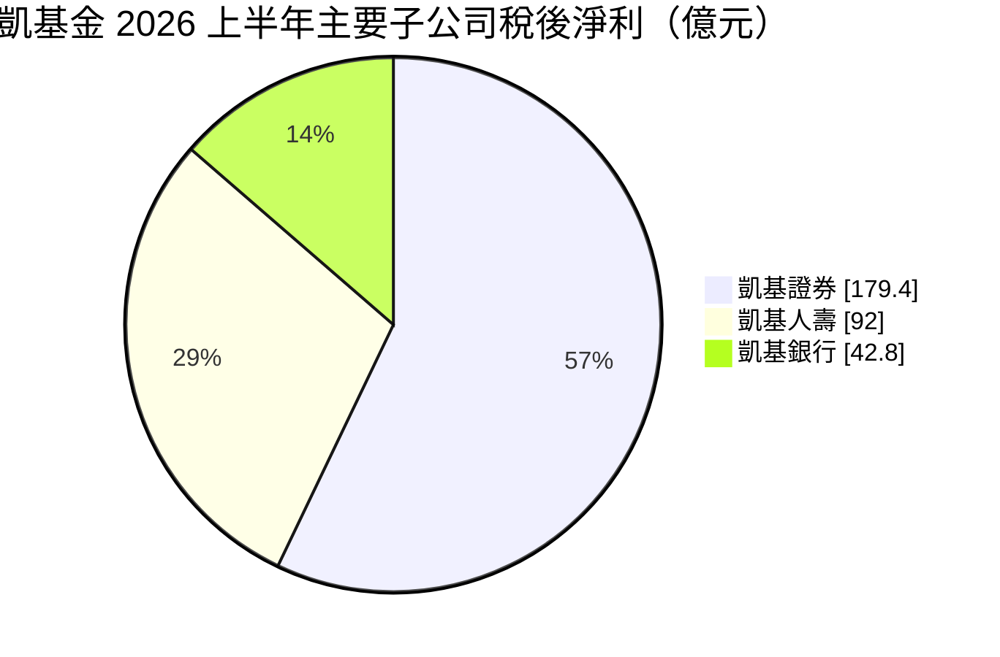
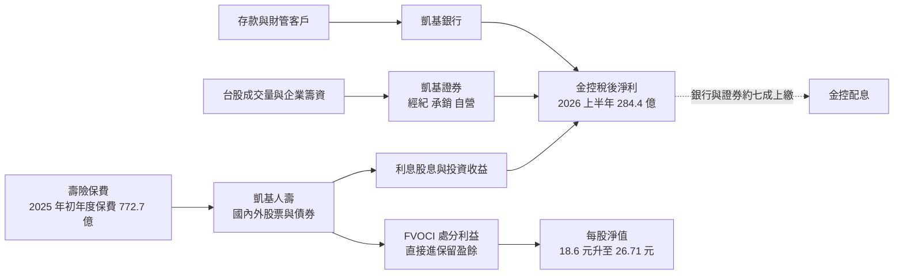
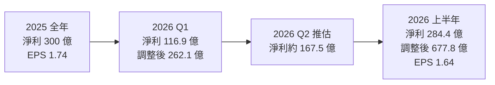
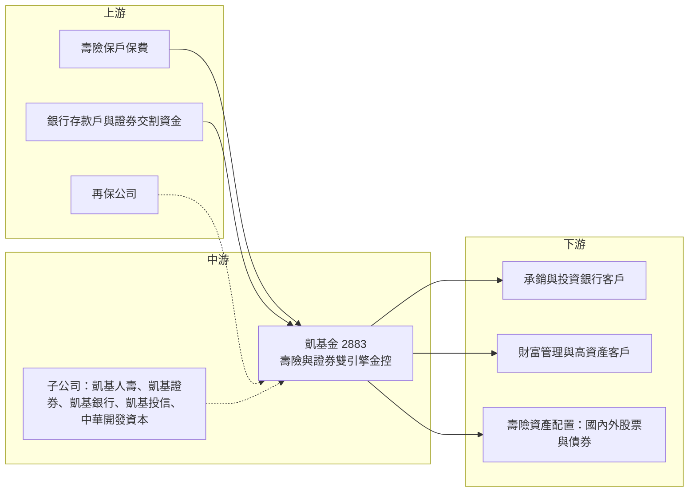

# 2883 凱基金

> 上市｜[[產業索引-金融保險業|金融保險業]]｜上市（櫃）日期 2001/12/28

# 第一章：企業模式與商業藍圖

> [!info] 撰寫說明
> 本文由 Claude 依公開資料整理，架構比照 [[2330台積電]] 的四章研究，資料截至 2026-10-07。財務數字來源：工商時報與優分析（2025 年獲利與股利政策）、股感（2026 年第一季營運）、NOWnews（2026 年上半年法說會）、經濟日報與 ETtoday 財經雲（2026 年股東會股利）、yam 蕃新聞（2026 年上半年金控獲利表）；產業描述為整理性內容，尚未逐條比對原始文件。#待校對

在評估單一個股的長期投資價值時，首要步驟是拆解企業的底層獲利邏輯。本章針對凱基金融控股（股票代號：2883，以下簡稱凱基金）的商業模式進行定性分析，說明一家由工業銀行起家的金控，如何轉型為「壽險加證券」雙引擎，以及為什麼它的損益表數字必須搭配淨值變化一起看。

## 一、核心定位：由開發金轉型的「壽險加證券」金控

凱基金前身為中華開發金控，成立於 2001 年底，起家於工業銀行與直接投資業務。之後陸續納入凱基證券、凱基銀行，並併購中國人壽，近年完成品牌整合，統一以「凱基」為集團名稱，壽險子公司亦整合為凱基人壽。

這個結構有兩個商業意義：

* **壽險決定資本，證券決定獲利彈性：** 凱基人壽資產規模最大，決定集團淨值與資本的波動；凱基證券是國內主要券商之一，在台股熱絡時貢獻大量獲利。兩者都與股市高度連動，因此凱基金是金控中對股市最敏感的類型之一。
* **獲利有兩本帳：** 壽險依 IFRS 9 將部分股票列為 [[FVOCI]]，處分利益不進損益表而直接轉入保留盈餘，因此要同時看「損益表獲利」與「含處分利益的調整後獲利」。

集團提出「財務韌性、One KGI 綜效、財富管理、資產管理」四大重點；凱基銀行規模較小但財富管理成長穩定，中華開發資本則延續創投與私募股權業務。

## 二、業務板塊：子公司獲利貢獻

金控不適用製造業的營收結構分析，以下以 2026 年上半年主要子公司稅後淨利呈現獲利來源（不含凱基人壽直接進入保留盈餘的處分利益）：

* **凱基人壽：** 2025 年稅後淨利 158 億元，排除 12 月提存調整後全年獲利超過 200 億元；初年度保費 772.7 億元，年增 33%。2026 年上半年稅後淨利 92 億元，另有 FVOCI 股票實現處分利益 390.4 億元直接進入保留盈餘，年化投資報酬率 6.69%，保險合約服務邊際（[[CSM]]）餘額約 2,436 億元。
* **凱基證券：** 2025 年稅後淨利 115.1 億元，ROE 17.3%，經紀市占約 11.2%。2026 年上半年稅後淨利 179.4 億元，年增 383%，年化 ROE 48.1%，股權[[承銷]]市占約 41%。
* **凱基銀行：** 2025 年稅後淨利 68 億元，年增 22%，財富管理手續費年增 24%，連續三年成長超過兩成。2026 年上半年稅後淨利 42.8 億元，年增 27%，年化 ROE 11.1%。
* **凱基投信：** 2025 年公募基金規模 3,119 億元，2026 年上半年增至 5,187 億元。
* **中華開發資本：** 創投、私募股權與資產管理業務。

## 三、資本轉化邏輯：保費與交易量的雙引擎

* **營運據點：** 國內以證券分公司、銀行分行與壽險業務通路為主；海外以香港、新加坡為區域重點，凱基證券在亞洲多地設有據點，集團持續強化跨境財富管理與投資銀行業務。
* **淨值與獲利分開看：** 2026 年上半年凱基人壽淨值增加約 1,300 億元，主要來自股票評價與處分利益，這部分不會出現在 EPS，但會反映在每股淨值與壽險資本。

## 四、企業長期藍圖：One KGI 與財務韌性

* **One KGI 綜效：** 整合壽險、證券、銀行客戶，推動跨子公司財富管理。
* **財務韌性：** 降低[[雙重槓桿比率]]、強化壽險資本，2025 年雙重槓桿比率由 122% 降至 118%。
* **資產管理：** 擴大投信與中華開發資本的管理資產規模。
* **透明的股利機制：** 銀行與證券子公司在正常營運下以約 70% 獲利上繳金控，作為配息基礎。

# 第二章：護城河深度與競爭優勢

在長期價值投資中，「護城河」指企業抵禦競爭、維持超額利潤的保護機制。凱基金的護城河分散在投資銀行、壽險負債端與直接投資三個領域。本章分析這些優勢的構成、壽險與證券兩個戰場的主要對手，以及凱基金的資本韌性能否支撐它與大型壽險金控競爭。

## 一、凱基金護城河的核心組成要素

* **1. 證券的投資銀行能力：** 凱基證券股權承銷市占約四成，加上經紀市占約 11%，在承銷、經紀與財富管理上都有規模。承銷需要長期的企業客戶關係與研究團隊，新進者難以短期追上。
* **2. 壽險的負債端規模：** 凱基人壽擁有大量長年期保單，保單持有人轉換成本高，CSM 餘額代表未來可逐年認列的利潤。
* **3. 直接投資的歷史經驗：** 中華開發體系累積多年創投與私募股權經驗，在金控業中較少見。

## 二、主要競爭對手格局

| 對手 | 定位 | 對凱基金的威脅 |
|---|---|---|
| [[2882國泰金]]、[[2881富邦金]] | 大型壽險金控 | 壽險規模與資本韌性明顯較大 |
| [[2887台新新光金]]（新光人壽）、南山人壽 | 壽險同業 | 在保費市場直接競爭 |
| [[2885元大金]]、[[2890永豐金]]、富邦證券、群益證券 | 券商 | 元大經紀市占領先，永豐以數位券商搶年輕客群 |
| [[2891中信金]]、[[2884玉山金]]、[[2892第一金]] | 大型銀行 | 存放款與財富管理規模較凱基銀行大 |

## 三、優勢轉化：哪些市場守得住、哪些守不住

* **守得住：** 承銷與投資銀行業務的專業團隊與客戶關係；壽險既有保單的長期收益。
* **守不住：** 經紀業務仍由元大證券領先；壽險規模與國泰、富邦相比仍有差距，資本韌性較弱，需要靠股市處分利益補強淨值。銀行規模偏小，無法像銀行型金控提供穩定的利差收入。
* **觀察重點：** 凱基人壽在 [[IFRS 17]] 與 [[ICS]] 新制下的資本與上繳能力、證券獲利能否在台股降溫後維持、雙重槓桿比率能否持續下降。

# 第三章：財務體質與盈利規模

資料日期：2026-10-07。數字取自公司法說會與財經媒體報導，表格是撰寫當時的快照；最新月營收、毛利率、累計 EPS 由自動排程寫在本筆記的屬性欄位（月營收、毛利率、累計EPS 等）。#待校對

財務報表是檢驗護城河是否真實存在的最終標準。金控不適用製造業的毛利率與營業利益率，本章改以損益表獲利與調整後獲利、子公司 ROE、資本與財務韌性、股利政策四個面向，檢視凱基金的獲利品質。

## 一、獲利能力的基石：損益表獲利與調整後獲利

| 項目 | 2025 全年 | 2026 Q1 | 2026 上半年 |
|---|---|---|---|
| 稅後淨利（新台幣） | 300 億 | 116.9 億 | 284.4 億 |
| 年增率 | 未查得 | 34% | 創同期新高 |
| 含 FVOCI 處分利益之調整後獲利 | 未查得 | 262.1 億 | 677.8 億 |
| EPS（元） | 1.74 | 未查得 | 1.64 |
| 每股淨值（元） | 年初 18.6 | 未查得 | 26.71 |

* 2025 年獲利若排除約 59 億元的[[外匯價格變動準備金]]提存與一次性因素，公司表示創歷史新高。
* 2026 年第二季淨利約 167.5 億元由上半年減第一季推算（推估）。
* 2026 年上半年調整後獲利 677.8 億元，是損益表獲利的兩倍多，差額主要是凱基人壽的 FVOCI 處分利益。這部分雖不計入 EPS，但真實增加了股東權益，每股淨值由年初 18.6 元升至 26.71 元。

## 二、ROE 與子公司獲利

| 子公司 | 2025 全年 | 2026 上半年 | 其他指標 |
|---|---|---|---|
| 凱基人壽 | 158 億 | 92 億 | 處分利益 390.4 億、CSM 2,436 億 |
| 凱基證券 | 115.1 億 | 179.4 億 | 年化 ROE 48.1%、承銷市占 41% |
| 凱基銀行 | 68 億 | 42.8 億 | 年化 ROE 11.1% |
| 凱基投信 | 規模 3,119 億 | 規模 5,187 億 | 公募基金管理資產 |

金控整體 [[ROE]] 本次未查得。從子公司看，證券 ROE 由 2025 年的 17.3% 升到 2026 年上半年年化 48.1%，屬台股天量下的高峰；銀行約 11%，相對穩定；壽險則取決於股債市場與匯率。每股淨值大幅上升後，同樣的淨利對應的 ROE 會下降，評估時要注意分母變大的效果。

## 三、資本與財務韌性

* 金控雙重槓桿比率 2024 年約 122%，2025 年降至 118%，公司因此將股利改為全現金配發。
* 凱基人壽的 ICS 比率、凱基銀行[[逾放比]]與[[資本適足率]]本次未查得具體數字。
* 上半年壽險淨值增加約 1,300 億元，壽險資本緩衝大幅改善；但這些淨值有相當比例來自股票評價，股市回落時會反向縮水。

## 四、股利政策

* 2024 年盈餘配發 0.85 元現金加 0.1 元股票；2025 年盈餘改為全數現金，股東會通過每股現金股利 1 元，報導指出配發率為近五年最高。
* 公司建立子公司上繳框架：銀行與證券以約 70% 獲利上繳，壽險上繳比例視主管機關與年底資本狀況決定。管理層表示明年股利仍以現金為主。

# 第四章：總體風險與地緣政治

任何企業都無法脫離宏觀環境獨立存在。本章分析凱基金未來必須面對的股市與匯率雙重曝險、證券與利率週期、壽險資本的營運風險，以及保險新制與金融監理帶來的挑戰。

## 一、地緣政治與市場風險

* **股市與匯率雙重曝險：** 凱基人壽持有大量海外債券與股票，新台幣升值會造成匯損並需提存外匯準備；兩岸緊張引發股市下跌時，證券與壽險會同時受衝擊。
* **海外業務：** 香港、新加坡等地的證券與財管業務，受當地市場與監理變化影響。

## 二、景氣與市場週期

* **證券獲利高度循環：** 2026 年上半年證券 ROE 達 48%，屬台股天量與承銷熱潮下的高峰，不宜視為常態。
* **利率：** 央行升降息會影響銀行淨利差，也影響壽險的再投資收益率與負債評價。

## 三、營運環境的隱性風險

* **壽險資本：** 新制上路後壽險需要更多資本，若股市下跌，FVOCI 未實現利益縮水，淨值會快速下降。
* **雙重槓桿：** 金控對子公司的投資大於本身淨值，限制金控的配息與再投資彈性。
* **一次性因素：** 外匯準備提存、處分利益等一次性項目使獲利波動大，評估時應拆開經常性與非經常性收益。

## 四、法規與科技演進

* **IFRS 17 與 ICS：** 新會計與資本制度改變壽險獲利認列方式，主管機關也會審核壽險盈餘上繳金控的比例。
* **金融監理：** 承銷、自營與財富管理銷售的監理要求趨嚴。
* **數位競爭：** 網路券商與數位銀行在年輕客群上的競爭。

# 專有名詞解析

## 金融

- **[[FVOCI]]**：透過其他綜合損益按公允價值衡量的金融資產，股票處分利益不進損益表，直接轉入保留盈餘。
- **[[CSM]]**：合約服務邊際，IFRS 17 下壽險公司尚未認列、將隨保單期間逐年轉為利潤的未來收益。
- **[[承銷]]**：券商協助企業發行新股、債券並銷售給投資人，收取承銷費用。
- **[[雙重槓桿比率]]**：金控對子公司的長期股權投資除以金控淨值，比率越高代表金控以舉債支應子公司資本的程度越高。
- **[[IFRS 17]]**：國際保險合約會計準則，改變壽險公司認列保單利潤的方式，台灣自 2026 年起適用。
- **[[ICS]]**：保險業新一代清償能力制度，以市值評估資產與負債，衡量壽險公司資本是否足以承擔風險。
- **[[外匯價格變動準備金]]**：台灣壽險業為因應海外投資匯率波動而提存的準備金，新台幣升值時需提存，會壓低當期獲利。
- **[[逾放比]]**：逾期放款占總放款的比例，數字越低代表放款資產品質越好。
- **[[資本適足率]]**：自有資本除以風險性資產，主管機關用來確保金融機構有足夠資本承擔損失。
- **[[ROE]]**：股東權益報酬率，稅後淨利除以股東權益，衡量公司運用股東資本賺錢的效率。

# 核心供應鏈

## 1. 上游：資金與保費來源
- 壽險保戶的保費收入
- 銀行存款戶、證券客戶交割資金
- 再保公司（分散壽險風險）

## 2. 中游：凱基金與子公司
- 凱基人壽、凱基證券、凱基銀行、凱基投信、中華開發資本

## 3. 下游：主要客群與投資標的
- 承銷與投資銀行客戶（IPO、增資企業）
- 財富管理與高資產客戶
- 壽險資產配置：國內外股票與債券，例如 [[2330台積電]] 等權值股

## 4. 同業比較
- 壽險型金控：[[2882國泰金]]、[[2881富邦金]]、[[2887台新新光金]]
- 證券型金控：[[2885元大金]]、[[2890永豐金]]

## 最新新聞
<!-- news:start -->
<!-- news:end -->

## 相關連結
- [公開資訊觀測站](https://mopsov.twse.com.tw/mops/web/t05st03?step=1&firstin=1&co_id=2883)
- [Goodinfo](https://goodinfo.tw/tw/StockDetail.asp?STOCK_ID=2883)
- [Yahoo 股市](https://tw.stock.yahoo.com/quote/2883)
- [鉅亨網新聞](https://www.cnyes.com/twstock/2883/news)
