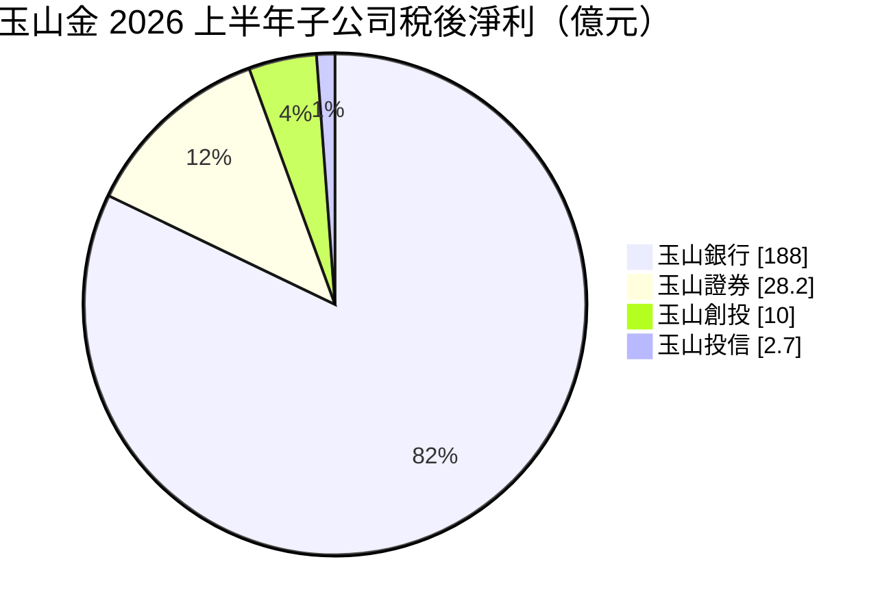
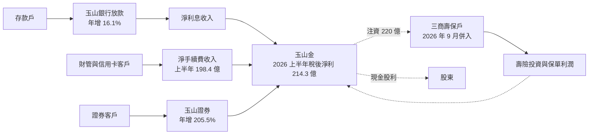
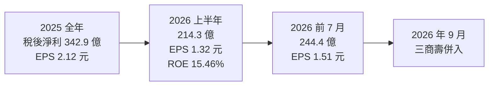
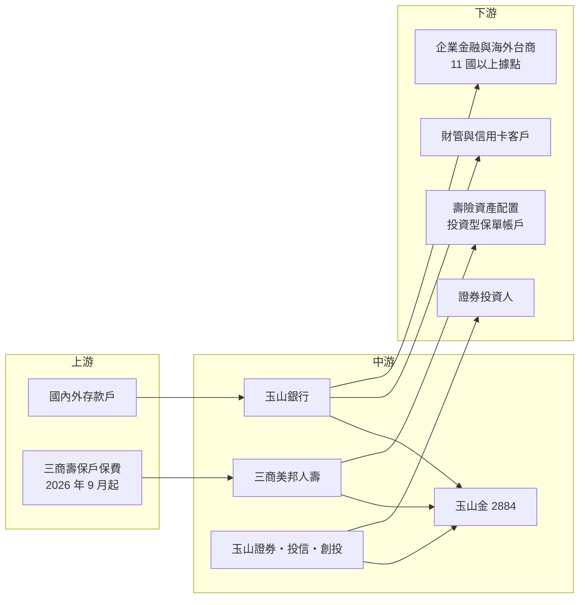

# 2884 玉山金

> 上市｜[[產業索引-金融保險業|金融保險業]]｜上市（櫃）日期 2002/01/28

# 第一章：企業模式與商業藍圖

> [!info] 撰寫說明
> 本文由 Claude 依公開資料整理，架構比照 [[2330台積電]] 的四章研究，資料截至 2026-10-07。財務數字來源：優分析（2025 年第四季法說會、2026 年上半年法說會、三商壽併購報導）、科技新報（2026 年上半年法說會、2025 年股東會）；產業描述為整理性內容，尚未逐條比對原始文件。#待校對

在評估金融股的長期投資價值時，首要步驟是看清楚獲利從哪一家子公司、哪一種業務而來。本章針對玉山金融控股（股票代號：2884，以下簡稱玉山金）的商業模式進行定性分析，說明這家以財富管理、信用卡與服務品質聞名的銀行型[[金控]]，如何在 2026 年透過併入三商美邦人壽補上保險拼圖，以及這筆交易帶來的機會與挑戰。

## 一、核心定位：財管與信用卡見長的純民營銀行型金控

玉山金控成立於 2002 年，核心子公司為玉山商業銀行，另有玉山證券、玉山創投與玉山投信。玉山銀行以服務品質、財富管理與信用卡業務見長，沒有財團背景，股權相對分散，是國內少數以專業經理人文化著稱的金控。

2025 年稅後純益 342.9 億元、年增 31.2%，EPS 2.12 元，[[ROE]] 13.04%。2026 年上半年稅後純益 214.3 億元、年增 27.8%，EPS 1.32 元，ROE 15.46%；前 7 月累計 244.4 億元、EPS 1.51 元。

2026 年 9 月 1 日，三商美邦人壽（三商壽）正式交割併入玉山金，玉山從純銀行型金控轉為「銀行加壽險」的結構。對投資人而言，玉山金有兩個基本特徵：

* **銀行占絕大多數獲利：** 玉山銀行 2026 年上半年稅後淨利約 188 億元，占金控大部分，手續費收入比重高是其特色。
* **併購帶來轉型挑戰：** 三商壽需要玉山在 2026 至 2027 年合計注資 220 億元，短期內是資本負擔，長期能否帶來綜效仍待驗證。

## 二、業務板塊：銀行為主、證券快速成長

以 2026 年上半年各子公司稅後淨利來看（三商壽 9 月才併入，不在此期間），獲利結構如下：

圖中合計約 229 億元，高於金控合併稅後淨利 214.3 億元，差額來自金控層級費用與合併調整（推估）；創投數字依報導，口徑待校對。

* **玉山銀行：** 2026 年上半年淨手續費收入 198.4 億元、年增 39.9%，其中財富管理手續費 92.7 億元、年增 30.7%，信用卡手續費 45 億元、年增 16.1%。總放款年增 16.1%，企業放款年增 20.1%、個人放款年增 11.4%，海外放款年增 20.5%。
* **玉山證券：** 2026 年上半年稅後淨利 28.2 億元、年增 205.5%，受惠於台股成交熱絡。
* **三商美邦人壽（2026 年 9 月起）：** 2026 年上半年淨值約 1,200 億元、淨值比 8.8%，投資型保單比重高達 89%，業務員通路占 98%。

## 三、資本轉化邏輯：手續費導向的銀行模式

* **手續費比重高：** 2025 年淨手續費收入 315.6 億元，其中財管 154.4 億元、信用卡 84.8 億元。手續費收入不需占用太多資本，是玉山 ROE 能維持兩位數的關鍵。
* **企業金融加速：** 企業放款成長快於個人放款，跟隨科技業與台商海外布局。
* **銀行保險綜效：** 併入三商壽後，玉山銀行的財管客群可以直接銷售自家保單，三商壽則以業務員通路帶來新客群，形成[[交叉銷售]]。

## 四、企業長期藍圖：海外三成與壽險 Back to Health

* **海外獲利占比三成以上：** 2025 年海外獲利占比 26.4%、據點 35 個遍布 11 國；2026 年上半年占比 25.3%。目標是 30% 以上，長期朝 33% 至 40% 邁進，規劃布局 13 國 38 個營業據點，日本大阪出張所 9 月開業、加拿大多倫多與印度孟買分行預計 2027 年上半年開業，美國達拉斯分行也在籌備中。
* **三商壽 Back to Health：** 改革四大方向為通路雙軌（結合銀保通路）、商品結構調整（傳統險與投資型保單各半）、數位與流程優化、資產管理綜效。第一階段注資 160 億元預計 9 月底前完成，目標年底 [[TIS]] 資本適足達 125% 的健康水準；第二階段 60 億元在 2027 年。
* **總資產邁向 5 兆元：** 管理層以總資產 5 兆元作為中期規模目標。

# 第二章：護城河深度與競爭優勢

在長期價值投資中，「護城河」指企業抵禦競爭、維持超額利潤的保護機制。金融業產品同質性高，護城河多半來自品牌、客戶關係與經營效率。本章分析玉山金的護城河構成、主要競爭對手，以及這些優勢在併入壽險後能守住多少。

## 一、護城河的核心組成要素

玉山金的護城河屬於「窄護城河」，主要來自軟實力，由四個要素組成：

* **1. 服務品牌與客戶黏著度：** 玉山長期以服務品質建立品牌，財管客戶的忠誠度高，這讓財管手續費能維持兩位數成長。
* **2. 財富管理與信用卡能力：** 2025 年財管手續費 154.4 億元、信用卡手續費 84.8 億元，在民營銀行中屬前段。
* **3. 資產品質：** 2026 年上半年[[逾放比]] 0.15%、[[備抵呆帳覆蓋率]] 770.8%，授信紀律良好。
* **4. 專業經理人文化：** 沒有財團大股東，決策以經營績效為主，管理層延續性高。

## 二、全球主要競爭對手格局

| 對手 | 定位 | 對玉山金的威脅 |
|---|---|---|
| [[2891中信金]] | 海外布局最廣、信用卡與財管規模大 | 在財管、信用卡與海外台商業務直接競爭 |
| [[2881富邦金]]、[[2882國泰金]] | 壽險規模最大的金控 | 在財管與保險銷售競爭，資本規模遠大 |
| [[2887台新新光金]] | 合併後的銀行加壽險金控 | 與玉山同樣走「銀行加壽險」路線，客群重疊 |
| [[2890永豐金]] | 銀行與證券並重 | 在數位銀行與證券客群競爭 |
| 公股金控 | 存放款規模大、資金成本低 | 在企業授信價格上具成本優勢 |

## 三、優勢轉化：哪些守得住、哪些守不住

* **守得住：** 財管、信用卡與企業金融的經營能力。2026 年上半年手續費收入年增近四成，顯示核心能力仍在擴張。
* **守不住：** 純銀行型金控的「低波動」特質。併入三商壽後，玉山將首次承擔壽險的利率、匯率與股市風險，且三商壽淨值比僅 8.8%、需要大額注資，短期會拉低金控 ROE（推估）。
* **觀察重點：** 三商壽注資後 TIS 能否達到 125%、銀行保險通路能否帶動新契約，以及海外獲利占比能否突破 30%。這三點決定玉山金能否從「好銀行」變成「好金控」。

# 第三章：財務體質與盈利規模

資料日期：2026-10-07。數字取自公司法說會與財經媒體報導，表格是撰寫當時的快照；最新月營收、毛利率、累計 EPS 由自動排程寫在本筆記的屬性欄位（月營收、毛利率、累計EPS 等）。#待校對

財務報表是檢驗護城河是否真實存在的最終標準。金控不適用一般產業的毛利率與資本支出概念，本章改用稅後淨利、[[ROE]]、手續費結構、資本與股利、資產品質等金融業指標，檢視玉山金的獲利品質。

## 一、獲利能力的基石：稅後淨利與手續費結構

| 項目 | 2025 全年 | 2026 上半年 | 2026 前 7 月 |
|---|---|---|---|
| 稅後淨利（新台幣） | 342.9 億 | 214.3 億 | 244.4 億 |
| 年增率 | 31.2% | 27.8% | 未查得 |
| EPS（元） | 2.12 | 1.32 | 1.51 |
| [[ROE]] | 13.04% | 15.46% | 未查得 |
| [[ROA]] | 0.80% | 0.91% | 未查得 |
| 淨手續費收入 | 315.6 億 | 198.4 億 | 未查得 |
| 財管手續費 | 154.4 億 | 92.7 億 | 未查得 |

* **成長來源：** 2025 年與 2026 年上半年獲利都以近三成的速度成長，來自放款擴張、手續費成長與證券獲利。
* **獲利品質：** 手續費收入占比高、資產品質佳，屬於較高品質的經常性獲利；證券獲利則與台股熱度相關。
* **併購後的變化：** 2026 年第四季起合併三商壽損益，壽險的投資收益與準備金提存會讓季度獲利波動變大（推估）。

## 二、ROE：資本效率

玉山金 2025 年 ROE 13.04%，2026 年上半年 15.46%，屬國內銀行型金控的前段。高 ROE 主要來自手續費收入比重高、資本使用效率佳。併入三商壽並注資 220 億元後，金控淨值與股本都會擴大，報導指合併後股本約 1,764 億元、擴大約 9%，短期 EPS 與 ROE 可能被稀釋。

## 三、資本與股利政策

* **股利：** 2024 年度配發現金 1.2 元與股票 0.1 元（2025 年股東會通過合計 1.3 元）；2025 年度現金股利每股 1.4 元。
* **兩大原則：** 董事長黃男州表示，EPS 提升就增加股利，並維持現金殖利率 4% 以上；管理層曾揭露可分配盈餘約 400 億元，作為配息底氣。
* **三商壽注資：** 220 億元全數由玉山金控現金增資認購，不另向股東募資。

## 四、利差與資產品質：取代 ROIC 與 WACC 的觀察指標

* **放款成長與結構：** 2026 年上半年總放款年增 16.1%，企業放款成長較快，海外放款年增 20.5%。[[NIM]] 具體數字本次未查得。
* **資產品質：** 逾放比 0.15%，備抵呆帳覆蓋率由 2025 年的 826% 降至 770.8%，仍屬高水準。
* **壽險利差：** 三商壽以投資型保單為主（89%），傳統險利差損壓力相對小，但投資型保單的獲利主要來自管理費，規模受股市影響（推估）。

# 第四章：總體風險與地緣政治

任何金融機構都無法脫離宏觀環境獨立存在。本章分析玉山金未來必須面對的地緣政治、利率週期、併購整合風險與法規變化。

## 一、地緣政治風險

* **海外據點曝險：** 海外獲利占比約四分之一，布局美國、日本、加拿大、印度、東南亞等 11 國以上，當地經濟、匯率與監理變化會直接影響獲利。
* **台商移轉：** 企業放款跟隨台商海外布局，若關稅或地緣政治改變投資方向，海外策略需調整。
* **兩岸風險：** 台股與台幣波動會影響財管、證券與新併入的壽險業務。

## 二、產業週期與市場結構風險

* **利率週期：** 降息會壓縮銀行利差；併入壽險後，利率變化也會影響保單負債與資產評價。
* **股市週期：** 財管手續費、證券獲利與投資型保單規模都和股市高度相關，市場轉弱時三者會同時受影響。
* **同業競爭：** 財管與信用卡市場競爭激烈，費率可能被壓縮。

## 三、營運環境的隱性風險

* **三商壽整合：** 三商壽業務員通路占 98%，與玉山銀行的企業文化與銷售方式差異大，通路整合與人員留任是主要挑戰。
* **資本消耗：** 220 億元注資若不足以讓三商壽達到健康資本水準，未來可能需要再增資，影響配息能力。
* **股本擴大：** 合併換股使股本擴大約 9%，EPS 成長會被稀釋。

## 四、法規與技術演進風險

* **[[IFRS 17]] 與 [[ICS]] 新制：** 玉山首次承擔壽險資本監理，TIS 與 ICS 要求將影響三商壽的資本需求與盈餘上繳。
* **數位金融：** 玉山以數位銀行見長，但純網銀與行動支付競爭持續升溫。
* **海外法遵：** 新設美國、加拿大、印度分行，需符合當地洗錢防制與資本要求。

# 專有名詞解析

## 金融

- **[[金控]]**：金融控股公司，旗下同時持有銀行、保險、證券等子公司，透過集團整合交叉銷售金融商品。
- **[[TIS]]**：台灣保險業新一代清償能力制度的資本適足指標，配合 ICS 接軌使用，比率越高代表資本越充足。
- **[[交叉銷售]]**：把集團內不同子公司的商品賣給同一批客戶，例如向銀行客戶銷售保險與基金。
- **[[投資型保單]]**：保費中有一部分投入保戶自選的基金或帳戶，投資盈虧主要由保戶承擔，壽險公司賺取管理費。
- **[[銀行保險]]**：透過銀行通路銷售保險商品，簡稱銀保，是金控整合銀行與壽險的主要綜效來源。
- **[[逾放比]]**：逾期放款占總放款的比率，數字越低代表銀行資產品質越好。
- **[[備抵呆帳覆蓋率]]**：銀行提列的備抵呆帳除以逾期放款，比率越高代表吸收壞帳損失的緩衝越厚。
- **[[ROE]]**：股東權益報酬率，稅後淨利除以股東權益，是衡量金控資本效率的主要指標。
- **[[ROA]]**：資產報酬率，稅後淨利除以總資產，衡量金融機構運用資產創造獲利的效率。
- **[[NIM]]**：淨利差，銀行放款與投資的收益率扣除存款等資金成本後的利差，是銀行獲利能力的核心指標。
- **[[IFRS 17]]**：國際保險合約會計準則，改以現值方式衡量保險負債，讓壽險獲利認列更貼近保單實際經濟價值。
- **[[ICS]]**：保險資本標準，國際保險監理官協會制定的壽險資本規範，台灣接軌後壽險需準備更多資本。
- **[[現金增資]]**：公司發行新股向投資人收取現金以擴充資本，金控常用來注資子公司。

# 核心供應鏈

## 1. 上游：資金與保費來源
- 國內外存款戶（玉山銀行）
- 三商美邦人壽保戶保費（2026 年 9 月起併入）

## 2. 中游：玉山金與子公司
- 玉山銀行、三商美邦人壽、玉山證券、玉山投信、玉山創投

## 3. 下游：主要客群
- 財富管理與信用卡客戶
- 企業金融與海外台商：美國、日本、加拿大、印度、東南亞等據點
- 證券經紀客戶

## 4. 同業比較
- 銀行型民營金控：[[2891中信金]]、[[2890永豐金]]、[[2887台新新光金]]
- 壽險型金控：[[2881富邦金]]、[[2882國泰金]]
- 公股金控：[[2886兆豐金]]、[[5880合庫金]]

## 最新新聞
<!-- news:start -->
<!-- news:end -->

## 相關連結
- [公開資訊觀測站](https://mopsov.twse.com.tw/mops/web/t05st03?step=1&firstin=1&co_id=2884)
- [Goodinfo](https://goodinfo.tw/tw/StockDetail.asp?STOCK_ID=2884)
- [Yahoo 股市](https://tw.stock.yahoo.com/quote/2884)
- [鉅亨網新聞](https://www.cnyes.com/twstock/2884/news)
