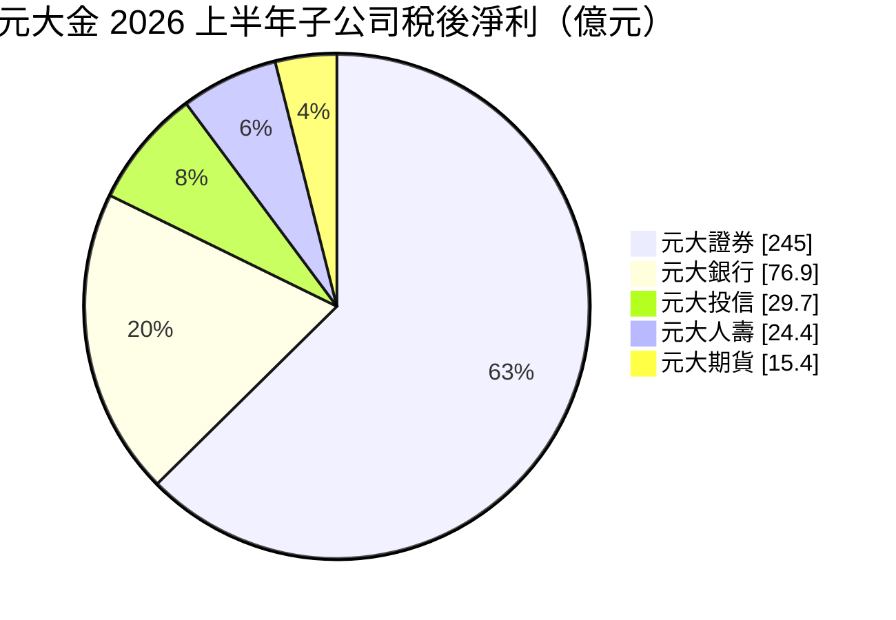
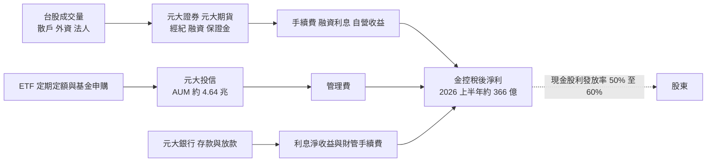
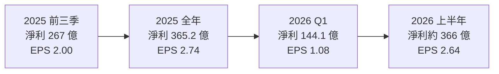
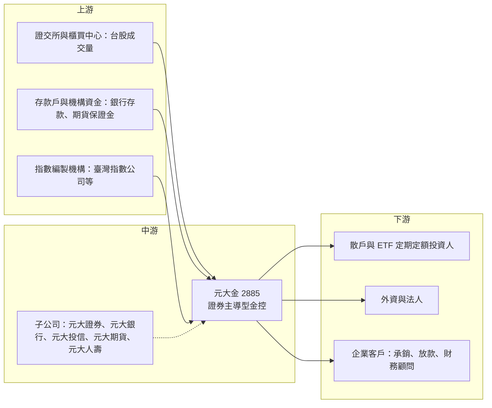

# 2885 元大金

> 上市｜[[產業索引-金融保險業|金融保險業]]｜上市（櫃）日期 2002/02/04

# 第一章：企業模式與商業藍圖

> [!info] 撰寫說明
> 本文由 Claude 依公開資料整理，架構比照 [[2330台積電]] 的四章研究，資料截至 2026-10-07。財務數字來源：富果研究元大金法說會整理（2025 年第三季、2026 年上半年）、優分析（2025 年自結獲利）、ETtoday 財經雲（2026 年股東常會與股利）、yam 蕃新聞（2026 年上半年金控獲利表）、nstock 公司簡介；產業描述為整理性內容，尚未逐條比對原始文件。#待校對

在評估單一個股的長期投資價值時，首要步驟是拆解企業的底層獲利邏輯。本章針對元大金融控股（股票代號：2885，以下簡稱元大金）的商業模式進行定性分析，說明台灣最大的證券型金控如何以「券商通路加自家 [[ETF]]」形成閉環，以及為什麼它的獲利會成為台股成交量的放大器。

## 一、核心定位：台灣最大的證券型金控

元大金前身為 2002 年成立的復華金控，後與元大證券體系整併並更名。和多數以銀行為主體的台灣金控不同，元大金的獲利引擎是證券：旗下元大證券是國內經紀業務龍頭，元大投信是國內最大的 ETF 發行商，元大期貨在期貨保證金市占也居首位。銀行（元大銀行）與壽險（元大人壽）則扮演穩定存款、放款與保險收入的角色。

這種結構有兩個商業意義：

* **台股景氣的槓桿：** 2025 年第三季法說會時，證券與銀行合計貢獻集團稅後淨利約 87%；到 2026 年上半年台股成交量大增，證券單一子公司就貢獻集團約三分之二的獲利。成交量放大時獲利成長遠快於銀行型金控，成交量萎縮時也會先受影響。
* **資產管理的長期年金：** ETF 規模一旦累積，管理費收入會隨市值與定期定額扣款持續流入，波動低於經紀手續費，是集團中較穩定的收益來源。

## 二、業務板塊：子公司獲利貢獻

金控不適用製造業的營收結構分析，以下以 2026 年上半年各子公司稅後淨利呈現獲利來源（各子公司合計高於金控淨利，差額推估為金控費用、持股比例與合併沖銷）：

* **元大證券：** 經紀、[[融資融券]]、自營、[[承銷]]與海外業務。2026 年上半年稅後淨利約 245 億元，年增 156%。法說會提到外資（FINI）經紀市占提升至約 15%。海外已布局韓國、泰國、越南、香港等市場，2025 年第三季海外獲利約占證券總淨利的一成。
* **元大銀行：** 2016 年整併大眾銀行後規模擴大，2025 年全年稅後淨利約 106.7 億元。2026 年上半年稅後淨利約 76.9 億元，年增 45%，年化 ROE 約 9.7%，淨利息收益率（[[NIM]]）升至 1.13%，外幣放款占比由 2025 年底的 4.3% 提升至 8.7%。
* **元大投信：** 台灣 ETF 市場領導者，旗下元大台灣 50（0050）是國內規模最大的 ETF 之一。2025 年第三季 ETF 定期定額市占約 46.7%、公募基金整體市占約 23.9%；2026 年上半年管理資產規模（[[AUM]]）約 4.64 兆元，稅後淨利約 29.7 億元。
* **元大期貨：** 2026 年上半年稅後淨利約 15.4 億元，保證金市占約 28.6%。
* **元大人壽：** 2013 年併購國際紐約人壽而來，規模在壽險業中屬中小型。2025 年 12 月單月出現虧損，2026 年上半年轉為稅後淨利約 24.4 億元。

## 三、資本轉化邏輯：成交量與 AUM 的雙引擎

* **通路與產品閉環：** 元大證券在國內擁有大量分公司與營業據點，搭配電子下單與 ETF 定期定額平台，形成「券商通路加自家 ETF 產品」的閉環；銀行分行則提供存款與財富管理通路，集團共銷讓銀行客戶能購買元大投信的基金與 ETF。
* **海外：** 證券業務在韓國、泰國、越南、香港等地設有子公司或據點。

## 四、企業長期藍圖：資產管理整合與銀行轉型

* **資產管理整合：** 2026 年股東會說明，元大金擬以股份轉換方式把元大投信納為 100% 持股子公司，目的在整合集團資源、配合主管機關「打造亞洲資產管理中心」的方向。
* **銀行財富管理與外幣放款：** 法說會預估 2026 年銀行財管手續費成長約 30%，並持續提高外幣放款比重以改善利差。
* **長期 ROE 目標：** 公司設定未來五年 ROE 目標區間約 9% 至 11%；2026 年上半年因台股熱絡，年化 ROE 達 20.2%，遠高於長期目標，屬於景氣高點的表現。

# 第二章：護城河深度與競爭優勢

在長期價值投資中，「護城河」指企業抵禦競爭、維持超額利潤的保護機制。證券經紀是高度同質化的業務，元大金的護城河主要來自規模與通路。本章分析這些優勢的構成、券商與投信兩個戰場的主要對手，以及哪些優勢能在手續費競爭中守住。

## 一、元大金護城河的核心組成要素

元大金的護城河屬於「中等寬度」：

* **1. 經紀規模與成本優勢：** 元大證券是國內經紀業務龍頭，大量的交易量讓它能攤薄系統、合規與人力成本，也讓融資融券、借券等衍生業務有足夠的客戶基礎。
* **2. ETF 品牌與先行者優勢：** 0050 等早期發行的 ETF 累積多年規模與流動性，投資人習慣以元大 ETF 作為台股指數的代名詞。ETF 定期定額市占近半，顯示散戶長期扣款的黏著度很高。
* **3. 期貨保證金與交易基礎設施：** 元大期貨保證金市占近三成，與證券經紀形成交叉銷售。
* **4. 集團共銷：** 銀行、證券、投信可以互相導客，例如銀行財管銷售自家基金、證券客戶的交割帳戶留在元大銀行。

## 二、主要競爭對手格局

| 對手 | 定位 | 對元大金的威脅 |
|---|---|---|
| [[2883凱基金]]、[[2890永豐金]] | 證券型或雙核心金控 | 凱基承銷市占高，永豐數位券商吸引年輕客群 |
| [[2881富邦金]]、國泰證券、群益證券 | 大型券商 | 以手續費折讓與數位平台搶經紀市占 |
| 國泰投信、群益投信、復華投信、富邦投信 | ETF 發行商 | 高股息與主題型 ETF 在部分產品線已超越元大 |
| [[2891中信金]]、[[2884玉山金]]、[[2892第一金]] | 大型銀行 | 存放款與財富管理規模較元大銀行大 |

## 三、優勢轉化：哪些市場守得住、哪些守不住

* **守得住：** 指數型 ETF 的規模與流動性具有「贏者全拿」的特性，新進者難以在相同指數上追趕；經紀龍頭地位也很難在短時間內被撼動。
* **守不住：** 手續費折讓是全業界的趨勢，經紀業務難以靠價格獲取超額報酬；高股息與主題型 ETF 的創新速度，其他投信不見得落後。
* **觀察重點：** 證券獲利對成交量的依賴程度、元大投信整併後的資產管理規模成長、銀行外幣放款與財管手續費能否在台股降溫時撐住獲利。

# 第三章：財務體質與盈利規模

資料日期：2026-10-07。數字取自公司法說會整理（富果研究）與財經媒體報導，表格是撰寫當時的快照；最新月營收、毛利率、累計 EPS 由自動排程寫在本筆記的屬性欄位（月營收、毛利率、累計EPS 等）。#待校對

財務報表是檢驗護城河是否真實存在的最終標準。金控不適用製造業的毛利率與營業利益率，本章改以稅後淨利與 EPS、子公司獲利與 ROE、資本適足與資產品質、股利政策四個面向，檢視元大金的獲利品質與週期性。

## 一、獲利能力的基石：稅後淨利與 EPS

| 項目 | 2025 前三季 | 2025 全年 | 2026 Q1 | 2026 上半年 |
|---|---|---|---|---|
| 稅後淨利（新台幣） | 267 億 | 365.2 億 | 144.1 億 | 約 366 億 |
| EPS（元） | 2.00 | 2.74 | 1.08 | 2.64 |
| 年化 [[ROE]] | 11.1% | 未查得 | 未查得 | 20.2% |
| 每股淨值（元） | 未查得 | 未查得 | 未查得 | 27.62 |

* 2025 年全年稅後淨利年增約 1.9%，在 13 家上市金控中排名第四。2026 年 1 至 5 月自結淨利 290.6 億元，上半年即超越 2025 年全年。
* 依上半年與第一季數字推算，2026 年第二季淨利約 222 億元（推估），單季就超過 2025 年第四季的約 98 億元（推算）一倍以上，反映台股天量對證券獲利的放大效果。
* 2026 年上半年 EPS 有 2.64 元與 2.74 元兩種報導口徑，推估差異來自配發股票股利後的追溯調整，本文以法說會的 2.64 元為準。

## 二、ROE 與子公司獲利

| 子公司 | 2025 前三季淨利 | 2026 上半年淨利 | 其他指標 |
|---|---|---|---|
| 元大證券 | 165 億 | 約 245 億 | 2025 全年 244.2 億 |
| 元大銀行 | 84 億 | 76.9 億 | NIM 1.13%、年化 ROE 9.7% |
| 元大投信 | 30.6 億 | 29.7 億 | AUM 4.64 兆元 |
| 元大期貨 | 20.1 億 | 15.4 億 | 保證金市占 28.6% |
| 元大人壽 | 虧損約 3 億 | 24.4 億 | 2025 年 12 月單月虧損 |

金控年化 ROE 由 2025 年前三季的 11.1% 升到 2026 年上半年的 20.2%，幾乎全部來自證券。公司自己設定的五年 ROE 目標只有 9% 至 11%，說明管理層也把目前的高 ROE 視為週期高點，評估長期價值時應以 10% 上下為中樞。

## 三、資本適足性與資產品質

* 2026 年上半年[[資本適足率]]：元大金控 123.1%、元大證券 346.7%、元大銀行 13.9%、元大人壽 141%。
* 法說會指出固定收益資產 100% 為投資等級；銀行[[信用成本]]預估約 12 至 15 個基點。銀行[[逾放比]]本次未查得。
* 壽險方面，公司目標新制清償能力（[[ICS]]）比率維持 150% 以上。

## 四、股利政策

* 公司設定現金股利發放率 50% 至 60%，法說會表示 2026 年傾向往 60% 高端靠攏。
* 2026 年股東常會通過以 2025 年盈餘配發每股 2.2 元，其中現金 1.8 元、股票 0.4 元。
* 證券獲利波動大，股利金額會隨台股景氣起伏，不宜用單一年度的高獲利推估長期配息。

# 第四章：總體風險與地緣政治

任何企業都無法脫離宏觀環境獨立存在。本章分析元大金未來必須面對的地緣政治與資金流向、成交量與利率週期、子公司營運風險，以及保險新制、ETF 監理與數位化帶來的挑戰。

## 一、地緣政治風險

* **兩岸風險與資金外流：** 作為台股成交量的主要受益者，兩岸緊張升高引發外資撤出或成交量萎縮時，元大金的證券與投信獲利會首當其衝。
* **海外子公司：** 韓國、東南亞等海外證券業務受當地監理與政治環境影響，獲利貢獻約一成，規模不大但會帶來波動。

## 二、景氣與市場週期

* **成交量循環：** 2026 年上半年的高獲利建立在台股天量之上，法說會預估下半年日均成交量約 1.0 至 1.2 兆元。一旦成交量回落，證券經紀、融資利息與自營收益都會同步下滑。
* **ETF 資金流向：** ETF 規模雖具黏著度，但若市場轉空、投資人贖回，管理費收入會下降。
* **利率環境：** 銀行淨利差受央行利率政策影響，降息會壓縮 NIM。

## 三、營運環境的隱性風險

* **壽險避險成本：** 元大人壽持有外幣資產，新台幣大幅升值時需提存[[外匯價格變動準備金]]，2025 年 12 月即出現單月虧損。
* **自營部位：** 證券自營在多頭時貢獻大，在急跌時也可能出現評價損失。
* **投信整併執行：** 元大投信股份轉換案需經主管機關核准，股東異議權行使與整合過程都有不確定性。

## 四、法規與科技演進

* **手續費競爭與數位化：** 網路券商與手續費折讓壓縮經紀收入，需要持續投入系統與資安。
* **保險新制：** [[IFRS 17]] 與 ICS 新制上路後，壽險獲利認列與資本要求改變，可能影響子公司上繳股利的能力。
* **ETF 監理：** 主管機關對 ETF 行銷、配息來源揭露的要求趨嚴，影響產品推廣方式。

# 專有名詞解析

## 金融

- **[[ETF]]**：指數股票型基金，追蹤特定指數並在交易所掛牌買賣，投資人可像買股票一樣買進一籃子股票。
- **[[AUM]]**：資產管理規模，投信或資產管理公司替客戶管理的資產總額，管理費收入與它直接相關。
- **[[融資融券]]**：券商借錢給投資人買股票（融資）或借股票給投資人賣出（融券），券商可賺取利息與費用。
- **[[承銷]]**：券商協助企業發行新股、債券並銷售給投資人，收取承銷費用。
- **[[NIM]]**：淨利息收益率，利息淨收益除以生息資產，衡量銀行整體資產賺取利息的效率。
- **[[資本適足率]]**：自有資本除以風險性資產，主管機關用來確保金融機構有足夠資本承擔損失。
- **[[信用成本]]**：一段期間內提列的呆帳費用占放款的比例，通常以基點表示，數字越低代表壞帳損失越少。
- **[[逾放比]]**：逾期放款占總放款的比例，數字越低代表放款資產品質越好。
- **[[ICS]]**：保險業新一代清償能力制度，以市值評估資產與負債，衡量壽險公司資本是否足以承擔風險。
- **[[IFRS 17]]**：國際保險合約會計準則，改變壽險公司認列保單利潤的方式，台灣自 2026 年起適用。
- **[[外匯價格變動準備金]]**：台灣壽險業為因應海外投資匯率波動而提存的準備金，新台幣升值時需提存，會壓低當期獲利。
- **[[ROE]]**：股東權益報酬率，稅後淨利除以股東權益，衡量公司運用股東資本賺錢的效率。

# 核心供應鏈

## 1. 上游：交易與資金來源
- 證券交易所與櫃買中心：台股成交量是證券獲利的源頭
- 存款戶與機構資金：元大銀行存款、元大期貨保證金
- 指數編製與資訊服務：ETF 追蹤指數的編製機構（臺灣指數公司等）

## 2. 中游：元大金與子公司
- 元大證券、元大銀行、元大投信、元大期貨、元大人壽

## 3. 下游：主要客群
- 散戶與 ETF 定期定額投資人
- 外資與法人（FINI 經紀業務）
- 企業客戶：承銷、放款與財務顧問
- ETF 成分股公司，例如 [[2330台積電]]、[[2317鴻海]]、[[2454聯發科]]

## 4. 同業比較
- 證券型金控：[[2883凱基金]]、[[2890永豐金]]
- 大型民營金控：[[2881富邦金]]、[[2882國泰金]]、[[2891中信金]]
- 公股金控：[[2892第一金]]、[[2880華南金]]、[[5880合庫金]]

## 最新新聞
<!-- news:start -->
<!-- news:end -->

## 相關連結
- [公開資訊觀測站](https://mopsov.twse.com.tw/mops/web/t05st03?step=1&firstin=1&co_id=2885)
- [Goodinfo](https://goodinfo.tw/tw/StockDetail.asp?STOCK_ID=2885)
- [Yahoo 股市](https://tw.stock.yahoo.com/quote/2885)
- [鉅亨網新聞](https://www.cnyes.com/twstock/2885/news)
