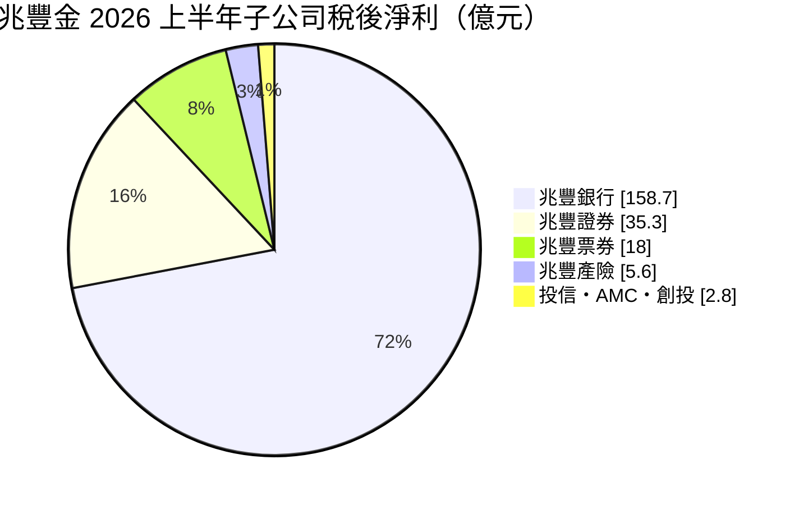
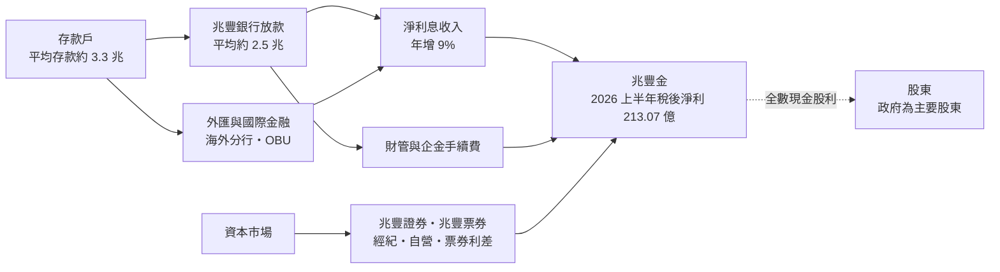
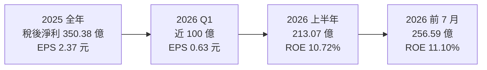
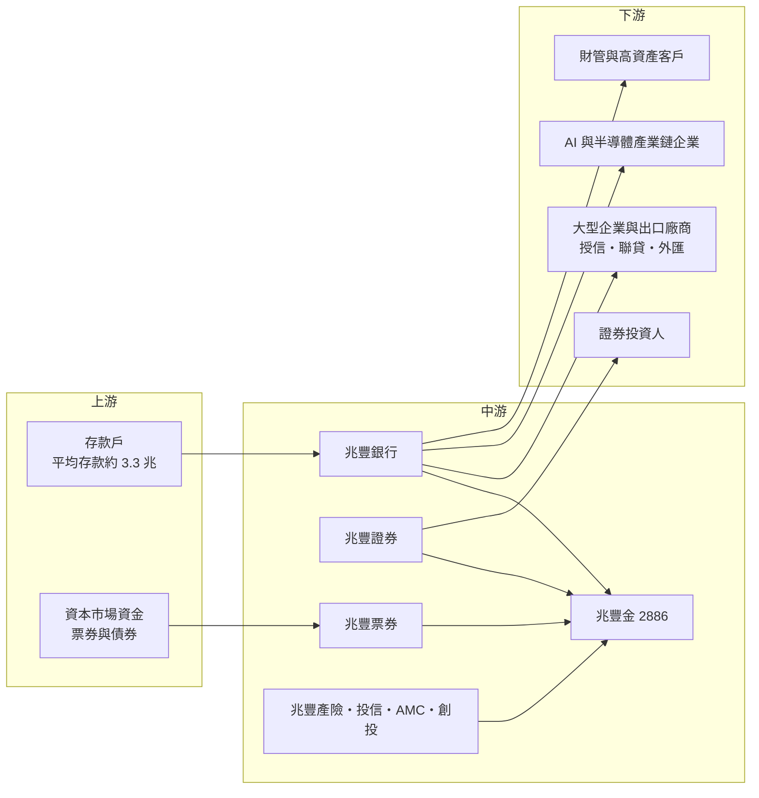

# 2886 兆豐金

> 上市｜[[產業索引-金融保險業|金融保險業]]｜上市（櫃）日期 2002/02/04

# 第一章：企業模式與商業藍圖

> [!info] 撰寫說明
> 本文由 Claude 依公開資料整理，架構比照 [[2330台積電]] 的四章研究，資料截至 2026-10-07。財務數字來源：優分析（2025 年全年、2025 年度配息、2026 年第一季、2026 年前 7 月法說會）、方格子 vocus（2026 年 4 月法說會整理）；產業描述為整理性內容，尚未逐條比對原始文件。#待校對

在評估金融股的長期投資價值時，首要步驟是看清楚獲利從哪一家子公司、哪一種業務而來。本章針對兆豐金融控股（股票代號：2886，以下簡稱兆豐金）的商業模式進行定性分析，說明這家以企業金融與外匯見長的公股[[金控]]，如何在銀行獲利成長放緩時，靠證券、票券等非銀行子公司與財富管理開出「第二成長曲線」。

## 一、核心定位：企業金融與外匯見長的公股金控

兆豐金控成立於 2002 年，由交通銀行與中國國際商業銀行體系整合而來，核心子公司兆豐國際商業銀行（兆豐銀行）長期以企業金融、外匯與國際聯貸見長。其他子公司包括兆豐證券、兆豐票券、兆豐產險、兆豐投信、兆豐資產管理（AMC）與兆豐創投。作為公股金控，政府是主要股東，經營風格偏穩健，配息以現金為主。

2025 年稅後淨利 350.38 億元、年增 1%，創歷史新高，EPS 2.37 元，[[ROE]] 9.28%。2026 年上半年稅後淨利 213.07 億元、年增 17%，ROE 10.72%；前 7 月累計 256.59 億元、年增 14%。

對投資人而言，兆豐金有兩個基本特徵：

* **銀行占絕大多數：** 兆豐銀行 2025 年稅後淨利 288.66 億元，占金控八成以上；資本強、資產品質佳，但成長性相對溫和。
* **非銀行正在放大：** 2026 年上半年非銀行子公司獲利貢獻度達 27.98%，前一年同期只有 13.53%，主要來自台股熱絡帶動的證券獲利。

## 二、業務板塊：銀行為主、證券與票券加速

以 2026 年上半年各子公司稅後淨利來看，獲利結構如下：

* **兆豐銀行：** 2026 年上半年稅後淨利 158.66 億元、年增約 3%，淨利息收益年增 9%，平均放款餘額約 2.5 兆元、平均存款餘額約 3.3 兆元。財富管理淨手續費 29 億元、年增 49%，高資產客群 [[AUM]] 2,640 億元。
* **兆豐證券：** 2026 年上半年稅後淨利 35.26 億元、年增 410%，第一季獲利就較前一年翻了約 4 倍，主要受惠於台股成交量與自營部位。
* **兆豐票券：** 2026 年上半年稅後淨利 18 億元、年增 46%，以短期票券的簽證、承銷與買賣賺取利差，是國內票券業的主要業者之一。
* **兆豐產險：** 2026 年上半年稅後淨利 5.63 億元、年增 49%。
* **投信、AMC 與創投：** 合計規模小，創投在 2026 年上半年扭虧為盈。

## 三、資本轉化邏輯：存款與資本如何變成獲利

* **存放比偏低的保守體質：** 2025 年底放款餘額 2.45 兆元、存款 3.42 兆元，存放比 72.27%，代表有大量資金放在債券與同業拆放，而非全數放款。好處是流動性充足、風險低，代價是[[NIM]]偏低，2025 年第四季台幣 NIM 為 0.87%，總存放利差約 1.28%。
* **企業金融與外匯：** 兆豐銀行在大型企業授信、[[聯貸]]、貿易融資與外匯業務具傳統優勢，2026 年將深化對 AI、半導體企業與跨境業務的授信。
* **非銀行補足波動收益：** 證券與票券在股市與利率環境有利時能大幅提升獲利，2026 年上半年就是如此。

## 四、企業長期藍圖：第二成長曲線三大戰略

2026 年法說會首度提出「第二成長曲線」，三大方向如下：

* **收益結構多元化：** 強化財富管理與手續費收入，2025 年淨手續費收入 88.84 億元、財管手續費占比約 48%，2026 年目標高資產 AUM 成長三成、達 2,500 億元以上，上半年已達 2,640 億元。
* **AI、半導體與跨境業務：** 深化對科技產業鏈的企業金融服務，跟隨客戶海外布局。
* **靈活資產配置：** 在高利率環境下調整債券與放款配置，提高資金運用收益。

# 第二章：護城河深度與競爭優勢

在長期價值投資中，「護城河」指企業抵禦競爭、維持超額利潤的保護機制。金融業產品同質性高，護城河多半來自規模、資本、資金成本與客戶關係。本章分析兆豐金的護城河構成、主要競爭對手，以及這些優勢能守住多少。

## 一、護城河的核心組成要素

兆豐金的護城河屬於「窄而穩」的類型，主要由四個要素組成：

* **1. 公股背景與資本實力：** 金控[[資本適足率]] 131.93%、[[雙重槓桿比率]] 17.58%，銀行資本適足率 16.42%，資本厚度在國內金控中屬前段，能承受較大的信用風險。
* **2. 企業金融與外匯專業：** 長年經營大型企業客戶與國際貿易融資，與台灣出口導向企業關係深厚，在聯貸與外匯市場具傳統優勢。
* **3. 資產品質：** 2025 年底[[逾放比]] 0.19%、[[備抵呆帳覆蓋率]] 866.03%，屬於國內銀行中的優等生。
* **4. 低存放比與充足流動性：** 存放比僅約七成，景氣反轉時不必被迫緊縮放款，也能在利率上升時把閒置資金轉為較高收益。

## 二、全球主要競爭對手格局

| 對手 | 定位 | 對兆豐金的威脅 |
|---|---|---|
| [[5880合庫金]]、[[2892第一金]]、[[2880華南金]] | 同為公股金控，存放款規模大 | 在企業授信、政策性放款與公股客群直接競爭 |
| [[2891中信金]] | 海外布局最廣的民營金控 | 在台商跨境金融與財管競爭 |
| [[2884玉山金]] | 財管與海外積極的民營金控 | 在財管、企業金融與東南亞布局競爭 |
| [[2881富邦金]]、[[2882國泰金]] | 規模最大的壽險型金控 | 在財管、證券與企業金融競爭 |

## 三、優勢轉化：哪些守得住、哪些守不住

* **守得住：** 資本實力、資產品質與企業金融客戶關係。兆豐 2025 年在市場普遍擴張時維持低逾放，穩健度是其他金控難以複製的。
* **守不住：** 獲利成長性。兆豐銀行 2026 年上半年獲利只年增約 3%，台幣 NIM 0.87% 也偏低，民營銀行在財管與消費金融的獲利能力明顯較強。
* **觀察重點：** 非銀行獲利貢獻能否在台股降溫後維持兩成以上、高資產 AUM 能否持續成長，以及 AI 與半導體企業授信能否提升銀行利差。這三點決定第二成長曲線是否真的成形。

# 第三章：財務體質與盈利規模

資料日期：2026-10-07。數字取自公司法說會與財經媒體報導，表格是撰寫當時的快照；最新月營收、毛利率、累計 EPS 由自動排程寫在本筆記的屬性欄位（月營收、毛利率、累計EPS 等）。#待校對

財務報表是檢驗護城河是否真實存在的最終標準。金控不適用一般產業的毛利率與資本支出概念，本章改用稅後淨利、[[ROE]]、資本與股利、利差與資產品質等金融業指標，檢視兆豐金的獲利品質。

## 一、獲利能力的基石：稅後淨利與子公司貢獻

| 項目 | 2025 全年 | 2026 Q1 | 2026 上半年 | 2026 前 7 月 |
|---|---|---|---|---|
| 稅後淨利（新台幣） | 350.38 億 | 近 100 億 | 213.07 億 | 256.59 億 |
| 年增率 | 1% | 逾 16% | 17% | 14% |
| EPS（元） | 2.37 | 0.63 | 未查得 | 未查得 |
| [[ROE]] | 9.28% | 未查得 | 10.72% | 11.10% |
| [[ROA]] | 0.72% | 未查得 | 0.82% | 0.84% |
| 兆豐銀行稅後淨利 | 288.66 億 | 未查得 | 158.66 億 | 未查得 |

* **2025 年靠稅務利益收尾：** 2025 年全年獲利年增 1%，第四季有稅務利益挹注才創新高，銀行本業成長有限。
* **2026 年靠非銀行：** 上半年非銀行獲利貢獻度從 13.53% 升到 27.98%，證券獲利年增 410%，是獲利成長的主要來源。這部分與台股熱度高度相關，可持續性較低。

## 二、ROE：資本效率

兆豐金 2025 年 ROE 9.28%，2026 年前 7 月提升到 11.10%，在國內金控中屬於中後段。偏低的原因是資本過度充足、存放比低與 NIM 偏低，這是公股金控「穩健優先」策略的代價。對追求股息的投資人而言，低波動與穩定配息可以部分彌補 ROE 偏低的缺點。

## 三、資本適足與股利政策

* **股利：** 2025 年度每股現金股利 1.75 元，創歷史新高（前一年 1.6 元），總額約 259.58 億元，以公告當日股價 39.45 元計算現金殖利率約 4.44%；全數以現金發放，未配股票股利，也未動用資本公積。
* **資本指標：** 金控資本適足率 131.93%、雙重槓桿比率 17.58%，銀行資本適足率 16.42%，Tier 1 與 CET1 比率較前一年提升約 1.6 個百分點。
* **股利延續性：** 資本充足讓兆豐不需要擴張股本，維持高現金配發的空間較大（推估）。

## 四、利差與資產品質：取代 ROIC 與 WACC 的觀察指標

對銀行型金控而言，類似「投入資本報酬率是否高於資金成本」的概念，反映在利差、存放比與信用成本上。

* **利差：** 2025 年第四季台幣 NIM 0.87%、總存放利差約 1.28%。利差偏低是兆豐的結構性弱點，提升方式是提高放款比重與外幣業務收益。
* **規模：** 2025 年底放款餘額 2.45 兆元、存款 3.42 兆元，台幣放款年增 8.1%。
* **資產品質：** 逾放比 0.19%、逾放金額 47.44 億元，備抵呆帳覆蓋率 866.03%。

# 第四章：總體風險與地緣政治

任何金融機構都無法脫離宏觀環境獨立存在。本章分析兆豐金未來必須面對的地緣政治、利率週期、營運風險與法規變化。

## 一、地緣政治風險

* **企業客戶的全球曝險：** 兆豐銀行大量承作出口企業授信與國際聯貸，美國關稅、供應鏈移轉與地緣衝突，都會影響客戶還款能力。
* **海外分行監理：** 兆豐銀行過去曾因紐約分行洗錢防制缺失遭美國監理機關重罰，顯示海外據點的法遵風險不能忽視。
* **兩岸風險：** 兩岸緊張升高時，台股下跌會壓縮證券獲利，也可能影響企業授信品質。

## 二、產業週期與市場結構風險

* **利率週期：** 降息會壓縮本已偏低的利差；升息則有利再投資收益，但會壓低債券評價。
* **股市週期：** 2026 年獲利成長大幅依賴證券，台股降溫時非銀行獲利貢獻可能回落到過去的一成多。
* **同業競爭：** 民營銀行在財管與消費金融更積極，公股銀行在手續費收入上較難追趕。

## 三、營運環境的隱性風險

* **公股治理：** 董事長與總經理人選受政府影響，經營策略可能隨政策調整，例如配合政策性放款或公股整併討論。
* **集中於大型企業授信：** 若大型企業客戶出現違約，單一案件的損失金額可能較大。
* **財管人才：** 第二成長曲線需要財管與資本市場人才，公股體系在薪酬彈性上不如民營金融機構。

## 四、法規與技術演進風險

* **資本與洗錢防制監理：** 國際洗錢防制要求持續提高，法遵成本上升。
* **數位轉型：** 公股銀行在數位通路與 AI 應用上起步較晚，需追趕民營銀行。
* **公股整併議題：** 市場不時討論公股金控整併，若發生，股權結構與經營策略可能改變。

# 專有名詞解析

## 金融

- **[[金控]]**：金融控股公司，旗下同時持有銀行、保險、證券等子公司，透過集團整合交叉銷售金融商品。
- **[[AUM]]**：資產管理規模，金融機構替客戶管理或保管的資產總額，是財富管理業務的核心指標。
- **[[NIM]]**：淨利差，銀行放款與投資的收益率扣除存款等資金成本後的利差，是銀行獲利能力的核心指標。
- **[[聯貸]]**：多家銀行共同承作同一筆大額企業貸款，由主辦行統籌，分散單一銀行的授信風險。
- **[[存放比]]**：放款餘額除以存款餘額，比率低代表銀行有較多資金放在債券等非放款資產，流動性較高但利差較低。
- **[[票券]]**：一年期以下的短期票據，如商業本票，由票券公司簽證、承銷與買賣，賺取短期資金利差。
- **[[資本適足率]]**：自有資本除以風險性資產的比率，主管機關以此確保金融機構有足夠資本吸收損失。
- **[[雙重槓桿比率]]**：金控對子公司的長期股權投資除以金控淨值，比率過高代表金控以負債支撐子公司資本。
- **[[逾放比]]**：逾期放款占總放款的比率，數字越低代表銀行資產品質越好。
- **[[備抵呆帳覆蓋率]]**：銀行提列的備抵呆帳除以逾期放款，比率越高代表吸收壞帳損失的緩衝越厚。
- **[[ROE]]**：股東權益報酬率，稅後淨利除以股東權益，是衡量金控資本效率的主要指標。
- **[[ROA]]**：資產報酬率，稅後淨利除以總資產，衡量金融機構運用資產創造獲利的效率。
- **[[OBU]]**：國際金融業務分行，在台灣境內以外幣辦理境外客戶存放款與匯兌的帳務單位。

# 核心供應鏈

## 1. 上游：資金來源
- 存款戶（兆豐銀行國內外分行、OBU）
- 貨幣市場與債券市場資金（兆豐票券）

## 2. 中游：兆豐金與子公司
- 兆豐銀行、兆豐證券、兆豐票券、兆豐產險、兆豐投信、兆豐資產管理、兆豐創投

## 3. 下游：主要客群
- 大型企業與出口廠商：授信、國際聯貸、貿易融資與外匯
- AI 與半導體產業鏈企業，例如 [[2330台積電]] 供應鏈廠商（推估）
- 財富管理與高資產客戶
- 證券經紀與承銷客戶

## 4. 同業比較
- 公股金控：[[5880合庫金]]、[[2892第一金]]、[[2880華南金]]
- 民營銀行型金控：[[2891中信金]]、[[2884玉山金]]、[[2890永豐金]]
- 壽險型金控：[[2881富邦金]]、[[2882國泰金]]

## 最新新聞
<!-- news:start（自動產生，請勿手動編輯此範圍） -->
- 2026-10-05 📰 媒體 20:10｜鉅亨速報 - Factset 最新調查：兆豐金(2886-TW)目標價調升至49元，幅度約5.15%｜[鉅亨網](https://news.cnyes.com/news/id/6622000)

完整紀錄：[[2886兆豐金 新聞]]
<!-- news:end -->

## 相關連結
- [公開資訊觀測站](https://mopsov.twse.com.tw/mops/web/t05st03?step=1&firstin=1&co_id=2886)
- [Goodinfo](https://goodinfo.tw/tw/StockDetail.asp?STOCK_ID=2886)
- [Yahoo 股市](https://tw.stock.yahoo.com/quote/2886)
- [鉅亨網新聞](https://www.cnyes.com/twstock/2886/news)
