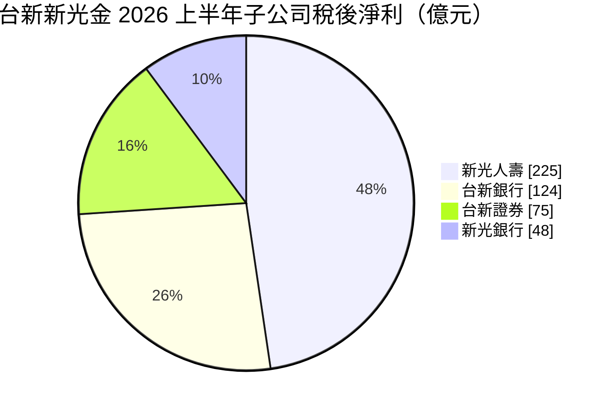
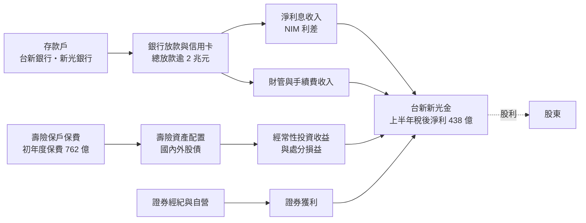
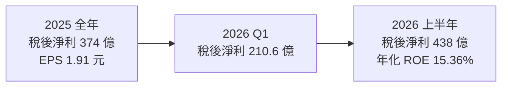
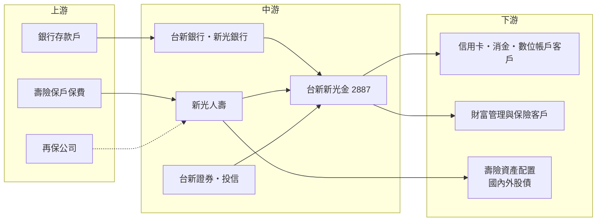

# 2887 台新新光金

> 上市｜[[產業索引-金融保險業|金融保險業]]｜上市（櫃）日期 2002/02/18

# 第一章：企業模式與商業藍圖

> [!info] 撰寫說明
> 本文由 Claude 依公開資料整理，架構比照 [[2330台積電]] 的四章研究，資料截至 2026-10-07。財務數字來源：優分析（台新新光金 2025 年股利、2026 年上半年法說會）、科技新報（2026 年上半年法說會）、ETtoday 財經雲（2026 年第一季）、yam 蕃新聞（2026 年上半年金控獲利表）；產業描述為整理性內容，尚未逐條比對原始文件。#待校對

在評估金融股的長期投資價值時，首要步驟是看清楚獲利從哪一家子公司、哪一種業務而來。本章針對台新新光金融控股（股票代號：2887，以下簡稱台新新光金）的商業模式進行定性分析，說明它如何透過合併新光金，從以消費金融見長的銀行型[[金控]]，轉變為銀行與壽險並重的大型綜合金控，以及這個轉變帶來的機會與代價。

## 一、核心定位：合併新光金後躋身大型金控

台新金融控股成立於 2002 年，以台新銀行為核心，長期以信用卡、消費金融與財富管理見長，數位銀行品牌 Richart 在年輕客群中有一定知名度。2025 年完成與新光金控的合併並更名為台新新光金控，一舉納入新光人壽與新光銀行，從「銀行型中型金控」轉為「銀行加壽險」的大型綜合金控。2026 年上半年總資產接近 9.4 兆元，股價站上 40 元時市值首度突破 1 兆元。

合併對投資人的意義可以從兩個角度理解：

* **規模躍升：** 2026 年上半年稅後淨利 438 億元，已和國內前段班金控處在同一量級，不再只是中型民營金控。
* **風險屬性改變：** 新光人壽貢獻約一半獲利，集團從此必須承受壽險常見的利率、匯率與股市波動，獲利的穩定度不如過去純銀行型結構。

## 二、業務板塊：壽險與銀行雙引擎

以 2026 年上半年各子公司稅後淨利來看，獲利結構如下：

圖中各子公司合計約 472 億元，高於金控合併稅後淨利 438 億元，差額主要來自金控層級費用與合併調整（推估）。

* **新光人壽：** 2026 年上半年稅後淨利 225 億元，若加回金融資產處分損益的調整，累計獲利約 737 億元。初年度保費 762 億元、年增 37%，新契約 [[CSM]] 351 億元，[[外幣保單]]占比 70.7%，避險前經常性投資收益率 4.19%。
* **台新銀行：** 稅後淨利 124 億元、年增 26%，創同期新高。淨利息收入 200 億元（年增 26.7%），淨手續費收入 110 億元（年增 32%），總放款突破 2 兆元、年增 12%。
* **台新證券：** 稅後淨利 75 億元，受惠於台股成交熱絡。
* **新光銀行：** 貢獻 48 億元，將於 2027 年 1 月 1 日併入台新銀行，台新銀行為存續公司。
* **投信：** 合併後投信、人壽、證券等子公司已完成整併。

## 三、資本轉化邏輯：負債端資金如何變成獲利

金控的「生產線」不是工廠，而是把存款與保費轉成放款與投資，賺取兩者之間的利差與手續費。

* **銀行端：** 靠[[淨利差]]（[[NIM]]）與手續費賺錢。台新銀行全年 NIM 展望已由原先預期較前一年增加 4 至 5 個基點，上修為增加 5 至 8 個基點。
* **壽險端：** 靠投資收益與保單利差賺錢。新光人壽外幣保單與海外資產比重高，獲利受匯率與[[避險成本]]影響大。
* **交叉銷售：** 合併後台新銀行的財管與信用卡產品，可以賣給新光人壽與新光銀行的既有客群，這是合併綜效的主要來源之一。

在營運據點上，台新銀行在國內有完整分行與數位通路，新光銀行與新光人壽則帶來北部與中南部的傳統客群。海外業務以台新銀行的海外分行與子行為主，規模相對國內有限。

## 四、企業長期藍圖：整併、轉型與股利成長

* **銀行整併：** 兩家銀行合併已獲主管機關核准，2027 年 1 月 1 日生效。整合後可共用系統、裁併重疊分行，若執行順利，[[成本收益比]]可望下降（推估）。
* **壽險轉型：** 新光人壽過去以傳統利變型商品為主，背負高預定利率保單的[[利差損]]。合併後提高保障型與外幣保單比重，並以新契約 CSM 作為核心經營指標。
* **財富管理與數位：** 以台新銀行的財管能力與 Richart 數位平台，向新光體系客群[[交叉銷售]]。
* **股利穩定成長：** 管理層提出股利政策原則，包括評估整體獲利、維持競爭力、保持長期穩定成長，並表示明年股利會比今年更好。

# 第二章：護城河深度與競爭優勢

在長期價值投資中，「護城河」指企業抵禦競爭、維持超額利潤的保護機制。金融業產品同質性高，護城河多半來自規模、客群與資金成本。本章分析台新新光金的護城河構成、國內主要競爭對手，以及合併後的優勢能守住多少。

## 一、護城河的核心組成要素

台新新光金的護城河屬於「窄護城河」，合併讓規模大幅提升，但整合尚未完成，綜效仍待驗證。主要由四個要素組成：

* **1. 規模經濟：** 合併後總資產近 9.4 兆元，躋身國內前段金控。規模帶來較低的單位資訊系統成本、較好的品牌能見度，以及在聯貸、財管商品上的議價能力。
* **2. 消費金融與數位銀行：** 台新銀行在信用卡、消費貸款與數位帳戶具先行優勢，客群偏年輕，是未來財管與保險交叉銷售的基礎。
* **3. 壽險保單存量：** 新光人壽擁有大量長年期保單與保戶，形成穩定的負債端資金與業務員通路。保單一旦售出，客戶轉換成本高，這部分具有黏著度。
* **4. 合併綜效：** 銀行合併後可裁併重疊分行、統一系統，若執行順利，營運成本可望下降（推估）。

## 二、全球主要競爭對手格局

台新新光金的競爭主要在國內，對手可依業務重心分為三群：

| 對手 | 定位 | 對台新新光金的威脅 |
|---|---|---|
| [[2882國泰金]]、[[2881富邦金]] | 壽險規模最大的兩家金控，銀行與證券也完整 | 壽險資本與投資規模遠大，可承受較大波動 |
| [[2883凱基金]] | 壽險加證券型金控 | 在壽險與證券業務同時競爭 |
| [[2891中信金]]、[[2884玉山金]] | 銀行實力強的民營金控 | 在信用卡、財管與企業金融直接競爭 |
| [[2890永豐金]] | 銀行與證券並重，數位業務積極 | 在數位銀行與年輕客群重疊 |
| [[2885元大金]] | 證券龍頭金控 | 在證券經紀與財管通路具規模優勢 |

## 三、優勢轉化：哪些守得住、哪些守不住

* **守得住：** 合併後的規模與分行通路、台新銀行的消費金融與財管能力，在中大型金控中已具差異化。2026 年上半年台新銀行淨手續費收入年增 32%，顯示財管動能確實存在。
* **守不住：** 壽險規模與資本韌性仍不及國泰、富邦；新光人壽過去的高成本保單與資本缺口需要時間消化，在利率或股市逆風時，獲利與淨值波動會比同業大。
* **觀察重點：** 2027 年銀行合併能否如期順利；新光人壽在 [[ICS]] 新制下的資本狀況與盈餘上繳能力；合併後營運成本是否真的下降。這三點決定合併到底是「一加一大於二」還是「大而不強」。

# 第三章：財務體質與盈利規模

資料日期：2026-10-07。數字取自公司法說會與財經媒體報導，表格是撰寫當時的快照；最新月營收、毛利率、累計 EPS 由自動排程寫在本筆記的屬性欄位（月營收、毛利率、累計EPS 等）。#待校對

財務報表是檢驗護城河是否真實存在的最終標準。金控不適用一般產業的毛利率與資本支出概念，本章改用稅後淨利、[[ROE]]、每股淨值、資本與股利、利差與經營效率等金融業指標，檢視台新新光金合併後的獲利品質。

## 一、獲利能力的基石：稅後淨利與子公司貢獻

| 項目 | 2025 全年 | 2026 Q1 | 2026 上半年 |
|---|---|---|---|
| 稅後淨利（新台幣） | 374 億 | 210.6 億 | 438 億 |
| 年增率 | 86% | 345% | 329% |
| EPS（元） | 1.91 | 未查得 | 1.69 至 1.71 |
| [[ROE]] | 11.52% | 未查得 | 年化 15.36% |
| [[每股淨值]]（元） | 17 | 21.6 | 26.28 |

* **成長率要打折看：** 2025 年與 2026 年的高成長率主要來自合併新光金後的基期差異，2025 年上半年淨利僅約 102 億元，並非同口徑比較。
* **EPS 口徑：** 2026 年上半年 EPS 有 1.69 元（法說會）與 1.71 元兩種報導口徑。
* **獲利品質：** 新光人壽與台新證券的獲利有相當部分來自台股大漲帶動的處分利益，屬於景氣敏感、可持續性較低的成分；台新銀行淨利息收入與手續費收入的成長則較具經常性。

## 二、ROE 與每股淨值：資本效率

台新新光金 2025 年 ROE 為 11.52%，2026 年上半年年化達 15.36%，在國內金控中屬中上水準。每股淨值由 2025 年底 17 元升到 2026 年 6 月底 26.28 元，主要反映壽險金融資產評價上升。需要注意的是，壽險型金控的淨值受股債市評價影響很大，市場反轉時淨值可能快速回落，ROE 也會跟著波動。

## 三、資本適足與股利政策

* **股利：** 2025 年盈餘配發現金 1 元、股票 0.1 元，合計 1.1 元，配發率約 57.6%，是合併後首次發放，以當時收盤價計算現金殖利率約 4.2%。
* **政策方向：** 管理層表示股利以現金為主、保留股票股利彈性；新光人壽可上繳金控的盈餘金額，需待主管機關年底定案。
* **資本指標：** 金控資本適足率、壽險 ICS 比率本次未查得具體數字，是判斷未來配息能力的關鍵缺口。

## 四、利差與經營效率：取代 ROIC 與 WACC 的觀察指標

對金控而言，類似「投入資本報酬率是否高於資金成本」的概念，具體反映在銀行的 NIM 與壽險的投資收益率與負債成本之間的差距。

* **銀行 NIM：** 台新銀行全年 NIM 展望上修為較前一年增加 5 至 8 個基點，代表資金運用收益與存款成本的利差正在擴大。
* **壽險投資收益：** 新光人壽避險前經常性投資收益率 4.19%，扣除避險成本後是否高於保單負債成本，決定利差損能否縮小。
* **資產品質：** 銀行逾放比本次未查得，建議在下一季法說會補充。

# 第四章：總體風險與地緣政治

任何金融機構都無法脫離宏觀環境獨立存在，壽險型金控尤其如此。本章分析台新新光金未來必須面對的地緣政治、利率週期、整合風險與法規變化。

## 一、地緣政治風險

* **匯率與海外資產曝險：** 新光人壽外幣保單占比約七成，資產端也大量配置海外債券，新台幣升值或全球股債同跌時，淨值與獲利都會受衝擊。
* **兩岸風險：** 兩岸緊張升高時，台股下跌會同時影響壽險資產評價與證券獲利，屬於系統性風險。

## 二、產業週期與市場結構風險

* **利率週期：** 升息有利銀行利差與壽險再投資收益，但會使持有的債券評價下降；降息則相反。台新新光金同時擁有銀行與壽險，兩種效果部分抵銷，但方向與幅度很難精準預測。
* **台股熱度：** 2026 年上半年證券與壽險處分利益都受惠於台股大漲，市場反轉時獲利會明顯回落。
* **同業競爭：** 信用卡、房貸與財管市場競爭激烈，價格戰可能壓縮手續費與利差。

## 三、營運環境的隱性風險

* **合併整合：** 銀行合併延至 2027 年 1 月 1 日生效，整合期間的系統轉換、人員安置與客戶流失都是風險。
* **新光人壽的歷史包袱：** 過去高預定利率保單造成的利差損與資本缺口，需要長期消化。
* **股本膨脹：** 合併換股與股票股利使股本增加，EPS 成長會被稀釋。

## 四、法規與技術演進風險

* **[[IFRS 17]] 與 ICS 新制：** 壽險會計與資本規範趨嚴，資本要求提高，主管機關可能限制壽險上繳金控的盈餘，間接影響金控股利。
* **合併監理條件：** 主管機關核准合併時可能附帶資本、治理或股利限制。
* **數位與資安：** 兩家銀行系統整合需確保資安與服務不中斷，數位銀行與純網銀的競爭也持續升溫。

# 專有名詞解析

## 金融

- **[[金控]]**：金融控股公司，旗下同時持有銀行、保險、證券等子公司，透過集團整合交叉銷售金融商品。
- **[[NIM]]**：淨利差，銀行放款與投資的收益率扣除存款等資金成本後的利差，是銀行獲利能力的核心指標。
- **[[淨利差]]**：同 NIM，指資金運用收益率與資金來源成本之間的差距。
- **[[CSM]]**：合約服務邊際，IFRS 17 下壽險新契約預期未來可認列的利潤，用來衡量新保單的獲利價值。
- **[[外幣保單]]**：以美元、澳幣等外幣計價的保單，保費與給付都用外幣，壽險公司可直接投資海外資產但仍承受部分匯率風險。
- **[[避險成本]]**：壽險公司為降低海外投資的匯率風險而買賣外匯衍生商品所付出的成本，新台幣升值或利差擴大時會上升。
- **[[利差損]]**：壽險公司過去賣出高預定利率保單，實際投資報酬率低於應付給保戶的利率所造成的虧損。
- **[[ICS]]**：保險資本標準，國際保險監理官協會制定的壽險資本規範，台灣接軌後壽險需準備更多資本。
- **[[IFRS 17]]**：國際保險合約會計準則，改以現值方式衡量保險負債，讓壽險獲利認列更貼近保單實際經濟價值。
- **[[每股淨值]]**：股東權益除以流通股數，代表每股對應的帳面資產價值，壽險型金控受股債評價影響大。
- **[[成本收益比]]**：營運費用占營業收入的比例，數字越低代表銀行經營效率越好。
- **[[交叉銷售]]**：把集團內不同子公司的商品賣給同一批客戶，例如向銀行客戶銷售保險與基金。
- **[[ROE]]**：股東權益報酬率，稅後淨利除以股東權益，是衡量金控資本效率的主要指標。

# 核心供應鏈

## 1. 上游：資金與保費來源
- 銀行存款戶（台新銀行、新光銀行）
- 壽險保戶保費
- 再保公司

## 2. 中游：台新新光金與子公司
- 台新銀行、新光銀行（2027/1/1 合併）、新光人壽、台新證券、台新投信

## 3. 下游：主要客群與投資標的
- 信用卡、消費金融與數位帳戶客戶
- 財富管理與保險客戶
- 壽險資產配置：國內外股債，例如 [[2330台積電]] 等權值股

## 4. 同業比較
- 壽險型金控：[[2882國泰金]]、[[2881富邦金]]、[[2883凱基金]]
- 銀行型民營金控：[[2891中信金]]、[[2884玉山金]]、[[2890永豐金]]
- 證券型金控：[[2885元大金]]

## 最新新聞
<!-- news:start -->
<!-- news:end -->

## 相關連結
- [公開資訊觀測站](https://mopsov.twse.com.tw/mops/web/t05st03?step=1&firstin=1&co_id=2887)
- [Goodinfo](https://goodinfo.tw/tw/StockDetail.asp?STOCK_ID=2887)
- [Yahoo 股市](https://tw.stock.yahoo.com/quote/2887)
- [鉅亨網新聞](https://www.cnyes.com/twstock/2887/news)
