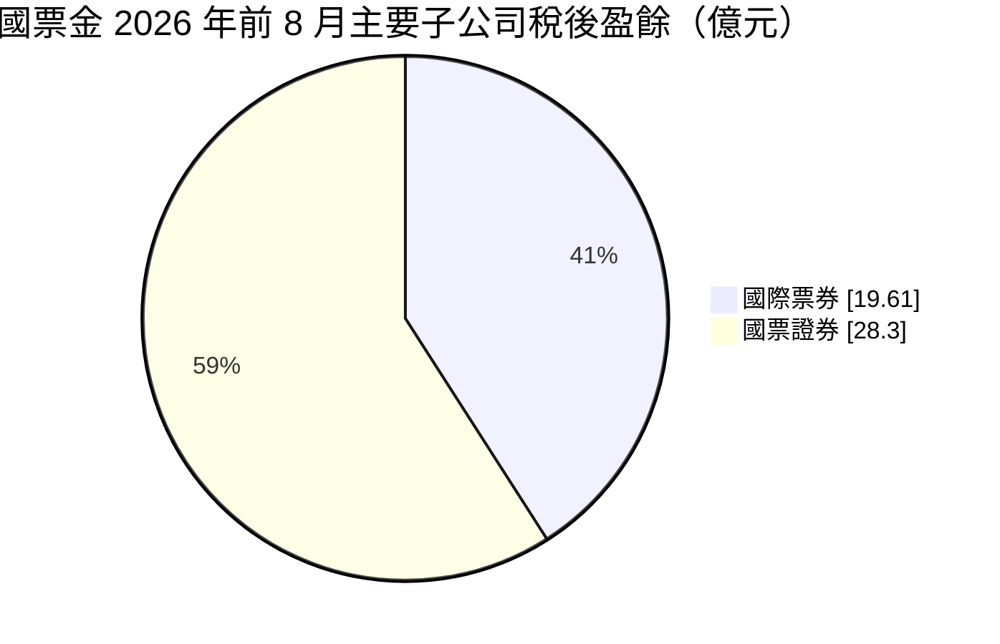
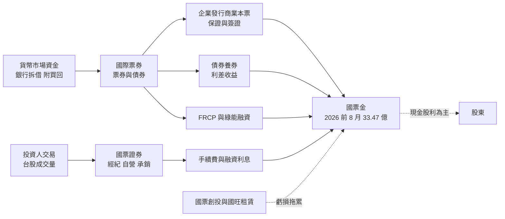
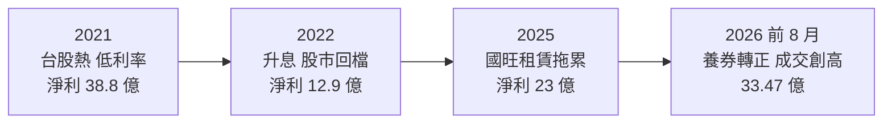
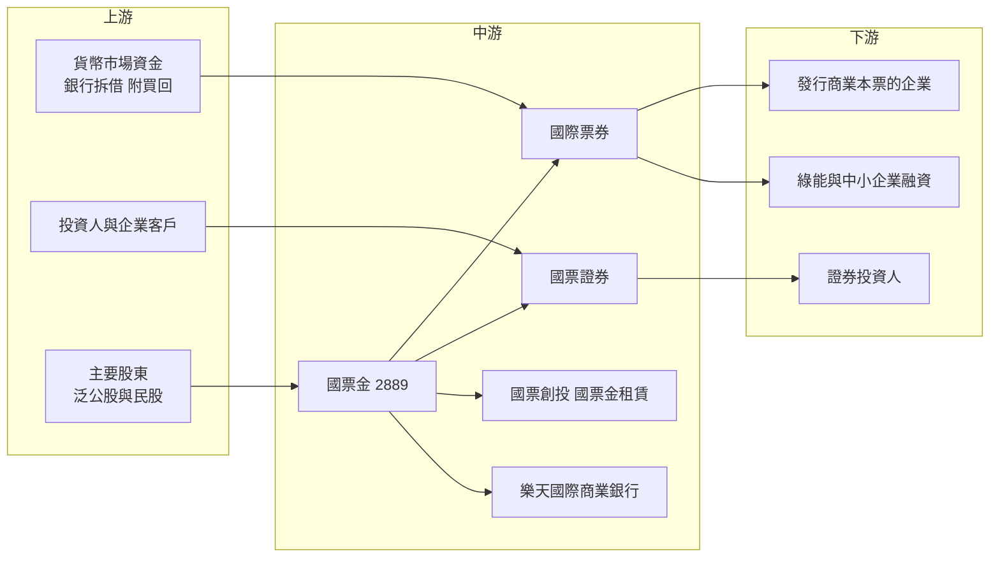

# 2889 國票金

> 上市｜[[產業索引-金融保險業|金融保險業]]｜上市（櫃）日期 2002/03/26

# 第一章：企業模式與商業藍圖

> [!info] 撰寫說明
> 本文由 Claude 依公開資料整理，架構比照 [[2330台積電]] 的四章研究，資料截至 2026-10-08。財務數字來源：Goodinfo 年度經營績效頁、富果研究（國票金 2026 年 3 月與 7 月法說會整理）、自由時報（2026 年前 8 月子公司獲利、經營權報導）、鏡週刊（2026 年 8 月經營權報導）、證交所開放資料（基本資料、股利、本益比）；產業描述為整理性內容，尚未逐條比對原始文件。#待校對

在評估單一個股的長期投資價值時，首要步驟是拆解企業的底層獲利邏輯。本章針對國票金融控股公司（股票代號：2889，以下簡稱國票金）的商業模式進行定性分析，說明一家以票券公司為核心、證券為第二支柱、沒有大型商業銀行的金控，獲利為什麼特別依賴利率與股市兩個變數。

## 一、核心定位：以票券為核心的小型金控

國票金成立於 2002 年 3 月，同日上市，前身是國際票券金融公司（以下簡稱國際票券），以國際票券為主體轉換成金控。截至 2026 年 10 月，實收資本額約 366.6 億元，董事長為張兆順、總經理為吳瑛。

和多數以銀行或壽險為核心的金控不同，國票金的子公司組成很特別：

* **國際票券：** 國內規模領先的票券公司，業務是替企業發行與保證商業本票、在貨幣市場買賣短期票券與債券，賺取短期資金的利差與保證手續費。這是國票金的獲利主力，2026 年上半年貢獻約 57% 的獲利。
* **國票證券：** 經紀、自營與承銷業務，2026 年上半年在台股熱絡下貢獻約 46% 的獲利。國票金並未持有國票證券全部股權，管理層表示收購其餘股權是長期方向，但目前沒有具體議案。
* **國票創投與國票金租賃：** 創投本業穩定，但其轉投資的中國融資租賃公司國旺租賃近年因中國景氣疲弱與呆帳提列而虧損，是集團的拖累來源。
* **樂天國際商業銀行：** 國票金是這家純網路銀行的主要股東之一（持股比例未查得），截至 2026 年仍為帳面虧損，2026 年被定位為企金業務元年，目標達成損益兩平。

這種結構的意義是：國票金沒有大型商業銀行提供穩定的存款與放款利息，獲利主要來自「短期利率與債券部位」及「股市成交量」，景氣與市場循環對它的影響比一般銀行型金控大。

## 二、業務板塊：子公司獲利結構

註：同期國票創投虧損 1.41 億元、樂天國際商業銀行仍虧損，未畫入圓餅圖；集團前 8 月稅後盈餘 33.47 億元，低於兩大子公司合計，差額來自虧損子公司、持股比例與金控費用。

* **票券業務：** 國際票券前 8 月稅後盈餘 19.61 億元、年增 59.57%，主因外幣債券養券收益由負轉正，股權投資也受惠電子股表現。票券公司的資金來源是短期拆借與附買回交易，資產是商業本票與債券，降息時資金成本下降、債券評價上升，對獲利有雙重好處。
* **證券業務：** 國票證券前 8 月稅後盈餘 28.3 億元、年增 328%，受台股日均成交值創紀錄帶動，經紀手續費與融資利息大增。但這種成長高度依賴市場熱度，2022 年台股回檔時集團淨利就大幅下滑。
* **其他：** 國票創投本業前 8 月獲利約 1.69 億元，但被國旺租賃拖累整體轉虧；國票金租賃規模小，2025 年稅後約 2,000 萬元。

## 三、資本轉化邏輯：短期資金與市場成交量

* **票券的利差邏輯：** 票券公司以短期借來的資金買進票券與債券，賺取兩者之間的利差。利率下降時資金成本先降、債券價格上漲，獲利擴大；利率快速上升時則相反，2022 年全球升息就讓國票金稅後淨利從 38.8 億元跌到 12.9 億元。
* **保證業務的信用風險：** 票券公司替企業發行的商業本票提供保證，等於承擔企業的信用風險，性質接近短期企業放款。景氣好時風險低，但若企業違約，票券公司要代為償付。
* **FRCP 與綠色金融：** 國際票券的 FRCP（循環信用發行商業本票）合約金額在 2026 年 6 月底約 986 億元，並參與太陽能電站融資與推出永續發展票券，這些是票券公司從單純短期融資延伸出的中長期業務。
* **證券的成交量邏輯：** 國票證券的經紀手續費與融資利息幾乎與台股成交量同步，屬於典型順週期收入。

## 四、企業長期藍圖：治理重整與補足拼圖

* **經營權變動：** 國票金長期是無單一大股東的「公司派」與多個民營股東並存的結構。2026 年股東會改選後，泛公股取得經營主導權，由張兆順出任董事長。新團隊表示首要目標是減少內耗、提升績效與完善治理。鏡週刊等媒體報導，改選後部分民股股東仍與經營團隊有爭議，治理穩定度仍需觀察。
* **補足集團拼圖：** 國票金缺乏商業銀行與投信，管理層承認這是證券經紀市占下滑、ETF 相關業務難以爭取的原因。樂天國際商業銀行的增資與企金化、研究收購國票證券其餘股權、規劃財富管理業務，都是補足拼圖的方向。
* **處理中國曝險：** 國旺租賃以處理逾期資產為首要任務，新業務採保守態度，2026 年 2 月底其逾放比達 13.32%。逐步縮小這個曝險，是國票金穩定獲利的前提。

# 第二章：護城河深度與競爭優勢

在長期價值投資中，「護城河」指企業抵禦競爭、維持超額利潤的保護機制。本章分析國票金的護城河構成、國內主要對手，以及這些優勢在利率與股市循環中能守住多少。

## 一、國票金護城河的核心組成要素

國票金的護城河集中在票券業務，屬於「窄護城河」：

* **1. 票券業務的規模與企業關係：** 國際票券深耕貨幣市場數十年，擁有廣泛的企業發票客戶與保證額度，熟悉企業短期資金調度。新進者要建立同等的企業信用資料與交易網路並不容易。
* **2. 專業的利率與債券操作能力：** 票券公司的核心技能是管理短期資金缺口與債券存續期間，這需要長年累積的交易與風險控管經驗。2026 年管理層提到會增加浮動利率債券、嚴控存續期間，就是這種能力的體現。
* **3. 金融執照：** 票券、證券、創投等執照均受監理，提供基本的進入門檻。

但國票金也有明顯的護城河缺口：沒有商業銀行就沒有低成本存款，沒有投信就難以參與 ETF 浪潮，證券經紀市占長期被大型金控蠶食。

## 二、全球主要競爭對手格局

| 對手 | 定位 | 對國票金的威脅 |
|---|---|---|
| 中華票券、兆豐票券、大中票券 | 國內主要票券公司（中華票券由 [[2897王道銀行]] 合併） | 在商業本票保證、簽證與債券業務直接競爭 |
| 銀行兼營票券（[[2886兆豐金]]、[[2891中信金]] 等） | 銀行以存款資金承作票券與聯貸 | 以低資金成本和放款替代商業本票融資 |
| [[2885元大金]]、[[2883凱基金]]、[[6005群益證]] | 大型證券商與金控 | 經紀、融資、自營與 ETF 業務規模遠大於國票證券 |
| 數位券商與網路下單平台 | 低手續費、年輕客群 | 壓縮經紀手續費率，搶走新開戶 |

## 三、優勢轉化：哪些市場守得住、哪些守不住

* **守得住：** 商業本票保證、簽證與票債券交易。這是國際票券的本業，企業關係與交易能力深厚，市場結構穩定。
* **守不住：** 證券經紀市占與財富管理。管理層在 2026 年法說會直接表示，缺乏銀行通路與投信子公司，難以爭取 ETF 相關法人業務，年輕客群與數位金融也相對弱勢。
* **觀察重點：** 新經營團隊能否穩定治理、國旺租賃的逾放能否下降、樂天國際商業銀行能否轉虧為盈，以及收購國票證券其餘股權的進度。這些因素決定國票金能否擺脫「市場好就賺、市場差就虧」的循環。

# 第三章：財務體質與盈利規模

資料日期：2026-10-08。數字取自 Goodinfo 年度經營績效頁、法說會整理、媒體報導與證交所開放資料，表格是撰寫當時的快照；最新月營收、累計 EPS 由自動排程寫在本筆記的屬性欄位（月營收、累計EPS 等）。#待校對

財務報表是檢驗護城河是否真實存在的最終標準。金控不適用毛利率與營業利益率，本章改用淨收益、稅後淨利、[[ROE]]、[[ROA]]、資本適足與[[雙重槓桿比率]]，檢視國票金的獲利品質。

## 一、獲利能力的基石：淨收益與淨利的波動

| 年度 | 淨收益（新台幣） | 稅後淨利 | EPS（元） | [[ROE]] | [[ROA]] |
|---|---|---|---|---|---|
| 2020 | 85.7 億 | 32.5 億 | 1.12 | 9.05% | 1.24% |
| 2021 | 102 億 | 38.8 億 | 1.30 | 10.6% | 1.38% |
| 2022 | 58.3 億 | 12.9 億 | 0.41 | 3.83% | 0.47% |
| 2023 | 70.9 億 | 20 億 | 0.58 | 5.47% | 0.69% |
| 2024 | 82.1 億 | 21.7 億 | 0.61 | 5.70% | 0.73% |
| 2025 | 85.9 億 | 23 億 | 0.63 | 5.54% | 0.67% |
| 2026 上半年 | 未查得 | 27.83 億 | 0.77 | 11.87%（年化） | 未查得 |

註：年度數字取自 Goodinfo 合併報表；證交所股利資料的 2025 年本期淨利為 22.96 億元。2026 年前 8 月稅後盈餘 33.47 億元、EPS 0.92 元，已超過 2025 年全年。

* **高波動是國票金的本質：** 2021 至 2022 年稅後淨利從 38.8 億元跌到 12.9 億元，淨收益幾乎腰斬，原因是升息同時打擊票券的債券部位與證券的成交量。2020 至 2025 年淨收益幾乎沒有成長（85.7 億元對 85.9 億元），稅後淨利年複合成長率約 -6.7%（推算）。
* **2026 年的回升：** 前 8 月獲利年增約 158%，國際票券外幣債券養券由負轉正、國票證券受惠成交量創紀錄。這說明國票金的獲利高點出現在「利率下降加股市熱絡」的組合。
* **利差：** 票券公司的利差資訊在本次查得的資料中未揭露（未查得），金控也沒有銀行型的 NIM 可比較。

## 二、[[ROE]] 與 [[ROA]]：資本效率

2021 至 2025 年平均 ROE 約 6.2%（推算），但年度間差異極大：2021 年 10.6%、2022 年 3.83%。ROA 在 0.5% 至 1.4% 之間，高於一般銀行，因為票券與證券的槓桿低於銀行。2026 年上半年年化 ROE 約 11.87%，每股淨值 13.11 元，是近五年最好的水準，但歷史經驗顯示這種高點不易長期維持。

## 三、資本適足、雙重槓桿與股利

* **金控[[資本適足率]]：** 2026 年 5 月約 127.19%，管理層表示因證券子公司業務擴張耗用較多資本而下降。金控資本適足率的法定門檻為 100%，緩衝並不寬裕。
* **[[雙重槓桿比率]]：** 2026 年 6 月約 116.41%，代表金控對子公司的長期投資略高於金控本身的淨值，部分以負債支應。
* **資本需求：** 管理層表示證券業資本普遍緊俏，可能以現金增資或盈餘轉增資因應，並提醒 2027 年股利可能因保留盈餘支持成長而受限。
* **股利：** 2025 年度擬配現金 0.5 元與股票 0.089 元，現金配發率約 79%（推算，0.5 ÷ 0.63）。章程規定盈餘的 50% 以上分派股東股利。Goodinfo 統計歷年平均現金股利約 0.47 元、股票股利約 0.21 元。

## 四、ROE 與權益資金成本：價值創造利差

**為什麼金融業不用 ROIC：** [[ROIC]] 把有息負債視為投入資本、以 [[WACC]] 為門檻。但票券公司的拆借與附買回負債、證券公司的融資資金，都是營業本身的原料，利息支出就是營業成本，無法和資本分開。因此分析金控時直接比較 ROE 與權益資金成本較合理。

**權益資金成本推算：** 以 [[CAPM]] 估算，假設台灣 10 年期公債殖利率 1.75%、市場風險溢酬 6%，β 考量國票金含證券業務、獲利波動高於一般銀行，取 0.85（同業常見值推估，非來源數字），權益資金成本約為 1.75% ＋ 0.85 × 6% ＝ 6.85%（推算）。

**比較：** 2022 至 2025 年國票金 ROE 在 3.8% 至 5.7% 之間，低於推算的權益成本約 1 至 3 個百分點，代表這四年在毀損股東價值；只有 2020 至 2021 年與 2026 年的市場高點，ROE 才明顯高於權益成本。2021 至 2025 年平均 ROE 約 6.2%，也略低於權益成本。結論是：國票金長期平均大致無法賺回資金成本，價值創造集中在利率下降與股市熱絡的少數年份。證交所資料顯示股價淨值比約 1.24 倍，反映市場已部分計入 2026 年的獲利回升與經營權變化（推估）。

# 第四章：總體風險與地緣政治

任何企業都無法脫離宏觀環境獨立存在。本章分析國票金未來必須面對的地緣政治、利率與市場週期，以及營運風險。

## 一、地緣政治風險

* **中國曝險：** 國票創投轉投資的國旺租賃位於中國，受當地景氣疲弱與信用風險影響，2026 年前 8 月使國票創投轉為虧損，自由時報形容為國票金當年獲利的最大變數。兩岸關係與中國經濟走向，直接影響這筆投資的回收。
* **金融市場的地緣衝擊：** 地緣衝突引發的股市重挫或債券殖利率飆升，會同時打擊證券經紀、自營與票券的債券部位，國票金對這類衝擊的敏感度高於傳統銀行。

## 二、利率與市場週期

* **利率方向是第一變數：** 國際票券的債券與票券部位對利率非常敏感。管理層在 2026 年表示，市場預期美國聯準會降息機會低、甚至不排除升息，因此增加浮動利率債券、控制存續期間。若利率反轉向上，2022 年的情況可能重演。
* **台股成交量：** 國票證券的獲利幾乎與台股成交量同步，2026 年成交值創紀錄帶來的高獲利不應視為常態。
* **信用循環：** 票券保證本質上是企業信用風險，景氣下行時企業違約會轉成票券公司的損失。

## 三、營運環境的隱性風險

* **治理與經營權：** 國票金長期處於股權分散、多方角力的狀態，2026 年改選後泛公股取得主導，但媒體報導民股股東與經營層仍有衝突，股利發放時程也因董事會會期調整而延後。治理不穩會影響策略延續與員工士氣。
* **資本緊俏：** 金控資本適足率約 127%，證券業務擴張又需要資本，未來可能需要現金增資或保留盈餘，對股利不利。
* **樂天國際商業銀行的投資風險：** 純網銀仍在虧損階段，若遲遲無法損益兩平，可能需要持續增資。

## 四、法規與科技演進

* **證券業數位化：** 數位券商與低手續費競爭壓縮經紀收入，國票證券在年輕客群與數位平台上相對弱勢。
* **票券業的結構變化：** 銀行聯貸與公司債市場發展，可能取代部分企業以商業本票融資的需求，票券業的長期成長空間有限。
* **金融整併政策：** 主管機關鼓勵金融業整併，小型金控可能成為併購標的或被要求整合，股東權益結構可能因此改變（推估）。

# 專有名詞解析

## 金融

- **[[票券]]**：一年期以下的短期票據，如商業本票，由票券公司簽證、承銷與買賣，賺取短期資金利差。
- **[[商業本票]]**：企業為籌措短期資金發行的票據，通常由票券公司保證後在貨幣市場出售。
- **[[FRCP]]**：循環信用發行商業本票，企業在約定期間內可循環發行商業本票，由票券公司保證，性質接近中期融資。
- **[[養券]]**：以短期借來的資金買進債券並持有，賺取債券利息與資金成本之間的利差。
- **[[附買回交易]]**：金融機構賣出債券並約定日後買回，實質上是以債券為擔保的短期借款。
- **[[金控]]**：金融控股公司，以控股方式持有銀行、證券、保險等子公司，可整合資源與交叉銷售。
- **[[雙重槓桿比率]]**：金控對子公司的長期股權投資除以金控淨值，超過 100% 代表部分投資以負債支應。
- **[[資本適足率]]**：自有資本除以風險性資產，主管機關用來確保金融機構有足夠資本承擔損失；金控的法定門檻為 100%。
- **[[ROE]]**：股東權益報酬率，稅後淨利除以股東權益，衡量公司運用股東資本賺錢的效率。
- **[[ROA]]**：資產報酬率，稅後淨利除以總資產，金融業因槓桿高，ROA 通常偏低。
- **[[CAPM]]**：資本資產定價模型，以無風險利率加上 β 乘以市場風險溢酬，推估股東要求的報酬率。
- **[[ROIC]]**：投入資本報酬率，稅後營業利益除以股東權益加有息負債，衡量本業運用資本的效率；不適用於金融業。
- **[[WACC]]**：加權平均資金成本，依股權與負債比重加權的資金成本，是判斷 ROIC 是否創造價值的門檻。

# 核心供應鏈

## 1. 上游：資金來源
- 貨幣市場資金：銀行拆借、附買回交易
- 證券投資人的交易委託與融資需求
- 主要股東：泛公股與民營股東

## 2. 中游：國票金與子公司
- 國際票券：商業本票保證、簽證、票債券交易、FRCP
- 國票證券：經紀、自營、承銷
- 國票創投（含中國國旺租賃）、國票金租賃
- 轉投資：樂天國際商業銀行

## 3. 下游：主要客群
- 發行商業本票的企業、綠能電站開發商
- 台股與債券投資人

## 4. 同業比較
- 票券同業：中華票券（[[2897王道銀行]]合併）、兆豐票券（[[2886兆豐金]]）
- 證券同業：[[2885元大金]]、[[2883凱基金]]、[[6005群益證]]

## 最新新聞
<!-- news:start（自動產生，請勿手動編輯此範圍） -->
- 2026-10-07 📰 媒體 14:51｜國票金前3季賺37億元年增116% EPS突破1元 證券獲利再創新高｜[鉅亨網](https://news.cnyes.com/news/id/6619380)
- 2026-10-07 🏛️ 重訊 13:58｜公告本公司115年9月份自結盈餘｜[觀測站](https://mops.twse.com.tw/mops/#/web/t05st01)

完整紀錄：[[2889國票金 新聞]]
<!-- news:end -->

## 相關連結
- [公開資訊觀測站](https://mopsov.twse.com.tw/mops/web/t05st03?step=1&firstin=1&co_id=2889)
- [Goodinfo](https://goodinfo.tw/tw/StockDetail.asp?STOCK_ID=2889)
- [Yahoo 股市](https://tw.stock.yahoo.com/quote/2889)
- [鉅亨網新聞](https://www.cnyes.com/twstock/2889/news)
