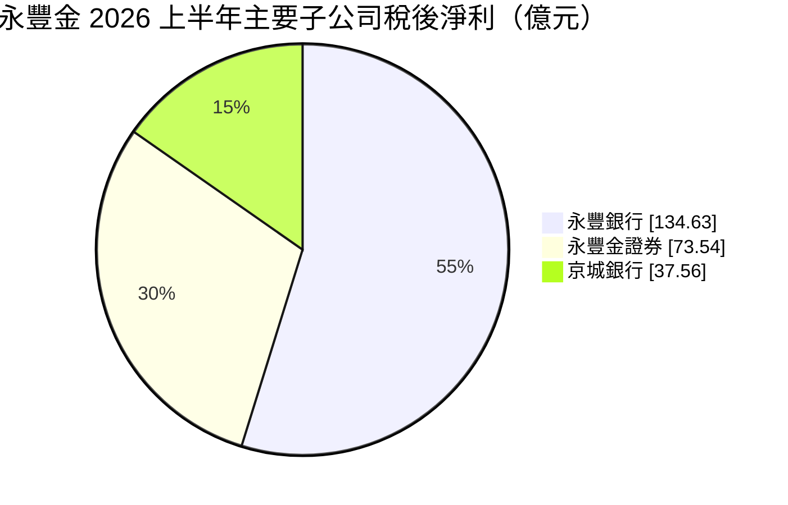
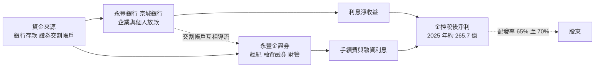
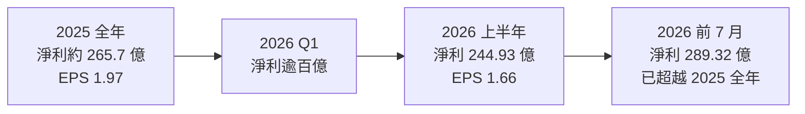
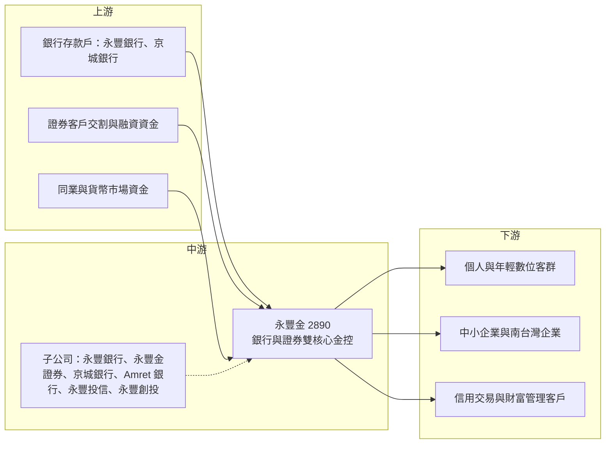

# 2890 永豐金

> 上市｜[[產業索引-金融保險業|金融保險業]]｜上市（櫃）日期 2002/05/09

# 第一章：企業模式與商業藍圖

> [!info] 撰寫說明
> 本文由 Claude 依公開資料整理，架構比照 [[2330台積電]] 的四章研究，資料截至 2026-10-07。財務數字來源：優分析（永豐金 2025 年法說會與股利）、NOWnews（2026 年上半年法說會）、優分析與 yam 蕃新聞（金控獲利排行）；產業描述為整理性內容，尚未逐條比對原始文件。#待校對

在評估單一個股的長期投資價值時，首要步驟是拆解企業的底層獲利邏輯。本章針對永豐金融控股（股票代號：2890，以下簡稱永豐金）的商業模式進行定性分析，說明一家沒有大型壽險子公司的民營金控，如何以銀行與證券雙核心賺錢，以及 2025 年連續三項併購如何改變它的規模與獲利結構。

## 一、核心定位：以銀行與證券為雙核心、近年積極併購的民營金控

永豐金前身為 2002 年成立的建華金控，後與台北國際商業銀行等整併，形成今天以永豐銀行與永豐金證券為兩大支柱的民營金控。和多數台灣大型金控不同，永豐金沒有大型壽險子公司，這有兩個商業意義：

* **獲利來源較單純：** 獲利主要來自銀行[[利差]]、手續費與證券經紀，不必承擔壽險的匯率避險、利差損與新會計制度的資本壓力，波動程度介於銀行型金控與證券型金控之間。
* **以併購擴大規模：** 2025 年是永豐金的「併購年」：1 月納入柬埔寨 Amret 銀行、10 月 1 日納入京城銀行、10 月 20 日納入台灣匯立證券，同時在海外[[微型金融]]、南台灣企業金融與證券業務上擴張。

2025 年稅後淨利約 265.7 億元，年增 19.2%，連續三年創新高；2026 年上半年在合併效益與台股熱絡帶動下，稅後淨利 244.93 億元，年增 94%，前 7 月 289.32 億元已超越 2025 年全年。

## 二、業務板塊：子公司獲利貢獻

金控不適用製造業的營收結構分析，以下以 2026 年上半年主要子公司稅後淨利呈現獲利來源（三家合計略高於金控淨利，差額為金控本身費用與其他子公司損益）：

* **永豐銀行：** 集團最大獲利來源。2025 年稅後淨利 194.6 億元，年增 11.7%，ROE 10.1%，調整後 [[NIM]] 1.41%，[[逾放比]] 0.19%。2026 年上半年淨收益 325.37 億元（年增 18.1%），稅後淨利 134.63 億元（年增 20.9%），利息淨收益 202.90 億元（年增 26%），手續費淨收益 74.61 億元（年增 11.9%），淨利差 1.42%，較去年同期擴大 21 個基點。
* **永豐金證券：** 2025 年稅後淨利 64.7 億元，ROE 16.5%。2026 年上半年稅後淨利 73.54 億元，年增 249%，淨收益 166.59 億元，經紀手續費 72 億元（年增 160%），經紀市占 5.02%、[[融資融券]]的融資餘額市占 7.79%，年化 ROE 34.86%。
* **京城銀行：** 以南台灣企業金融與不動產相關授信為主，資產品質佳。2025 年第四季貢獻長期投資收益 12.2 億元，當時逾放比 0.02%；2026 年上半年稅後淨利 37.56 億元，年增 138.6%（排除處分利益後年增 32%），年化 ROE 12.6%。
* **海外子行：** 柬埔寨 Amret 銀行以微型金融為主，另有越南、香港等海外據點（本次未逐一查證）。

## 三、資本轉化邏輯：存款與交割資金的雙循環

* **銀行與證券互相導流：** 證券客戶的交割帳戶開在銀行，帶來低成本活期存款；銀行的財富管理客戶也會使用證券下單與融資服務。融資餘額市占 7.79% 高於經紀市占 5.02%，顯示信用交易業務具競爭力。
* **營運據點：** 國內以永豐銀行分行網路、永豐金證券營業據點與數位平台（大戶 DAWHO 數位帳戶、豐存股等）為主；併入京城銀行後補強南台灣布局；海外以柬埔寨 Amret 銀行為東南亞重點。

## 四、企業長期藍圖：併購整合與證券擴張

* **併購整合：** 把三項併購案的效益落實到利息收入與手續費，2025 年利息淨收益年增 48.5% 至 383 億元，部分來自併購貢獻與美元資金成本下降。
* **證券增資擴張：** 永豐金證券辦理 200 億元現金增資，發行 6.4 億股，預計 2026 年第四季完成募集，用於擴大資本與業務規模。
* **數位金融：** 以數位帳戶與證券 App 吸引年輕客群，帶動經紀與財管業務。
* **股利穩定：** 配發率維持 65% 至 70%，以現金為主。

# 第二章：護城河深度與競爭優勢

在長期價值投資中，「護城河」指企業抵禦競爭、維持超額利潤的保護機制。金融業的產品同質性高、監理嚴格，護城河主要來自資金成本、客戶黏著度與通路。本章分析永豐金的護城河構成、銀行與證券兩個戰場的主要對手，以及這些優勢在台股降溫後能守住多少。

## 一、永豐金護城河的核心組成要素

* **1. 銀行與證券的協同：** 銀行交割帳戶、證券經紀、融資融券與財富管理可互相導流，這是單純銀行或單純券商難以複製的組合。
* **2. 數位通路：** 大戶 DAWHO 等數位品牌在年輕客群中具知名度（定性描述），降低獲客成本，也讓證券經紀在台股熱絡時快速放大。
* **3. 資產品質：** 銀行逾放比維持在 0.2% 左右，京城銀行資產品質也佳，信用風險緩衝足夠。
* **4. 併購整合經驗：** 一年內完成三項併購並開始貢獻獲利，顯示管理層的整合執行力。

## 二、主要競爭對手格局

| 對手 | 定位 | 對永豐金的威脅 |
|---|---|---|
| [[2891中信金]]、[[2884玉山金]]、2887台新金 | 大型民營銀行型金控 | 財管、信用卡與數位金融規模較大 |
| [[2892第一金]]、[[2880華南金]] | 公股銀行型金控 | 中小企業放款與低資金成本 |
| [[2885元大金]]、[[2883凱基金]] | 證券型金控 | 經紀與承銷市占明顯領先 |
| 數位券商與純網銀 | 低手續費、數位體驗 | 搶年輕客群，壓低手續費率 |

## 三、優勢轉化：哪些市場守得住、哪些守不住

* **守得住：** 數位化的證券與銀行服務、信用交易業務；併購帶來的規模與區域互補。
* **守不住：** 經紀市占約 5%，與元大、凱基仍有明顯差距；沒有大型壽險，財富管理產品線較依賴外部保險公司。
* **觀察重點：** 京城銀行與匯立證券整合後的成本與獲利、證券增資後的市占變化、銀行淨利差在利率反轉時能否守住。

# 第三章：財務體質與盈利規模

資料日期：2026-10-07。數字取自公司法說會與財經媒體報導，表格是撰寫當時的快照；最新月營收、毛利率、累計 EPS 由自動排程寫在本筆記的屬性欄位（月營收、毛利率、累計EPS 等）。#待校對

財務報表是檢驗護城河是否真實存在的最終標準。金控不適用製造業的毛利率與營業利益率，本章改以淨收益與淨利、ROE、資產品質與資本、股利政策四個面向，檢視永豐金併購後的獲利品質。

## 一、獲利能力的基石：淨收益與稅後淨利

| 項目 | 2025 全年 | 2026 上半年 | 2026 前 7 月 |
|---|---|---|---|
| 稅後淨利（新台幣） | 約 265.7 億 | 244.93 億 | 289.32 億 |
| 年增率 | 19.2% | 94% | 未查得 |
| EPS（元） | 1.97 | 1.66 | 未查得 |
| [[ROE]] | 11.50% | 年化 18.98% | 未查得 |
| 淨收益 | 743.9 億 | 552.82 億 | 未查得 |

* **淨收益：** 2026 年上半年淨收益 552.82 億元創歷史新高，成長主要來自銀行利息收入、證券經紀手續費與京城銀行合併效益。
* **獲利結構：** 銀行利息淨收益年增 26%、手續費淨收益年增 11.9%，證券經紀手續費年增 160%，證券是上半年獲利倍增的最大推力，但也是景氣循環性最高的部分。
* 2026 年第一季淨利本次未查得精確數字，報導僅指出超過百億元。

## 二、ROE 與子公司資本效率

| 子公司 | 2025 全年淨利 | 2026 上半年淨利 | 其他指標 |
|---|---|---|---|
| 永豐銀行 | 194.6 億 | 134.63 億 | 2025 年 ROE 10.1%、淨利差 1.42% |
| 永豐金證券 | 64.7 億 | 73.54 億 | 2025 年 ROE 16.5%、上半年年化 34.86% |
| 京城銀行 | 第四季貢獻 12.2 億 | 37.56 億 | 年化 ROE 12.6% |

金控 ROE 由 2025 年的 11.50% 升到 2026 年上半年年化 18.98%，主要來自證券獲利暴增。銀行 ROE 約一成，屬穩定的基本盤；證券 ROE 在多頭時可達三成以上，空頭時則可能大幅回落。因此金控 ROE 的長期中樞，推估應接近 2025 年的一成出頭，而非上半年的高點。

## 三、資產品質與資本適足

* **資產品質：** 永豐銀行逾放比由 2025 年的 0.19% 小幅上升至 2026 年上半年的 0.23%，[[備抵呆帳覆蓋率]] 618%，仍屬健康水準。
* **資本：** 金控[[資本適足率]]與[[雙重槓桿比率]]本次未查得。證券 200 億元增資會使用集團資本，需留意對金控資本與股利的影響。

## 四、股利政策與資本運用

* 2025 年盈餘配發現金 1.1 元、股票 0.2 元，合計 1.3 元，配發率約 71%，高於前一年的 1.25 元。
* 公司表示配發率維持 65% 至 70%，以現金為主，並逐步增加現金、降低股票股利比重。
* 股票股利與併購換股會增加股本，未來 EPS 成長幅度會低於淨利成長幅度，評估時應同時看淨利與 EPS。

# 第四章：總體風險與地緣政治

任何企業都無法脫離宏觀環境獨立存在。本章分析永豐金未來必須面對的地緣政治與海外風險、利率與台股週期、併購整合的營運風險，以及金融監理與數位化帶來的挑戰。

## 一、地緣政治與海外風險

* **東南亞子行：** 柬埔寨 Amret 銀行以微型金融為主，受當地經濟、匯率與政治環境影響，信用風險高於台灣市場。
* **兩岸風險：** 台股成交量與外資動向受兩岸情勢影響，會反映在證券獲利上。

## 二、利率與景氣週期

* **利差：** 2025 年至 2026 年利息淨收益大幅成長部分來自美元資金成本下降，若利率環境反轉，淨利差可能收斂。法說會預估聯準會與台灣央行 2026 年 9 月利率不變。
* **台股熱度：** 證券獲利在 2026 年上半年年增 249%，屬景氣高點，成交量回落時會明顯下降。

## 三、營運環境的隱性風險

* **併購整合：** 京城銀行與匯立證券的系統、人員與企業文化整合需時間，整合不順可能侵蝕綜效。
* **不動產授信：** 京城銀行過去以不動產相關授信為主，若房市降溫，資產品質需重新檢視（推估）。
* **股本稀釋：** 股票股利與併購換股會增加股本，影響 EPS 成長。

## 四、法規與科技演進

* **證券監理：** 融資融券與自營業務受主管機關風險控管要求影響。
* **銀行資本規範：** 若資本要求提高，需保留盈餘或增資。
* **數位競爭與資安：** 數位帳戶是永豐的強項，也代表資安事件的衝擊較大；純網銀與數位券商持續壓低手續費率。

# 專有名詞解析

## 金融

- **[[利差]]**：銀行放款利率與存款利率的差距，是銀行最主要的獲利來源。
- **[[NIM]]**：淨利息收益率，利息淨收益除以生息資產，衡量銀行整體資產賺取利息的效率。
- **[[逾放比]]**：逾期放款占總放款的比例，數字越低代表放款資產品質越好。
- **[[備抵呆帳覆蓋率]]**：備抵呆帳除以逾期放款，衡量銀行為可能的壞帳預先提列了多少緩衝。
- **[[資本適足率]]**：自有資本除以風險性資產，主管機關用來確保金融機構有足夠資本承擔損失。
- **[[雙重槓桿比率]]**：金控對子公司的長期股權投資除以金控淨值，比率越高代表金控以舉債支應子公司資本的程度越高。
- **[[融資融券]]**：券商借錢給投資人買股票（融資）或借股票給投資人賣出（融券），券商可賺取利息與費用。
- **[[微型金融]]**：提供小額貸款與存款給低收入戶與小微企業的金融服務，利率高但信用風險也較高。
- **[[ROE]]**：股東權益報酬率，稅後淨利除以股東權益，衡量公司運用股東資本賺錢的效率。

# 核心供應鏈

## 1. 上游：資金來源
- 銀行存款戶（永豐銀行、京城銀行）
- 證券客戶交割與融資資金
- 同業與貨幣市場資金

## 2. 中游：永豐金與子公司
- 永豐銀行、永豐金證券、京城銀行、柬埔寨 Amret 銀行、永豐投信、永豐創投

## 3. 下游：主要客群
- 個人與年輕數位客群（數位帳戶、證券 App）
- 中小企業與南台灣企業客戶
- 信用交易與財富管理客戶

## 4. 同業比較
- 證券型金控：[[2885元大金]]、[[2883凱基金]]
- 銀行型民營金控：[[2891中信金]]、[[2884玉山金]]、2887台新金

## 最新新聞
<!-- news:start（自動產生，請勿手動編輯此範圍） -->
- 2026-10-08 📰 媒體 18:21｜營收速報 - 永豐金(2890)9月營收84.42億元年增率高達29.84％｜[鉅亨網](https://news.cnyes.com/news/id/6625172)
- 2026-10-08 🏛️ 重訊 15:02｜永豐金控公告其與子公司115年9月合併自結損益｜[觀測站](https://mops.twse.com.tw/mops/#/web/t05st01)

完整紀錄：[[2890永豐金 新聞]]
<!-- news:end -->

## 相關連結
- [公開資訊觀測站](https://mopsov.twse.com.tw/mops/web/t05st03?step=1&firstin=1&co_id=2890)
- [Goodinfo](https://goodinfo.tw/tw/StockDetail.asp?STOCK_ID=2890)
- [Yahoo 股市](https://tw.stock.yahoo.com/quote/2890)
- [鉅亨網新聞](https://www.cnyes.com/twstock/2890/news)
