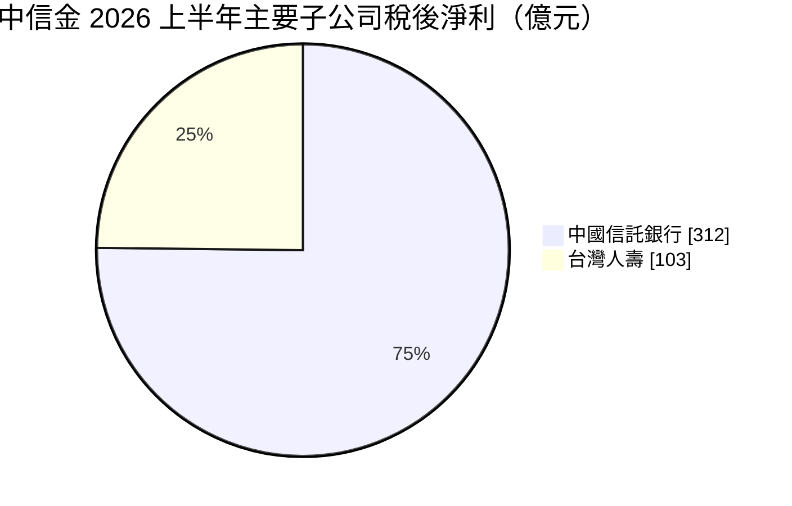
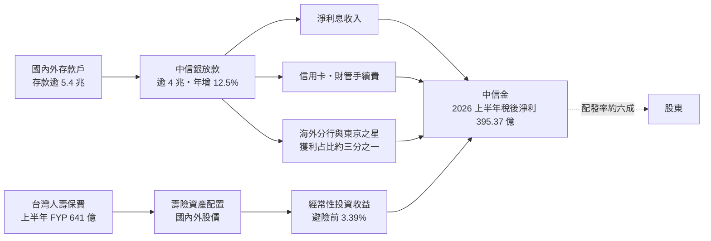
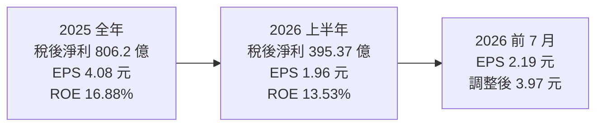
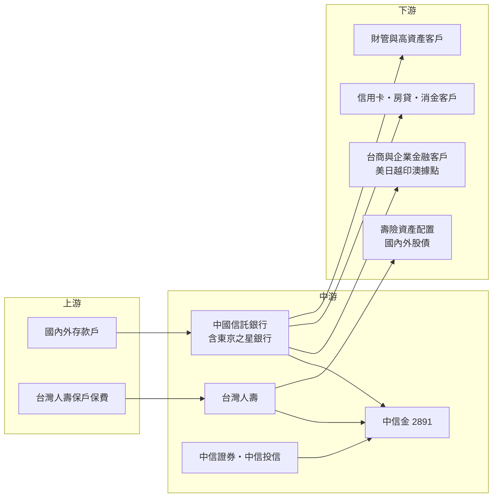

# 2891 中信金

> 上市｜[[產業索引-金融保險業|金融保險業]]｜上市（櫃）日期 2002/05/17

# 第一章：企業模式與商業藍圖

> [!info] 撰寫說明
> 本文由 Claude 依公開資料整理，架構比照 [[2330台積電]] 的四章研究，資料截至 2026-10-07。財務數字來源：優分析（2025 年全年自結、2025 年度配息、2025 年第四季與 2026 年上半年法說會、海外布局報導）、ETtoday 財經雲（2026 年上半年法說會）；產業描述為整理性內容，尚未逐條比對原始文件。#待校對

在評估金融股的長期投資價值時，首要步驟是看清楚獲利從哪一家子公司、哪一種業務而來。本章針對中國信託金融控股（股票代號：2891，以下簡稱中信金）的商業模式進行定性分析，說明它如何以中國信託商業銀行為核心、跟隨台商布局海外，並以台灣人壽補足保險版圖，成為國內獲利規模名列前茅的銀行型[[金控]]。

## 一、核心定位：以銀行為核心、海外布局最廣的民營金控

中信金控成立於 2002 年，旗下主要子公司為中國信託商業銀行（中信銀）、台灣人壽、中國信託證券與中國信託投信，並透過中信銀持有日本東京之星銀行。中信銀是國內規模最大的民營銀行之一，2026 年報導指其放款突破 4 兆元、存款超過 5.4 兆元。

2025 年中信金稅後純益 806.2 億元，EPS 4.08 元首度突破 4 元，[[ROE]] 16.88%。2026 年上半年稅後淨利 395.37 億元、年增 10%，EPS 1.96 元，淨值突破 7,000 億元。

對投資人而言，中信金有兩個基本特徵：

* **銀行決定獲利主體：** 中信銀 2025 年稅後純益約 573 億元、年增 16%，占金控獲利七成左右，獲利結構比壽險型金控穩定。
* **海外是成長引擎：** 中信銀海外獲利占比約三分之一，2025 年第四季法說會揭露約 34%，另有報導指占比 36%，管理層目標是維持在三分之一水準。

## 二、業務板塊：銀行為主、壽險為輔

以 2026 年上半年主要子公司稅後淨利來看，獲利結構如下：

兩家子公司合計約 415 億元，高於金控合併稅後淨利 395.37 億元，差額來自金控層級費用、其他子公司與合併調整（推估）；證券與投信的個別獲利本次未查得。

* **中國信託銀行：** 2025 年淨利息收入年增近 22%、放款成長 10%、手續費收入年增近 11%，信用卡簽帳金額突破 1 兆元。2026 年上半年稅後盈餘 311.78 億元、年增 12%，國內外新增放款規模約 5,000 億元，財富管理手續費收入年增 40% 以上。
* **台灣人壽：** 2025 年稅後淨利約 208.5 億元、年減 3%；2026 年上半年稅後純益 102.76 億元、年增 42%，新契約保費（[[FYP]]）641 億元、年增 139%，全年 FYP 目標上修至超過 1,000 億元。[[CSM]] 餘額 1,770 億元，較 2025 年底成長約 8%。
* **證券與投信：** 中國信託證券與投信規模相對小，主要扮演財管商品與經紀通路角色。

## 三、資本轉化邏輯：存款、保費如何變成獲利

* **銀行端：** 中信銀靠放款利差、信用卡與財富管理手續費賺錢，企業金融跟隨台商赴海外設廠，提供跨境放款、[[聯貸]]與現金管理服務。
* **壽險端：** 台灣人壽以保費投資國內外股債，2026 年上半年避險前經常性收益率 3.39%、避險後投資報酬率 2.96%，扣除負債成本 2.47% 後仍有正利差。
* **集團綜效：** 中信銀的財管與信用卡客群，是台灣人壽銀行保險通路與投信基金的主要銷售對象，屬於[[交叉銷售]]。

## 四、企業長期藍圖：跟隨台商深耕海外

依 2026 年法說會報導，中信銀海外布局可分為五個區域：

* **越南：** 既有胡志明市分行與河內辦事處，2025 年新獲准設立海防與平陽辦事處。
* **東南亞與印度：** 規劃印尼三寶瓏分行，印度 GIFT City 分行預計年內開業，並評估孟買設點。
* **日本：** 子行東京之星銀行熊本支行升格為分行，中信銀東京分行在福岡設立出張所，主要服務赴九州投資的半導體供應鏈台商。
* **北美：** 美國洛杉磯分行與德州休士頓辦事處已獲核准。
* **澳洲：** 規劃雪梨辦事處升格為分行。

管理層表示沒有裁撤海外據點的計畫，策略是「跟隨台商投資腳步」，同時推出私募信貸等財管新產品。

# 第二章：護城河深度與競爭優勢

在長期價值投資中，「護城河」指企業抵禦競爭、維持超額利潤的保護機制。金融業產品同質性高，護城河多半來自規模、資金成本、客戶基礎與海外網絡。本章分析中信金的護城河構成、主要競爭對手，以及這些優勢能守住多少。

## 一、護城河的核心組成要素

中信金的護城河屬於國內銀行業中較寬的一類，主要由四個要素組成：

* **1. 最廣的海外網絡：** 中信銀在美國、日本、東南亞、印度、澳洲都有據點，且持有東京之星銀行，能提供台商跨國現金管理與融資，這是多數國內銀行做不到的。
* **2. 信用卡與消費金融規模：** 信用卡簽帳金額突破 1 兆元，大量的消費數據與客群是財管與保險銷售的基礎。
* **3. 財富管理能力：** 2026 年上半年財管手續費收入年增 40% 以上，高資產客群經營具規模優勢。
* **4. 銀行型獲利結構：** 銀行占獲利主體，使中信金獲利對股市的敏感度低於壽險型金控，ROE 長期維持在國內金控前段。

## 二、全球主要競爭對手格局

| 對手 | 定位 | 對中信金的威脅 |
|---|---|---|
| [[2881富邦金]]、[[2882國泰金]] | 壽險規模最大的兩家金控，銀行也完整 | 在信用卡、財管與企業金融全面競爭 |
| [[2884玉山金]] | 財管與信用卡見長，海外也積極 | 在財管客群、數位銀行與東南亞布局競爭 |
| [[2886兆豐金]] | 外匯與企業金融強的公股金控 | 在台商跨境金融與聯貸競爭 |
| [[2887台新新光金]] | 合併後的銀行加壽險金控 | 在消費金融與財管客群重疊 |
| [[2890永豐金]] | 銀行與證券並重的民營金控 | 在數位與中小企業客群競爭 |

## 三、優勢轉化：哪些守得住、哪些守不住

* **守得住：** 海外網絡與台商客群、信用卡規模、財管能力。這些需要多年投資與監理核准才能建立，競爭者短期難以複製。
* **守不住：** 壽險規模仍明顯小於國泰、富邦，台灣人壽 2025 年獲利年減 3%，新契約大幅成長但能否轉化為長期利潤仍需時間驗證。房貸方面，總經理提到「四貸同堂」案例約 50 人，風險可控，但也反映房市槓桿議題受到關注。
* **觀察重點：** 海外獲利占比能否維持在三分之一、台灣人壽 FYP 目標超過 1,000 億元能否達成並帶動 CSM 成長，以及降息循環中銀行利差能否守住。

# 第三章：財務體質與盈利規模

資料日期：2026-10-07。數字取自公司法說會與財經媒體報導，表格是撰寫當時的快照；最新月營收、毛利率、累計 EPS 由自動排程寫在本筆記的屬性欄位（月營收、毛利率、累計EPS 等）。#待校對

財務報表是檢驗護城河是否真實存在的最終標準。金控不適用一般產業的毛利率與資本支出概念，本章改用稅後淨利、[[ROE]]、[[每股淨值]]、資本與股利、利差與資產品質等金融業指標，檢視中信金的獲利品質。

## 一、獲利能力的基石：稅後淨利與子公司貢獻

| 項目 | 2025 全年 | 2026 上半年 | 2026 前 7 月 |
|---|---|---|---|
| 稅後淨利（新台幣） | 806.2 億 | 395.37 億 | 未查得 |
| EPS（元） | 4.08 | 1.96 | 2.19 |
| 調整後 EPS（含 FVOCI 處分利益，元） | 未查得 | 未查得 | 3.97 |
| [[ROE]] | 16.88% | 13.53% | 未查得 |
| [[ROA]] | 0.91% | 0.83% | 未查得 |
| 中信銀稅後淨利 | 約 573 億 | 311.78 億 | 未查得 |
| 台灣人壽稅後淨利 | 約 208.5 億 | 102.76 億 | 未查得 |

* **銀行穩定成長：** 中信銀 2025 年與 2026 年上半年稅後淨利分別年增 16% 與 12%，是集團獲利的基本盤。
* **壽險貢獻回升：** 台灣人壽 2026 年上半年獲利年增 42%，加上 [[FVOCI]] 股票處分利益後，前 7 月調整後 EPS 達 3.97 元，顯示股市大漲也替中信金帶來額外收益。
* **獲利品質：** 相較壽險型金控，中信金一般 EPS 與調整後 EPS 的差距較小，經常性獲利比重較高。

## 二、ROE 與每股淨值：資本效率

中信金 2025 年 ROE 16.88%，屬國內金控前段班；2026 年上半年 ROE 13.53%。每股淨值由 2025 年底 24.8 元升至 34.3 元、成長 38.7%，淨值規模突破 7,000 億元，主要來自當期綜合損益約 1,890 億元，其中包含壽險持股評價上升。淨值快速擴大會使 ROE 分母變大，未來 ROE 能否維持高檔需要觀察。

## 三、資本適足與股利政策

* **股利：** 2025 年度每股現金股利 2.5 元，創歷史新高（前一年 2.3 元），配發率 61.27%，總額約 491.9 億元，以公告當日股價 52.9 元計算現金殖利率約 4.73%。
* **政策方向：** 總經理高麗雪表示股息配發率估計維持約六成，已連續 9 年配發現金股利。
* **資本指標：** 金控[[資本適足率]]與銀行資本比率本次未查得。

## 四、利差與資產品質：取代 ROIC 與 WACC 的觀察指標

對金控而言，類似「投入資本報酬率是否高於資金成本」的概念，反映在銀行利差與壽險投資收益率和負債成本之間的差距。

* **銀行端：** 中信銀 2025 年淨利息收入年增近 22%，代表放款規模與利差同步擴大；[[NIM]] 具體數字本次未查得。
* **壽險端：** 台灣人壽避險前經常性收益率 3.39%、[[避險成本]] 1.19%、避險後投資報酬率 2.96%，扣除負債成本 2.47% 後仍維持約 0.9 個百分點的正利差。
* **資產品質：** 中信銀[[逾放比]]本次未查得，建議在下一季法說會補充。

# 第四章：總體風險與地緣政治

任何金融機構都無法脫離宏觀環境獨立存在。本章分析中信金未來必須面對的地緣政治、利率週期、營運風險與法規變化。

## 一、地緣政治風險

* **海外據點曝險：** 海外獲利占比約三分之一，美國、日本、越南、印度、印尼等地的經濟、匯率與監理變化，都會直接影響中信銀獲利。
* **台商供應鏈移轉：** 中信銀的海外策略跟隨台商投資，若關稅或地緣政治使台商投資方向改變，海外布局需要跟著調整。
* **兩岸風險：** 兩岸緊張升高時，台股與台幣波動會影響台灣人壽資產評價與財管業務。

## 二、產業週期與市場結構風險

* **利率週期：** 降息會壓縮銀行利差；升息則壓低壽險債券評價。
* **房市與消費信用：** 信用卡與房貸規模大，若經濟轉弱、房價修正，消費金融與房貸的信用成本會上升。
* **同業競爭：** 財管、信用卡與海外台商業務競爭激烈，費率與利差可能被壓縮。

## 三、營運環境的隱性風險

* **海外營運成本：** 新設分行初期需要負擔人力與系統成本，獲利貢獻有時間落差。
* **壽險新契約大幅成長：** FYP 年增 139% 帶來規模，但也提高未來負債成本與資本需求，商品利率設計需要謹慎。
* **淨值快速擴張：** 若主要來自股市評價，市場反轉時淨值可能回落。

## 四、法規與技術演進風險

* **[[IFRS 17]] 與 [[ICS]] 新制：** 壽險資本要求提高，可能影響台灣人壽上繳金控的盈餘。
* **海外監理：** 美國、日本等地對洗錢防制與資本的監理要求嚴格，違規罰款風險不可忽視。
* **數位與資安：** 數位銀行、行動支付競爭與資安要求，需要持續投入資訊系統。

# 專有名詞解析

## 金融

- **[[金控]]**：金融控股公司，旗下同時持有銀行、保險、證券等子公司，透過集團整合交叉銷售金融商品。
- **[[FYP]]**：初年度保費，壽險公司當年度新賣出保單所收取的第一年保費，是衡量新契約業務量的指標。
- **[[CSM]]**：合約服務邊際，IFRS 17 下壽險新契約預期未來可認列的利潤，用來衡量新保單的獲利價值。
- **[[聯貸]]**：多家銀行共同承作同一筆大額企業貸款，由主辦行統籌，分散單一銀行的授信風險。
- **[[交叉銷售]]**：把集團內不同子公司的商品賣給同一批客戶，例如向銀行客戶銷售保險與基金。
- **[[FVOCI]]**：透過其他綜合損益按公允價值衡量的金融資產，股票處分利益不進損益表、直接轉入保留盈餘。
- **[[ROE]]**：股東權益報酬率，稅後淨利除以股東權益，是衡量金控資本效率的主要指標。
- **[[ROA]]**：資產報酬率，稅後淨利除以總資產，衡量金融機構運用資產創造獲利的效率。
- **[[每股淨值]]**：股東權益除以流通股數，代表每股對應的帳面資產價值。
- **[[資本適足率]]**：自有資本除以風險性資產的比率，主管機關以此確保金融機構有足夠資本吸收損失。
- **[[NIM]]**：淨利差，銀行放款與投資的收益率扣除存款等資金成本後的利差，是銀行獲利能力的核心指標。
- **[[避險成本]]**：壽險公司為降低海外投資的匯率風險而買賣外匯衍生商品所付出的成本，新台幣升值或利差擴大時會上升。
- **[[逾放比]]**：逾期放款占總放款的比率，數字越低代表銀行資產品質越好。
- **[[IFRS 17]]**：國際保險合約會計準則，改以現值方式衡量保險負債，讓壽險獲利認列更貼近保單實際經濟價值。
- **[[ICS]]**：保險資本標準，國際保險監理官協會制定的壽險資本規範，台灣接軌後壽險需準備更多資本。

# 核心供應鏈

## 1. 上游：資金與保費來源
- 國內外存款戶（中信銀、東京之星銀行）
- 台灣人壽保戶保費

## 2. 中游：中信金與子公司
- 中國信託銀行（含日本子行東京之星銀行）、台灣人壽、中國信託證券、中國信託投信

## 3. 下游：主要客群與投資標的
- 跟隨台商布局的企業金融客戶：越南、日本九州、印度、美國、澳洲等據點
- 信用卡、房貸與消費金融客戶
- 財富管理與高資產客戶
- 壽險資產配置：國內外股債，例如 [[2330台積電]] 等權值股

## 4. 同業比較
- 銀行型民營金控：[[2884玉山金]]、[[2890永豐金]]、[[2887台新新光金]]
- 壽險型金控：[[2881富邦金]]、[[2882國泰金]]
- 公股金控：[[2886兆豐金]]、[[5880合庫金]]

## 最新新聞
<!-- news:start（自動產生，請勿手動編輯此範圍） -->
- 2026-10-06 📰 媒體 20:10｜鉅亨速報 - Factset 最新調查：中信金(2891-TW)EPS預估上修至4.31元，預估目標價為74元｜[鉅亨網](https://news.cnyes.com/news/id/6622960)
- 2026-10-06 🏛️ 重訊 17:48｜代台灣人壽公告核准投資 Brookfield Infrastructure Fund VI-A, L.P.｜[觀測站](https://mops.twse.com.tw/mops/#/web/t05st01)
- 2026-10-05 📰 媒體 08:11｜鉅亨速報 - Factset 最新調查：中信金(2891-TW)EPS預估下修至4.28元，預估目標價為73.75元｜[鉅亨網](https://news.cnyes.com/news/id/6621405)

完整紀錄：[[2891中信金 新聞]]
<!-- news:end -->

## 相關連結
- [公開資訊觀測站](https://mopsov.twse.com.tw/mops/web/t05st03?step=1&firstin=1&co_id=2891)
- [Goodinfo](https://goodinfo.tw/tw/StockDetail.asp?STOCK_ID=2891)
- [Yahoo 股市](https://tw.stock.yahoo.com/quote/2891)
- [鉅亨網新聞](https://www.cnyes.com/twstock/2891/news)
