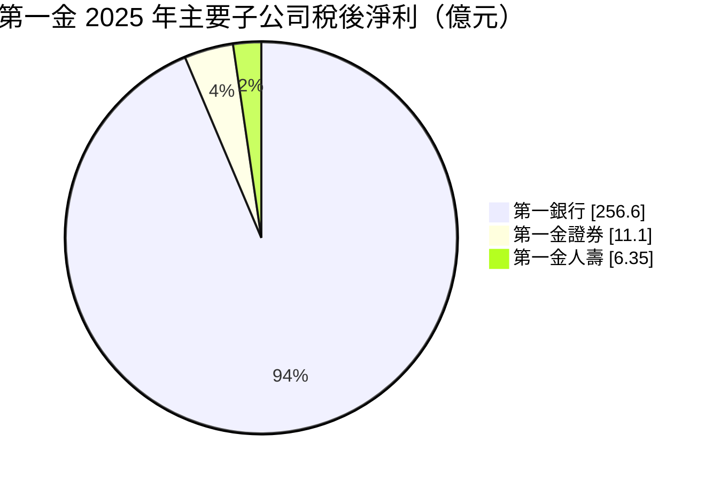
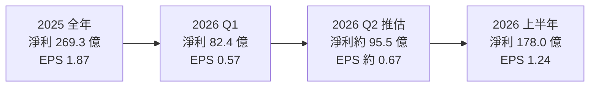
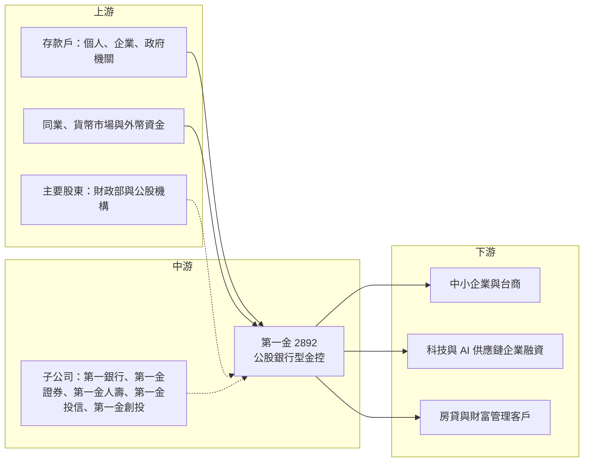

# 2892 第一金

> 上市｜[[產業索引-金融保險業|金融保險業]]｜上市（櫃）日期 2003/01/02

# 第一章：企業模式與商業藍圖

> [!info] 撰寫說明
> 本文由 Claude 依公開資料整理，架構比照 [[2330台積電]] 的四章研究，資料截至 2026-10-07。財務數字來源：富果研究第一金法說會整理（2026 年 6 月）、優分析（2025 年自結獲利）、yam 蕃新聞（2026 年上半年金控獲利表）；產業描述為整理性內容，尚未逐條比對原始文件。#待校對

在評估單一個股的長期投資價值時，首要步驟是拆解企業的底層獲利邏輯。本章針對第一金融控股（股票代號：2892，以下簡稱第一金）的商業模式進行定性分析，說明一家九成獲利來自銀行的公股金控，如何靠低成本存款、中小企業放款與海外據點賺錢，以及它近年想要分散獲利來源的方向。

## 一、核心定位：以第一銀行為核心的公股金控

第一金成立於 2003 年，核心子公司第一商業銀行的歷史可追溯到日治時期，是台灣歷史最悠久的銀行之一。第一金屬於公股金控，財政部與相關公股機構為主要股東，經營風格偏向穩健保守。

這個定位有兩個商業意義：

* **本質是放大版的商業銀行：** 2025 年第一銀行稅後淨利 256.6 億元，占金控 269.3 億元的九成以上。2026 年第一季第一銀行仍占集團獲利約 87.5%，非銀行子公司占比提升到 12.7%，累計至 4 月接近 15%。評估重點因此落在[[利差]]、放款成長與資產品質。
* **公股信用帶來低資金成本：** 公股背景讓存款戶信任度高，存款來源穩定且成本低，這是銀行利差的基礎，也讓第一金能在景氣波動中維持穩定獲利。

## 二、業務板塊：銀行為主、非銀行為輔

金控不適用製造業的營收結構分析，以下以 2025 年主要子公司稅後淨利呈現獲利來源：



* **企業金融與中小企業放款：** 第一銀行是中小企業放款的主力銀行之一，2026 年第一季中小企業放款突破 1 兆元，年增 8.2%。總放款約 2.96 兆元，年增 10.8%。
* **外幣與海外放款：** 外幣放款年增 17.3%，是近年成長最快的部分。法說會提到第一銀行擁有約 48 個海外據點。
* **消費金融與房貸：** 房屋貸款年增 5.5%，受央行信用管制影響，成長速度明顯低於企業放款。
* **財富管理：** 2026 年第一季財富管理淨手續費年增 17.1%，整體淨手續費收入 37.78 億元，年增 13.7%。
* **非銀行子公司：** 第一金證券、第一金人壽、第一金投信、第一金創投等。2026 年第一季第一金證券淨利 5.11 億元（年增 325%），第一金人壽淨利 1.53 億元並轉虧為盈。

## 三、資本轉化邏輯：存款變放款、利差變股利

```mermaid
flowchart LR
    A["資金來源<br/>個人 企業 政府存款"] --> B["第一銀行<br/>總放款約 2.96 兆"]
    B --> C["中小企業放款<br/>突破 1 兆"]
    B --> D["外幣與海外放款<br/>約 48 個海外據點"]
    B --> E[房貸與消費金融]
    C --> F[利息淨收益]
    D --> F
    E --> F
    G[財富管理與證券 人壽] --> H[手續費與非銀行獲利]
    F --> I["金控稅後淨利<br/>2025 年 269.3 億"]
    H --> I
    I -. 配發率約 69.5% .-> J[股東]
```

* **國內分行與海外據點：** 國內分行網路綿密，是公股行庫的典型優勢；海外據點約 48 處，分布在北美、東亞、東南亞與大洋洲等地區（各國明細本次未逐一查證），讓第一銀行能跟著台商客戶走向海外，承作[[聯貸]]與貿易融資。
* **[[換匯交易]]收益：** 第一銀行持有大量美元資金，透過換匯取得的收益在美台利差大時很可觀，但會隨利差縮小而減少，2026 年預估約 105 億元，較前一年減少約 25%。

## 四、企業長期藍圖：AI 融資、財管與多元引擎

法說會提出三大策略：

* **聚焦 AI 產業：** 利用海外據點與國內分行網路，承接 AI 與科技供應鏈的設備、擴廠與營運資金融資需求。
* **深耕財富管理：** 推出專屬商品、發展家族辦公室業務，提高手續費收入比重。
* **多元獲利引擎：** 提升證券、人壽、投信與創投的獲利貢獻，降低對銀行利差的依賴。

此外，第一金參與「國家融資保證機制」，初期出資 5,000 萬美元，預計五期總出資 2.5 億美元，可取得約 50 億美元的放款額度，用於擴大海外美元放款。

# 第二章：護城河深度與競爭優勢

在長期價值投資中，「護城河」指企業抵禦競爭、維持超額利潤的保護機制。銀行業的護城河主要來自低成本資金、客戶關係與監管門檻。本章分析第一金的護城河構成、公股與民營兩類主要對手，以及這些優勢在收費業務競爭中能轉化成多少獲利。

## 一、第一金護城河的核心組成要素

* **1. 公股背景與存款基礎：** 公股銀行的信用形象讓第一銀行擁有穩定且低成本的存款來源，這是利差的基礎。
* **2. 中小企業客戶關係：** 長期深耕中小企業放款，掌握大量企業的金流與往來紀錄，轉換成本不低。
* **3. 海外據點網路：** 約 48 個海外據點在公股銀行中屬前段，能服務台商海外布局。
* **4. 資產品質：** 2026 年第一季[[逾放比]] 0.16%、[[備抵呆帳覆蓋率]] 865%，風險緩衝厚。

## 二、主要競爭對手格局

| 對手 | 定位 | 對第一金的威脅 |
|---|---|---|
| [[2880華南金]]、[[5880合庫金]]、[[2886兆豐金]] | 公股金控 | 中小企業與企業放款直接競爭，兆豐在外匯與海外業務具優勢 |
| 彰化銀行、臺灣企銀、土地銀行 | 公股銀行 | 同樣以低資金成本搶企業放款 |
| [[2891中信金]]、[[2881富邦金]]、[[2882國泰金]]、[[2884玉山金]] | 民營大型金控 | 財富管理、信用卡與數位金融較具優勢 |
| 外商銀行 | 跨國金融 | 大型企業聯貸與跨境金融 |

## 三、優勢轉化：哪些市場守得住、哪些守不住

* **守得住：** 中小企業放款與企業金融的客戶關係穩固，資金成本低，資產品質佳。
* **守不住：** 財富管理、信用卡、數位銀行等收費業務，民營金控的產品設計與行銷能力較強；非銀行子公司規模偏小，難以和證券型或壽險型金控比較。
* **觀察重點：** 外幣放款與 AI 相關融資的成長能否持續、財管手續費能否維持雙位數成長、非銀行子公司的獲利占比能否穩定在一成以上。

# 第三章：財務體質與盈利規模

資料日期：2026-10-07。數字取自公司法說會整理（富果研究）與財經媒體報導，表格是撰寫當時的快照；最新月營收、毛利率、累計 EPS 由自動排程寫在本筆記的屬性欄位（月營收、毛利率、累計EPS 等）。#待校對

財務報表是檢驗護城河是否真實存在的最終標準。金控不適用製造業的毛利率與營業利益率，本章改以稅後淨利與 EPS、ROE 與銀行經營指標、資產品質與資本、股利政策四個面向，檢視第一金的獲利品質。

## 一、獲利能力的基石：稅後淨利與 EPS

| 項目 | 2025 全年 | 2026 Q1 | 2026 上半年 |
|---|---|---|---|
| 稅後淨利（新台幣） | 269.3 億 | 82.4 億 | 178.0 億 |
| EPS（元） | 1.87 | 0.57 | 1.24 |
| 年化 [[ROE]]（ROAE） | 未查得 | 11.16% | 未查得 |
| 年化 [[ROA]] | 未查得 | 0.64% | 未查得 |
| 每股淨值（元） | 未查得 | 20.70 | 未查得 |



* 2025 年稅後淨利年增 6.2%，為連續第五年創新高。2026 年第一季年增 26.5%，上半年再創同期新高。依上半年與第一季數字推算，第二季淨利約 95.5 億元、EPS 約 0.67 元（推估）。
* 第一銀行 2025 年稅後淨利 256.6 億元（年增 7.8%）；第一金證券 11.1 億元（年減 6.1%）；第一金人壽 6.35 億元（年增 9.3%）。

## 二、ROE 與銀行經營指標

| 指標（2026 年第一季） | 數值 |
|---|---|
| 淨利息收益率（[[NIM]]，含換匯調整） | 0.97% |
| 存放利差 | 1.19% |
| 淨利息收入 | 87.1 億元，年增 22.3% |
| 總放款 | 約 2.96 兆元，年增 10.8% |

第一金年化 ROE 11.16%、ROA 0.64%，代表每 100 元資產一年約賺 0.64 元，再透過約 17 倍的資產對權益槓桿（推算）放大成一成左右的 ROE。銀行型金控的 ROE 主要由利差與槓桿決定，提升空間有限，但穩定度高。

2026 年全年法說會指引：總放款成長由原估 5% 上修至 9%，外幣放款成長 17% 至 18%；原始 NIM 預估 0.86%，含換匯調整後 1.09%；淨利息收入與淨手續費收入皆成長 15% 至 16%；換匯交易收益約 105 億元，較前一年減少約 25%；成本收益比 42% 以下。

## 三、資產品質與資本適足

* **資產品質：** 2026 年第一季逾放比 0.16%、備抵呆帳覆蓋率 865%；2025 年 12 月底第一銀行逾放比 0.17%、覆蓋率 862.04%，資產品質維持穩定。
* **[[信用成本]]：** 法說會預估淨信用成本約 18 個基點。公司表示過去的海外商業不動產呆帳已處理完畢，信用成本可望維持低檔。
* **資本：** 2026 年第一季金控[[資本適足率]] 128.80%。

## 四、股利政策

* 2025 年盈餘配發現金股利 1.3 元，配發率約 69.5%，高於過去三年平均約 52%。
* 公司表示參與融資保證機制可能需要保留盈餘支應放款擴張，未來股利政策會滾動調整。

# 第四章：總體風險與地緣政治

任何企業都無法脫離宏觀環境獨立存在。本章分析第一金未來必須面對的地緣政治與海外曝險、利率與景氣週期、授信與資本的營運風險，以及公股治理、資本規範與數位金融帶來的挑戰。

## 一、地緣政治風險

* **兩岸與海外曝險：** 第一銀行在中國與東南亞設有據點，兩岸關係緊張或區域衝突可能影響台商客戶的還款能力。
* **美國關稅與供應鏈移轉：** 台商在東南亞與美國擴廠帶動海外放款，但若關稅政策反覆，客戶投資計畫延後，外幣放款成長會放緩。

## 二、利率與景氣週期

* **利差風險：** 銀行獲利主要來自利差，央行與聯準會降息會壓縮 NIM；換匯交易收益也隨美台利差縮小而下降，2026 年預估已較前一年減少約四分之一。
* **企業景氣：** 中小企業放款占比高，景氣反轉時中小企業違約率通常先上升。

## 三、營運環境的隱性風險

* **商業不動產與授信集中：** 第一銀行過去曾因海外商業不動產出現呆帳，雖然公司表示已處理完畢，仍需留意 AI 相關產業融資是否過度集中。
* **非銀行子公司規模小：** 證券與壽險獲利貢獻有限，台股轉弱時證券獲利會明顯下滑。
* **股利與資本的取捨：** 放款擴張與參與融資保證機制需要資本支撐，可能限制股利成長。

## 四、法規與科技演進

* **公股治理：** 董事會與經營階層受政府政策影響，可能承擔政策性任務。
* **資本要求：** 若被列為系統性重要銀行（[[D-SIB]]）或資本規範趨嚴，需保留更多盈餘。
* **數位金融與資安：** 純網銀與民營銀行的數位服務持續進步，第一銀行需持續投入系統與資安。

# 專有名詞解析

## 金融

- **[[利差]]**：銀行放款利率與存款利率的差距，是銀行最主要的獲利來源。
- **[[NIM]]**：淨利息收益率，利息淨收益除以生息資產，衡量銀行整體資產賺取利息的效率。
- **[[換匯交易]]**：銀行以即期買入、遠期賣出外幣的方式調度資金，可在兩國利差大時賺取收益。
- **[[聯貸]]**：由多家銀行共同承作同一筆大額企業貸款，分攤風險，常用於大型擴廠與併購融資。
- **[[逾放比]]**：逾期放款占總放款的比例，數字越低代表放款資產品質越好。
- **[[備抵呆帳覆蓋率]]**：備抵呆帳除以逾期放款，衡量銀行為可能的壞帳預先提列了多少緩衝。
- **[[信用成本]]**：一段期間內提列的呆帳費用占放款的比例，通常以基點表示，數字越低代表壞帳損失越少。
- **[[資本適足率]]**：自有資本除以風險性資產，主管機關用來確保金融機構有足夠資本承擔損失。
- **[[ROA]]**：資產報酬率，稅後淨利除以總資產，衡量銀行運用全部資產賺錢的效率。
- **[[ROE]]**：股東權益報酬率，稅後淨利除以股東權益，衡量公司運用股東資本賺錢的效率。
- **[[D-SIB]]**：國內系統性重要銀行，倒閉時會衝擊整體金融體系的銀行，須額外提列資本。

# 核心供應鏈



## 1. 上游：資金來源
- 存款戶：個人、企業與政府機關存款
- 同業與貨幣市場資金、外幣資金（換匯交易）
- 主要股東：財政部與相關公股機構

## 2. 中游：第一金與子公司
- 第一商業銀行、第一金證券、第一金人壽、第一金投信、第一金創投

## 3. 下游：主要客群
- 中小企業與台商（國內與海外放款）
- 科技與 AI 供應鏈企業融資，例如 [[2330台積電]]、[[2317鴻海]] 等供應鏈廠商
- 個人房貸、財富管理客戶

## 4. 同業比較
- 公股金控：[[2880華南金]]、[[5880合庫金]]、[[2886兆豐金]]
- 民營金控：[[2891中信金]]、[[2884玉山金]]、[[2881富邦金]]、[[2882國泰金]]

## 最新新聞
<!-- news:start -->
<!-- news:end -->

## 相關連結
- [公開資訊觀測站](https://mopsov.twse.com.tw/mops/web/t05st03?step=1&firstin=1&co_id=2892)
- [Goodinfo](https://goodinfo.tw/tw/StockDetail.asp?STOCK_ID=2892)
- [Yahoo 股市](https://tw.stock.yahoo.com/quote/2892)
- [鉅亨網新聞](https://www.cnyes.com/twstock/2892/news)
