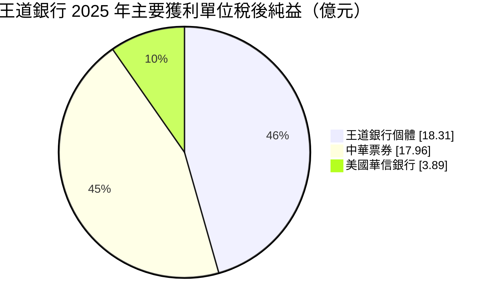
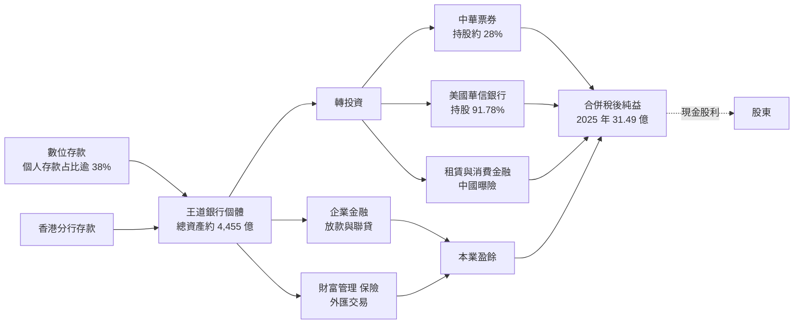
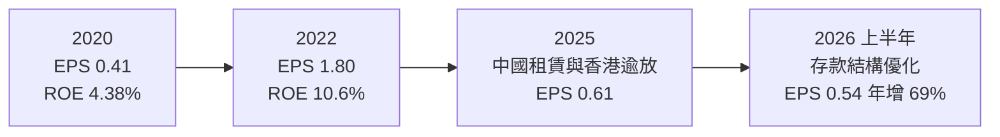
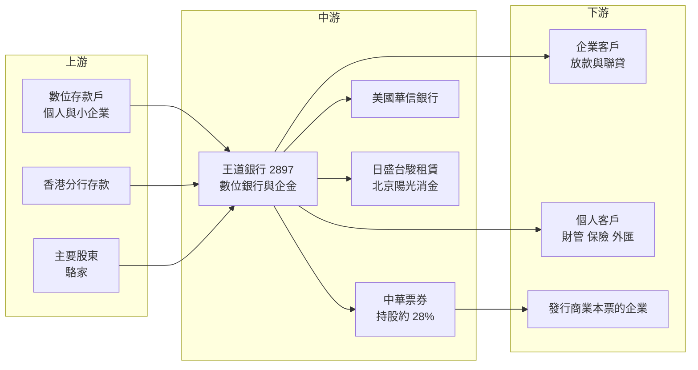

# 2897 王道銀行

> 上市｜[[產業索引-金融保險業|金融保險業]]｜上市（櫃）日期 2017/05/05

# 第一章：企業模式與商業藍圖

> [!info] 撰寫說明
> 本文由 Claude 依公開資料整理，架構比照 [[2330台積電]] 的四章研究，資料截至 2026-10-08。財務數字來源：Goodinfo 年度經營績效頁、優分析（王道銀行 2025 年展望、2025 年度與 2026 年第二季法說會報導）、聯合報（2026 年企業生日報導）、證交所開放資料（基本資料、股利、本益比）；產業描述為整理性內容，尚未逐條比對原始文件。#待校對

在評估單一個股的長期投資價值時，首要步驟是拆解企業的底層獲利邏輯。本章針對王道商業銀行（股票代號：2897，以下簡稱王道銀行）的商業模式進行定性分析，說明一家從企業金融起家的工業銀行，如何轉型為以數位通路為主的「精品數位銀行」，以及為什麼它的合併獲利有很大一部分來自轉投資的票券公司。

## 一、核心定位：從工業銀行轉型的數位銀行

王道銀行的前身是 1999 年成立的台灣工業銀行，初期以企業金融與創投、直接投資為主，累積了深厚的企金客戶基礎。2017 年改制並更名為王道商業銀行，同年 5 月以銀行身分上市，創辦人駱錦明推出台灣第一家原生數位銀行品牌 O-Bank。2020 年起由駱怡君擔任董事長，將企金與個金業務整合。證交所資料顯示，2026 年總經理為李芳遠，實收資本額約 305.5 億元（含特別股）。

王道銀行的定位有三個特色：

* **「精品數位銀行」：** 全台實體據點只有六個，個人金融主要透過數位通路經營。它不與大型銀行搶信用卡市場，而是以簽帳金融卡現金回饋吸引存款。這讓營運成本低於傳統銀行，但也意味著規模成長較慢。
* **輕資本經營：** 管理層多次表示王道銀行的資本少於同業，放款採審慎態度、不追求快速擴張，重點放在財富管理、保險、外匯交易與股票投資等耗用資本較少的業務。
* **控股型的獲利結構：** 王道銀行是中華票券的最大股東（持股約 28.37%，並納入合併報表），並持有美國華信銀行、日盛台駿國際租賃、北京陽光消費金融等轉投資。合併獲利中，中華票券的貢獻占相當大的比重。

## 二、業務板塊：銀行本業與轉投資

以 2025 年為例，合併淨收益 99.66 億元、合併稅後純益 31.49 億元，其中個體（銀行本身）稅後純益只有 18.31 億元。以下用 2025 年主要獲利單位的稅後純益呈現結構：

註：中華票券為 100% 金額，王道銀行依持股比例認列，個體純益已包含依權益法認列的部分，因此三者不可直接相加。

* **銀行本業：** 2025 年本業淨收益 63.02 億元、本業稅前盈餘 18.04 億元。收入來自企業放款、存款利差、財富管理與外匯交易。2026 年上半年本業淨收益 35.78 億元、年增 14%，主因存款結構優化推升利息淨收益。
* **中華票券：** 國內主要票券公司之一，2025 年稅後純益 17.96 億元、年增 31%，2026 年上半年 14.36 億元、年增 49%，受惠資金成本下降與承銷業務成長。
* **美國華信銀行：** 透過美國子公司 IBT Holdings 持股 91.78%，2025 年總資產首度超過 10 億美元，稅後純益 3.89 億元，排除 2024 年一次性呆帳回收後年增約 11%。
* **租賃與消費金融：** 日盛台駿國際租賃（持股 41.7%）在中國發展，2025 年受中國經濟疲弱拖累，是王道銀行 2025 年獲利下滑的主因之一；北京陽光消費金融持股 20%。

## 三、資本轉化邏輯：數位存款加企金放款，再加控股收益

* **數位通路降低成本：** 只有六個實體據點，大部分存款與個金業務在線上完成，2026 年第一季國內個人存款逼近千億元、全行個人存款占比超過 38%。個人與小企業存款較穩定、利率較低，是改善利差的關鍵。
* **企金是放款主體：** 承襲工業銀行背景，放款以企業客戶為主，包含香港分行的放款。這也是 2025 年逾放比上升的來源：香港分行個別授信案使年底逾放比升至 0.54%，管理層表示這些案件都有足額不動產擔保，處分後預估逾放比可降至 0.07%。
* **轉投資放大合併獲利：** 銀行個體的資本有限，但透過持有票券公司與美國銀行，合併報表的資產規模達 7,013 億元（2025 年底），獲利來源更多元。

## 四、企業長期藍圖：輕資本、科技與海外

* **金融科技與穩定幣：** 2025 年底管理層定調 2026 年往金融科技、AI 與穩定幣相關服務轉型，維持輕資本模式。這延續了王道銀行以數位為核心的創立精神。
* **財富管理：** 已向金管會申請財管 2.0，高雄分行擬遷入亞洲資產管理專區；香港分行在 2026 年 3 月取得保險代理牌照。
* **海外布局：** 雪梨辦事處規劃升格為分行，並評估在東南亞投資新創與創投項目；美國華信銀行持續擴大規模。管理層表示目前沒有具體併購計畫，但對能創造綜效的標的保持開放。

# 第二章：護城河深度與競爭優勢

在長期價值投資中，「護城河」指企業抵禦競爭、維持超額利潤的保護機制。本章分析王道銀行的護城河構成、國內主要對手，以及這些優勢在數位金融競爭中能守住多少。

## 一、王道銀行護城河的核心組成要素

王道銀行的護城河較淺，屬於「窄護城河」，主要來自三個方面：

* **1. 數位通路的成本結構：** 以六個實體據點經營全國客戶，人力與租金成本遠低於傳統分行銀行。這是可以長期累積的成本優勢，但純網銀與大型金控的數位帳戶也在追趕，優勢會逐漸縮小。
* **2. 企業金融與投資銀行經驗：** 工業銀行時期累積的企業客戶關係、聯貸與股權投資經驗，讓王道銀行在企業融資上有一定專業度，不必只靠價格競爭。
* **3. 票券與海外銀行的控股價值：** 中華票券與美國華信銀行提供銀行本業以外的穩定獲利來源。特別是中華票券，在降息環境下獲利成長快，是集團的重要支柱。

## 二、全球主要競爭對手格局

| 對手 | 定位 | 對王道銀行的威脅 |
|---|---|---|
| 純網銀（LINE Bank、將來銀行、樂天國際商業銀行） | 純數位銀行 | 以高利活存與簡便信貸直接競爭數位存款客群 |
| [[2884玉山金]]、[[2891中信金]]、[[2887台新新光金]] | 民營金控，數位帳戶成熟 | 數位帳戶、信用卡與財管全面領先，品牌與規模更大 |
| [[2845遠東銀]]、[[2838聯邦銀]]、[[5876上海商銀]] | 中型民營銀行 | 在企業放款、財管與存款上競爭 |
| 國際票券（[[2889國票金]]）、兆豐票券 | 票券同業 | 與中華票券在商業本票保證與票債券業務競爭 |

## 三、優勢轉化：哪些市場守得住、哪些守不住

* **守得住：** 以簽帳金融卡與高回饋吸引的數位存款客群、特定的企業金融客戶，以及中華票券的票券業務。這些業務王道銀行已有一定規模與專業。
* **守不住：** 大規模的消費金融與信用卡市場，以及需要大量資本的放款擴張。資本少於同業，限制了王道銀行在放款上的成長速度；大型金控的數位平台也越來越成熟，數位銀行的先發優勢在減弱。
* **觀察重點：** 香港逾放案件的處分進度、日盛台駿租賃能否轉虧為盈、財管 2.0 是否獲准，以及個人存款比重是否持續提升。這些決定王道銀行能否把 ROE 拉回 6% 以上並穩定成長。

# 第三章：財務體質與盈利規模

資料日期：2026-10-08。數字取自 Goodinfo 年度經營績效頁、法說會報導與證交所開放資料，表格是撰寫當時的快照；最新月營收、累計 EPS 由自動排程寫在本筆記的屬性欄位（月營收、累計EPS 等）。#待校對

財務報表是檢驗護城河是否真實存在的最終標準。銀行業不適用毛利率與營業利益率，本章改用淨收益、稅後淨利、[[ROE]]、[[ROA]]、資產品質與股利，檢視王道銀行的獲利品質。

## 一、獲利能力的基石：淨收益與淨利

| 年度 | 合併淨收益（新台幣） | 歸屬母公司稅後淨利 | EPS（元） | [[ROE]] | [[ROA]] |
|---|---|---|---|---|---|
| 2020 | 80.6 億 | 11.5 億 | 0.41 | 4.38% | 0.41% |
| 2021 | 93.1 億 | 18.4 億 | 0.63 | 5.85% | 0.56% |
| 2022 | 121 億 | 50.3 億 | 1.80 | 10.6% | 1.01% |
| 2023 | 95.4 億 | 24.9 億 | 0.87 | 6.09% | 0.57% |
| 2024 | 102 億 | 28.6 億 | 1.00 | 6.49% | 0.59% |
| 2025 | 99.7 億 | 18.3 億 | 0.61 | 4.99% | 0.45% |
| 2026 上半年 | 64.54 億 | 16.26 億（個體） | 0.54 | 未查得 | 未查得 |

註：年度數字取自 Goodinfo 合併報表；稅後淨利為歸屬母公司（與銀行個體純益相同口徑），2025 年合併稅後純益（含非控制權益）為 31.49 億元。2022 年獲利特別高，推估與轉投資一次性收益有關（推估，原因未查得）。

* **淨收益：** 2020 至 2025 年合併淨收益從 80.6 億元增至 99.7 億元，年複合成長率約 4.3%（推算），成長溫和。
* **淨利波動大：** 歸屬母公司淨利從 11.5 億元到 50.3 億元不等，2020 至 2025 年年複合成長率約 9.7%（推算），但中間起伏很大。2025 年個體純益年減 36%，主因是日盛台駿在中國的租賃事業受壓，以及扣除中國業務後銀行本業微幅衰退。
* **2026 年回升：** 上半年合併淨收益年增 30%、個體純益年增 59%，主因存款結構優化推升利息淨收益，加上中華票券獲利年增 49%。
* **[[NIM]]：** 本次查得的資料未揭露王道銀行的 NIM 數字（未查得）。

## 二、[[ROE]] 與 [[ROA]]：資本效率

2021 至 2025 年平均 ROE 約 6.8%（推算），ROA 多在 0.45% 至 0.6% 之間（2022 年例外）。王道銀行的 ROE 偏低，主要有兩個原因：一是銀行本業規模小、固定的科技與合規成本占比高；二是中國相關的轉投資近年持續拖累。管理層把「每股淨值持續成長」當作重要指標，2025 年底每股淨值 14.58 元、2026 年 2 月底約 14.85 元。

## 三、資產品質與股利

* **[[逾放比]]：** 2025 年底升至 0.54%，主因香港分行個別授信案，高於多數本土銀行；管理層預估擔保品處分後可降至 0.07%。銀行局資料也顯示王道銀行在海外分支的逾放金額高於同業。
* **[[備抵呆帳覆蓋率]]與[[資本適足率]]：** 本次查得的報導未揭露具體數字（未查得）。管理層表示 2026 年規劃發行次順位債補充資本。
* **股利：** 2025 年度配發現金股利 0.52 元，為掛牌以來新高，[[配息率]]約 85%（推算，0.52 ÷ 0.61）。管理層表示股利政策目標是每年穩定成長。章程規定普通股股利不低於可分配盈餘的 20%。Goodinfo 統計歷年平均現金股利約 0.27 元，近年明顯提高。

## 四、ROE 與權益資金成本：價值創造利差

**為什麼金融業不用 ROIC：** [[ROIC]] 把有息負債當成投入資本、以 [[WACC]] 為門檻，但銀行的存款就是生產原料，利息支出就是營業成本，負債與營運無法分開。因此銀行的資本效率直接以 ROE 對照股東要求的報酬（權益資金成本）。

**權益資金成本推算：** 以 [[CAPM]] 估算，假設台灣 10 年期公債殖利率 1.75%、市場風險溢酬 6%、β 取台灣中小型銀行常見值 0.7（同業常見值，非來源數字），權益資金成本約為 1.75% ＋ 0.7 × 6% ＝ 5.95%（推算）；β 若為 0.8，約 6.55%。

**比較：** 王道銀行 2025 年 ROE 4.99%，低於推算的權益成本約 1 個百分點；2023 至 2024 年 ROE 約 6.1% 至 6.5%，與權益成本大致打平；只有 2022 年 10.6% 明顯超過。2021 至 2025 年平均約 6.8%，略高於權益成本，但扣除 2022 年後就低於權益成本。結論是：王道銀行目前大致處於「勉強賺回或略低於資金成本」的狀態。證交所資料顯示其股價淨值比約 0.71 倍，明顯低於 1 倍，正好反映市場對其 ROE 長期低於權益成本的判斷。若中國租賃轉盈、香港逾放處理完成，ROE 回到 7% 以上，價值創造才會轉正（推估）。

# 第四章：總體風險與地緣政治

任何企業都無法脫離宏觀環境獨立存在。本章分析王道銀行未來必須面對的地緣政治、利率週期與營運風險。

## 一、地緣政治風險

* **中國曝險：** 日盛台駿國際租賃與北京陽光消費金融都在中國營運，2025 年中國經濟疲弱已直接拖累王道銀行的獲利。管理層表示不會要求關係企業衝業績，先做好風控，但這部分投資的回收高度依賴中國景氣與兩岸關係。
* **香港與海外放款：** 香港分行的授信多以當地不動產為擔保，香港房地產與經濟受中國影響，2025 年的逾放上升正是來自這裡。管理層也表示不急於低價出售擔保品，處分時程存在不確定性。
* **美國銀行子公司：** 美國華信銀行讓王道銀行有美國本地的業務，但也承擔美國利率與監理環境的變化。

## 二、利率與景氣週期

* **利率與存款結構：** 王道銀行近年靠優化存款結構提升利息淨收益，若利率環境變化使數位存款的高利回饋成本上升，利差可能受壓。
* **票券子公司的利率敏感度：** 中華票券在降息、資金成本下降時獲利成長快；若利率反轉上升，票券與債券部位會承壓，影響王道銀行的合併獲利。
* **企業授信的景氣循環：** 放款以企業為主，景氣下行時企業違約風險上升，加上資本較薄，承受大型壞帳的能力相對有限。

## 三、營運環境的隱性風險

* **資本較薄：** 管理層多次承認資本少於同業，這限制了放款成長，也讓單一大型壞帳對資本的衝擊較大。發行次順位債可以補充資本，但會增加利息成本。
* **控股結構的複雜度：** 合併報表包含票券、美國銀行、租賃與消費金融，投資人需要區分銀行本業與轉投資的獲利，否則容易誤判本業體質。
* **家族經營與傳承：** 王道銀行由駱家創辦與經營，策略延續性高，但也需要關注董事會獨立性與關係人交易。

## 四、法規與科技演進

* **數位銀行的差異化消退：** 純網銀與大型金控的數位帳戶持續進步，王道銀行作為台灣第一家原生數位銀行的先發優勢會逐漸縮小，必須靠產品與服務持續創新。
* **穩定幣與虛擬資產：** 王道銀行把穩定幣相關服務列為轉型方向，但相關法規仍在發展中，業務模式與獲利能力尚不確定。
* **財管 2.0 審核：** 財管 2.0 需要主管機關核准，且對資本與內控有要求，若審核時程拉長，財富管理的成長會延後。

# 專有名詞解析

## 金融

- **[[NIM]]**：淨利息收益率，利息淨收益除以生息資產，衡量銀行整體資產賺取利息的效率。
- **[[逾放比]]**：逾期放款占總放款的比例，數字越低代表放款資產品質越好。
- **[[備抵呆帳覆蓋率]]**：備抵呆帳除以逾期放款，衡量銀行為可能的壞帳預先提列了多少緩衝。
- **[[資本適足率]]**：自有資本除以風險性資產，主管機關用來確保金融機構有足夠資本承擔損失；放款越多需要的資本越多。
- **[[票券]]**：一年期以下的短期票據，如商業本票，由票券公司簽證、承銷與買賣，賺取短期資金利差。
- **[[非控制權益]]**：合併報表中子公司不屬於母公司的股權部分，相關獲利不歸母公司股東所有。
- **[[權益法]]**：持股具重大影響力時，依持股比例認列被投資公司損益的會計方法。
- **[[次順位債]]**：清償順序排在一般債權之後的債券，銀行可用來補充資本，但利率較高。
- **[[每股淨值]]**：股東權益除以流通股數，代表每股對應的帳面資產價值。
- **[[配息率]]**：股利占每股盈餘的比例，反映公司把多少獲利分給股東。
- **[[ROE]]**：股東權益報酬率，稅後淨利除以股東權益，衡量公司運用股東資本賺錢的效率。
- **[[ROA]]**：資產報酬率，稅後淨利除以總資產，銀行因槓桿高，ROA 通常低於 1%。
- **[[CAPM]]**：資本資產定價模型，以無風險利率加上 β 乘以市場風險溢酬，推估股東要求的報酬率。
- **[[ROIC]]**：投入資本報酬率，稅後營業利益除以股東權益加有息負債，衡量本業運用資本的效率；不適用於銀行。
- **[[WACC]]**：加權平均資金成本，依股權與負債比重加權的資金成本，是判斷 ROIC 是否創造價值的門檻。

# 核心供應鏈

## 1. 上游：資金來源
- 數位存款：個人存款占比超過 38%，個人與小企業存款合計約 43%
- 香港分行個人存款超過 200 億元
- 主要股東：創辦人駱家

## 2. 中游：王道銀行與轉投資
- 王道銀行個體：國內六個實體據點、香港分行、雪梨辦事處
- 中華票券（持股約 28.37%，納入合併）
- 美國華信銀行（透過 IBT Holdings 持股 91.78%）
- 日盛台駿國際租賃（41.7%）、北京陽光消費金融（20%）

## 3. 下游：主要客群
- 企業放款與聯貸客戶
- 數位帳戶個人客戶與高資產客戶
- 發行商業本票的企業（中華票券）

## 4. 同業比較
- 中型民營銀行：[[2845遠東銀]]、[[2838聯邦銀]]、[[5876上海商銀]]
- 票券同業：國際票券（[[2889國票金]]）、兆豐票券（[[2886兆豐金]]）
- 民營金控：[[2884玉山金]]、[[2891中信金]]

## 最新新聞
<!-- news:start -->
<!-- news:end -->

## 相關連結
- [公開資訊觀測站](https://mopsov.twse.com.tw/mops/web/t05st03?step=1&firstin=1&co_id=2897)
- [Goodinfo](https://goodinfo.tw/tw/StockDetail.asp?STOCK_ID=2897)
- [Yahoo 股市](https://tw.stock.yahoo.com/quote/2897)
- [鉅亨網新聞](https://www.cnyes.com/twstock/2897/news)
