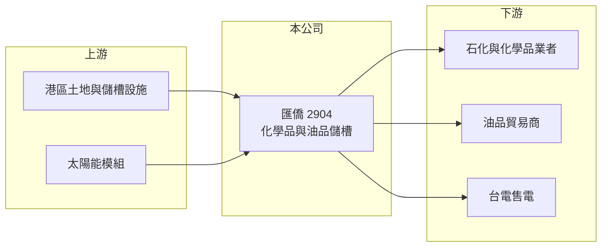

# 2904 匯僑

> 上市｜[[產業索引-其他業|其他業]]｜上市（櫃）日期 1983/01/05

# 第一章：企業模式與商業藍圖

> [!info] 撰寫說明
> 精簡版，由 Claude 依公開資料整理，架構比照 [[2330台積電]]，資料截至 2026-10-07。來源：nStock 匯僑公司簡介、winvest 營收快訊。#待校對

匯僑以化學品與油品[[儲槽]]服務為核心，並經營貿易、太陽能發電與商用不動產出租。

- **核心業務：** 提供化學品與油品儲槽的存放及輸送服務，另有一般貿易、[[太陽光電]]發電與商用不動產出租。
- **營收結構：** 本次未查到各業務營收比重，推估以儲槽租賃服務為主。
- **營運據點：** 公司 1978 年成立、1983 年上市，儲槽所在港區本次未查到。
- **長期方向：** 以太陽能發電與不動產出租增加穩定收入來源（推估）。

# 第二章：護城河深度與競爭優勢

匯僑的優勢在於儲槽設施的稀缺性，屬於收租型的基礎設施業務。

- **競爭優勢：** 港區儲槽需要土地、環評與安全許可，新進者不易取得（推估）。
- **主要對手：** 國內其他港區化學品與油品儲運業者，本次未查到具體名單。
- **觀察重點：** 8 月營收 3,514.6 萬元，年減 18.98%，觀察儲槽出租率何時止跌。

# 第三章：財務體質與盈利規模

資料日期：2026-10-07，以下數字是撰寫當時的快照；最新月營收、毛利率、累計 EPS 由自動排程寫在本筆記的屬性欄位（月營收、毛利率、累計EPS 等）。#待校對

匯僑 2026 年營收衰退，但第二季獲利回升並維持配息。

- **營收規模：** 2026 年 1 至 8 月累計營收 2.77 億元，月營收約在 3,300 萬至 3,700 萬元之間，各月均較去年同期減少約 16% 至 21%。
- **獲利：** 2026 年第二季 EPS 0.23 元，上半年累計 0.14 元；第二季[[毛利率]] 27.01%、[[營業利益率]] 14.96%。
- **財務特色：** 資本額 7.78 億元，2025 年現金股利 0.7 元、2024 年 1 元，近五年平均現金[[殖利率]] 4.08%。

# 第四章：總體風險與地緣政治

匯僑的風險在於石化景氣與儲槽需求變化。

- **產業週期：** 化學品與油品的進出口量隨石化景氣波動，影響儲槽出租率。
- **營運風險：** 儲槽有工安與環保要求，維護成本高，事故會造成重大損失。
- **其他風險：** 能源轉型可能降低長期油品儲存需求，港區土地租約與法規變動也需留意。

# 專有名詞解析

## 金融

- **[[殖利率]]**：每年現金股利除以股價，用來衡量配息報酬。

## 產業

- **[[儲槽]]**：存放液體化學品或油品的大型槽體，多設於港區，以出租容量收取租金。
- **[[太陽光電]]**：利用太陽能電池將陽光轉成電力，可售電給台電取得穩定收入。

# 核心供應鏈

- 上游：港區土地、儲槽設備與太陽能模組供應商（推估）
- 下游／客戶：石化與化學品業者、油品貿易商，以及售電對象台電（推估）
- 同業：國內港區儲運業者（本次未查到具體名單）

## 最新新聞
<!-- news:start -->
<!-- news:end -->

## 相關連結
- [公開資訊觀測站](https://mopsov.twse.com.tw/mops/web/t05st03?step=1&firstin=1&co_id=2904)
- [Goodinfo](https://goodinfo.tw/tw/StockDetail.asp?STOCK_ID=2904)
- [Yahoo 股市](https://tw.stock.yahoo.com/quote/2904)
- [鉅亨網新聞](https://www.cnyes.com/twstock/2904/news)
