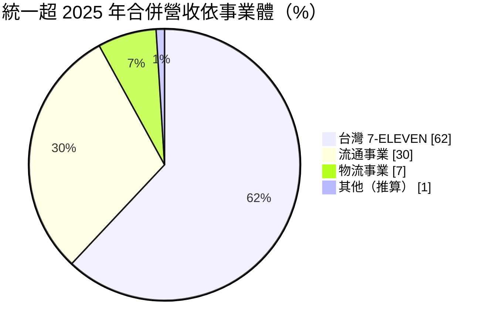
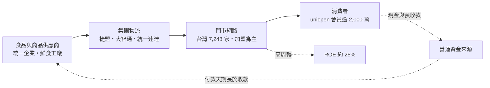
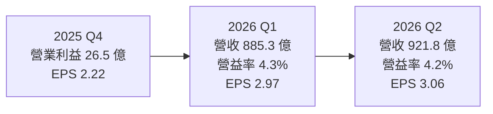
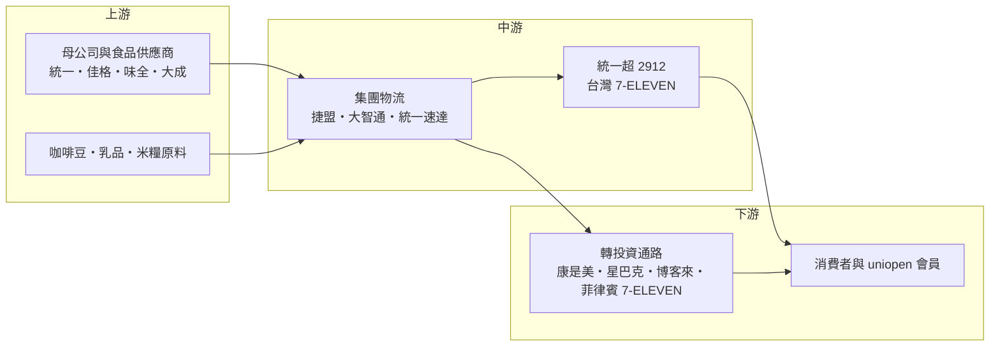

# 2912 統一超

> 上市｜[[產業索引-貿易百貨業|貿易百貨業]]｜上市（櫃）日期 1997/08/22

# 第一章：企業模式與商業藍圖

> [!info] 撰寫說明
> 本文由 Claude 依公開資料整理，架構比照 [[2330台積電]] 的四章研究，資料截至 2026-10-07。財務數字來源：統一超 2025 年度法說會整理（富果研究）、聯合新聞網與中央社 2026 年上半年財報報導、旺得富理財網、玩股網與 Yahoo 股市財報頁面；產業描述為整理性內容，尚未逐條比對原始文件。#待校對

在評估單一個股的長期投資價值時，首要步驟是拆解企業的底層獲利邏輯。本章針對統一超商（股票代號：2912，以下簡稱統一超）的商業模式進行定性分析，說明一家便利商店如何長成橫跨藥妝、咖啡、物流、電商與海外市場的流通集團，以及它在低毛利的零售業中如何創造高資本報酬。

## 一、核心定位：台灣最大的便利商店與流通集團

統一超是台灣 7-ELEVEN 的經營者，母公司為食品集團 [[1216統一]]。公司於 1987 年 6 月 10 日設立，1997 年掛牌上市。統一超的本體是台灣 7-ELEVEN 連鎖便利商店，但經過三十多年的轉投資，已經變成一個以便利商店為核心、橫跨藥妝、咖啡連鎖、物流、宅配、電商與海外便利商店的流通集團。

2025 年合併營收約 3,507 億元，年增 3.8%，其中台灣 7-ELEVEN 個體營業額約 2,200 億元，年增 4.4%。到 2025 年底，台灣 7-ELEVEN 門市 7,248 家，集團全球門市合計 13,866 家，菲律賓 7-ELEVEN 達 4,491 家。2026 年上半年合併營收 1,807 億元，年增 5.05%，歸屬母公司稅後淨利 62.65 億元，年增 5.51%，EPS 6.03 元，營收創同期新高。

## 二、終端應用與產品板塊：台灣 7-ELEVEN 是本體，轉投資貢獻約一半獲利

依公司 2025 年法說資料，三大事業體的營收占比如下（其他為 100% 減去三大事業推算）：

| 事業體 | 營收占比 | 淨利占比 |
|---|---|---|
| 台灣 7-ELEVEN | 62% | 49% |
| 流通事業（康是美、星巴克、菲律賓 7-ELEVEN 等） | 30% | 32% |
| 物流事業（統一速達、大智通、捷盟等） | 7% | 7% |

台灣 7-ELEVEN 營收占比超過六成，但淨利占比不到一半，代表轉投資事業的獲利能力不差，尤其菲律賓 7-ELEVEN、統一生活（康是美）與悠旅生活（星巴克）是近年主要的獲利成長來源。

台灣 7-ELEVEN 內部有兩條特別重要的產品線：

* **[[鮮食]]平台：** 2025 年營業額約 500 億元，占比超過 25%。便當、飯糰、麵食、甜點的毛利率高於一般包裝商品，也是讓消費者天天上門的主要理由。
* **CITY CAFE 現煮咖啡：** 2025 年營業額接近 200 億元，是台灣規模最大的咖啡品牌之一。

## 三、資本轉化邏輯：用供應商與消費者的錢經營

* **[[會員經濟]]：** uniopen 會員在 2025 年超過 1,900 萬人，2026 年上半年突破 2,000 萬人，公司表示會員貢獻的營收占比約 55%。OPENPOINT APP 整合點數、行動支付、預購與寄取件，2026 年推出跨境旅遊護照，可在泰國與韓國使用。
* **[[加盟]]為主的展店：** 門市多由加盟主出資經營，總部提供品牌、商品與物流並收取分潤，使總部不必負擔每家店的全部資本支出。
* **門市即基礎設施：** 全台超過 7,300 家門市提供寄取件服務，加上 ibon 繳費、票券與多元服務，讓便利商店變成社區服務據點。2026 年上半年，門市加上智 FUN 機等多元據點合計達 8,293 處，並經營 68 座在地商場。
* **[[負營運資金]]：** 零售業收現快、付款給供應商慢，加上禮券、儲值與代收款，形成由供應商與消費者提供的營運資金，是高 ROE 的來源。

## 四、企業長期藍圖：大店化、展店與海外成長

* **展店與大店化：** 2026 年計畫台灣 7-ELEVEN 淨增 150 至 200 家門市，並推動[[大店化]]，以複合店型（咖啡座位區、IP 主題區、娛樂互動設備「OPEN! FUNLAND」）提高客單價與停留時間。
* **海外：** 菲律賓 7-ELEVEN 是持續成長引擎，菲律賓人口結構年輕、便利商店密度仍低，展店空間大於台灣。
* **會員與數位：** 以 uniopen 會員資料做精準行銷與跨通路導流，把康是美、星巴克、博客來等通路串在同一個會員體系裡。

# 第二章：護城河深度與競爭優勢

在長期價值投資中，「護城河」指企業抵禦競爭、維持超額利潤的保護機制。本章分析統一超的護城河構成、主要競爭對手，以及這些優勢在飽和的台灣零售市場中能守住多少。

## 一、統一超護城河的核心組成要素

統一超的護城河屬於「寬護城河」，主要由規模、密度與生態系組成：

* **1. 門市密度與選址：** 台灣 7-ELEVEN 門市超過 7,200 家，在都會區幾乎步行幾分鐘就有一家。好的店點有限，先占先贏，後進者很難找到同等條件的位置。
* **2. 規模帶來的採購與物流效率：** 集團自有物流與鮮食供應體系，讓每家門市可以每天多次補貨。這種高頻配送網路需要龐大門市數才能攤平成本。
* **3. 鮮食與自有品牌：** 鮮食營業額約 500 億元，背後是長期合作的鮮食工廠與研發團隊，形成日常購買慣性。
* **4. 會員生態系：** 超過 2,000 萬名 uniopen 會員，跨 7-ELEVEN、康是美、星巴克等通路累積點數與消費資料，提高會員離開的成本。
* **5. 品牌授權的長期性：** 7-ELEVEN 在台灣的經營權由統一超長期持有，品牌知名度與信任度高。

## 二、全球主要競爭對手格局

| 對手 | 定位 | 對統一超的威脅 |
|---|---|---|
| [[5903全家]] | 台灣第二大便利商店，2026 年 6 月底門市 4,504 家 | 上半年營收年增約 8%，在鮮食、咖啡與會員 APP 正面競爭 |
| 萊爾富、OK 超商 | 規模較小，區域型或特定店型 | 在局部商圈分食客源 |
| 全聯福利中心、量販店 | 生活必需品低價通路，近年加入鮮食與咖啡 | 價格帶重疊 |
| Uber Eats、foodpanda、電商 | 即時配送與線上購物 | 分走部分即時購買需求 |
| [[5904寶雅]]、屈臣氏、路易莎 | 藥妝與平價咖啡 | 分別與康是美、星巴克競爭 |

## 三、優勢轉化：哪些市場守得住、哪些守不住

* **守得住：** 門市網路、物流與會員規模，短期內沒有對手能追上。2026 年上半年統一超與全家營收都創同期新高，顯示市場雖成熟，但龍頭仍能穩定成長。
* **守不住：** 台灣便利商店密度已是全球最高之一，單店營收成長主要靠客單價與服務收入，展店空間有限。人事與租金成本上升會持續壓縮[[營業利益率]]，2025 年合併營業利益率約 4.0%（依玩股網財報數字計算），本來就不高。
* **觀察重點：** 大店化能否帶動單店營收、菲律賓 7-ELEVEN 的展店與獲利、會員經濟能否轉化成更高毛利的廣告、金融與數位服務收入，以及基本工資調整對費用率的影響。

# 第三章：財務體質與盈利規模

資料日期：2026-10-07。數字取自公司法說會整理、財經媒體與玩股網、Yahoo 股市財報頁面，最新月營收與三率請見[[#相關連結]]的公開資訊觀測站。#待校對

財務報表是檢驗護城河是否真實存在的最終標準。本章用三率、ROE、現金流與資本報酬，檢視統一超「低利潤率、高周轉、高 ROE」的獲利品質。

## 一、獲利能力的基石：三率

| 項目 | 2025 全年 | 2026 Q1 | 2026 Q2 | 2026 H1 |
|---|---|---|---|---|
| 合併營收（新台幣） | 3,507.3 億 | 885.3 億 | 921.8 億 | 1,807.0 億 |
| [[毛利率]] | 34.4% | 34.6% | 34.6% | 34.6% |
| [[營業利益率]] | 4.0% | 4.3% | 4.2% | 4.2% |
| EPS（元） | 10.78 | 2.97 | 3.06 | 6.03 |

* **[[毛利率]]：** 依玩股網揭露的季度營收、毛利與營業利益計算，2026 年第二季毛利率 34.59%、營業利益率 4.17%，與 Yahoo 股市頁面一致。零售業毛利率看似高，但大部分被人事、租金與加盟分潤吃掉。
* **季節性：** 2025 年 EPS 10.78 元為四季加總（2.79、2.92、2.85、2.22 元）。第四季 EPS 較低，反映年底費用認列的季節性，2025 Q4 營業利益 26.5 億元，明顯低於前三季的 36 至 39 億元。
* **一次性因素：** 2024 年因處分山東銀座超市股權與所得稅迴轉等一次性收益，基期較高，因此 2025 年稅後淨利年減約 3%；公司表示若排除一次性因素，本業獲利仍成長。2026 年第二季歸屬母公司淨利 31.7 億元為歷史次高。

## 二、[[ROE]]：資本效率

依公司法說資料，2025 年 ROE 約 25.41%，資產報酬率約 5.32%。兩者差距來自財務槓桿，但這裡的槓桿主要不是銀行借款，而是應付帳款與預收款項（禮券、儲值與代收款）。這種「用供應商與消費者的錢經營」的營運資金結構，是零售龍頭典型的資本效率來源。

## 三、資本支出與自由現金流

* **[[CapEx]]：** 主要是新店裝修、舊店改裝、設備（冷藏櫃、咖啡機）與物流中心，單筆金額不大但持續發生。具體 2026 年資本支出金額本次未查得。
* **[[自由現金流]]：** 零售業收現快、付款慢，營業現金流通常穩定高於淨利，足以支應資本支出與高比率配息。
* **股利：** 2025 年度每股配發現金股利 9 元，配發率約 83%。統一超長期維持高配發率，屬於典型的穩定配息型公司。

## 四、[[ROIC]] 與 [[WACC]]：價值創造利差

由於負營運資金使投入資本偏低，統一超的 ROIC 長期高於 WACC 的機率高（推估，具體數值未查得）。利差的主要威脅在費用端：基本工資與租金上升若無法以客單價與服務收入轉嫁，營業利益率從 4% 往下滑，即使資本效率不變，利差也會縮小。

# 第四章：總體風險與地緣政治

任何企業都無法脫離宏觀環境獨立存在。本章分析統一超未來必須面對的地緣政治、產業結構與營運風險。

## 一、地緣政治與海外投資風險

* **菲律賓：** 菲律賓 7-ELEVEN 是重要成長引擎，但面臨當地匯率、通膨與政策變動風險。
* **中國投資：** 過去在中國的投資（如山東銀座超市）已處分，對中國市場的曝險相對有限。
* **兩岸情勢：** 營運幾乎都在台灣，兩岸風險主要透過總體經濟與消費信心間接影響。

## 二、產業週期與市場結構風險

* **市場飽和：** 台灣便利商店密度高，新店對既有店有自我侵蝕效應，未來成長更依賴單店營收與新服務。
* **競爭：** 全家、全聯與外送平台持續在鮮食、咖啡與即時配送上競爭，可能壓抑價格或增加促銷費用。
* **消費景氣：** 民生消費相對抗景氣，但咖啡、甜點、預購等高單價品項在景氣轉弱時可能受影響。

## 三、營運環境的隱性風險

* **人力成本：** 基本工資逐年調升，加盟主與門市人力招募不易，是費用率上升的主要壓力。
* **原物料成本：** 咖啡豆、乳製品、雞蛋與米等鮮食原料價格波動會影響毛利率。
* **食品安全：** 鮮食與咖啡占比高，一旦發生食安事件，對品牌形象的傷害大。
* **加盟關係：** 加盟店占多數，加盟主的利潤分配與勞動條件若引起爭議，可能影響展店與營運。

## 四、科技與法規演進風險

* **支付與數位法規：** 電子支付、個資保護與會員資料應用受法規規範，法規收緊可能限制會員經濟的變現方式。
* **環保法規：** 一次性塑膠、包材與食物浪費相關規範趨嚴，可能增加營運成本。
* **菸酒與健康法規：** 菸品與酒類是便利商店重要品項，相關稅費與販售規範調整會直接影響營收。

# 專有名詞解析

## 金融

- **[[負營運資金]]**：收現快、付款慢加上預收款項，使流動負債高於營運所需流動資產，等於由供應商與消費者提供資金。
- **[[毛利率]]**：毛利除以營收，零售業毛利率看似高，但大部分被人事、租金等營業費用吸收。
- **[[營業利益率]]**：營業利益除以營收，反映扣除人事、租金等費用後的本業獲利能力。
- **[[ROE]]**：股東權益報酬率，稅後淨利除以股東權益，衡量公司運用股東資金的效率。
- **[[CapEx]]**：資本支出，用於購置廠房、設備等長期資產的支出。
- **[[自由現金流]]**：營業活動現金流減去資本支出，代表企業可自由用於配息、還債或併購的現金。
- **[[ROIC]]**：投入資本報酬率，衡量公司運用股東與債權人資金創造本業報酬的效率。
- **[[WACC]]**：加權平均資金成本，股東與債權人要求報酬率的加權平均，ROIC 高於它才算創造價值。

## 產業

- **[[鮮食]]**：便當、飯糰、麵食、甜點等需冷藏且保存期短的即食商品，毛利率高於包裝商品，是便利商店的來客核心。
- **[[大店化]]**：把門市坪數擴大並加入座位區、主題區與複合服務，以提高客單價與停留時間的展店策略。
- **[[會員經濟]]**：以會員點數、APP 與消費資料串連多個通路，提高回購率並延伸廣告、金融等收入來源。
- **[[加盟]]**：由加盟主出資經營門市、總部提供品牌與供應鏈並收取分潤的經營模式，可降低總部資本支出。

# 核心供應鏈

## 1. 上游：商品與鮮食供應
- 母公司與主要食品供應商：[[1216統一]]
- 其他食品飲料供應商：[[1227佳格]]、[[1201味全]]、[[1210大成]]
- 咖啡豆、乳品、米糧等原料：國內外進口商與農產品供應商

## 2. 中游：統一超集團自有物流與服務
- 物流配送：捷盟行銷、大智通文化行銷、統一速達（宅急便）
- 資訊系統與支付：統一資訊、統一超商數位與電子支付相關子公司

## 3. 下游：自有通路與轉投資
- 便利商店：台灣 7-ELEVEN、菲律賓 7-ELEVEN
- 藥妝：統一生活（康是美）
- 咖啡：悠旅生活（台灣星巴克）
- 電商與書店：博客來

## 4. 同業與競爭者
- 便利商店：[[5903全家]]、萊爾富、OK 超商
- 超市與量販：全聯福利中心、家樂福
- 藥妝：[[5904寶雅]]、屈臣氏

## 最新新聞
<!-- news:start -->
<!-- news:end -->

## 相關連結
- [公開資訊觀測站](https://mopsov.twse.com.tw/mops/web/t05st03?step=1&firstin=1&co_id=2912)
- [Goodinfo](https://goodinfo.tw/tw/StockDetail.asp?STOCK_ID=2912)
- [Yahoo 股市](https://tw.stock.yahoo.com/quote/2912)
- [鉅亨網新聞](https://www.cnyes.com/twstock/2912/news)
