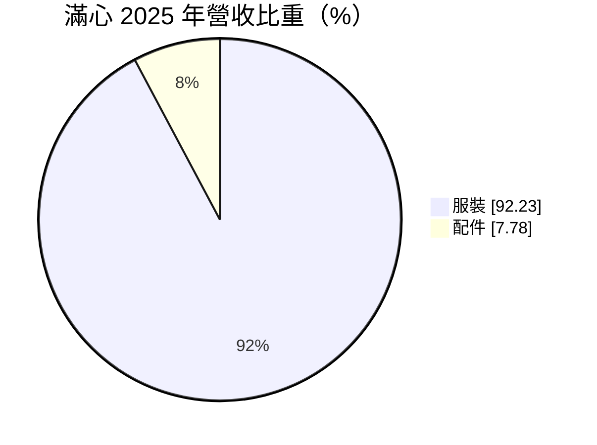
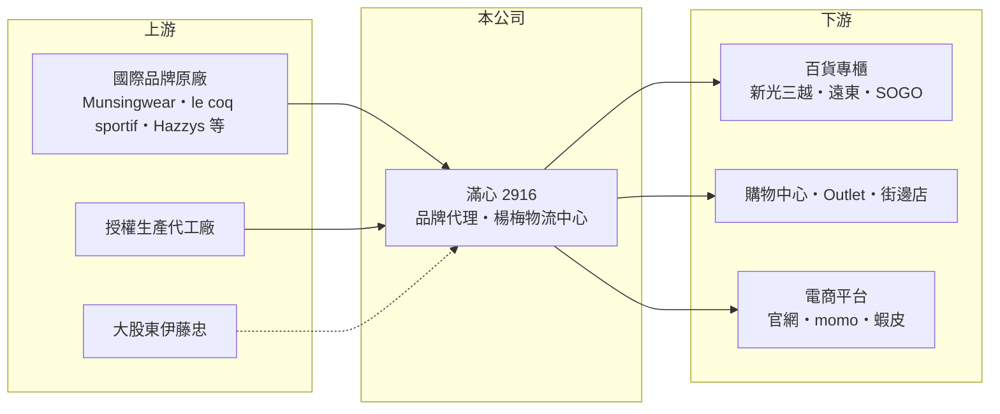

# 2916 滿心

> 上櫃｜[[產業索引-居家生活|居家生活]]｜上市（櫃）日期 2005/03/10

# 第一章：企業模式與商業藍圖

> [!info] 撰寫說明
> 精簡版，由 Claude 依公開資料整理，架構比照 [[2330台積電]]，資料截至 2026-10-08。來源：Goodinfo 年度經營績效、富邦 e 點通（MoneyDJ）公司基本資料、富果研究 2025 年 11 月法說會整理、旺得富 2025 年 8 月報導。#待校對

本章說明滿心（2916）如何以代理國際服飾品牌、經營百貨專櫃賺錢。

- **核心業務：** 滿心企業成立於 1984 年，2005 年上市，總部在新北五股，主要業務是在台灣代理國際服飾品牌，經營百貨專櫃、購物中心、Outlet 與電商通路。依旺得富報導，大股東為日本商社伊藤忠，總經理後藤憲二。這種模式不需要自己建立品牌，而是靠選品、通路管理與在地行銷賺取零售毛利。
- **營收結構：** 依 2025 年營收比重，服裝占 92.2%，配件 7.8%。代理品牌包括高爾夫與運動系的 Munsingwear（企鵝牌）、le coq sportif GOLF 與 le coq sportif sports，都會休閒系的 Hazzys、Nara Camicie、Leilian、Scotch House，以及 Danskin、PROTEST、PAREX、MC 等，代理品牌超過 12 個，近五年每年都引進新品牌。
- **營運據點：** 截至 2025 年 10 月底，全台有 211 個直營專櫃，主要位於新光三越、遠東、SOGO 等百貨系統，另有購物中心、Outlet、街邊店、加盟店與團體標案，線上則經營官網與 Yahoo、momo、蝦皮等平台。楊梅自有物流中心約 2,000 多坪，預計 2026 年 3 月啟用，用來集中管理所有商品並降低物流費用。
- **長期方向：** 經營模式結合[[授權生產]]與商品進口，部分品牌由公司自行設計生產，部分全數進口。長期成長來自三件事：持續引進新品牌、跟著新開百貨與購物中心增設專櫃、擴大電商比重。高爾夫服飾是重要支柱，受惠台灣高爾夫運動人口的長期成長。

# 第二章：護城河深度與競爭優勢

本章分析滿心的護城河，以及代理商模式的優勢與限制。

- **競爭優勢：** 滿心的護城河是「品牌組合加上百貨通路」。百貨專櫃的位置有限，長期合作的代理商較容易取得好櫃位；多品牌組合讓公司能在同一家百貨覆蓋高爾夫、運動與都會休閒等不同客群。伊藤忠作為大股東，也有助於取得日系授權品牌。毛利率長期在 50% 以上，2024 年達 54.2%，顯示代理品牌具有定價能力。
- **主要對手：** 競爭來自國際品牌直營（品牌收回代理自己經營）、其他服飾代理商，以及 Uniqlo、ZARA 等快時尚與電商品牌。在高爾夫服飾領域，還要面對各大運動品牌與日韓高爾夫品牌。
- **觀察重點：** 第一是代理合約的穩定性，主要品牌若收回自營，營收會明顯下滑。第二是新引進品牌的成功率。第三是物流中心啟用後，營業費用率能否下降。

# 第三章：財務體質與盈利規模

資料日期：2026-10-08，表格是撰寫當時的快照；最新月營收、毛利率、累計 EPS 由自動排程寫在本筆記的屬性欄位（月營收、毛利率、累計EPS 等）。#待校對

本章用五年數字檢視滿心的成長、獲利品質與配息。

| 年度 | 營收（新台幣） | [[毛利率]] | [[營業利益率]] | EPS（元） | [[ROE]] |
|---|---|---|---|---|---|
| 2021 | 13.6 億 | 49.8% | 9.11% | 2.52 | 14.3% |
| 2022 | 15.8 億 | 51.6% | 13.3% | 3.29 | 17.6% |
| 2023 | 18.4 億 | 53.0% | 15.2% | 4.61 | 23.0% |
| 2024 | 19.2 億 | 54.2% | 14.4% | 4.19 | 18.1% |
| 2025 | 19.6 億 | 54.0% | 14.2% | 3.96 | 15.8% |

- **營收規模：** 營收從 2021 年的 13.6 億元成長到 2025 年的 19.6 億元，年複合成長率約 9.6%（推算），每年都創新高。成長來自新櫃點與新品牌，以及疫情後的百貨消費回溫。
- **獲利：** 毛利率從 49.8% 升到 54% 左右，法說會說明主要來自商品折扣與成本控管。營業利益率約 14%，近五年平均 ROE 約 17.8%（推算）。2024 年 EPS 下降，部分是因為 2024 年 7 月增資使股本增加到約 6.46 億元，以及約 1,730 萬元的員工認股費用。
- **財務特色：** 負債比例約 22%，財務穩健。公司章程規定每年盈餘分派不低於 50%，近年配發率幾乎都在 90% 以上：2022 至 2024 年度現金股利分別為 3 元、4 元、3.6 元，屬於高配息的穩定型公司。
- **[[ROIC]] 與 [[WACC]]：** 2025 年營業利益約 2.78 億元（19.6 億 × 14.2%），以 20% 稅率計算稅後營業利益約 2.23 億元；股東權益約 16.3 億元（每股淨值 25.26 元 × 0.646 億股），總負債約 4.5 億元、假設一半為有息負債約 2.3 億元，ROIC 約 12%（推算）；2023 年約 14%（推算）。WACC 以 CAPM 推估：無風險利率 1.75%、市場風險溢酬 6%，MoneyDJ 的 β 僅 0.05 不具代表性，改用民生消費股常見值 0.7，股東權益成本約 5.95%；稅後負債成本約 2%，股權權重約 88%，WACC 約 5.5%（推算）。ROIC 長期高於 WACC 約 6 至 8 個百分點，代表代理零售本業持續創造經濟價值，並透過高配息回饋股東。若計入百貨專櫃的租賃負債，投入資本會更大、ROIC 會略低。

# 第四章：總體風險與地緣政治

本章整理滿心長期必須面對的風險。

- **產業週期：** 服飾屬於可選消費，景氣轉弱時消費者會減少購買，百貨客流量下降也會直接影響專櫃業績。天候異常（暖冬、雨季）會影響季節性商品的銷售與庫存。
- **營運風險：** 最大的結構性風險是代理權。品牌原廠可能收回台灣代理改為直營，或改換代理商，一旦主力品牌流失，營收與獲利會大幅下滑。服飾庫存需要定期折價出清，選品失準會壓縮毛利率。
- **其他風險：** 商品大量從日本與歐洲進口，匯率是主要成本變數；新台幣升值對滿心有利，貶值則會墊高進貨成本。電商與快時尚改變消費習慣，長期可能削弱百貨專櫃通路的重要性。

# 專有名詞解析

## 金融

- **[[配息率]]**：現金股利占每股盈餘的比例，反映公司把多少獲利分給股東。
- **[[ROIC]]**：投入資本報酬率，稅後營業利益除以投入資本，衡量本業運用資金創造報酬的能力。
- **[[WACC]]**：加權平均資金成本，股東與債權人要求報酬率的加權平均，ROIC 高於 WACC 才代表創造價值。

## 產業

- **[[總代理]]**：取得國外原廠授權，在特定地區負責銷售與售後服務的通路商。
- **[[授權生產]]**：品牌原廠授權代理商在當地設計或生產商品，代理商支付權利金並負擔生產與庫存。
- **[[百貨專櫃]]**：品牌在百貨公司內設置的銷售櫃位，通常以營業額抽成方式支付百貨費用。

# 核心供應鏈

- 上游：Munsingwear、le coq sportif、Hazzys、Nara Camicie、Leilian、Scotch House、Danskin、PROTEST 等國際品牌原廠，以及授權生產的代工廠；大股東伊藤忠。
- 下游／通路：新光三越、遠東、SOGO 等百貨，購物中心、Outlet、加盟店，以及 Yahoo、momo、蝦皮等電商平台。
- 同業：其他國際服飾代理商、品牌直營門市，以及快時尚與電商服飾品牌。

## 最新新聞
<!-- news:start -->
<!-- news:end -->

## 相關連結
- [公開資訊觀測站](https://mopsov.twse.com.tw/mops/web/t05st03?step=1&firstin=1&co_id=2916)
- [Goodinfo](https://goodinfo.tw/tw/StockDetail.asp?STOCK_ID=2916)
- [Yahoo 股市](https://tw.stock.yahoo.com/quote/2916)
- [鉅亨網新聞](https://www.cnyes.com/twstock/2916/news)
