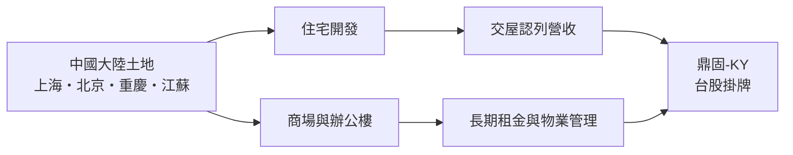
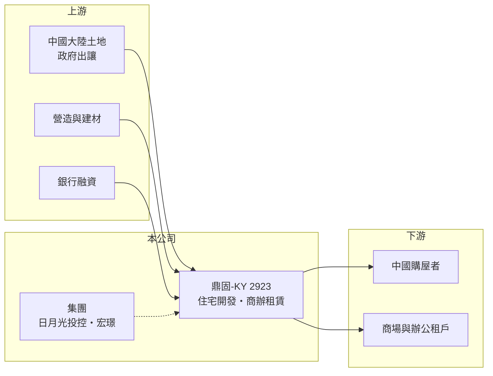

# 2923 鼎固-KY

> 上市｜[[產業索引-建材營造業|建材營造業]]｜上市（櫃）日期 2012/12/07

# 第一章：企業模式與商業藍圖

> [!info] 撰寫說明
> 本文由 Claude 依公開資料整理，架構比照 [[2330台積電]] 的四章研究，資料截至 2026-10-08。財務數字來源：Goodinfo 年度經營績效頁、理財周刊個股報導、聯合新聞網報導標題；公開資料有限，專案與集團描述為整理性內容，尚未逐條比對原始文件。#待校對

在評估單一個股的長期投資價值時，首要步驟是拆解企業的底層獲利邏輯。本章說明鼎固控股（股票代號：2923，以下簡稱鼎固）這家在台第一上市、資產位於中國大陸的不動產開發商，如何以住宅銷售與商辦租賃組成營收。

## 一、核心定位：日月光集團的大陸不動產平台

鼎固是 [[3711日月光投控]] 體系在中國大陸的不動產轉投資，業務包括不動產開發與銷售、商場與辦公室租賃、物業管理及停車場經營。項目集中在上海、北京、重慶與江蘇等一、二線城市，其中知名度最高的住宅建案是上海嘉定的「匯景華庭」。同集團的台灣建設公司 [[2527宏璟]] 也曾參與鼎固旗下鼎固置業的現金增資（依報導標題）。

和台灣建商相比，鼎固的特點是「開發加持有」：住宅案銷售後一次認列營收，商場與辦公樓則長期出租收取租金。前者帶來大起大落的營收，後者則提供基本的現金流。Goodinfo 數據顯示，鼎固 2019 至 2025 年營收在 48 億至 134 億元之間擺盪，反映住宅交屋的時點效應。

## 二、資本轉化邏輯：大陸土地與長期持有

鼎固股本約 174 億元，總資產推算超過 1,200 億元（推算），是規模相當大的開發商。大陸不動產的稅制包含土地增值稅，且開發與持有都需要大量資金，因此公司的財務費用與稅負對最終淨利影響很大。

## 三、長期方向

在中國房地產進入長期調整的環境下，鼎固的長期課題是去化既有住宅庫存、維持商辦與商場的出租率，並調整資產組合。由於公開資料有限，本次未查得未來推案計畫與租賃面積等數據。

# 第二章：護城河深度與競爭優勢

「護城河」指企業抵禦競爭、維持超額利潤的保護機制。本章分析鼎固在中國不動產市場的優勢與限制。

## 一、相對優勢

鼎固的優勢主要來自集團背景與資產區位。背靠日月光集團，使它在融資與信用上比多數中小型民營開發商穩健；項目集中在一、二線城市，長期需求基礎也比三、四線城市好。持有型商辦與商場則提供不受銷售週期影響的租金收入。

## 二、主要競爭對手

| 對手 | 定位 | 對鼎固的威脅 |
|---|---|---|
| 中國國營開發商 | 華潤置地、中海地產等 | 資金成本低，在土地與銷售上占優勢 |
| 上海本地商辦業者 | 陸家嘴、北外灘等商辦 | 辦公供給過剩下的租金競爭 |
| 台資在陸建商 | 其他 KY 不動產公司 | 爭取同一批台商與外資租戶 |

## 三、守得住／守不住／觀察重點

守得住的是一線城市核心地段資產的長期價值；守不住的是中國房市整體下行，以及上海辦公樓空置率上升、租金下跌的壓力。長期觀察重點是商辦出租率與租金、住宅庫存去化速度，以及資產減損是否持續。

# 第三章：財務體質與盈利規模

資料日期：2026-10-08。數字取自 Goodinfo 年度經營績效，表格是撰寫當時的快照；最新月營收、毛利率、累計 EPS 由自動排程寫在本筆記的屬性欄位（月營收、毛利率、累計EPS 等）。#待校對

財務報表是檢驗護城河是否真實存在的最終標準。本章用五年的三率、ROE 與資本報酬檢視鼎固的獲利品質。

## 一、多年度經營績效

| 年度 | 營收（新台幣） | [[毛利率]] | [[營業利益率]] | EPS（元） | [[ROE]] |
|---|---|---|---|---|---|
| 2021 | 48.0 億 | 55.5% | 38.0% | 0.67 | 2.19% |
| 2022 | 92.2 億 | 59.3% | 37.3% | 0.34 | 1.15% |
| 2023 | 117 億 | 55.5% | 49.0% | 0.32 | 1.13% |
| 2024 | 85.6 億 | 58.6% | 41.8% | 0.44 | 1.87% |
| 2025 | 58.0 億 | 50.2% | -96.4% | -3.62 | -12.2% |

鼎固帳面上毛利率與營業利益率都很高，但 2021 至 2024 年 EPS 只有 0.3 至 0.7 元、ROE 約 1% 至 2%，代表營業利益大多被利息、土地增值稅與所得稅等吃掉（推估）。2025 年營業利益率為 -96.4%、EPS -3.62 元，推估與存貨或投資性不動產的減損有關（推估，原因未查得）。2021 至 2025 年平均 ROE 約 -1.2%（推算）。Goodinfo 統計 2012 年以來平均現金股利約 0.54 元。

## 二、營建業指標

本次未查得推案量、已售未入帳與租賃面積等數據。依 ROE 與 ROA 推算，2025 年總資產約 1,290 億元、股東權益約 443 億元（推算），負債比約 66%，財務槓桿偏高。

## 三、[[ROIC]] 與 [[WACC]]：價值創造利差

**ROIC 推算：** 2025 年營業虧損約 56 億元，ROIC 為負。改用 2021 至 2024 年平均營業利益約 36 億元，稅後約 29 億元；股東權益約 443 億元（每股淨值 25.43 元 × 約 17.4 億股），假設有息負債約 425 億元（推估，約負債的一半），投入資本約 868 億元，ROIC 約 3.4%（推算）。

**WACC 推算：** 依指定假設，台灣 10 年期公債 1.75%、市場風險溢酬 6%，但因資產位於中國大陸，β 取 1.0（推估，高於台灣營建同業常見值），股東權益成本約 7.8%；負債成本假設 4.5%、稅率 20%，稅後 3.6%；權益占投入資本約 51%，WACC 約 5.7%（推算）。

**結論：** 即使以正常年度計算，鼎固 ROIC 也低於 WACC，2025 年更轉為負值，代表長期未能為股東創造價值。中國房市若持續調整，資產減損與高槓桿可能繼續侵蝕淨值。

# 第四章：總體風險與地緣政治

任何企業都無法脫離宏觀環境獨立存在。本章分析鼎固長期必須面對的風險。

## 一、中國房地產結構性調整

中國房地產自 2021 年起進入長期調整，銷售量與房價下滑、開發商債務問題頻傳。上海辦公樓空置率上升、租金下跌，對持有型商辦的收入與估值都是壓力。這不是短期循環，而是人口結構與政策方向共同造成的長期變化。

## 二、地緣政治與匯率

資產與營收在中國、股票在台灣掛牌，兩岸關係與資金匯出規定都可能影響股利與資本回流。人民幣兌新台幣匯率變動，也會影響以台幣表達的營收與淨值。

## 三、財務槓桿與減損

高負債結構下，利率與再融資條件直接影響獲利。不動產價格下跌時，存貨與投資性不動產需要提列減損，2025 年的大幅虧損即顯示這個風險已經實現。

# 專有名詞解析

## 金融

- **[[KY 股]]**：在海外註冊、來台第一上市櫃的公司，代號後加註 KY，主要資產常不在台灣。
- **[[ROIC]]**：投入資本報酬率，稅後營業利益除以股東權益加有息負債，衡量本業運用資本的效率。
- **[[WACC]]**：加權平均資金成本，股東與債權人要求報酬率的加權平均，是 ROIC 要超越的門檻。

## 產業

- **[[建案交屋]]**：建商在房屋完工並交付買方時才認列營收，因此營建公司的營收常集中在交屋年度。
- **[[土地增值稅]]**：中國大陸對土地及房產轉讓增值部分課徵的稅，累進稅率高，對開發商淨利影響大。

# 核心供應鏈

## 1. 上游：土地與資金
- 土地：上海、北京、重慶、江蘇等地政府土地出讓
- 資金：銀行開發貸款與集團支持

## 2. 中游：鼎固與集團
- 集團：[[3711日月光投控]]、[[2527宏璟]]

## 3. 下游：客戶
- 中國一、二線城市購屋者、商場與辦公租戶

## 最新新聞
<!-- news:start -->
<!-- news:end -->

## 相關連結
- [公開資訊觀測站](https://mopsov.twse.com.tw/mops/web/t05st03?step=1&firstin=1&co_id=2923)
- [Goodinfo](https://goodinfo.tw/tw/StockDetail.asp?STOCK_ID=2923)
- [Yahoo 股市](https://tw.stock.yahoo.com/quote/2923)
- [鉅亨網新聞](https://www.cnyes.com/twstock/2923/news)
