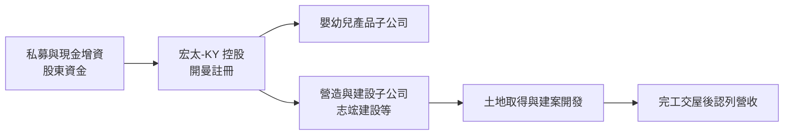
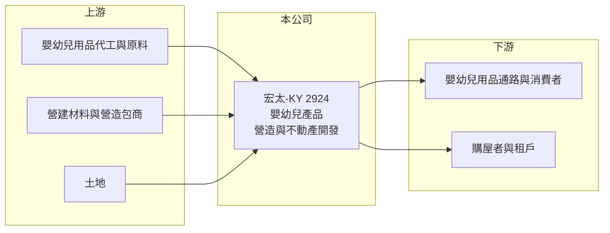

# 2924 宏太-KY

> 上櫃｜[[產業索引-居家生活|居家生活]]｜上市（櫃）日期 2011/12/02

# 第一章：企業模式與商業藍圖

> [!info] 撰寫說明
> 本文由 Claude 依公開資料整理，架構比照 [[2330台積電]] 的四章研究，資料截至 2026-10-08。財務數字來源：Goodinfo 台灣股市資訊網年度經營績效、nStock 公司資料、櫃買中心開放資料（本筆記 _data 快照）；子公司工程承攬資訊取自 Yahoo 股市公告標題。公開資料有限，業務轉型細節與營收比重未查得，產業描述為整理性內容，尚未逐條比對原始文件。#待校對

在評估單一個股的長期投資價值時，首要步驟是拆解企業的底層獲利邏輯。本章說明宏太-KY（股票代號：2924）這家開曼註冊的控股公司，如何從嬰幼兒產品事業，轉向工程營造與不動產開發，以及這樣的轉型對投資人代表什麼。

## 一、核心定位：處於轉型期的 KY 控股公司

宏太-KY 於 2009 年在開曼群島設立，屬於 [[KY股]]，本身是投資控股公司，實際營運由旗下子公司進行，2011 年 12 月在櫃買中心掛牌。依 nStock 整理的公司資料，2022 年股東臨時會通過更名，同年 12 月經經濟部核准，正式更名為開曼群島宏太股份有限公司。

依公司揭露的業務範圍，合併公司經營三類事業：嬰幼兒產品的研發、製造與銷售，工程營造，以及不動產、住宅與大樓的開發與租售。從財務數字看，公司的營收規模已從 2018 年的 6.77 億元縮小到 2025 年的 0.67 億元，原本的嬰幼兒產品事業明顯萎縮，公司正處於事業重心轉換的階段。

## 二、事業板塊：舊業務萎縮、新業務尚未貢獻

各事業的營收比重未查得，以下依公開資料做定性說明。

* **嬰幼兒產品：** 這是公司過去的主力事業。2018 至 2020 年毛利率高達 58% 至 62%，顯示當時的產品具品牌或通路溢價；但營收逐年下滑，2021 年起毛利率降到 17% 至 37%，代表原有產品的競爭力與規模都已明顯減弱。
* **工程營造：** 依公告標題，子公司志竤建設曾與築安營造簽訂工程承攬意向書。營造業務的收入認列跟著工程進度，規模與時點都較不穩定。
* **不動產開發與租售：** 2026 年第二季的資產負債表中，流動資產約 9.9 億元，占總資產約 10.3 億元的九成以上。建設公司的在建房地通常列在流動資產的存貨中，推估公司已把大部分資金投入不動產開發案，但具體個案未查得。

## 三、資本轉化邏輯：從消費品轉向建案模式

* **建案模式的特性：** 不動產開發在土地取得與興建期間幾乎沒有營收，費用與利息卻持續發生，完工交屋時才一次認列收入與利潤。這代表宏太-KY 在建案完工前，財報很可能持續呈現虧損，獲利時點高度集中。
* **資金來源：** 實收資本額約 5.2 億元，其中私募股數約 1,923 萬股，顯示公司曾透過私募引進資金，以支應轉型所需。

## 四、企業長期藍圖：轉型成果仍待驗證

公司長期方向是以營造與不動產開發取代萎縮的嬰幼兒產品事業。由於目前尚無建案完工交屋的公開紀錄可查，這個轉型的成敗，要看首批開發案能否如期完工、銷售與認列。依 nStock 資料，公司近五年沒有配息紀錄，資本配置以投入新事業為主。

# 第二章：護城河深度與競爭優勢

在長期價值投資中，「護城河」指企業抵禦競爭、維持超額利潤的保護機制。本章分析宏太-KY 在轉型過程中是否具備競爭優勢。

## 一、護城河的核心組成要素

以目前的公開資料來看，宏太-KY 尚未建立明確的護城河。

* **1. 舊事業的優勢已流失：** 嬰幼兒產品過去的高毛利率，代表曾有一定的產品或通路優勢，但營收縮小到不到 1 億元，這項優勢已經難以支撐公司。
* **2. 新事業處於起步期：** 營造與不動產開發是高度在地化、資本密集的產業，競爭優勢通常來自土地取得能力、品牌口碑與資金成本。宏太-KY 在這三方面都還沒有可驗證的紀錄。
* **3. 規模劣勢：** 股東權益約 4.5 億元，與上市櫃建商相比規模很小，可同時推動的建案數量有限，單一建案的成敗對公司影響很大。

## 二、主要競爭對手格局

| 對手 | 定位 | 對宏太-KY 的威脅 |
|---|---|---|
| 地方中小型建商 | 熟悉當地土地與客群 | 在土地取得與銷售上直接競爭（推估） |
| 上市櫃大型建商 | 品牌與資金成本優勢 | 搶占優質地段與購屋者信任（推估） |
| 嬰幼兒用品國際品牌與電商 | 品牌、通路與價格優勢 | 是舊事業萎縮的主因（推估） |

## 三、優勢轉化：守得住／守不住／觀察重點

* **守得住：** 目前沒有明顯可守住的利基。
* **守不住：** 原有嬰幼兒產品的市場，營收已大幅萎縮。
* **觀察重點：** 長期可以觀察三件事：開發案的地點、規模與預售狀況；完工交屋後的毛利率；以及公司是否需要持續以增資或借款支應營運。

# 第三章：財務體質與盈利規模

資料日期：2026-10-08。數字取自 Goodinfo 年度經營績效與櫃買中心開放資料快照，表格是撰寫當時的快照；最新月營收、毛利率、累計 EPS 由自動排程寫在本筆記的屬性欄位（月營收、毛利率、累計EPS 等）。#待校對

財務報表是檢驗護城河是否真實存在的最終標準。本章用多年度的三率與 ROE，檢視宏太-KY 轉型過程中的財務狀況。

## 一、獲利能力的基石：三率

| 年度 | 營收（新台幣） | [[毛利率]] | [[營業利益率]] | EPS（元） | [[ROE]] |
|---|---|---|---|---|---|
| 2018 | 6.77 億 | 62.5% | -16.0% | -3.84 | -23.1% |
| 2019 | 5.45 億 | 58.4% | -16.2% | -2.56 | -20.6% |
| 2020 | 3.66 億 | 59.7% | -17.5% | -3.79 | -41.9% |
| 2021 | 2.72 億 | 33.5% | -60.5% | -1.72 | -27.1% |
| 2022 | 0.80 億 | 23.9% | -90.6% | 0.23 | 4.1% |
| 2023 | 0.41 億 | 36.7% | -72.6% | -1.05 | -19.9% |
| 2024 | 1.65 億 | 16.9% | -20.7% | -1.67 | -19.4% |
| 2025 | 0.67 億 | 27.0% | -92.5% | -1.17 | -12.0% |

* **[[毛利率]]：** 2018 至 2020 年維持在 58% 以上，之後掉到 17% 至 37%，反映舊產品的定價能力消失，以及營收組合改變。
* **[[營業利益率]]：** 八年全部為負。營收縮小後，管理費用等固定成本無法被攤平，虧損率在 2021 年後擴大到 -60% 至 -92%。
* **淨利與業外：** 2022 年在本業大幅虧損下仍有小幅淨利，推估來自業外收益，屬一次性成分，不代表本業轉好。
* **長期指標：** 2020 至 2025 年營收年複合成長率約 -29%（推算）；2021 至 2025 年五年平均 ROE 約 -14.9%（推算）；近五年未配發現金股利。

## 二、[[ROE]]：資本效率

除 2022 年外，ROE 全部為負，代表股東資金長期被虧損侵蝕。依 2026 年第二季資產負債表，總資產約 10.3 億元、總負債約 5.8 億元（幾乎都是流動負債）、股東權益約 4.5 億元，負債比約 56%。在建案尚未貢獻營收前，負債主要用於支應開發所需資金（推估）。

## 三、資本支出與自由現金流

* **[[CapEx]]：** 建案投入多列為存貨而非固定資產，因此傳統資本支出不大，但營運資金需求高，具體金額未查得。
* **[[自由現金流]]：** 本業持續虧損，加上不動產開發需要投入土地與工程款，推估自由現金流長期為負，逐年數字未查得。

## 四、[[ROIC]] 與 [[WACC]]：價值創造利差

宏太-KY 的營業利益八年皆為負，ROIC 為負值。以 2025 年為例，營業虧損約 0.62 億元（營收 0.67 億元 × 營業利益率 -92.5%），相對於股東權益約 4.5 億元，ROIC 約 -14%（推算）。

WACC 以 CAPM 推估：台灣 10 年期公債約 1.5% 至 2%，市場風險溢酬約 6%，β 未查得，以小型轉型公司常見的 1.0 至 1.2 假設，股東權益成本約 7.5% 至 9.2%。考量負債比約五成、負債成本假設 3%（稅後 2.4%），WACC 約 5% 至 6%（推算）。

ROIC 長期遠低於 WACC，代表公司過去八年持續在消耗股東價值。轉型能否扭轉，取決於不動產開發案完工後的實際獲利。

# 第四章：總體風險與地緣政治

任何企業都無法脫離宏觀環境獨立存在。本章分析宏太-KY 長期必須面對的轉型、產業與公司治理風險。

## 一、地緣政治與法規

* **KY 股的資訊揭露：** 註冊地在開曼群島，營運子公司分散，投資人取得子公司與建案資訊的難度較高。
* **不動產政策：** 台灣的選擇性信用管制、囤房稅與預售屋相關法規，會影響建案銷售與融資條件。

## 二、產業週期與市場結構

* **房地產循環：** 不動產開發受利率、信用管制與購屋需求影響很大，景氣反轉時，建案可能出現銷售遲緩與存貨積壓。
* **營造成本：** 營建材料與工資上漲會壓縮建案毛利，小型建商的議價能力有限。

## 三、營運環境的隱性風險

* **轉型執行風險：** 公司從消費品跨入營造與不動產，管理團隊需要建立全新的能力，執行上的不確定性高。
* **資金與流動性：** 本業持續虧損，若建案銷售不如預期，可能需要再增資或借款，稀釋既有股東權益。
* **營收規模過小：** 2025 年營收不到 1 億元，任何單一事件都可能大幅影響財報。

## 四、科技或法規演進

* **建築法規與節能要求：** 建築節能、耐震與綠建築標準逐步提高，會增加建案成本與設計門檻。

# 專有名詞解析

## 金融

- **[[KY股]]**：在海外（多為開曼群島）註冊、來台上市櫃的公司，股票代號後加 KY，營運多在台灣以外或透過海外控股架構進行。
- **[[業外收益]]**：本業以外的收入，例如處分資產、投資收益、匯兌利益，波動大且常不持續。
- **[[ROIC]]**：投入資本報酬率，稅後營業利益除以投入資本，衡量本業運用資金創造報酬的能力。
- **[[WACC]]**：加權平均資金成本，股東與債權人要求報酬率的加權平均，是 ROIC 要超過的門檻。

# 核心供應鏈

## 1. 上游：原料、營造與土地
- 嬰幼兒產品的原料與代工，供應商未揭露
- 營造合作：築安營造（子公司志竤建設簽訂工程承攬意向書）

## 2. 本公司：宏太-KY
- 開曼控股公司，事業包括嬰幼兒產品、工程營造、不動產開發與租售

## 3. 下游：客戶
- 嬰幼兒用品通路與消費者
- 住宅與大樓的購屋者與租戶

## 4. 同業
- 台灣中小型建商與營造廠（推估）

## 最新新聞
<!-- news:start -->
<!-- news:end -->

## 相關連結
- [公開資訊觀測站](https://mopsov.twse.com.tw/mops/web/t05st03?step=1&firstin=1&co_id=2924)
- [Goodinfo](https://goodinfo.tw/tw/StockDetail.asp?STOCK_ID=2924)
- [Yahoo 股市](https://tw.stock.yahoo.com/quote/2924)
- [鉅亨網新聞](https://www.cnyes.com/twstock/2924/news)
