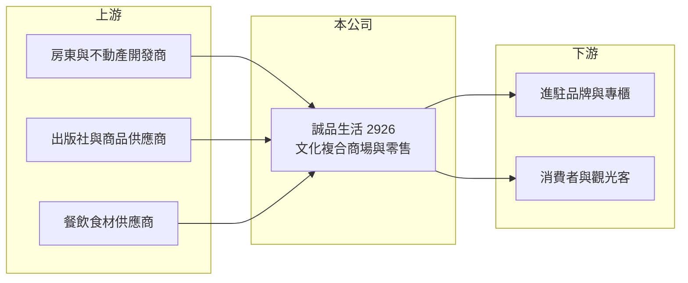

# 2926 誠品生活

> 上櫃｜[[產業索引-文化創意業|文化創意業]]｜上市（櫃）日期 2013/01/30

# 第一章：企業模式與商業藍圖

> [!info] 撰寫說明
> 精簡版，由 Claude 依公開資料整理，架構比照 [[2330台積電]] 的四章研究，資料截至 2026-10-08。來源：Goodinfo 年度經營績效頁、nStock 公司簡介、櫃買中心開放資料（基本資料、2026 年第二季資產負債與綜合損益、每月營收、本益比殖利率）；海外據點與業務描述為整理性內容，尚未逐條比對原始文件。#待校對

本章拆解誠品生活（股票代號：2926）的商業模式。誠品生活是誠品集團旗下負責商場、零售與餐旅的上櫃公司，賣的不只是商品，而是以書店文化為號召、吸引人潮再向進駐品牌收取抽成的「文化複合商場」。

- **核心業務：** 誠品生活 2005 年設立，2010 年受讓母公司誠品股份有限公司分割的商場、餐旅及不動產事業，2013 年上櫃，實收資本額約 4.74 億元。依公司介紹，業務包括文化創意通路、商場委託經營與管理顧問、食品進口代理及零售、咖啡館與餐廳、網路零售與物流倉儲。母公司誠品股份綜合持股約 54.67%，最終母公司為頤宗投資（nStock）。
- **營收結構：** 公司未提供各業務營收比重。商場業務的模式是承租整棟或部分樓層，再分租給服飾、生活雜貨、餐飲等品牌，向品牌收取[[專櫃抽成]]或租金；零售與餐飲則是自營銷售。[[毛利率]]由 2016 至 2019 年的 45% 左右降到 2021 年後的 35% 至 39%，反映自營零售比重提高（推估）。
- **營運據點：** 以台灣為主，在台北、新北、台中、高雄等地經營多家誠品生活商場，2023 年底台中誠品生活 480 試營運。海外方面，2012 年進入香港、2015 年開設蘇州誠品生活，2019 年在東京日本橋以授權方式展店（海外據點的現況待校對）。
- **長期方向：** 誠品生活的長期挑戰是讓實體空間在電商時代持續有吸引力。公司以書店、展演與文化活動建立品牌，再透過餐飲與生活風格商品變現。董事長兼總經理吳旻潔為創辦人吳清友之女，經營風格重視品牌形象與空間質感，擴點以「每一家店都是在地文化據點」為原則，而非快速複製。

# 第二章：護城河深度與競爭優勢

誠品生活的護城河來自品牌，這種優勢在台灣零售業中相當少見，但轉化成獲利的效率並不高。

- **競爭優勢：** 「誠品」在華人世界是具代表性的文化品牌，房東與開發商願意以較好的條件邀請誠品進駐，作為商場或都更案的招牌；品牌也讓誠品能吸引設計品牌、文創小店進駐，形成其他百貨難以複製的商品組合。這種「品牌帶人潮、人潮帶抽成」的模式，是誠品生活最核心的競爭力。
- **主要對手：** 在商場業務上，對手包括 [[2903遠百]]、新光三越、SOGO 等百貨公司，以及各類購物中心與 outlet；在書籍與文具零售上，面對博客來等網路書店與電商平台；在生活風格零售上，則與無印良品、蔦屋書店等品牌競爭。
- **觀察重點：** 2016 至 2019 年營業利益率約 7% 至 11%，2021 至 2023 年轉為虧損，2024 年起逐步回到接近損益兩平。能否把營業利益率重新拉回疫情前的水準，以及海外據點是否持續拖累獲利，是判斷品牌優勢能否轉為股東報酬的關鍵。

# 第三章：財務體質與盈利規模

資料日期：2026-10-08，表格是撰寫當時的快照；最新月營收、毛利率、累計 EPS 由自動排程寫在本筆記的屬性欄位（月營收、毛利率、累計EPS 等）。#待校對

本章用十年數據檢視誠品生活由疫情衝擊到復原的過程。

| 年度 | 營收（新台幣） | [[毛利率]] | [[營業利益率]] | EPS（元） | [[ROE]] |
|---|---|---|---|---|---|
| 2016 | 42.6 億 | 47.9% | 10.6% | 8.88 | 26.2% |
| 2018 | 45.4 億 | 44.6% | 6.91% | 7.32 | 20.4% |
| 2019 | 53.2 億 | 46.4% | 8.87% | 4.92 | 15.2% |
| 2020 | 45.4 億 | 40.6% | 1.93% | 1.16 | 4.15% |
| 2021 | 46.8 億 | 35.3% | -9.55% | -4.82 | -23.8% |
| 2022 | 55.8 億 | 34.8% | -8.87% | -3.97 | -22.6% |
| 2023 | 66.4 億 | 35.4% | -5.68% | -2.73 | -18.4% |
| 2024 | 68.5 億 | 38.9% | -2.37% | 0.27 | 2.08% |
| 2025 | 69.7 億 | 38.8% | -0.18% | 0.54 | 4.06% |
| 2026 上半年 | 35.07 億 | 38.2% | -1.0% | 0.32 | 不適用（半年） |

- **營收規模：** 營收由 2016 年的 42.6 億元成長到 2025 年的 69.7 億元，九年年複合成長率約 5.6%（推算），2021 至 2025 年約 10.5%（推算）。成長主要來自新據點與自營業務擴大，但營收成長並未帶來相同幅度的獲利。
- **獲利：** 疫情前營業利益率約 7% 至 11%、ROE 15% 至 26%；2021 至 2023 年連續三年虧損，ROE 一度低於 -20%。2024 與 2025 年回到小幅獲利，但本業仍在損益兩平附近，淨利主要靠業外收入支撐。2021 至 2025 年平均 ROE 約 -11.7%（推算）。
- **財務特色：** 2026 年第二季底總資產約 147.7 億元、負債約 141.4 億元，股東權益只有約 6.2 億元。負債如此之高，主要是長期租約依 [[IFRS 16]] 認列的[[租賃負債]]（推估），並不全是銀行借款，但也代表公司承擔了大量固定租金義務。2025 年度配發現金股利 0.46 元（nStock）。

**[[ROIC]] 與 [[WACC]]：** 2025 年營業利益率 -0.18%，本業接近打平，ROIC 約為 0（推算）；以疫情前 2019 年計算，營業利益約 4.7 億元、稅後約 3.8 億元，若投入資本以股東權益加租賃負債約 100 億元以上估計（推估），ROIC 不到 4%（推算）。WACC 假設公債 1.75%、市場風險溢酬 6%、β 取 0.7（零售通路常見值，假設），股東權益成本約 5.95%；負債成本假設 2.5%、稅後 2.0%，以租賃負債為主的資本結構計算，WACC 約 2% 至 3%（推算）。由於資本結構特殊，這個 WACC 偏低且敏感度高；即使如此，近年 ROIC 仍低於資金成本，代表誠品生活的品牌價值目前主要累積在無形影響力，尚未轉化為穩定的資本報酬。

# 第四章：總體風險與地緣政治

誠品生活的風險來自實體零售的結構性挑戰與高固定成本。

- **產業週期：** 商場與零售營收跟隨消費景氣與觀光人潮，疫情期間的虧損顯示營收一旦下滑，高額租金與人事費用很快就會吞掉利潤。
- **營運風險：** 大量長期租約讓成本結構僵固，租約到期續約時若房東調漲租金，或大型據點熄燈（例如 2023 年底信義店結束營業），都會影響營收與品牌曝光。海外據點的經營成效與匯率，也會影響合併損益。
- **其他風險：** 電商持續侵蝕書籍與生活雜貨的實體銷售；股東權益偏低，若再出現連續虧損，財務彈性有限。少子化與閱讀習慣改變，則是書店文化核心的長期挑戰。

# 專有名詞解析

## 金融

- **[[IFRS 16]]**：國際財務報導準則第 16 號「租賃」，規定承租人把長期租約認列為使用權資產與租賃負債。
- **[[租賃負債]]**：企業依長期租約未來須支付租金的現值，依 IFRS 16 列為負債，性質類似借款。
- **[[ROIC]]**：投入資本報酬率，稅後營業利益除以股東權益加有息負債，衡量本業運用資本的效率。
- **[[WACC]]**：加權平均資金成本，股東與債權人要求報酬的加權平均，ROIC 高於它才代表創造價值。

## 產業

- **[[專櫃抽成]]**：百貨與商場向進駐品牌依銷售額收取一定比例費用的經營模式，商場收入隨品牌業績浮動。

# 核心供應鏈

- 上游：提供商場空間的房東與開發商、出版社與文具雜貨供應商、餐飲食材供應商；母公司誠品股份有限公司。
- 下游／客戶：進駐商場的品牌與專櫃、到店消費的民眾與觀光客。
- 同業：[[2903遠百]]、新光三越、SOGO、博客來等網路書店。

## 最新新聞
<!-- news:start -->
<!-- news:end -->

## 相關連結
- [公開資訊觀測站](https://mopsov.twse.com.tw/mops/web/t05st03?step=1&firstin=1&co_id=2926)
- [Goodinfo](https://goodinfo.tw/tw/StockDetail.asp?STOCK_ID=2926)
- [Yahoo 股市](https://tw.stock.yahoo.com/quote/2926)
- [鉅亨網新聞](https://www.cnyes.com/twstock/2926/news)
