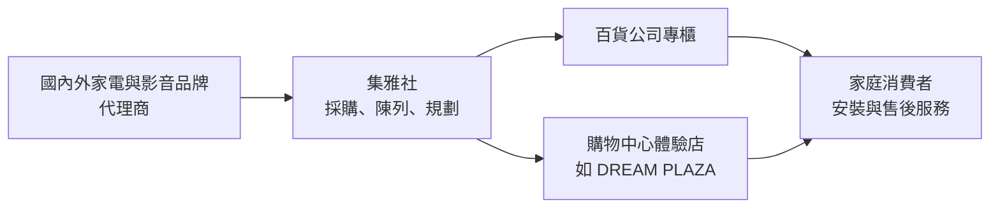
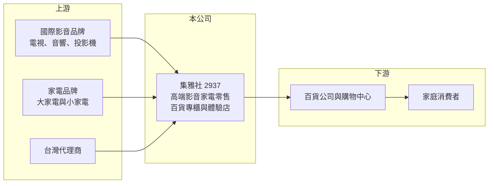

# 2937 集雅社

> 上櫃｜[[產業索引-居家生活|居家生活]]｜上市（櫃）日期 2017/06/08

# 第一章：企業模式與商業藍圖

> [!info] 撰寫說明
> 本文由 Claude 依公開資料整理，架構比照 [[2330台積電]] 的四章研究，資料截至 2026-10-08。財務數字來源：Goodinfo 台灣股市資訊網年度經營績效、MoneyDJ 公司基本資料（富邦證券版）、櫃買中心開放資料（本筆記 _data 快照）；業務描述另參考聯合報、工商時報、三立新聞的新聞標題。公開資料有限，門市數與品牌代理細節未查得，產業描述為整理性內容，尚未逐條比對原始文件。#待校對

在評估單一個股的長期投資價值時，首要步驟是拆解企業的底層獲利邏輯。本章說明集雅社（股票代號：2937）這家以百貨專櫃為主的高端影音家電零售商，如何在電商與量販店的價格戰中，靠服務與體驗建立自己的市場。

## 一、核心定位：百貨通路的高端家電規劃師

集雅社成立於 1994 年，總部位於高雄，2017 年在櫃買中心掛牌。公司的本業是零售，銷售的不是自己製造的產品，而是國內外品牌的高端影音設備與家電，主要據點設在百貨公司的專櫃與購物中心。新聞報導常以「百貨最強家電規劃師」形容它的定位。

和量販店或電商不同，集雅社的客群是在百貨公司消費、重視品質與服務的家庭。它提供的價值不只是賣一台電視或音響，而是替客戶規劃整個家庭的影音與家電配置，並負責安裝與售後服務。這種顧問式銷售，讓它能賣出單價較高的商品，也更容易累積回頭客。

## 二、產品板塊：影音家電占九成九

依 MoneyDJ 整理的 2025 年營收比重，影音家電占 98.96%，非影音家電占 1.04%。這裡的「影音家電」是廣義的分類，涵蓋電視、音響、投影機，以及冰箱、洗衣機、空調與各類小家電。

* **影音設備：** 高階電視、音響與家庭劇院是集雅社起家的品類。依新聞標題，音響與微型投影機是近年的熱銷商品，顯示消費者對居家娛樂的投入持續增加。
* **大型與生活家電：** 冰箱、洗衣機、空調等大家電單價高、需要安裝，適合顧問式銷售，是營收的重要來源（推估）。
* **小家電與獨家商品：** 新聞標題提到小家電銷售穩健，以及獨家商品推升成長。獨家或限定商品可以避開與電商的直接比價，是提升毛利的手段。

## 三、資本轉化邏輯：通路零售的周轉生意

* **毛利率穩定、營業利益率偏薄：** 集雅社的毛利率長期在 22% 至 26%，這是零售業轉賣品牌商品的典型水準。扣除百貨抽成、人員與倉儲費用後，營業利益率只有 2% 至 5%。
* **周轉率是獲利關鍵：** 利潤率雖薄，但零售業的資產主要是存貨與應收款，資本需求不高。集雅社的 ROE 長期在 12% 至 18%，代表它靠高周轉與財務結構，把薄利轉成不錯的股東報酬。
* **營運資金的特性：** 2026 年第二季總負債約 19.5 億元，幾乎都是流動負債，推估以應付帳款與預收款為主。零售商常先收客戶的錢、後付供應商貨款，這讓公司能用較少的自有資金支撐營運。

## 四、企業長期藍圖：體驗店與規模擴張

* **營收穩定成長：** 營收從 2018 年的 18.6 億元成長到 2025 年的 52 億元，七年成長近 1.8 倍，主要來自新據點與既有門市的成長。
* **體驗型據點：** 依新聞標題，集雅社進駐 DREAM PLAZA 等購物中心，強化體驗布局。消費者可以在現場試聽、試看，這是實體通路對抗電商的核心手段。
* **資本配置習慣：** 2019 至 2025 年度的現金股利分別為 1.55、1.20、2.25、1.28、2.00、2.00、2.10 元。以 2025 年 EPS 4.06 元計算，配息率約 52%（推算），屬於穩定配發、保留部分盈餘支應展店的模式。

# 第二章：護城河深度與競爭優勢

在長期價值投資中，「護城河」指企業抵禦競爭、維持超額利潤的保護機制。本章分析集雅社的競爭優勢、主要對手，以及實體高端通路在電商時代能守住多少。

## 一、護城河的核心組成要素

集雅社的護城河屬於窄護城河，主要來自通路位置與服務能力。

* **1. 百貨通路的位置：** 百貨公司的家電專櫃位置有限，集雅社長期經營百貨通路，與百貨業者的合作關係是新進者不容易複製的資源。百貨的客群消費力較高，也讓它能銷售高單價商品。
* **2. 顧問式銷售與安裝服務：** 高階音響、家庭劇院與大型家電需要專業規劃與安裝，消費者願意為這類服務付出溢價。這是集雅社與電商最大的差別。
* **3. [[會員經濟]]與回頭客：** 家庭會分階段添購與汰換家電，服務滿意的客戶會持續回購。累積的會員與客戶資料，讓公司能做精準的再行銷。

## 二、主要競爭對手格局

| 對手 | 定位 | 對集雅社的威脅 |
|---|---|---|
| 燦坤、全國電子等 3C 家電連鎖 | 大眾家電零售 | 在一般家電品類價格競爭（推估） |
| momo、PChome 等電商 | 低價與便利 | 標準化家電容易被比價（推估） |
| 品牌直營店與官網 | 品牌自己賣 | 繞過通路直接接觸消費者（推估） |
| 百貨內其他家電專櫃 | 同一通路的競爭者 | 爭奪百貨客群（推估） |

## 三、優勢轉化：守得住／守不住／觀察重點

* **守得住：** 需要規劃與安裝的高階影音與大型家電，以及獨家或限定商品。這些品類的消費者重視服務與體驗，價格敏感度較低。
* **守不住：** 規格明確、容易比價的小家電與一般電視。電商的價格透明，會壓縮這類商品的毛利。毛利率從 2022 年的 26.3% 降到 2025 年的 22.1%，推估與產品組合和價格競爭有關。
* **觀察重點：** 長期可以觀察三件事：毛利率能否穩定在 22% 以上；新據點的營收貢獻與營業利益率；以及獨家商品與服務收入的比重是否提升。

# 第三章：財務體質與盈利規模

資料日期：2026-10-08。數字取自 Goodinfo 年度經營績效、MoneyDJ 與櫃買中心開放資料快照，表格是撰寫當時的快照；最新月營收、毛利率、累計 EPS 由自動排程寫在本筆記的屬性欄位（月營收、毛利率、累計EPS 等）。#待校對

財務報表是檢驗護城河是否真實存在的最終標準。本章用多年度的三率、ROE 與資本報酬，檢視集雅社的成長品質。

## 一、獲利能力的基石：三率

| 年度 | 營收（新台幣） | [[毛利率]] | [[營業利益率]] | EPS（元） | [[ROE]] |
|---|---|---|---|---|---|
| 2018 | 18.6 億 | 25.3% | 2.1% | 1.35 | 8.4% |
| 2019 | 23.8 億 | 24.0% | 3.4% | 2.22 | 12.8% |
| 2020 | 28.9 億 | 25.0% | 4.4% | 3.15 | 16.5% |
| 2021 | 31.9 億 | 25.4% | 4.6% | 3.20 | 16.7% |
| 2022 | 38.0 億 | 26.3% | 4.7% | 3.80 | 17.9% |
| 2023 | 40.6 億 | 24.3% | 3.5% | 2.81 | 12.2% |
| 2024 | 46.4 億 | 23.1% | 4.2% | 3.86 | 15.5% |
| 2025 | 52.0 億 | 22.1% | 4.4% | 4.06 | 16.4% |

* **[[毛利率]]：** 長期在 22% 至 26% 之間，近三年逐步下滑，但營收規模擴大後，費用率下降抵銷了毛利率的壓力。
* **[[營業利益率]]：** 從 2018 年的 2.1% 提升到 4% 以上並維持，代表規模擴大帶來的費用攤提效果，也就是零售業的 [[營運槓桿]]。
* **長期指標：** 2018 至 2025 年營收年複合成長率約 15.8%，2020 至 2025 年約 12.5%（皆為推算），八年營收沒有一年衰退。2021 至 2025 年五年平均 ROE 約 15.7%（推算）。

## 二、[[ROE]]：資本效率

集雅社 ROE 在 2020 年後多數年份維持 15% 以上，以零售業來說屬於不錯的水準。依 2026 年第二季資產負債表，總資產約 30.5 億元、總負債約 19.5 億元、股東權益約 11.0 億元，負債比約 64%。負債比看似偏高，但絕大部分是流動負債，推估主要是應付帳款與預收款，屬於零售業營運模式的自然結果，而不是大量舉債。

## 三、資本支出與自由現金流

* **[[CapEx]]：** 零售業的資本支出以門市裝修與設備為主，金額不大，具體數字未查得。
* **[[自由現金流]]：** 獲利穩定、資本支出小，推估自由現金流多數年份為正，並足以支應每年 2 元左右的現金股利；逐年數字未查得。

## 四、[[ROIC]] 與 [[WACC]]：價值創造利差

有息負債金額未查得，以股東權益近似投入資本。以 2025 年為例，營業利益約 2.26 億元（營收 52 億元 × 營業利益率 4.35%），扣除 20% 稅率後約 1.81 億元，以股東權益約 11.0 億元計算，ROIC 約 16%（推算）。若公司有部分短期借款，實際 ROIC 會略低，但仍明顯高於資金成本。

WACC 以 CAPM 推估：台灣 10 年期公債約 1.5% 至 2%，市場風險溢酬約 6%。MoneyDJ 所列 β 僅 0.08，推估是交易量偏低造成，參考性不足，改採零售通路股常見的 0.6 至 0.8（假設），股東權益成本約 5.1% 至 6.8%。有息負債不多，WACC 約 5% 至 6.5%（推算）。

ROIC 約 16% 明顯高於 WACC，代表集雅社在 2020 年後持續創造價值。這個利差的來源是低資本密集度與穩定的周轉，而不是高利潤率，因此能否維持，關鍵在於展店效率與存貨管理。

# 第四章：總體風險與地緣政治

任何企業都無法脫離宏觀環境獨立存在。本章分析集雅社長期必須面對的消費景氣、通路結構與營運風險。

## 一、地緣政治與關稅

* **進口商品成本：** 集雅社銷售的高階影音與家電多為日本、歐美與韓國品牌，國際貿易摩擦與匯率變動會影響進貨成本。
* **供應鏈中斷：** 品牌商的生產若受地緣衝突影響，可能出現缺貨，影響銷售。

## 二、產業週期與市場結構

* **消費景氣循環：** 高單價家電屬於可延後的消費，景氣轉弱或房市降溫時，換購需求會減少。2023 年營業利益率下滑到 3.5%，推估與疫情後需求回落有關。
* **電商的長期侵蝕：** 消費者習慣在實體店體驗、上網比價，標準化商品的毛利會持續承壓。

## 三、營運環境的隱性風險

* **百貨通路依賴：** 據點集中在百貨公司與購物中心，百貨的客流變化、租約條件與抽成比例，都會直接影響獲利。
* **存貨風險：** 家電與影音產品更新快，若新品推出後舊品無法及時出清，可能產生存貨跌價損失。
* **人才：** 顧問式銷售需要專業銷售與安裝人員，人力成本上升與人才流失會影響服務品質。

## 四、科技或法規演進

* **產品世代更替：** 影音技術從電視、投影機到串流與智慧家庭快速演進，集雅社需要持續調整商品組合。
* **品牌直營化：** 若主要品牌加強官網與直營門市，通路商的議價空間可能縮小。

# 專有名詞解析

## 金融

- **[[營運槓桿]]**：固定成本占比高的企業，營收變動時營業利益變動幅度更大的現象。
- **[[ROIC]]**：投入資本報酬率，稅後營業利益除以投入資本，衡量本業運用資金創造報酬的能力。
- **[[WACC]]**：加權平均資金成本，股東與債權人要求報酬率的加權平均，是 ROIC 要超過的門檻。

## 產業

- **[[會員經濟]]**：以會員資料與回購關係為核心的經營方式，透過了解客戶需求提高回購率與客單價。

# 核心供應鏈

## 1. 上游：品牌與代理商
- 國內外影音與家電品牌、台灣代理商，具體名單未查得

## 2. 本公司：集雅社
- 高端影音與家電零售，百貨專櫃與購物中心體驗店，總部高雄

## 3. 下游：通路與消費者
- 百貨公司與購物中心（如 DREAM PLAZA）
- 重視品質與服務的家庭消費者

## 4. 同業
- 3C 家電連鎖、電商平台、品牌直營店（推估）

## 最新新聞
<!-- news:start -->
<!-- news:end -->

## 相關連結
- [公開資訊觀測站](https://mopsov.twse.com.tw/mops/web/t05st03?step=1&firstin=1&co_id=2937)
- [Goodinfo](https://goodinfo.tw/tw/StockDetail.asp?STOCK_ID=2937)
- [Yahoo 股市](https://tw.stock.yahoo.com/quote/2937)
- [鉅亨網新聞](https://www.cnyes.com/twstock/2937/news)
