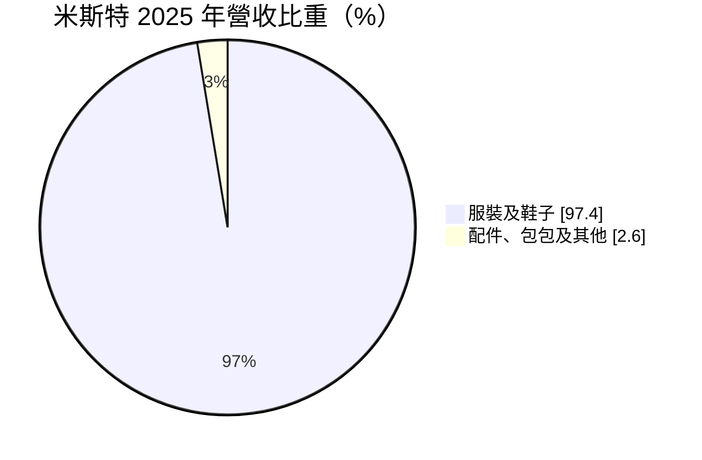
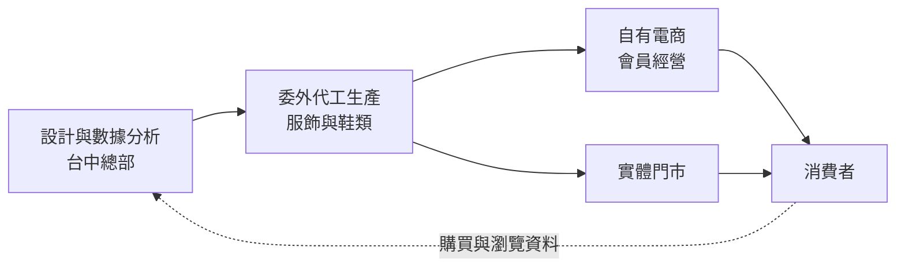
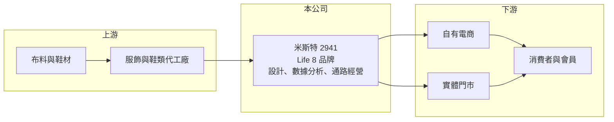

# 2941 米斯特

> 上櫃｜[[產業索引-居家生活|居家生活]]｜上市（櫃）日期 2024/03/20

# 第一章：企業模式與商業藍圖

> [!info] 撰寫說明
> 本文由 Claude 依公開資料整理，架構比照 [[2330台積電]] 的四章研究，資料截至 2026-10-08。財務數字來源：Goodinfo 台灣股市資訊網年度經營績效、MoneyDJ 公司基本資料（富邦證券版）、櫃買中心開放資料（本筆記 _data 快照）；業務描述另參考 104 職場力、數位時代、蕃薯藤、工商時報的新聞標題。公開資料有限，門市數與通路比重未查得，產業描述為整理性內容，尚未逐條比對原始文件。#待校對

在評估單一個股的長期投資價值時，首要步驟是拆解企業的底層獲利邏輯。本章說明米斯特（股票代號：2941）這家以 Life 8 品牌經營服飾與鞋類的公司，如何從電商起家，再走向實體門市，以及這個轉變對獲利結構的影響。

## 一、核心定位：數據驅動的服飾鞋類 [[自有品牌]]

米斯特國際成立於 2010 年，總部位於台中，2024 年 3 月 20 日在櫃買中心掛牌。依新聞標題，公司由林瑞豪、林瑞達兄弟以電商賣鞋起家，從零開始分工批貨，逐步建立 Life 8 品牌。目前董事長為林瑞豪，總經理為林瑞達。

米斯特的定位是自有品牌商，而不是代工廠或代理商。它自己設計商品、委外生產，再透過自有電商與實體門市直接賣給消費者。這種模式讓公司能掌握定價權與顧客資料，也能保留較高的毛利。依數位時代的報導標題，米斯特擁有百萬級會員，並從舊款鞋的銷售資料中找出消費者偏好，讓新品開發速度提升約一倍，數據分析是它的核心能力之一。

## 二、產品板塊：服裝與鞋子占九成七

依 MoneyDJ 整理的 2025 年營收比重：

* **服裝及鞋子（97.4%）：** 公司以鞋類起家，之後擴大到男女服飾。服飾與鞋類是高頻率的消費品，款式更新快，品牌商的競爭力在於能否快速推出符合需求的新品。
* **配件、包包及其他（2.6%）：** 占比很小，主要功能是提高客單價與搭配銷售。

## 三、資本轉化邏輯：高毛利、重行銷的品牌生意

* **高毛利率：** 米斯特的毛利率長期在 51% 至 64%，近四年穩定在 60% 以上。這是自有品牌直接面對消費者的優勢，省去了中間通路的抽成。
* **費用吃掉大部分毛利：** 營業利益率只有 5% 至 10%，代表行銷、門市租金與人事費用占營收的比例很高。品牌商的獲利能力，取決於這些費用能否隨規模擴大而被攤平。
* **線上到線下：** 依 104 職場力的報導標題，公司上櫃時設定兩年內拓展到百家門市的目標。實體門市能提供試穿與體驗，吸引不習慣網購的客群，但也帶來租金與人力的固定成本。

## 四、企業長期藍圖：門市擴張與品牌經營

* **門市展店：** 從純電商走向線上線下整合，是米斯特上櫃後最主要的成長策略。營收從 2020 年的 2.71 億元成長到 2025 年的 9.27 億元，展店是主要動力。
* **數據與會員經營：** 以會員資料指導選品與行銷，是公司相對傳統服飾品牌的差異化所在，也是 [[會員經濟]] 的典型應用。
* **資本配置習慣：** 2022 至 2025 年度現金股利分別為 3.00、3.18、3.20、2.28 元，配息率很高，2025 年度約為 EPS 的 97%（推算）。高配息顯示公司偏好把盈餘回饋股東，但也代表展店資金需要靠營運現金流或借款支應。

# 第二章：護城河深度與競爭優勢

在長期價值投資中，「護城河」指企業抵禦競爭、維持超額利潤的保護機制。本章分析米斯特的品牌優勢、主要對手，以及電商品牌轉向實體擴張時能守住多少利潤。

## 一、護城河的核心組成要素

米斯特的護城河較淺，主要來自品牌認知與數據能力。

* **1. 會員資料與數據分析：** 百萬級的會員資料，讓公司能掌握消費者的尺寸、款式與價格偏好，降低新品開發失敗的風險。這項能力需要多年的資料累積，新進品牌不容易立即複製。
* **2. 直接面對消費者的通路：** 自有電商與門市讓公司掌握定價與顧客關係，毛利率能維持在 60% 以上。
* **3. 品牌認知：** Life 8 在台灣的年輕男性與休閒服飾客群中有一定知名度，但服飾品牌的忠誠度普遍不高，消費者容易被新品牌與折扣吸引。

## 二、主要競爭對手格局

| 對手 | 定位 | 對米斯特的威脅 |
|---|---|---|
| UNIQLO、GU 等日系快時尚 | 規模大、價格低、門市多 | 在基本款服飾直接競爭（推估） |
| 國際運動與鞋類品牌 | 品牌力強 | 在鞋類市場爭奪消費者（推估） |
| 電商新創服飾品牌 | 社群行銷、快速上新 | 爭奪年輕網購客群（推估） |
| 跨境電商平台 | 極低價 | 壓縮平價服飾的價格帶（推估） |

## 三、優勢轉化：守得住／守不住／觀察重點

* **守得住：** 已經熟悉 Life 8 版型與風格的回頭客，以及靠數據快速調整的商品組合。
* **守不住：** 純價格競爭的基本款。跨境電商與快時尚的價格更低，米斯特難以在價格上取勝。
* **觀察重點：** 營業利益率從 2023 年的 9.9% 降到 2025 年的 4.7%，同時營收仍在成長，顯示展店初期的費用壓力。長期可以觀察三件事：新門市成熟後營業利益率能否回到 8% 以上；同店營收是否成長；以及電商與門市的會員能否互相導流。

# 第三章：財務體質與盈利規模

資料日期：2026-10-08。數字取自 Goodinfo 年度經營績效、MoneyDJ 與櫃買中心開放資料快照，表格是撰寫當時的快照；最新月營收、毛利率、累計 EPS 由自動排程寫在本筆記的屬性欄位（月營收、毛利率、累計EPS 等）。#待校對

財務報表是檢驗護城河是否真實存在的最終標準。本章用多年度的三率、ROE 與資本報酬，檢視米斯特從電商轉向實體擴張的獲利品質。

## 一、獲利能力的基石：三率

| 年度 | 營收（新台幣） | [[毛利率]] | [[營業利益率]] | EPS（元） | [[ROE]] |
|---|---|---|---|---|---|
| 2018 | 2.31 億 | 50.8% | -24.2% | -4.14 | -46.2% |
| 2019 | 1.89 億 | 54.0% | -10.4% | -1.50 | -25.4% |
| 2020 | 2.71 億 | 56.8% | 10.2% | 2.39 | 36.6% |
| 2021 | 3.63 億 | 55.8% | 5.5% | 2.80 | 25.3% |
| 2022 | 5.06 億 | 61.6% | 10.5% | 3.09 | 20.5% |
| 2023 | 7.43 億 | 60.8% | 9.9% | 4.16 | 24.2% |
| 2024 | 8.23 億 | 63.8% | 7.5% | 3.31 | 16.0% |
| 2025 | 9.27 億 | 63.7% | 4.7% | 2.35 | 9.9% |

* **[[毛利率]]：** 從 2018 年的 50.8% 一路提升到 2024 年後的近 64%。毛利率上升反映品牌定價能力提高，以及自有通路比重增加。
* **[[營業利益率]]：** 2018 至 2019 年虧損，2020 年轉盈後在 5% 至 10% 之間；2024 年起明顯下滑，推估與門市擴張帶來的租金、人事與裝修攤提有關。
* **長期指標：** 2020 至 2025 年營收年複合成長率約 27.9%（推算），成長速度快。2021 至 2025 年五年平均 ROE 約 19.2%（推算），但呈現逐年下滑的趨勢，2025 年降到 9.9%。

## 二、[[ROE]]：資本效率

ROE 從 2020 年的 36.6% 降到 2025 年的 9.9%，原因有兩個：一是 2024 年上櫃前後辦理增資，股東權益變大；二是展店期間營業利益率下降。依 2026 年第二季資產負債表，總資產約 7.45 億元、總負債約 3.99 億元、權益約 3.46 億元，其中非流動負債約 1.78 億元，推估多為門市租約產生的 [[租賃負債]]。

## 三、資本支出與自由現金流

* **[[CapEx]]：** 主要用於門市裝修、倉儲與系統，隨展店速度增加，具體金額未查得。
* **[[自由現金流]]：** 服飾品牌的存貨需求高，展店期間存貨與裝修支出會同步增加，推估自由現金流受到壓縮；但公司仍維持高配息，逐年數字未查得。

## 四、[[ROIC]] 與 [[WACC]]：價值創造利差

有息負債金額未查得，以權益與非流動負債（推估多為租賃負債）兩種口徑估算。以 2025 年為例，營業利益約 0.43 億元（營收 9.27 億元 × 營業利益率 4.68%），扣除 20% 稅率後約 0.35 億元。以權益約 3.46 億元計算，ROIC 約 10%；若加計非流動負債 1.78 億元，ROIC 約 6.6%（皆為推算）。2023 年稅後營業利益約 0.59 億元，以權益約 2.4 億元（淨利 0.58 億元 ÷ ROE 24.2% 回推）計算，ROIC 約 24%（推算）。

WACC 以 CAPM 推估：台灣 10 年期公債約 1.5% 至 2%，市場風險溢酬約 6%。MoneyDJ 所列 β 為 0.18，推估是上櫃時間短、交易量低造成，參考性不足，改採服飾零售股常見的 0.8 至 1.0（假設），股東權益成本約 6.3% 至 8%。考量租賃負債，WACC 約 6% 至 7.5%（推算）。

2020 至 2023 年 ROIC 明顯高於 WACC，米斯特當時確實在創造價值；2025 年展店期間 ROIC 降到與 WACC 相近的區間。新門市成熟後能否讓 ROIC 回到兩位數，是判斷展店策略是否成功的關鍵。

# 第四章：總體風險與地緣政治

任何企業都無法脫離宏觀環境獨立存在。本章分析米斯特長期必須面對的消費、競爭與營運風險。

## 一、地緣政治與供應鏈

* **委外生產：** 服飾與鞋類多委由海外工廠生產（推估），生產地的關稅、匯率與勞動成本變化，會影響進貨成本與交期。
* **運輸成本：** 國際運費波動會影響進口商品的成本。

## 二、產業週期與市場結構

* **消費景氣：** 服飾屬於可延後的消費，景氣轉弱時，消費者會減少購買或轉向更便宜的品牌。
* **跨境電商與快時尚：** 國際快時尚與跨境電商平台以極低價格進入台灣市場，對平價服飾品牌形成長期壓力。

## 三、營運環境的隱性風險

* **展店風險：** 門市擴張帶來租金與人力的固定成本，若新門市業績不如預期，營業利益率會持續被壓縮。
* **存貨風險：** 服飾款式與季節性強，若判斷錯誤，過季存貨需要折價出清，影響毛利率。
* **經營團隊集中：** 公司由創辦人兄弟經營，策略與執行高度依賴核心經營者。

## 四、科技或法規演進

* **數位行銷成本：** 社群與搜尋廣告的成本持續上升，電商起家的品牌需要不斷投入才能維持流量。
* **永續要求：** 服飾產業面臨環保材料、回收與碳排揭露的要求，未來可能增加生產成本。

# 專有名詞解析

## 金融

- **[[租賃負債]]**：依 IFRS 16，企業把長期租約（如門市、辦公室）未來應付租金的現值列為負債。
- **[[ROIC]]**：投入資本報酬率，稅後營業利益除以投入資本，衡量本業運用資金創造報酬的能力。
- **[[WACC]]**：加權平均資金成本，股東與債權人要求報酬率的加權平均，是 ROIC 要超過的門檻。

## 產業

- **[[自有品牌]]**：企業以自己的品牌名稱設計與銷售商品，掌握定價與顧客關係，毛利通常高於代工或代理。
- **[[會員經濟]]**：以會員資料與回購關係為核心的經營方式，透過了解客戶需求提高回購率與客單價。

# 核心供應鏈

## 1. 上游：生產
- 服飾與鞋類代工廠、布料與鞋材供應商，名單未揭露

## 2. 本公司：米斯特
- 品牌：Life 8
- 產品：服裝及鞋子、配件與包包
- 總部：台中

## 3. 下游：通路
- 自有電商平台與實體門市，直接面對消費者

## 4. 同業
- 日系快時尚、國際運動鞋服品牌、電商服飾品牌（推估）

## 最新新聞
<!-- news:start -->
<!-- news:end -->

## 相關連結
- [公開資訊觀測站](https://mopsov.twse.com.tw/mops/web/t05st03?step=1&firstin=1&co_id=2941)
- [Goodinfo](https://goodinfo.tw/tw/StockDetail.asp?STOCK_ID=2941)
- [Yahoo 股市](https://tw.stock.yahoo.com/quote/2941)
- [鉅亨網新聞](https://www.cnyes.com/twstock/2941/news)
