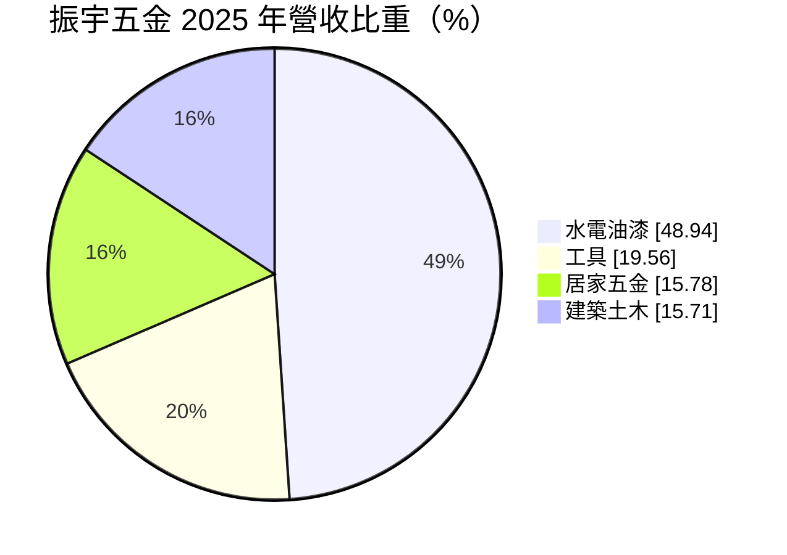
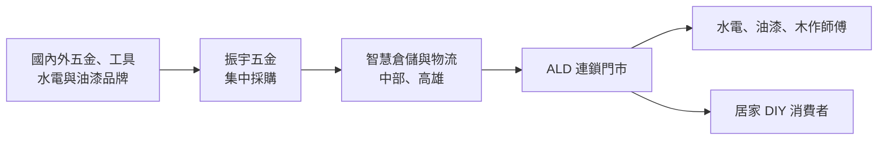
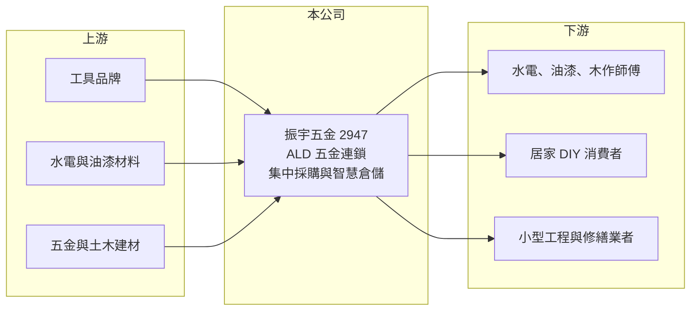

# 2947 振宇五金

> 上櫃｜[[產業索引-居家生活|居家生活]]｜上市（櫃）日期 2021/10/06

# 第一章：企業模式與商業藍圖

> [!info] 撰寫說明
> 本文由 Claude 依公開資料整理，架構比照 [[2330台積電]] 的四章研究，資料截至 2026-10-08。財務數字來源：Goodinfo 台灣股市資訊網年度經營績效、MoneyDJ 公司基本資料（富邦證券版）、櫃買中心開放資料（本筆記 _data 快照）；業務描述另參考聯合報、自由時報、科技新報、中央社的新聞標題。公開資料有限，確切門市數與客群比重未查得，產業描述為整理性內容，尚未逐條比對原始文件。#待校對

在評估單一個股的長期投資價值時，首要步驟是拆解企業的底層獲利邏輯。本章說明振宇五金（股票代號：2947）這家以 ALD 品牌經營五金連鎖的公司，如何把傳統的五金行生意，做成有規模的連鎖通路。

## 一、核心定位：專業與居家兼顧的五金連鎖

振宇五金成立於 2008 年，總部位於台中，2021 年 10 月在櫃買中心掛牌，公司網址與投資人信箱都使用 ALD 名稱。它經營的是五金、工具與水電建材的連鎖零售，客群包括水電、油漆、木作等專業師傅，以及自己動手修繕的居家消費者。

傳統五金行多是個人經營的小店，商品雜、庫存管理靠經驗。振宇五金把這門生意連鎖化：以統一採購壓低進貨成本，以中央倉儲和物流支援各門市，並用大坪數門市陳列上萬種品項，讓師傅可以一次買齊施工所需材料。這種模式類似美國的家得寶（Home Depot），但更偏重專業師傅的需求。

## 二、產品板塊：水電油漆占近一半

依 MoneyDJ 整理的 2025 年營收比重：

* **水電油漆（48.94%）：** 水電材料與油漆是裝修工程最頻繁的消耗品，師傅幾乎每天都需要補貨，是穩定來客的基礎。
* **工具（19.56%）：** 電動與手工具單價較高，品牌選擇多，也是專業客群重視的品類。
* **居家五金（15.78%）：** 門鎖、收納、衛浴配件等，主要吸引居家 DIY 客群。
* **建築土木（15.71%）：** 水泥、防水與土木材料，與營建與修繕景氣相關。

## 三、資本轉化邏輯：規模採購與高周轉

* **毛利率穩定在 38% 至 40%：** 八年間毛利率幾乎沒有波動，代表振宇五金對供應商有穩定的議價能力，商品組合也相當分散。零售業能維持近四成毛利，部分原因是五金品項多、單價低，消費者對個別品項價格較不敏感。
* **營業利益率被展店費用壓低：** 營業利益率從 2018 至 2021 年的 8.5% 以上，降到 2022 年後的 3.5% 至 5%。新門市的租金、人力與開辦費用在前期就會發生，營收卻需要時間爬坡。
* **倉儲投資：** 依新聞標題，公司在高雄啟用智慧倉儲，以支援南部展店。中央倉儲是連鎖通路擴大規模後降低缺貨與物流成本的關鍵。

## 四、企業長期藍圖：百店目標與全台布局

* **百店計畫：** 依聯合報標題，公司設定「2026 百店達陣」的目標，2025 年營收約 22.9 億元、年增 5.7%。從中部起家，逐步往北部與南部擴張，是長期成長的主軸。
* **專業客群經營：** 連鎖五金的長期價值，在於成為師傅日常補貨的首選，這需要穩定的品項齊全度與營業時間。
* **資本配置習慣：** 2020 至 2025 年度現金股利分別為 3.60、3.80、2.20、1.30、2.10、2.10 元。以 2025 年 EPS 3.17 元計算，配息率約 66%（推算），在展店期間仍維持配息。

# 第二章：護城河深度與競爭優勢

在長期價值投資中，「護城河」指企業抵禦競爭、維持超額利潤的保護機制。本章分析振宇五金的競爭優勢、主要對手，以及連鎖化在五金零售中能建立多深的優勢。

## 一、護城河的核心組成要素

振宇五金的護城河屬於窄護城河，主要來自規模、品項與在地密度。

* **1. 規模採購的成本優勢：** 門市數量越多，向供應商採購的量越大，進貨成本越低。這讓振宇五金能同時維持近四成毛利，又能提供師傅有競爭力的價格。
* **2. 品項齊全度：** 師傅施工時最怕缺料，能一次買齊的門市可以節省大量時間。上萬種品項的庫存與陳列，需要倉儲系統與資金支撐，個人五金行難以做到。
* **3. 門市密度與便利性：** 師傅通常就近補貨，同一區域的門市越密，越能成為師傅的習慣。這種在地密度是先行者的優勢。

## 二、主要競爭對手格局

| 對手 | 定位 | 對振宇五金的威脅 |
|---|---|---|
| 特力屋（HOLA） | 居家修繕與家居大型通路 | 搶居家 DIY 客群（推估） |
| 地方傳統五金行與水電材料行 | 熟客關係與賒帳 | 在專業師傅市場競爭（推估） |
| 電商平台 | 價格透明、配送到府 | 搶標準化工具與居家五金（推估） |
| 量販店 | 一般家用五金 | 搶簡單的居家修繕需求（推估） |

## 三、優勢轉化：守得住／守不住／觀察重點

* **守得住：** 專業師傅的日常補貨需求，以及需要立即取貨的水電與油漆材料。這些需求重視就近與品項齊全，電商很難取代。
* **守不住：** 標準化的電動工具與居家五金，這類商品容易在網路比價。
* **觀察重點：** 長期可以觀察三件事：門市數是否如期達到百店；新門市成熟後營業利益率能否回到 6% 以上；以及倉儲投資完成後，存貨周轉率是否改善。

# 第三章：財務體質與盈利規模

資料日期：2026-10-08。數字取自 Goodinfo 年度經營績效、MoneyDJ 與櫃買中心開放資料快照，表格是撰寫當時的快照；最新月營收、毛利率、累計 EPS 由自動排程寫在本筆記的屬性欄位（月營收、毛利率、累計EPS 等）。#待校對

財務報表是檢驗護城河是否真實存在的最終標準。本章用多年度的三率、ROE 與資本報酬，檢視振宇五金展店過程中的獲利品質。

## 一、獲利能力的基石：三率

| 年度 | 營收（新台幣） | [[毛利率]] | [[營業利益率]] | EPS（元） | [[ROE]] |
|---|---|---|---|---|---|
| 2018 | 13.1 億 | 39.0% | 8.8% | 6.06 | 30.8% |
| 2019 | 14.0 億 | 38.7% | 8.5% | 5.37 | 25.8% |
| 2020 | 15.8 億 | 38.7% | 8.9% | 6.10 | 23.6% |
| 2021 | 17.3 億 | 39.1% | 8.6% | 6.26 | 17.6% |
| 2022 | 18.4 億 | 39.0% | 5.2% | 3.47 | 9.1% |
| 2023 | 19.7 億 | 38.2% | 3.5% | 2.32 | 6.2% |
| 2024 | 21.7 億 | 38.4% | 4.2% | 3.46 | 8.9% |
| 2025 | 23.0 億 | 39.5% | 3.9% | 3.17 | 8.6% |

* **[[毛利率]]：** 八年間穩定在 38% 至 40%，是振宇五金最大的財務特色，顯示採購議價能力與商品組合都很穩定。
* **[[營業利益率]]：** 2022 年起從 8.5% 以上降到 3.5% 至 5.2%，與上櫃後加速展店、倉儲投資的時點一致。
* **長期指標：** 2018 至 2025 年營收年複合成長率約 8.4%，2020 至 2025 年約 7.8%（皆為推算），八年營收每年都成長。2021 至 2025 年五年平均 ROE 約 10.1%（推算）。

## 二、[[ROE]]：資本效率

ROE 從 2018 年的 30.8% 降到 2025 年的 8.6%。主因有二：一是 2021 年上櫃前後增資，股東權益擴大；二是展店與倉儲投資讓營業利益率下降。依 2026 年第二季資產負債表，總資產約 31.0 億元、總負債約 22.8 億元、股東權益約 8.2 億元，負債比約 74%。其中非流動負債約 15.1 億元、非流動資產約 22.2 億元，推估主要是門市租約產生的 [[租賃負債]] 與倉儲相關的長期借款。

## 三、資本支出與自由現金流

* **[[CapEx]]：** 展店裝修與智慧倉儲是主要的資本支出，具體金額未查得。
* **[[自由現金流]]：** 零售本業的營業現金流穩定，但在展店與倉儲投資期間，自由現金流推估受到壓縮；逐年數字未查得。

## 四、[[ROIC]] 與 [[WACC]]：價值創造利差

有息負債金額未查得，以股東權益與非流動負債兩種口徑估算。以 2025 年為例，營業利益約 0.90 億元（營收 23 億元 × 營業利益率 3.93%），扣除 20% 稅率後約 0.72 億元。以股東權益約 8.2 億元計算，ROIC 約 8.8%；若加計非流動負債 15.1 億元，ROIC 約 3.1%（皆為推算）。2018 年稅後營業利益約 0.92 億元，股東權益約 3.1 億元（淨利 0.95 億元 ÷ ROE 30.8% 回推），ROIC 約 30%（推算），顯示早期的單店獲利能力很好。

WACC 以 CAPM 推估：台灣 10 年期公債約 1.5% 至 2%，市場風險溢酬約 6%。MoneyDJ 所列 β 為 0.23，推估受交易量偏低影響，改採零售通路股常見的 0.6 至 0.8（假設），股東權益成本約 5.1% 至 6.8%。考量負債比偏高、負債成本假設約 2.5%（稅後 2%），WACC 約 3.5% 至 5%（推算）。

依不同口徑，2025 年 ROIC 約 3% 至 9%，與 WACC 大致相當，展店期間的價值創造並不明顯。百店目標達成、新店成熟後，若營業利益率能回到 6% 以上，利差才會再度明顯轉正。

# 第四章：總體風險與地緣政治

任何企業都無法脫離宏觀環境獨立存在。本章分析振宇五金長期必須面對的景氣、競爭與營運風險。

## 一、地緣政治與進口成本

* **進口工具與材料：** 部分工具與五金來自中國、日本與歐美，關稅、匯率與國際運費都會影響進貨成本。
* **供應鏈中斷：** 地緣衝突造成的原料短缺，會影響金屬五金與水電材料的價格與供應。

## 二、產業週期與市場結構

* **營建與修繕景氣：** 建築土木與水電材料的需求，與新屋營建、舊屋翻修的景氣相關。房市降溫時，裝修需求會減少。
* **老屋翻修的長期需求：** 台灣住宅屋齡逐年老化，修繕需求有長期支撐，這是五金通路相對穩定的背景。

## 三、營運環境的隱性風險

* **展店執行風險：** 新區域的門市需要時間建立師傅客群，若展店速度太快，費用壓力會持續壓低利潤。
* **租賃與財務槓桿：** 負債比約 74%，租約與借款形成固定支出，營收不如預期時，獲利波動會放大。
* **人力：** 五金門市需要懂產品的專業店員，人力成本上升會影響費用率。

## 四、科技或法規演進

* **電商與數位化：** 師傅開始使用線上下單、門市取貨，通路需要投資數位系統，才能留住年輕世代的客群。
* **建材法規：** 節能、防火與環保建材規範更新，會改變商品組合與庫存需求。

# 專有名詞解析

## 金融

- **[[租賃負債]]**：依 IFRS 16，企業把長期租約（如門市、辦公室）未來應付租金的現值列為負債。
- **[[ROIC]]**：投入資本報酬率，稅後營業利益除以投入資本，衡量本業運用資金創造報酬的能力。
- **[[WACC]]**：加權平均資金成本，股東與債權人要求報酬率的加權平均，是 ROIC 要超過的門檻。
- **[[營運槓桿]]**：固定成本占比高的企業，營收變動時營業利益變動幅度更大的現象。

# 核心供應鏈

## 1. 上游：供應商
- 國內外工具、水電、油漆、五金與土木建材品牌，名單未揭露

## 2. 本公司：振宇五金
- ALD 五金連鎖門市，總部台中，中部與高雄倉儲

## 3. 下游：客群
- 專業師傅、居家 DIY 消費者、小型工程與修繕業者

## 4. 同業
- 特力屋、傳統五金行與水電材料行、電商平台（推估）

## 最新新聞
<!-- news:start -->
<!-- news:end -->

## 相關連結
- [公開資訊觀測站](https://mopsov.twse.com.tw/mops/web/t05st03?step=1&firstin=1&co_id=2947)
- [Goodinfo](https://goodinfo.tw/tw/StockDetail.asp?STOCK_ID=2947)
- [Yahoo 股市](https://tw.stock.yahoo.com/quote/2947)
- [鉅亨網新聞](https://www.cnyes.com/twstock/2947/news)
