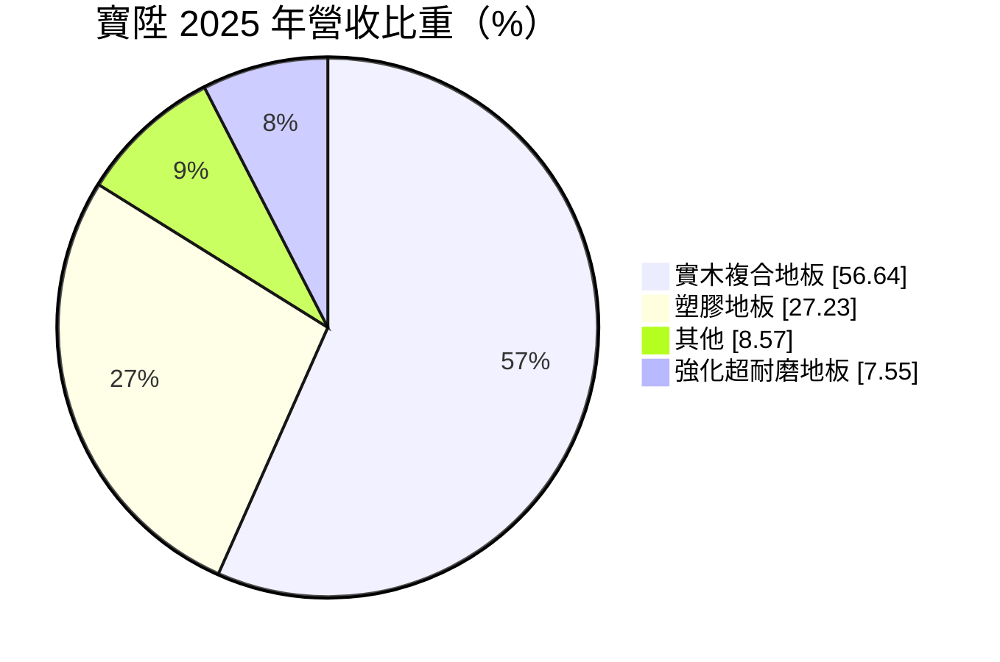
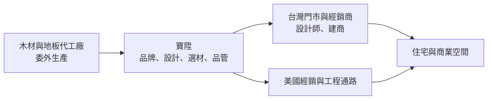
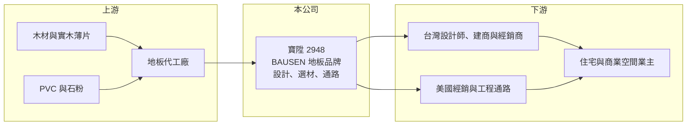

# 2948 寶陞

> 上櫃｜[[產業索引-居家生活|居家生活]]｜上市（櫃）日期 2023/12/12

# 第一章：企業模式與商業藍圖

> [!info] 撰寫說明
> 本文由 Claude 依公開資料整理，架構比照 [[2330台積電]] 的四章研究，資料截至 2026-10-08。財務數字來源：Goodinfo 台灣股市資訊網年度經營績效、MoneyDJ 公司基本資料（富邦證券版）、櫃買中心開放資料（本筆記 _data 快照）；業務描述另參考科技新報（2023 年）、財訊快報、工商時報的新聞標題。公開資料有限，美國與台灣營收比重未查得，產業描述為整理性內容，尚未逐條比對原始文件。#待校對

在評估單一個股的長期投資價值時，首要步驟是拆解企業的底層獲利邏輯。本章說明寶陞（股票代號：2948）這家以 BAUSEN 品牌經營地板與室內建材的公司，如何從台灣市場出發，把木地板賣進美國的高端住宅。

## 一、核心定位：地板品牌商而非製造商

寶陞國際成立於 2016 年，總部位於台北，2023 年 12 月在櫃買中心掛牌，董事長兼總經理為黃楷倫。依財訊快報的描述，寶陞是「專業地板品牌及室內建材銷售商」，核心是經營地板品牌，透過設計、選材、委外生產與通路經營賺取品牌價差。

依科技新報 2023 年的報導標題，創辦人是台大畢業的年輕創業者，寶陞以兩項策略打進美國市場，把地板賣進蘋果執行長庫克的住家，當年營收超過 20 億元。這代表寶陞的市場不只在台灣，美國高端住宅市場也是重要的成長來源。

## 二、產品板塊：實木複合地板過半

依 MoneyDJ 整理的 2025 年營收比重：

* **實木複合地板（56.64%）：** 表層為實木薄片、底層為多層夾板，兼具實木質感與尺寸穩定性，單價較高，是高端住宅與美國市場的主力產品（推估）。
* **塑膠地板（27.23%）：** 包括 [[SPC地板]] 等石塑地板，防水、耐磨、施工快，適合商業空間與預算型住宅。
* **強化超耐磨地板（7.55%）：** 以高密度纖維板加上耐磨表層，價格親民，是台灣住宅常見的地板。
* **其他（8.57%）：** 周邊建材、配件與施工相關收入。

## 三、資本轉化邏輯：輕資產的品牌生意

* **輕資產模式：** 寶陞以品牌與通路為核心，生產多委外進行（推估），因此固定資產不多。2026 年第二季非流動資產僅約 5.0 億元，占總資產約 24.0 億元的兩成左右。
* **毛利率的結構性提升：** 毛利率在 2018 至 2022 年約 32% 至 34%，2023 年起跳升到 41% 以上並維持。推估與高價實木複合地板與美國市場比重提高有關，代表品牌定位往高端移動。
* **營業利益率下滑：** 毛利率提高的同時，營業利益率從 2021 年的 10.7% 降到 2025 年的 5.8%，顯示行銷、通路與人事費用增加得更快，可能與海外市場拓展有關。

## 四、企業長期藍圖：美國高端市場與品牌經營

* **美國市場：** 依新聞標題，寶陞已打進美國高端住宅市場。美國住宅地板市場規模遠大於台灣，是寶陞長期最重要的成長方向。
* **營收規模：** 營收從 2018 年的 8.66 億元成長到 2022 年的 22.7 億元，之後連續三年維持在 21 億元上下，成長進入停滯期。能否在美國市場取得新一波成長，是下一階段的關鍵。
* **資本配置習慣：** 2020 至 2025 年度現金股利分別為 2.00、3.00、3.00、2.60、1.82、1.93 元。以 2025 年 EPS 2.14 元計算，配息率約 90%（推算），偏好高比例發放盈餘。

# 第二章：護城河深度與競爭優勢

在長期價值投資中，「護城河」指企業抵禦競爭、維持超額利潤的保護機制。本章分析寶陞的品牌優勢、主要對手，以及地板品牌商在建材市場中能守住多少利潤。

## 一、護城河的核心組成要素

寶陞的護城河較淺，主要來自品牌定位與通路經營。

* **1. 高端品牌形象：** 能進入美國名人住宅，是品牌定位的重要背書。建材的品牌溢價主要來自設計師與建商的推薦，一旦建立口碑，較容易被指定採用。
* **2. 設計師與建商通路：** 地板的採購決策常由室內設計師與建商決定，長期合作關係是品牌能持續接單的基礎。
* **3. 產品線廣度：** 從高價實木複合地板到平價強化地板與塑膠地板，能滿足不同預算的案件，讓經銷商與設計師能一次採購。

## 二、主要競爭對手格局

| 對手 | 定位 | 對寶陞的威脅 |
|---|---|---|
| 歐洲地板品牌（如 Pergo 等） | 國際品牌、設計與技術領先 | 在高端市場爭奪設計師與建商（推估） |
| 中國與東南亞地板製造商 | 低價大量生產 | 壓低塑膠地板與強化地板價格（推估） |
| 美國在地地板品牌與大型建材通路 | 熟悉美國市場與通路 | 在美國市場直接競爭（推估） |
| 台灣地板品牌與工程商 | 在地服務 | 在台灣住宅市場競爭（推估） |

## 三、優勢轉化：守得住／守不住／觀察重點

* **守得住：** 高端住宅與設計師指定的實木複合地板。這類客戶重視品牌與質感，價格敏感度較低，也是毛利率能維持在 41% 以上的原因。
* **守不住：** 標準化的塑膠地板與強化地板。產品差異小、生產門檻低，容易陷入價格競爭。
* **觀察重點：** 長期可以觀察三件事：營收能否突破連續三年 21 億元左右的平台；毛利率能否維持 40% 以上；以及營業利益率能否回到 8% 以上，代表海外拓展的費用開始產生效益。

# 第三章：財務體質與盈利規模

資料日期：2026-10-08。數字取自 Goodinfo 年度經營績效、MoneyDJ 與櫃買中心開放資料快照，表格是撰寫當時的快照；最新月營收、毛利率、累計 EPS 由自動排程寫在本筆記的屬性欄位（月營收、毛利率、累計EPS 等）。#待校對

財務報表是檢驗護城河是否真實存在的最終標準。本章用多年度的三率、ROE 與資本報酬，檢視寶陞的成長與獲利品質。

## 一、獲利能力的基石：三率

| 年度 | 營收（新台幣） | [[毛利率]] | [[營業利益率]] | EPS（元） | [[ROE]] |
|---|---|---|---|---|---|
| 2018 | 8.66 億 | 32.2% | 4.9% | 2.07 | 17.6% |
| 2019 | 10.2 億 | 33.8% | 7.1% | 2.46 | 19.9% |
| 2020 | 14.0 億 | 34.3% | 10.0% | 5.00 | 33.1% |
| 2021 | 20.0 億 | 34.2% | 10.7% | 7.28 | 36.4% |
| 2022 | 22.7 億 | 33.2% | 7.8% | 6.23 | 23.4% |
| 2023 | 21.9 億 | 41.2% | 8.3% | 4.26 | 12.2% |
| 2024 | 21.0 億 | 41.8% | 5.8% | 2.19 | 未查得 |
| 2025 | 21.4 億 | 42.5% | 5.8% | 2.14 | 6.3% |

* **[[毛利率]]：** 2023 年起由 33% 左右跳升到 41% 以上，是近年最重要的結構變化，推估來自高端產品與海外市場比重提升。
* **[[營業利益率]]：** 2020 至 2021 年達到 10% 以上的高峰，之後降到 6% 左右，費用增加抵銷了毛利率的改善。
* **長期指標：** 2018 至 2025 年營收年複合成長率約 13.8%，2020 至 2025 年約 8.9%（皆為推算），但 2022 年後成長停滯。2021 至 2025 年五年平均 ROE 約 17%（推算，2024 年 ROE 未查得，以淨利 0.66 億元與約 10 億元權益推算約 6.5%）。

## 二、[[ROE]]：資本效率

ROE 從 2021 年的 36.4% 降到 2025 年的 6.3%，原因有二：一是 2023 年上櫃前後增資，股東權益大幅增加；二是營業利益率下滑。依 2026 年第二季資產負債表，總資產約 24.0 億元、總負債約 13.8 億元、股東權益約 10.2 億元，負債比約 57%。流動資產約 19.0 億元，推估以存貨與應收帳款為主，地板品牌商需要備貨以應付不同規格與花色。

## 三、資本支出與自由現金流

* **[[CapEx]]：** 輕資產模式，資本支出以門市、倉庫與展示空間為主，金額不大，具體數字未查得。
* **[[自由現金流]]：** 資本支出小，但存貨與應收帳款會隨營收與海外拓展增加，推估自由現金流波動受營運資金影響較大；逐年數字未查得。

## 四、[[ROIC]] 與 [[WACC]]：價值創造利差

有息負債金額未查得，以股東權益與非流動負債兩種口徑估算。以 2025 年為例，營業利益約 1.24 億元（營收 21.4 億元 × 營業利益率 5.77%），扣除 20% 稅率後約 0.99 億元。以股東權益約 10.2 億元計算，ROIC 約 9.7%；若加計非流動負債約 3.8 億元，ROIC 約 7.1%（皆為推算）。2021 年稅後營業利益約 1.71 億元，股東權益約 4.2 億元（淨利 1.54 億元 ÷ ROE 36.4% 回推），ROIC 約 40%（推算）。

WACC 以 CAPM 推估：台灣 10 年期公債約 1.5% 至 2%，市場風險溢酬約 6%。MoneyDJ 所列 β 僅 0.03，推估受交易量偏低影響，參考性不足，改採建材與居家用品股常見的 0.7 至 0.9（假設），股東權益成本約 5.7% 至 7.4%。考量部分借款、負債成本假設約 2.5%，WACC 約 5% 至 6.5%（推算）。

2025 年 ROIC 約 7% 至 10%，仍高於 WACC，代表寶陞持續創造價值，但利差已比 2020 至 2022 年的高峰明顯縮小。營業利益率能否回升，決定利差能否再度擴大。

# 第四章：總體風險與地緣政治

任何企業都無法脫離宏觀環境獨立存在。本章分析寶陞長期必須面對的貿易、景氣與營運風險。

## 一、地緣政治與關稅

* **美國關稅：** 美國對進口建材與木製品的關稅與反傾銷措施，會直接影響寶陞在美國的價格競爭力。生產地若在中國或東南亞，需要關注各國的關稅差異（推估）。
* **木材來源與合法性：** 歐美對木材的合法來源有嚴格規範，供應鏈需要能提供來源證明。

## 二、產業週期與市場結構

* **房地產景氣：** 地板需求與新屋營建、成屋交易與裝修景氣高度相關。美國利率上升時，房屋交易與裝修需求會放緩，台灣房市受信用管制影響也會降溫。
* **低價競爭：** 塑膠地板與強化地板的生產門檻低，中國與東南亞產能龐大，長期壓低價格。

## 三、營運環境的隱性風險

* **存貨與匯率：** 地板品項與花色多，存貨管理不當會造成跌價損失；美國業務以美元計價，新台幣升值會壓縮以台幣計算的獲利。
* **經營者集中：** 董事長、總經理與發言人由同一人擔任，公司策略高度依賴創辦人。
* **海外拓展費用：** 海外通路建立需要長期投入，若營收成長不如預期，費用率會持續偏高。

## 四、科技或法規演進

* **環保與健康規範：** 地板的甲醛釋放、塑膠材料與回收規範持續趨嚴，可能增加產品認證與材料成本。
* **新材料：** 新型複合地板與防水材料不斷推出，品牌需要持續更新產品線。

# 專有名詞解析

## 金融

- **[[ROIC]]**：投入資本報酬率，稅後營業利益除以投入資本，衡量本業運用資金創造報酬的能力。
- **[[WACC]]**：加權平均資金成本，股東與債權人要求報酬率的加權平均，是 ROIC 要超過的門檻。

## 產業

- **[[SPC地板]]**：石塑地板，以石粉與 PVC 為主要原料製成的硬質地板，防水、耐磨，常用於住宅與商業空間。
- **[[自有品牌]]**：企業以自己的品牌名稱設計與銷售商品，掌握定價與顧客關係，毛利通常高於代工或代理。

# 核心供應鏈

## 1. 上游：材料與生產
- 木材、PVC 與石粉等原料，地板代工廠，名單未揭露

## 2. 本公司：寶陞
- 品牌：BAUSEN
- 產品：實木複合地板、塑膠地板（含 SPC）、強化超耐磨地板

## 3. 下游：通路與客戶
- 台灣：設計師、建商、經銷商與門市
- 美國：高端住宅市場的經銷與工程通路

## 4. 同業
- 國際地板品牌、中國與東南亞地板廠、台灣地板品牌（推估）

## 最新新聞
<!-- news:start -->
<!-- news:end -->

## 相關連結
- [公開資訊觀測站](https://mopsov.twse.com.tw/mops/web/t05st03?step=1&firstin=1&co_id=2948)
- [Goodinfo](https://goodinfo.tw/tw/StockDetail.asp?STOCK_ID=2948)
- [Yahoo 股市](https://tw.stock.yahoo.com/quote/2948)
- [鉅亨網新聞](https://www.cnyes.com/twstock/2948/news)
