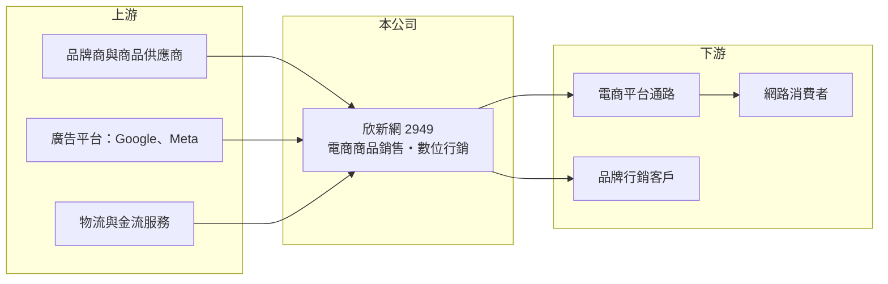

# 2949 欣新網

> 上櫃｜[[產業索引-數位雲端|數位雲端]]｜上市（櫃）日期 2023/12/15

# 第一章：企業模式與商業藍圖

> [!info] 撰寫說明
> 精簡版，由 Claude 依公開資料整理，架構比照 [[2330台積電]]，資料截至 2026-10-08。來源：櫃買中心開放資料（基本資料、資產負債、綜合損益、本益比殖利率、每月營收）、Goodinfo 年度經營績效、富邦 e 點通（MoneyDJ）公司基本資料。公開資料有限，銷售品類、通路、客戶與併購內容未查得。#待校對

本章說明欣新網（2949）以電商商品銷售與數位行銷服務兩條業務並行的經營模式。

- **核心業務：** 欣新網成立於 2013 年，2023 年 12 月上櫃，董事長陳德仁，實收資本額約 3.1 億元。依 MoneyDJ 2025 年營收比重，[[電子商務]]商品銷售占 69.6%，[[數位行銷]]服務占 30.4%。前者是公司採購商品後在網路通路銷售，後者是替品牌客戶規劃與執行網路廣告與行銷活動。
- **商業模式：** 電商商品銷售營收規模大但毛利低，因為營收包含整個商品進貨成本；數位行銷服務規模較小，但屬於以人力與專業收費的服務，毛利較高。兩者結合的好處是，公司在替品牌做行銷時累積的流量與數據經驗，可以直接用在自家銷售上，反之亦然。
- **營收結構：** 2020 至 2025 年營收從 21.2 億元成長到 57.3 億元，成長速度在國內電商相關公司中相當快。不過毛利率長期只有 10% 至 12%，代表營收仍以低毛利的商品銷售為主，規模成長不等於獲利同步成長。
- **長期方向：** 2023 年上櫃取得資金後，公司持續擴大營收規模，長期課題是提高高毛利服務的比重，並在電商平台流量成本上升的環境中維持獲利。2024 至 2025 年營業利益率降到 2.4% 至 2.6%，低於上櫃前的 4% 至 5%，顯示規模擴張伴隨利潤率下滑。

# 第二章：護城河深度與競爭優勢

本章分析欣新網的競爭條件與限制。

- **競爭優勢：** 同時具備商品銷售與行銷服務能力，讓公司能為品牌提供從曝光到成交的一條龍服務；長期操作電商通路累積的選品、定價與廣告投放經驗，是較難被單一廣告代理商或單純賣家複製的能力。不過這種優勢主要建立在人才與執行力上，護城河相對淺。
- **主要對手：** 電商銷售端面對大型電商平台自營商品，例如 [[8454富邦媒]]（momo）、[[8044網家]]，以及大量網路賣家；數位行銷端則面對國際廣告集團與本土數位廣告公司，例如 [[8477創業家]] 等。進入門檻低、競爭者眾多，是這個產業長期毛利偏低的原因。
- **觀察重點：** 第一是數位行銷服務的比重能否提高，這是毛利率改善的關鍵。第二是營業利益率能否回到上櫃前 4% 以上的水準。第三是應收帳款與存貨的週轉，低毛利模式下，壞帳或存貨跌價就可能吃掉全年獲利。

# 第三章：財務體質與盈利規模

資料日期：2026-10-08，表格是撰寫當時的快照；最新月營收、毛利率、累計 EPS 由自動排程寫在本筆記的屬性欄位（月營收、毛利率、累計EPS 等）。#待校對

本章用六年數字檢視欣新網的成長與獲利品質。

| 年度 | 營收（新台幣） | [[毛利率]] | [[營業利益率]] | EPS（元） | [[ROE]] |
|---|---|---|---|---|---|
| 2020 | 21.2 億 | 10.3% | 3.27% | 2.30 | 31.6% |
| 2021 | 26.3 億 | 11.4% | 4.08% | 4.73 | 34.6% |
| 2022 | 40.5 億 | 11.1% | 4.69% | 6.37 | 26.9% |
| 2023 | 43.4 億 | 11.7% | 4.77% | 6.29 | 15.9% |
| 2024 | 47.3 億 | 10.2% | 2.56% | 3.34 | 7.51% |
| 2025 | 57.3 億 | 11.6% | 2.44% | 3.63 | 9.46% |

- **營收規模：** 2020 至 2025 年營收年複合成長率約 22%（推算），是這段期間的主要亮點。依櫃買中心資料，2026 年上半年營收約 31.6 億元、毛利率約 12.2%、營業利益率約 2.3%、EPS 1.68 元；1 至 8 月累計營收較前一年同期成長約 26%。
- **獲利：** 近五年（2021 至 2025）平均 ROE 約 18.9%（推算），但趨勢明顯下滑：上櫃前淨值小、ROE 動輒 30%；2023 年上櫃募資後每股淨值從 28.99 元升到 42.03 元，加上利潤率下降，ROE 降到 7.5% 至 9.5%。
- **財務特色：** 2026 年第二季歸屬母公司權益約 10.6 億元，每股淨值 35.55 元，總負債約 19.9 億元（流動 17.9 億、非流動 2.0 億），MoneyDJ 所列負債比例約 62%，主要是營運週轉所需的應付帳款與借款（組成未查得）。依櫃買中心資料，最近年度現金股利每股約 2.03 元，以 2025 年 EPS 3.63 元計算[[配息率]]約 56%（推算）。
- **[[ROIC]] 與 [[WACC]]：** 2025 年營業利益約 1.4 億元（57.3 億 × 2.44%），以稅率 20% 計稅後約 1.1 億元；投入資本以股東權益約 10.6 億元加上假設的有息負債約 5 億元（實際數字未查得），合計約 15.6 億元，ROIC 約 7.2%（推算）。WACC 以 CAPM 推估：無風險利率 1.75%、市場風險溢酬 6%，MoneyDJ 的 β 為 0.27 不具代表性，改用小型網路服務股常見值 1.0，股東權益成本約 7.75%；負債成本 2.5%、稅後約 2.0%；股權權重約 68%，WACC 約 5.9%（推算）。ROIC 略高於 WACC，代表仍在創造價值，但利差不到 2 個百分點，利潤率再下滑就可能轉為負利差。

# 第四章：總體風險與地緣政治

本章整理欣新網長期必須面對的風險。

- **產業週期：** 電商銷售與數位廣告預算都跟著消費景氣走，景氣轉弱時品牌會先砍行銷費用，消費者也會減少非必需品購買，兩條業務可能同時受影響。
- **營運風險：** 低毛利的商品銷售模式對存貨與應收帳款管理要求很高，滯銷或客戶倒帳就可能吞掉獲利。數位行銷高度依賴 Google、Meta 等平台的廣告規則與演算法，平台政策改變會直接影響投放成效。
- **其他風險：** 電商平台流量成本逐年上升，壓縮第三方賣家的利潤；個人資料保護法規趨嚴，會限制數據行銷的做法；人才流動也會影響服務品質，因為行銷服務的核心資產是團隊。

# 專有名詞解析

## 應用

- **[[電子商務]]**：透過網路平台銷售商品，帶動小量多樣的倉儲與宅配需求。

## 金融

- **[[配息率]]**：現金股利占每股盈餘的比例，反映公司把多少獲利發還股東。
- **[[ROIC]]**：投入資本報酬率，稅後營業利益除以投入資本，衡量本業運用資金創造報酬的能力。
- **[[WACC]]**：加權平均資金成本，股東與債權人要求報酬率的加權平均，ROIC 高於 WACC 才代表創造價值。

## 產業

- **[[數位行銷]]**：以搜尋、社群、影音等網路廣告與內容經營推廣品牌與商品的行銷方式。

# 核心供應鏈

- 上游：品牌商與商品供應商、[[GOOGL谷歌]] 與 [[META臉書]] 等廣告平台，以及物流與金流服務（例如 [[2642宅配通]]，產業參考，實際合作對象未查得）。
- 下游／客戶：透過電商平台購物的消費者、委託行銷的品牌客戶；可能的銷售通路包括 [[8454富邦媒]]、[[8044網家]] 等平台（實際通路未查得）。
- 同業：電商賣家與數位行銷公司，例如 [[8477創業家]]。

## 最新新聞
<!-- news:start（自動產生，請勿手動編輯此範圍） -->
- 2026-10-05 🏛️ 重訊 16:50｜(更正)8/27公告本公司董事會決議取得有價證券｜[觀測站](https://mops.twse.com.tw/mops/#/web/t05st01)

完整紀錄：[[2949欣新網 新聞]]
<!-- news:end -->

## 相關連結
- [公開資訊觀測站](https://mopsov.twse.com.tw/mops/web/t05st03?step=1&firstin=1&co_id=2949)
- [Goodinfo](https://goodinfo.tw/tw/StockDetail.asp?STOCK_ID=2949)
- [Yahoo 股市](https://tw.stock.yahoo.com/quote/2949)
- [鉅亨網新聞](https://www.cnyes.com/twstock/2949/news)
